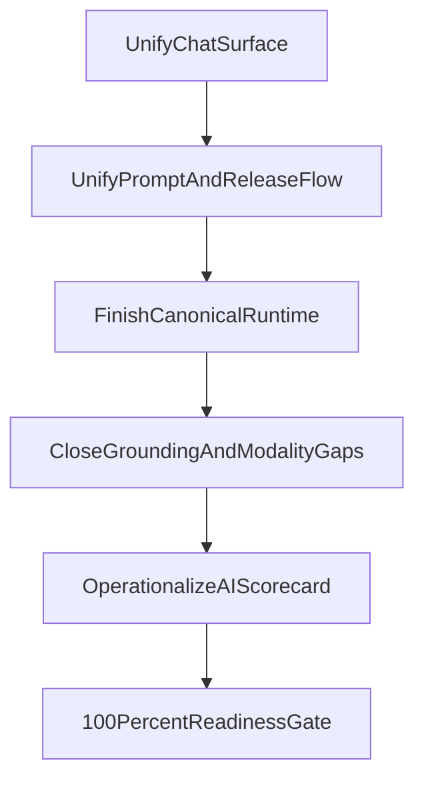

# AI Support Closure Roadmap

Date: `2026-03-07`

Related audit outputs:
- `docs/product/modules/ai/AI_SUPPORT_INVENTORY_SCORECARD_2026-03-07.md`
- `docs/product/modules/ai/AI_CHAT_CONTROL_AUDIT_2026-03-07.md`
- `docs/product/modules/ai/AI_PROMPT_GOVERNANCE_AUDIT_2026-03-07.md`
- `docs/product/modules/ai/AI_USECASE_MODALITY_AUDIT_2026-03-07.md`

## Target
Move the AI layer from `strong but uneven` to a state where it can honestly be treated as `100% product-ready, operationally controlled, and governance-safe`.

## Recommendation System
The closure logic should be driven by one rule:

If a feature is visible to the user, then it must satisfy all five conditions:

1. `Real entrypoint`: the button or trigger performs a real action.
2. `Canonical runtime`: the request uses the approved AI path.
3. `Correct model fit`: the assigned model class matches the task.
4. `Governed release`: prompt/model/policy change is traceable and controlled.
5. `Operational coverage`: health, fallback, cost, and ownership are visible.

Any AI feature failing one of those conditions should be treated as:
- `fix immediately`
- `hide/deprecate`
- or `clearly mark as unavailable`

## Closure Priorities

### P1. Unify The Chat Product Surface
Why first:
- chat is the most visible AI surface
- it currently has the highest trust risk because modern and legacy shells behave differently

Actions:
- declare `src/components/AIChat/UnifiedChatPanel.tsx` the only canonical conversation shell
- reduce `src/views/AIChatWelcomeView.tsx` to a wrapper or deprecate it from user-facing paths
- remove or fully wire fake/partial controls:
  - Business Actions
  - legacy feedback/report
  - cloud connect
  - legacy export-only behaviors
  - voice conversation if not fully supported

Done criteria:
- one chat shell in production
- every visible button has a real effect
- no placeholder success APIs remain for visible chat actions

### P2. Establish One Prompt And Release Workflow
Why second:
- provider/routing foundations are already strong
- governance weakness now comes mostly from fragmented change control

Actions:
- keep `server/src/routes/ai-prompts.routes.ts` as the only prompt authority
- decommission or fully wrap `server/src/routes/ai/ai-prompts.routes.ts`
- make release bundle publish atomic across:
  - prompt version
  - primary model
  - fallback model
  - policy version

Done criteria:
- one prompt API truth
- one publish action
- every critical AI runtime can report which bundle/prompt/model/policy produced its response

### P3. Finish One Runtime Truth
Why third:
- many strong capabilities already exist
- the remaining issue is uneven canonicalization across paths

Actions:
- finish migration of AI entrypoints onto `AIPipeline` + `modelRouter`
- reduce old capability-only paths where they bypass purpose/governance visibility
- ensure every critical use-case resolves through purpose-aware routing

Done criteria:
- one canonical runtime for critical AI flows
- no business-critical path bypasses routing, policy, or logging

### P4. Close Modality And Grounding Gaps
Why fourth:
- model-class fit is already broadly correct
- missing value is in completeness of richer modalities

Actions:
- either finish external RAG or explicitly define current local RAG as the supported limit
- align file-type promises in UI with actual ingestion support
- either fully support cloud connect and voice/media flows or remove them from visible UX
- strengthen image-generation and presentation QA contracts

Done criteria:
- every modality shown in UI is truly production-ready
- every grounded flow has a clearly supported retrieval backend and artifact contract

### P5. Operationalize The AI Scorecard
Why fifth:
- the system already has many signals, but they are not yet one management instrument

Actions:
- maintain one AI scorecard per use-case with:
  - owner
  - entrypoint
  - prompt
  - model
  - fallback
  - policy
  - eval status
  - budget status
  - risk status
- extend `/api/llm/use-cases/overview` conceptually to include UX reachability and product completeness, not only assignment coverage

Done criteria:
- product, ops, and leadership can read one scoreboard and know what is healthy, partial, or blocked

## Delivery Sequence

## Suggested 30/60/90 Sequence

### First 30 Days
- remove visible fake chat actions
- decide and enforce canonical chat shell
- freeze legacy prompt API for new work
- define publish contract for release bundles

### Next 60 Days
- implement atomic publish
- move remaining critical AI flows to canonical runtime
- align attachment/cloud/voice surface with actual support
- define use-case ownership and scorecard governance

### Next 90 Days
- finish external RAG direction
- close multimodal readiness gaps
- add final production-readiness gate across prompt/model/policy/runtime
- make executive cockpit the operating layer for AI support health

## What “100%” Means In Practice
The system should only be marked complete when:

- all major AI surfaces use one canonical runtime
- no visible AI control is fake, decorative, or partially wired
- prompt, model, and policy changes are governed by one release flow
- use-cases are mapped to the correct modality and verified end-to-end
- leadership can see health, cost, risk, and blast radius in one place

## Final Recommendation
Do not treat this as a “build more AI” problem.

Treat it as a `closure and trust` program:
- remove ambiguity
- remove duplicate paths
- remove placeholder behavior
- make every visible promise measurable and governable

That is the shortest path from a strong AI foundation to a truly complete AI operating layer.
