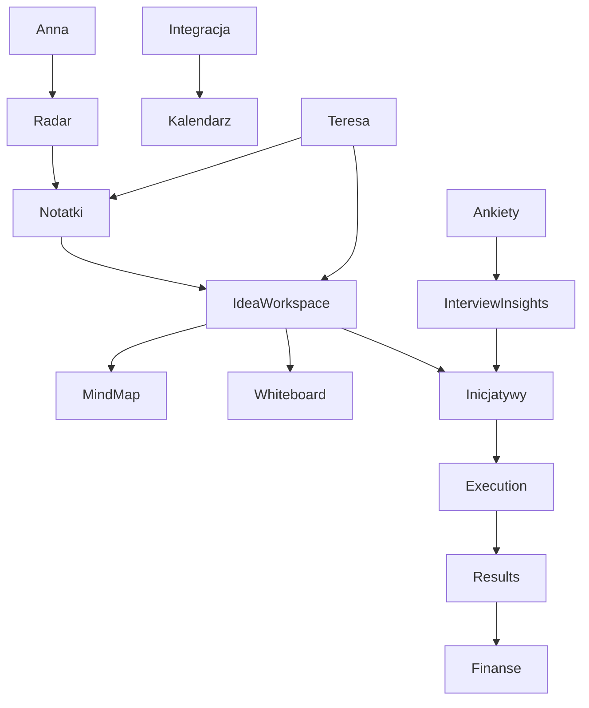

# Manager Fala 1 Master Implementation Order

> Date: 2026-03-28
> Owner: Manager
> Status: active execution authority
> Purpose: turn the manager layer into one execution sequence with dependency order, bounded starting packets, acceptance proof, and anti-chaos guardrails

---

## 1. Authority

This file is the execution SSOT for `Fala 1`.

It translates the manager planning layer into the order in which work should actually be delivered.

If another planning document conflicts with this file on:

- execution order,
- what starts now,
- what is blocked,
- what is explicitly parked,
- or which packet gets priority,

this file wins.

---

## 2. Canonical active scope

The active `Fala 1` scope remains the same 16 streams defined in:

- `docs/product/work-packets/MANAGER_FALA_1_CANONICAL_EXECUTION_MAP_2026-03-28.md`

The active streams are:

1. `Anna`
2. `Radar`
3. `Notatki`
4. `Kalendarz`
5. `Integracja`
6. `Ankiety`
7. `Wnioski w Interview`
8. `Inicjatywy`
9. `Wdrozenia`
10. `KPI`
11. `Finanse`
12. `Mind map`
13. `Whiteboard`
14. `Proces flow`
15. `Tabele`
16. `Teresa`

---

## 3. Explicitly not now

The following remain outside this execution order unless explicitly re-promoted:

- `Outputs / Documents / Presentations / Word / Excel / Sheet`
- `Komunikacja` as a standalone product
- `Tools`
- `Assessment`
- `Help / Baza wiedzy`
- `Program partnerski`
- `Superadmin`
- `Agenci / KIMI / Prompty / Palantir`
- `Organization / Settings / Admin / Edukacja / Mobile`

Rule:

- these may appear as dependencies,
- but they must not re-enter execution scope through “small helpful additions.”

---

## 4. Execution doctrine

The order of delivery is driven by product dependence, not by module popularity.

The doctrine is:

1. stabilize the first-use path,
2. stabilize the core working-memory path,
3. stabilize the visual thinking system,
4. stabilize the consulting/execution spine,
5. stabilize connected runtime surfaces,
6. then finish remaining structured insight loops.

This means:

- we first reduce confusion,
- then reduce split-brain,
- then reduce workflow breaks,
- and only then open broader quality or interoperability depth.

---

## 5. Dependency order

Interpretation:

- `Anna`, `Radar`, and `Notatki` form the first trusted product spine.
- `Idea Workspace`, `Mind map`, and `Whiteboard` depend on that trust and traceability layer.
- `Inicjatywy -> Wdrozenia -> KPI -> Finanse` is one business-operating chain and should be treated as one system.
- `Kalendarz` must not outrun the truth of `Integracja`.
- `Teresa` should ride already-stabilized surfaces rather than hide their unfinished state.
- `Ankiety` and `Wnioski w Interview` become much stronger once they can hand off into initiatives and action.

---

## 6. Execution phases

### Phase A - Manager execution layer

Objective:

- freeze one working order before any further implementation planning or coding.

Deliverables:

- this file,
- first starting packets,
- dependency-based execution order,
- execution handoff.

Acceptance proof:

- manager and future executor can point to one file for what starts now, what waits, and why.

### Phase B - Front door and working-memory spine

Streams:

- `Anna`
- `Radar`
- `Notatki`

Why first:

- this phase determines whether the product feels understandable in the first five minutes.
- without this phase, later modules still feel stitched together.

Target outcome:

- user understands what the product is,
- sees what matters now,
- and can capture trusted work without ambiguity.

### Phase C - Visual thinking core

Streams:

- `Idea Workspace`
- `Mind map`
- `Whiteboard`

Why second:

- these modules are already rich in capability, but they still risk “powerful lab” over “finished product.”
- they must become calmer before deeper surface breadth is added elsewhere.

Target outcome:

- one idea feels like one stable workspace,
- map work feels predictable,
- whiteboard work feels workshop-grade instead of experimental.

### Phase D - Consulting/execution spine

Streams:

- `Inicjatywy`
- `Wdrozenia`
- `KPI`
- `Finanse`

Why third:

- this is the strongest business value chain in the scope.
- it should be delivered as one continuity spine, not four isolated modules.

Target outcome:

- plan becomes governed initiative truth,
- initiative becomes execution truth,
- execution becomes measured outcome,
- measured outcome connects to finance meaning.

### Phase E - High-risk structural canvases

Streams:

- `Proces flow`
- `Tabele`

Why fourth:

- both modules are technically substantial,
- both can easily expand into hidden platform programs,
- both should be grounded only after the main product spine is more stable.

Target outcome:

- process modeling becomes governed and readable,
- tables get one canonical mental model instead of competing paths.

### Phase F - Connected runtime surfaces

Streams:

- `Kalendarz`
- `Integracja`
- `Teresa`

Why fifth:

- these modules can overpromise if connected-runtime truth is not honest.
- they should be exposed more strongly only after internal product truth is firmer.

Target outcome:

- internal calendar feels real,
- integration state is honest,
- Teresa feels productized instead of purely technical.

### Phase G - Structured insight loop

Streams:

- `Ankiety`
- `Wnioski w Interview`

Why last in this wave:

- they are important,
- but their value rises most when the downstream action surfaces are already credible.

Target outcome:

- real session flow,
- real answer capture,
- real summary and insight trust,
- real transition from insight to decision or action.

---

## 7. First eight starting packets

These are the first bounded packets to execute after manager acceptance.

They are ordered.

### Packet 1 - `Anna entry / CTA coherence`

Goal:

- make the front door communicate one strong product story.

What this packet must achieve:

- clearer value proposition,
- stronger role of Anna as guided entry,
- clearer primary CTA structure,
- less risk that Anna feels like a detached widget.

Acceptance proof:

- a first-time visitor understands what the product is,
- who it is for,
- and what the next meaningful action is.

### Packet 2 - `Radar actionable insight pass`

Goal:

- turn Radar from an information surface into a decision surface.

What this packet must achieve:

- clearer priority signals,
- clearer “what to do next” cues,
- visible handoff to `task / idea / initiative`.

Acceptance proof:

- a user opens Radar and can identify the top actionable item without hunting across unrelated panels.

### Packet 3 - `Notebook canonical-path closure`

Goal:

- remove ambiguity about the primary notebook path.

What this packet must achieve:

- one preferred path for create, edit, attachments, AI proposal, and conversion,
- unsupported states surfaced honestly,
- less silent fallback behavior.

Acceptance proof:

- user completes `create -> edit -> AI propose -> resolve -> refresh -> convert` without losing state or falling into invisible path changes.

### Packet 4 - `Notebook trust and boundary pass`

Goal:

- make notebook behavior understandable and trustworthy.

What this packet must achieve:

- visible notebook identity and boundaries,
- clearer provenance and retrieval trust markers,
- stronger distinction from other note-like objects.

Acceptance proof:

- user can tell what kind of note they are using, where context came from, and why a retrieved result should be trusted or questioned.

### Packet 5 - `Workspace Entry And Shell Coherence`

Goal:

- make `Idea Workspace` feel like one product at first entry.

What this packet must achieve:

- calmer entry,
- clearer “same idea, different lens” behavior,
- stronger current-canvas clarity,
- better next-step guidance.

Acceptance proof:

- user opens an idea workspace and understands what it is, what the active canvas is, and what the next useful action is.

### Packet 6 - `Mindmap Interaction Grammar Freeze`

Goal:

- make the main map interaction model obvious and fast.

What this packet must achieve:

- stable select/pan/connect behavior,
- primary node-local actions,
- calmer editing flow,
- less mode confusion.

Acceptance proof:

- user can grow and edit a branch tree for several minutes without menu hunting or interaction uncertainty.

### Packet 7 - `Initiative Write Truth`

Goal:

- remove the highest-value split-brain in initiatives.

What this packet must achieve:

- one governed initiative happy path for create/update/status,
- less invisible dependence on legacy write seams,
- stronger trust in readiness-bearing changes.

Acceptance proof:

- user creates an initiative, updates its core state, and sees a consistent detail/history/readiness story without ambiguous route truth.

### Packet 8 - `Execution Truth Spine`

Goal:

- reduce mixed-truth behavior in the execution control tower.

What this packet must achieve:

- one clearer contract for visible risk, delay, capacity, timeline, budget, and main action entry points,
- less stitched operator experience.

Acceptance proof:

- an operator can inspect and act on the main execution signals without clearly conflicting truths across the active panels.

---

## 8. What each later phase should unlock

### After Phase B

The product should stop feeling confusing at entry and in personal work capture.

### After Phase C

The product should stop feeling like an experimental canvas bundle and instead feel like one idea system.

### After Phase D

The product should show one believable consulting/execution spine across planning, execution, KPI, and finance.

### After Phase E

The product should gain stronger operational modeling and structured work credibility without opening a new platform program.

### After Phase F

The product should expose connected-runtime surfaces honestly instead of aspirationally.

### After Phase G

The product should support a real minimal structured insight loop from question to action.

---

## 9. Module-specific sequencing inside later phases

### Phase D sequence

Use this order:

1. `Inicjatywy`
2. `Wdrozenia`
3. `KPI`
4. `Finanse`

Reason:

- `Inicjatywy` is the upstream governance anchor.
- `Wdrozenia` depends on initiative truth.
- `KPI` depends on cleaner execution and initiative context.
- `Finanse` benefits most when initiative and result semantics are already more visible.

### Phase E sequence

Use this order:

1. `Proces flow`
2. `Tabele`

Reason:

- process modeling requires fewer product-truth negotiations than tables.
- tables are wider, riskier, and more exposed to split-brain between `metadata-first` and `graph-first`.

### Phase F sequence

Use this order:

1. `Integracja`
2. `Kalendarz`
3. `Teresa`

Reason:

- calendar truth depends on integration truth.
- Teresa should integrate with stabilized surfaces, not paper over unstable ones.

### Phase G sequence

Use this order:

1. `Ankiety`
2. `Wnioski w Interview`

Reason:

- insight quality depends on credible response capture and session flow first.

---

## 10. Guardrails

- Do not reopen `Outputs`.
- Do not silently absorb `Komunikacja`, `Tools`, `Assessment`, `Help`, `Partner`, or `Superadmin`.
- Do not start with `Proces flow` or `Tabele` as if they were wave-defining foundations.
- Do not treat backend depth as proof of finished product quality.
- Do not broaden packet scope once a packet has a clear user-facing proof.
- Prefer one honest canonical path over many compatibility shims.

---

## 11. Manager review rule for every packet

Before a packet is accepted, the manager must check:

- what user-facing ambiguity it removes,
- what split-brain it reduces,
- what proof demonstrates the happy path,
- what neighboring scope is consciously not touched,
- and whether it makes the next packet easier rather than harder.

If a packet improves local richness but increases global ambiguity, it is not accepted.

---

## 12. Fast start after this document

The next execution step after this document is:

1. start `Packet 1`,
2. keep `Packets 2-8` queued in the order above,
3. review after each packet whether the proof was actually achieved,
4. only then move deeper into later phases.

This file is complete when it allows the team to start execution without reopening planning.
