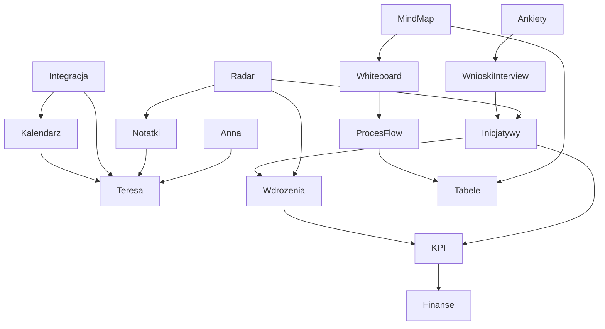

# Wave 1 Final Implementation Master Plan

Date: 2026-03-29
Owner: Cursor agent
Scope: master implementation plan for taking all active Wave 1 modules from closure-grade status to final implementation-grade readiness

## 1. Scope

This plan governs only the 16 active Wave 1 modules defined by:

- `docs/product/work-packets/MANAGER_FALA_1_CANONICAL_EXECUTION_MAP_2026-03-28.md`

Active modules:

1. `Anna`
2. `Radar`
3. `Notatki`
4. `Kalendarz`
5. `Integracja`
6. `Ankiety`
7. `Wnioski w Interview`
8. `Inicjatywy`
9. `Wdrożenia`
10. `KPI`
11. `Finanse`
12. `Mind map`
13. `Whiteboard`
14. `Proces flow`
15. `Tabele`
16. `Teresa`

Explicitly outside the active module plan:

- `Help / Baza wiedzy`
- `Program partnerski`
- parked areas already excluded by the manager map

These may appear as dependencies or benchmark context only.

## 2. Authority Chain

This plan is downstream from the following authority stack:

- `docs/product/work-packets/MANAGER_FALA_1_CANONICAL_EXECUTION_MAP_2026-03-28.md`
- `docs/product/work-packets/MANAGER_FALA_1_AGENT_STANDARD_2026-03-28.md`
- `docs/product/work-packets/cursor-work/wave1-full-audit/WAVE1_MASTER_AUDIT_2026-03-29.md`
- `docs/product/work-packets/cursor-work/wave1-full-audit/WAVE1_GAP_BACKLOG_2026-03-29.md`
- `docs/product/work-packets/cursor-work/wave1-full-audit/WAVE1_SOURCE_MATRIX_2026-03-29.md`
- all 16 module packets under `docs/product/work-packets/cursor-work/wave1-full-audit/module-packets/`
- relevant SSOT, readiness, benchmark, evidence, and execution memo documents for each module

Rule:

- `WAVE1_MASTER_AUDIT_2026-03-29.md` owns the current closure vs completeness verdict
- this document owns the execution-grade order for achieving final implementation readiness
- module plans own the detailed packet design and acceptance bar per module

## 3. Benchmark Method

`Softs/` is used only as an `external-reference` corpus, as defined by:

- `docs/cleanup/SOFTS_REFERENCE_HANDLING.md`

Benchmarking rule:

1. Start from the module SSOT and readiness docs
2. Match the module to the closest benchmark family in `Softs/`
3. Extract behavioral expectations, not UI copies
4. Adopt only conclusions that can be expressed as product requirements inside tracked docs
5. Record where `Softs/` is strong, weak, sparse, or only partially relevant

What counts as benchmark truth:

- expected end-to-end behavior
- transition quality between steps
- operator visibility and recoverability
- trust language in empty, degraded, and locked states
- decisional quality, not just feature count
- product calmness and mental-model clarity

What does not count as benchmark truth:

- visual cloning
- unsupported parity claims
- assuming that a vendor folder in `Softs/` equals a complete market target

## 4. Final Implementation Standard

For this program, a module is only considered finally implemented when all of the following are true:

- the intended user journey works end to end on the declared lane
- the user sees honest state at every transition
- the right data is saved through the right runtime family
- the next step is explicit and coherent with neighboring modules
- known limitations are bounded and do not break the claimed module contract
- the module is no longer only `closed`, but can sustain a stronger commercial claim for its declared scope

This is stricter than Wave 1 closure and should not be confused with the closeout bar.

## 5. Module Matrix

| Module | Current audit verdict | Primary benchmark family in `Softs/` | Final implementation objective | Highest remaining gap |
| --- | --- | --- | --- | --- |
| `Anna` | closed; high bounded completeness | `0 Czat`, `KIMI` | strong public AI front door with resilient voice, multilingual guidance, and conversion instrumentation | public voice and analytics depth |
| `Radar` | closed; medium-strong | `0 Projekty`, `0 KPI` | decisional cockpit that turns signals into ranked action | recommendation and prioritization grammar |
| `Notatki` | closed; high core / medium breadth | `0 Notatki` | durable working memory with strong provenance, attachments, and cross-module continuity | adjunct breadth and provenance |
| `Kalendarz` | closed; medium | `0 Kalendarz` | PMO-grade connected planning surface with trustworthy external state and workload guidance | sync maturity and workload depth |
| `Integracja` | closed; medium | `0 synchronizacja` | trustworthy provider lifecycle control plane, not only a settings seam | onboarding and post-connect lifecycle |
| `Ankiety` | closed; medium | `0 Ankiety` | operator-grade collection workflow with governance and downstream insight bridge | operator workflow and submission governance |
| `Wnioski w Interview` | closed; medium | closest family only: `0 Ankiety`, `0 Projekty` | structured insight lane that produces actionable artifacts and confidence signals | actionability and analysis structure |
| `Inicjatywy` | closed; medium-strong | `0 Projekty` | planning and initiative runtime with aligned write family and schema resilience | write truth and schema drift |
| `Wdrożenia` | closed; medium | `0 Projekty`, `0 KPI` | unified execution control tower with read-write continuity | write continuity and runtime unification |
| `KPI` | closed; medium | `0 KPI` | coherent results operating lane with reporting and reconciliation depth | report and reconciliation workflow |
| `Finanse` | closed; medium | `0 Analiza finansowa` | broader finance operating lane beyond analysis-only truth | mutation parity and breadth |
| `Mind map` | closed; medium | `0 Miro` | calm ideation surface with trustworthy branch work and collaboration readiness | interaction calmness |
| `Whiteboard` | closed; medium | `0 Whiteboard`, `0 Miro` | facilitation-ready workshop surface with better collaboration and assets | facilitation maturity |
| `Proces flow` | closed; medium | `0 Diagramy` | process design surface with stronger semantics, BPMN, and governance | semantic and BPMN depth |
| `Tabele` | closed; medium | `0 tabele` | coherent relational operating surface with singular grammar | relational grammar |
| `Teresa` | closed; medium | `0 Czat`, `0 Agenci`, `KIMI` | contextual internal copilot with stronger workspace handoffs and continuity | handoffs and cross-surface continuity |

## 6. Cluster Dependency Map

Interpretation:

- `Integracja`, `Kalendarz`, and `Teresa` are one continuity family
- `Inicjatywy`, `Wdrożenia`, `KPI`, and `Finanse` are one business spine
- `Mind map`, `Whiteboard`, `Proces flow`, and `Tabele` must converge toward one calmer workspace grammar
- `Radar`, `Notatki`, and `Teresa` are the main cross-surface guidance layer

## 7. Final Rollout Order

### Phase 1: structural trust and runtime coherence

1. `Integracja`
2. `Kalendarz`
3. `Wdrożenia`
4. `KPI`
5. `Finanse`

Phase 1 goal:

- remove the remaining split-runtime and post-connect trust gaps that undermine believable day-to-day use

### Phase 2: operational usefulness and guided continuity

6. `Radar`
7. `Notatki`
8. `Teresa`
9. `Ankiety`
10. `Wnioski w Interview`
11. `Inicjatywy`

Phase 2 goal:

- deepen decision support, working memory, assistant handoff, and research-to-action continuity

### Phase 3: workspace-tool product quality

12. `Mind map`
13. `Whiteboard`
14. `Proces flow`
15. `Tabele`

Phase 3 goal:

- turn real but uneven workspace tools into calmer, more coherent product surfaces

### Phase 4: commercial-strengthening layer

16. `Anna`
17. cross-module parity polish on already strengthened modules

Phase 4 goal:

- improve commercial presentation, public confidence, and claim safety after the operating core is stronger

## 8. Common Proof Gates

Every module plan in this program must define proof at four levels:

1. `Contract proof`
   - scope is explicit
   - intended behavior is written in plain language
   - non-goals are explicit
2. `Runtime proof`
   - load, save, lock, and degraded states are honest
   - correct runtime family handles the declared lane
3. `User-flow proof`
   - the end-to-end module journey is explicit
   - the next transition is explicit
4. `Regression proof`
   - focused tests or evidence confirm the strengthened lane
   - proof is matched to the actual changed risk surface

## 9. Safe And Unsafe Claim Language

Safe after this program:

- `the module is fully implemented for its declared Wave 1 scope`
- `the module now supports an end-to-end user journey with explicit runtime and recovery truth`
- `the module is materially closer to benchmark-grade behavior in its declared category`

Unsafe unless separately proven:

- `full parity with the market leader`
- `full platform parity across all adjacent categories`
- `all SSOT ambition is now implemented`

## 10. Deliverable Index

This master plan is paired with the following module plans:

- `WAVE1_FINAL_IMPLEMENTATION_PLAN_ANNA_2026-03-29.md`
- `WAVE1_FINAL_IMPLEMENTATION_PLAN_RADAR_2026-03-29.md`
- `WAVE1_FINAL_IMPLEMENTATION_PLAN_NOTATKI_2026-03-29.md`
- `WAVE1_FINAL_IMPLEMENTATION_PLAN_KALENDARZ_2026-03-29.md`
- `WAVE1_FINAL_IMPLEMENTATION_PLAN_INTEGRACJA_2026-03-29.md`
- `WAVE1_FINAL_IMPLEMENTATION_PLAN_ANKIETY_2026-03-29.md`
- `WAVE1_FINAL_IMPLEMENTATION_PLAN_WNIOSKI_W_INTERVIEW_2026-03-29.md`
- `WAVE1_FINAL_IMPLEMENTATION_PLAN_INICJATYWY_2026-03-29.md`
- `WAVE1_FINAL_IMPLEMENTATION_PLAN_WDROZENIA_2026-03-29.md`
- `WAVE1_FINAL_IMPLEMENTATION_PLAN_KPI_2026-03-29.md`
- `WAVE1_FINAL_IMPLEMENTATION_PLAN_FINANSE_2026-03-29.md`
- `WAVE1_FINAL_IMPLEMENTATION_PLAN_MIND_MAP_2026-03-29.md`
- `WAVE1_FINAL_IMPLEMENTATION_PLAN_WHITEBOARD_2026-03-29.md`
- `WAVE1_FINAL_IMPLEMENTATION_PLAN_PROCES_FLOW_2026-03-29.md`
- `WAVE1_FINAL_IMPLEMENTATION_PLAN_TABELE_2026-03-29.md`
- `WAVE1_FINAL_IMPLEMENTATION_PLAN_TERESA_2026-03-29.md`

## 11. Final Recommendation

Wave 1 should still be described as formally closed.

This implementation program exists because closure was real, but not yet equivalent to final implementation completeness. The right path is not to reopen the closeout verdict. The right path is to execute the remaining module packets in the order above and raise each module from closure-safe to implementation-safe for the claim it wants to make.
