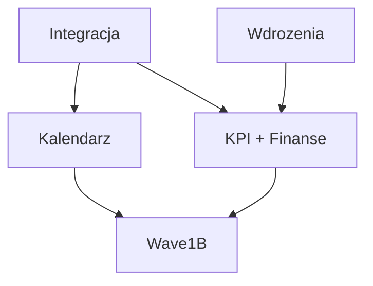

# Wave 1A Program

Date: 2026-03-29
Owner: Cursor agent
Status: executed P0 remediation program
Scope: P0 remediation after formal Wave 1 closure

## 0. Execution outcome

Wave 1A has now been executed and the four P0 packets were closed on the active branch:

- `Integracja` via `838ccea191` - governed lifecycle shell and refresh-runtime materialization
- `Kalendarz` via `8a28370187` - external source honesty and selected-day workload guidance
- `Wdrożenia` via `f8e02ee5b5` - shared post-write execution refresh spine
- `KPI + Finanse` via `8631d675de` - finance runtime-strip refresh after import/create flows

Verification recorded during execution:

- targeted `Calendar` tests: `8/8` passing
- targeted `Execution` tests: `16/16` passing
- targeted `Finance` tests: `16/16` passing
- edited-file lint checks: clean

Wave 1A therefore no longer sits in `proposed` status. It is the completed P0 remediation stage and serves as the handoff boundary to `Wave 1B`.

## 1. Purpose

This program turns the full Wave 1 audit into an execution stage focused on the highest-priority post-closure gaps.

It uses the audit output directly instead of reopening discovery:

- `docs/product/work-packets/cursor-work/wave1-full-audit/WAVE1_MASTER_AUDIT_2026-03-29.md`
- `docs/product/work-packets/cursor-work/wave1-full-audit/WAVE1_GAP_BACKLOG_2026-03-29.md`
- `docs/product/work-packets/cursor-work/wave1-full-audit/WAVE1_SOURCE_MATRIX_2026-03-29.md`

## 2. Program goal

Close the remaining `P0` gaps so the product no longer has a mismatch between:

- formal Wave 1 closure
- believable operator end-to-end use
- core runtime credibility

## 3. Scope

Wave 1A includes only these four packets:

1. `Integracja`
2. `Kalendarz`
3. `Wdrożenia`
4. `KPI + Finanse`

Scope freeze authority:

- `docs/product/work-packets/cursor-work/wave1a-remediation/WAVE1A_SCOPE_FREEZE_2026-03-29.md`

## 4. Program order

### Step 1

`Integracja`

Why first:

- it is the shared connected-system authority layer
- it materially affects `Kalendarz`
- it partially affects the credibility of downstream consequence and assistant flows

### Step 2

`Kalendarz`

Why second:

- it depends on connected-source truth from `Integracja`
- it is one of the clearest still-open trust gaps against PMO-grade expectations

### Step 3

`Wdrożenia`

Why third:

- it is the first half of the business operating spine
- it must stop being strong on reads and weaker on writes/runtime unification

### Step 4

`KPI + Finanse`

Why fourth:

- it is the second half of the business operating spine
- it should be solved as one consequence runtime rather than as two separate module patches

## 5. Dependency map

## 6. Delivery model

Each packet must ship with:

- one execution brief
- one code/test surface map
- one bounded delivery packet list
- one acceptance proof plan
- one explicit non-goals section

## 7. Done criteria per packet

### Integracja

Done means:

- provider onboarding no longer stops at honest status readback
- the user can move through a believable connect-complete-recover-operate lifecycle
- the lightweight entry surface and governed hub no longer diverge in lifecycle truth

### Kalendarz

Done means:

- external availability is real, not only visually acknowledged
- workload and adjustment depth is no longer missing enough to break PMO-grade credibility
- the calendar no longer feels like an internal-first shell pretending to be fully connected

### Wdrożenia

Done means:

- main write flows are as credible as the read/control surfaces
- execution-control runtime does not fragment user trust across backend families
- operator-facing control-tower continuity is not read-only in practice

### KPI + Finanse

Done means:

- KPI, ROI, and finance no longer behave like neighboring bounded truths
- results and finance workflows form one believable consequence runtime
- deeper user actions no longer fall back into split-brain behavior that breaks credibility

## 8. Proof standard

Each packet must define proof at four layers:

1. route/service truth
2. user-facing surface truth
3. regression test coverage
4. one explicit acceptance scenario proving the repaired P0 claim

## 9. Risks

- `Integracja` and `Kalendarz` can expand into a platform rewrite if not bounded
- `Wdrożenia` can drift into broad PMO ambition instead of fixing write/runtime credibility
- `KPI + Finanse` can split into too many separate fixes unless treated as one consequence program
- teams may try to pull `P1` polish into `Wave 1A`, weakening focus on the actual P0 gaps

## 10. Transition rule to Wave 1B

Wave 1A is complete only when:

- all 4 execution briefs exist
- each brief has its own acceptance proof plan
- the `P0` list is fully assigned and bounded
- everything else is explicitly cut into `Wave 1B` or `Wave 1C`

After that, `Wave 1B` can start on the audited `P1` set without reopening the meaning of `Wave 1A`.
