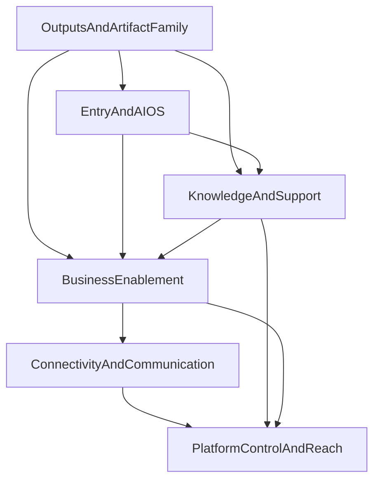

# Wave 2 Final Implementation Master Plan

Date: 2026-03-29
Owner: Cursor agent
Scope: master implementation plan for taking all 24 Wave 2 modules from planning-grade truth and bounded baseline fragments to full execution-grade final implementation planning

## 1. Scope

This plan governs only the 24 Wave 2 modules defined by:

- `docs/product/work-packets/wave-2/WAVE_2_CANONICAL_SCOPE_MAP.md`

Wave 2 modules:

1. `Landing`
2. `Komunikacja`
3. `Tools`
4. `Assessment`
5. `Help / Baza wiedzy`
6. `Program partnerski`
7. `Superadmin`
8. `Outputs Library`
9. `Documents`
10. `Presentations`
11. `Sheet`
12. `ArtifactRun z czatu`
13. `Object-linked outputs`
14. `Notebook outputs`
15. `Report -> Presentation`
16. `Provenance / review / visibility`
17. `Pelny Reports / Presentations builder`
18. `Agenci / KIMI / Prompty / Palantir`
19. `Organization`
20. `Settings`
21. `Admin`
22. `Edukacja`
23. `Mobile`
24. `Synchronizacja`

Explicitly outside this package:

- reopening the active Wave 1 16-stream implementation as new owned scope
- claiming that bounded baseline truth already equals full commercial parity
- rewriting frozen layout rules or cross-cutting runtime contracts without a separate implementation decision

## 2. Authority Chain

This plan is downstream from the following authority stack:

- `docs/product/work-packets/wave-2/WAVE_2_CANONICAL_SCOPE_MAP.md`
- `docs/product/work-packets/wave-2/WAVE_2_AGENT_STANDARD.md`
- `docs/product/work-packets/wave-2/WAVE_2_MASTER_IMPLEMENTATION_ORDER.md`
- `docs/product/work-packets/V8_EXECUTION_WAVES_NOW_LATER_2026-03-28.md`
- `docs/product/work-packets/V8_V81_GAP_ANALYSIS_AND_8_2_CUT_2026-03-28.md`
- `docs/product/work-packets/evidence/548-v81-wave1-final-module-gate-ratification.md`
- `docs/product/work-packets/cursor-work/V8_V81_CLOSURE_LEDGER.md`
- `docs/product/SYSTEMATYKA_PRZEGLADU_V8.md`
- `docs/product/DOCUMENTATION_REGISTRY.md`
- all six cluster briefs under `docs/product/work-packets/wave-2/briefs/`
- all 24 module cards under `docs/product/work-packets/wave-2/module-cards/`
- `docs/product/work-packets/cursor-work/wave2-full-audit/WAVE2_SOURCE_MATRIX_2026-03-29.md`
- `docs/product/work-packets/cursor-work/wave2-full-audit/WAVE2_MASTER_AUDIT_2026-03-29.md`
- `docs/product/work-packets/cursor-work/wave2-full-audit/WAVE2_GAP_BACKLOG_2026-03-29.md`

Rule:

- `WAVE2_MASTER_AUDIT_2026-03-29.md` owns the current baseline-versus-completeness verdict
- this document owns the execution-grade order and final implementation framing
- the module plans own the detailed packets, acceptance bars, and non-goal boundaries per module

## 3. Benchmark Method

`Softs/` is used only as an external-reference corpus.

Benchmarking rule:

1. start from the Wave 2 module card and strongest SSOT
2. match the module to the closest benchmark family
3. extract expected behavior, not UI cloning
4. translate benchmark expectations into product requirements
5. record clearly where the benchmark comparison is strong, weak, or only partially relevant

What counts as benchmark truth:

- end-to-end behavior
- trust and recoverability
- explicit user transitions
- guidance quality
- visible governance
- operator visibility
- market-standard completeness for the declared category

What does not count as benchmark truth:

- visual mimicry
- parity claims without runtime proof
- assuming that a strong doc stack equals strong product packaging

## 4. Final Implementation Standard

For this program, a module is only considered finally implemented in planning terms when all of the following are true:

- the intended broad product behavior is explicit
- the bounded baseline truth is separated from the broader `100%` target state
- the future implementation agent can see the exact major gaps without guessing
- the module has bounded delivery packets with explicit exclusions
- the acceptance bar is honest, provable, and scoped
- unsafe claim language is explicitly fenced off

This is stricter than:

- bounded Wave 1 closure
- module-card-only planning
- or a dependency-order document by itself

## 5. Module Matrix

| Module | Current audit verdict | Primary benchmark family | Final implementation objective | Highest remaining gap |
| --- | --- | --- | --- | --- |
| `Landing` | strong bounded context, weak broad shell | AI-first public entry and category-shaping SaaS landings | serious public value story with proof and conversion convergence | full public narrative closure |
| `Komunikacja` | doctrine strong, shell partial | work-forward communication and delivery systems | one visible communication family tied to work and policy | visible shell and routing clarity |
| `Tools` | bridge-strong, canon-partial | consulting tools and guided workspaces | one refreshed consulting-tools product canon | one coherent library-session-output contract |
| `Assessment` | fragments strong, family weak | structured diagnostic workbenches | one unified assessment family and workbench | shared runtime grammar |
| `Help / Baza wiedzy` | docs strong, runtime partial | contextual help and transformation KB | one user-facing support and knowledge product | productized recommendation and content ops depth |
| `Program partnerski` | bounded portal real, ecosystem partial | partner ecosystems and enablement programs | full partner lifecycle and operator-visible ecosystem model | lifecycle and enablement depth |
| `Superadmin` | IA fragments strong, root partial | platform control planes | one visible platform operator root with mounted branches | root and branch completeness |
| `Outputs Library` | substrate real, shell partial | canonical artifact hubs | one truthful artifact home | taxonomy and queue grammar |
| `Documents` | strong runtime | governed document artifacts | document family closure with review and continuation truth | full family packaging |
| `Presentations` | strong runtime | governed presentation artifacts | durable presentation product with review and continuation | continuation depth |
| `Sheet` | substrate only | governed sheet artifacts | honest sheet contract and runtime | no-fake-sheet closure |
| `ArtifactRun z czatu` | strong substrate | chat-first artifact planning and execution | explicit run lifecycle and traceability spine | lifecycle completeness |
| `Object-linked outputs` | partial propagation | source-object to artifact continuity | linked outputs across key source surfaces | coverage and deep-link consistency |
| `Notebook outputs` | strong bounded lane | notes-to-output continuity | notebook-native output family closure | doctrine consolidation |
| `Report -> Presentation` | concept strong, shell thin | cross-format promotion workflows | deterministic source-to-deck promotion | visible workflow identity |
| `Provenance / review / visibility` | doctrine strong, exposure partial | lineage and review trust systems | one artifact trust grammar | consistent exposure across surfaces |
| `Pelny Reports / Presentations builder` | ambition documented, runtime partial | office-style authoring | credible builder roadmap and first rich-authoring packet | authoring depth |
| `Agenci / KIMI / Prompty / Palantir` | doctrine strong, suite thin | AI OS and governed knowledge systems | one visible AI operating system package | user-facing product identity |
| `Organization` | fragments real, canon weak | tenant identity and org control systems | one tenant organization canon | downstream reuse contract |
| `Settings` | behavior broad, canon weak | coherent settings systems | one settings ownership model | runtime-impact ownership clarity |
| `Admin` | fragments real, cockpit partial | tenant operator cockpits | one tenant admin layer | operator cohesion |
| `Edukacja` | mostly deferred | learning and enablement products | one standalone education scope and model | boundary and runtime definition |
| `Mobile` | strategy fragments only | mobile support matrices | one credible support promise by flow | support matrix and non-goals |
| `Synchronizacja` | bounded connector lane real | broad sync platforms | one canonical provider onboarding and control model | setup and lifecycle parity |

## 6. Cluster Dependency Map

Interpretation:

- `Outputs` must stabilize before broader AI OS, knowledge, and enablement claims deepen
- `Landing` and `AI OS` shape later product packaging and therefore come before support and business depth
- `Synchronizacja` should stabilize before `Komunikacja` claims broad connected-runtime maturity
- `Organization`, `Settings`, `Admin`, `Superadmin`, and `Mobile` should mount on top of stabilized product and connector truth rather than invent their own

## 7. Final Rollout Order

### Phase A: structural artifact truth

1. `ArtifactRun z czatu`
2. `Provenance / review / visibility`
3. `Outputs Library`
4. `Documents`
5. `Presentations`
6. `Sheet`
7. `Object-linked outputs`
8. `Notebook outputs`
9. `Report -> Presentation`
10. `Pelny Reports / Presentations builder`

Phase goal:

- stabilize the artifact spine, trust grammar, and family shell before broad packaging claims spread outward

### Phase B: public entry and AI identity

11. `Landing`
12. `Agenci / KIMI / Prompty / Palantir`

Phase goal:

- make public promise and AI operating identity coherent before adjacent modules build on them

### Phase C: support and learning

13. `Help / Baza wiedzy`
14. `Edukacja`

Phase goal:

- turn support and enablement from supporting fragments into intentional product modules

### Phase D: business enablement

15. `Tools`
16. `Assessment`
17. `Program partnerski`

Phase goal:

- close the broad consulting, assessment, and partner canons around stronger shared product grammar

### Phase E: connectivity and communication

18. `Synchronizacja`
19. `Komunikacja`

Phase goal:

- move from bounded connector truth to one trustworthy connected-runtime and communication story

### Phase F: platform control and reach

20. `Organization`
21. `Settings`
22. `Admin`
23. `Superadmin`
24. `Mobile`

Phase goal:

- close tenant, operator, and mobile-control surfaces after the product and connectivity layers are stable

## 8. Common Proof Gates

Every module plan in this program must define proof at four levels:

1. `Contract proof`
   - scope is exact
   - bounded baseline truth is separated from the broad `100%` target
   - non-goals are explicit
2. `Runtime proof`
   - the module states what the user can do now
   - the module states what still remains unbuilt at the broad product level
   - runtime families and governance expectations are explicit
3. `User-flow proof`
   - the end-to-end intended journey is explicit
   - the next transition and adjacent module handoffs are explicit
4. `Regression proof`
   - implementation packets name the proof burden they must satisfy
   - proof is matched to the actual changed risk surface

## 9. Safe And Unsafe Claim Language

Safe after this program:

- `Wave 2 now has a complete execution-grade planning package`
- `each Wave 2 module now separates bounded baseline truth from the broader 100% target state`
- `future implementation can proceed from explicit packets, dependencies, and acceptance bars`

Unsafe unless separately proven in implementation:

- `all Wave 2 modules are fully built`
- `bounded Wave 1 acceptance already delivered the broad Wave 2 vision`
- `Consultify now matches category leaders across every Wave 2 module`

## 10. Deliverable Index

This master plan is paired with:

- `WAVE2_SOURCE_MATRIX_2026-03-29.md`
- `WAVE2_MASTER_AUDIT_2026-03-29.md`
- `WAVE2_GAP_BACKLOG_2026-03-29.md`
- `WAVE2_FINAL_IMPLEMENTATION_PLAN_LANDING_2026-03-29.md`
- `WAVE2_FINAL_IMPLEMENTATION_PLAN_COMMUNICATION_2026-03-29.md`
- `WAVE2_FINAL_IMPLEMENTATION_PLAN_TOOLS_2026-03-29.md`
- `WAVE2_FINAL_IMPLEMENTATION_PLAN_ASSESSMENT_2026-03-29.md`
- `WAVE2_FINAL_IMPLEMENTATION_PLAN_HELP_KNOWLEDGE_BASE_2026-03-29.md`
- `WAVE2_FINAL_IMPLEMENTATION_PLAN_PARTNER_PROGRAM_2026-03-29.md`
- `WAVE2_FINAL_IMPLEMENTATION_PLAN_SUPERADMIN_2026-03-29.md`
- `WAVE2_FINAL_IMPLEMENTATION_PLAN_OUTPUTS_LIBRARY_2026-03-29.md`
- `WAVE2_FINAL_IMPLEMENTATION_PLAN_DOCUMENTS_2026-03-29.md`
- `WAVE2_FINAL_IMPLEMENTATION_PLAN_PRESENTATIONS_2026-03-29.md`
- `WAVE2_FINAL_IMPLEMENTATION_PLAN_SHEET_2026-03-29.md`
- `WAVE2_FINAL_IMPLEMENTATION_PLAN_CHAT_ARTIFACTRUN_2026-03-29.md`
- `WAVE2_FINAL_IMPLEMENTATION_PLAN_OBJECT_LINKED_OUTPUTS_2026-03-29.md`
- `WAVE2_FINAL_IMPLEMENTATION_PLAN_NOTEBOOK_OUTPUTS_2026-03-29.md`
- `WAVE2_FINAL_IMPLEMENTATION_PLAN_REPORT_TO_PRESENTATION_2026-03-29.md`
- `WAVE2_FINAL_IMPLEMENTATION_PLAN_PROVENANCE_REVIEW_VISIBILITY_2026-03-29.md`
- `WAVE2_FINAL_IMPLEMENTATION_PLAN_FULL_REPORTS_PRESENTATIONS_BUILDER_2026-03-29.md`
- `WAVE2_FINAL_IMPLEMENTATION_PLAN_AGENTS_KIMI_PROMPTS_PALANTIR_2026-03-29.md`
- `WAVE2_FINAL_IMPLEMENTATION_PLAN_ORGANIZATION_2026-03-29.md`
- `WAVE2_FINAL_IMPLEMENTATION_PLAN_SETTINGS_2026-03-29.md`
- `WAVE2_FINAL_IMPLEMENTATION_PLAN_ADMIN_2026-03-29.md`
- `WAVE2_FINAL_IMPLEMENTATION_PLAN_EDUKACJA_2026-03-29.md`
- `WAVE2_FINAL_IMPLEMENTATION_PLAN_MOBILE_2026-03-29.md`
- `WAVE2_FINAL_IMPLEMENTATION_PLAN_SYNCHRONIZATION_2026-03-29.md`

## 11. Final Recommendation

Wave 2 should now be treated the same way Wave 1 was treated in its stronger final-review package:

- bounded truth remains valid,
- but completion claims should be tied to explicit module plans, not to old closures,
- and the right next move is execution from these packets rather than rebuilding the package structure again.
