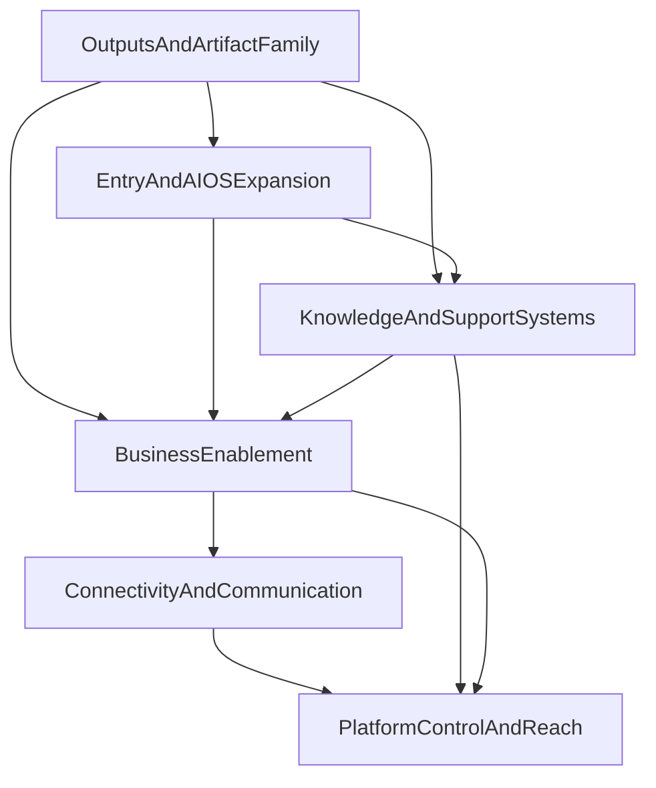

# Wave 2 Master Implementation Order

> Date: 2026-03-29
> Owner: Manager
> Status: active execution-planning authority for Wave 2
> Purpose: turn the Wave 2 planning package into one dependency-based execution sequence

---

## 1. Authority

This file is the execution-order SSOT for the Wave 2 planning package.

It inherits from:

- `docs/product/work-packets/wave-2/WAVE_2_CANONICAL_SCOPE_MAP.md`
- `docs/product/work-packets/wave-2/WAVE_2_AGENT_STANDARD.md`
- the six cluster briefs under `docs/product/work-packets/wave-2/briefs/`
- the module cards under `docs/product/work-packets/wave-2/module-cards/`

If another Wave 2 planning document conflicts on:

- execution order,
- what starts first,
- what is a dependency,
- or which packet gets priority,

this file wins.

---

## 2. Execution doctrine

Wave 2 is not driven by module popularity.

It is driven by product dependence.

The doctrine is:

1. stabilize the cross-format artifact and trust layer,
2. stabilize public entry and AI operating identity,
3. stabilize learning and support systems,
4. stabilize business-enablement products,
5. stabilize communication and external connected runtime,
6. then stabilize platform control and mobile reach.

Canonical sequencing rule:

`shared truth first, visible product shell second, ecosystem depth third`

---

## 3. Dependency order

Interpretation:

- `Outputs` comes first because the artifact family is the most shared cross-cluster truth.
- `Entry + AI OS` comes second because public promise and AI identity shape later product packaging.
- `Knowledge + Support` comes third because it relies on entry and AI framing but should exist before partner/support-heavy enablement work.
- `Business Enablement` comes fourth because tools, assessment, and partner ecosystem depend on stable outputs and support layers.
- `Connectivity + Communication` comes fifth because connected runtime depends on clearer business and operator semantics.
- `Platform Control + Reach` comes last because it should mount stabilized business and connected branches instead of guessing them.

---

## 4. Phase order

### Phase A — Outputs And Artifact Family

Goal:

- make artifact truth fully explicit and execution-ready before other Wave 2 modules depend on it.

Owned brief:

- `WAVE_2_BRIEF_A_OUTPUTS_AND_ARTIFACT_FAMILY.md`

### Phase B — Entry And AI OS Expansion

Goal:

- make public entry and AI identity coherent enough that later modules do not build on vague category framing.

Owned brief:

- `WAVE_2_BRIEF_B_ENTRY_AND_AI_OS_EXPANSION.md`

### Phase C — Knowledge And Support Systems

Goal:

- turn support and enablement into intentional products rather than side layers.

Owned brief:

- `WAVE_2_BRIEF_C_KNOWLEDGE_AND_SUPPORT_SYSTEMS.md`

### Phase D — Business Enablement

Goal:

- close the product canons for tools, assessments, and partner ecosystem depth.

Owned brief:

- `WAVE_2_BRIEF_E_BUSINESS_ENABLEMENT.md`

### Phase E — Connectivity And Communication

Goal:

- move from partial connected capability to one trustworthy communication-and-sync platform story.

Owned brief:

- `WAVE_2_BRIEF_D_CONNECTIVITY_AND_COMMUNICATION.md`

### Phase F — Platform Control And Reach

Goal:

- close tenant/admin/operator/mobile control surfaces on top of stabilized product and connector truth.

Owned brief:

- `WAVE_2_BRIEF_F_PLATFORM_CONTROL_AND_REACH.md`

---

## 5. First starting packets

These are the first bounded packets to define and execute after manager acceptance.

They are ordered.

### Packet 1 — `ArtifactRun lifecycle closure`

Goal:

- freeze the canonical chat-native run lifecycle for artifact creation, refresh, and traceability.

Primary module:

- `WAVE_2_MODULE_CARD_CHAT_ARTIFACTRUN.md`

### Packet 2 — `Artifact trust-state baseline`

Goal:

- make provenance, review, visibility, and export truth explicit across the artifact family.

Primary module:

- `WAVE_2_MODULE_CARD_PROVENANCE_REVIEW_VISIBILITY.md`

### Packet 3 — `Outputs Library taxonomy closure`

Goal:

- turn the library from transitional shell into one truthful canonical discovery surface.

Primary module:

- `WAVE_2_MODULE_CARD_OUTPUTS_LIBRARY.md`

### Packet 4 — `Landing narrative closure`

Goal:

- align the public landing shell around one serious value and conversion story.

Primary module:

- `WAVE_2_MODULE_CARD_LANDING.md`

### Packet 5 — `AI OS product map`

Goal:

- translate prompt, agent, and governed knowledge doctrine into one visible AI operating-system package.

Primary module:

- `WAVE_2_MODULE_CARD_AGENTS_KIMI_PROMPTS_PALANTIR.md`

### Packet 6 — `Help runtime closure`

Goal:

- turn the strong help/knowledge package into one real user-facing support and learning module.

Primary module:

- `WAVE_2_MODULE_CARD_HELP_KNOWLEDGE_BASE.md`

### Packet 7 — `Edukacja scope statement`

Goal:

- explicitly define what standalone education is and where it stops being part of Help.

Primary module:

- `WAVE_2_MODULE_CARD_EDUKACJA.md`

### Packet 8 — `Tools v8 canon`

Goal:

- close the gap between V3 tool truth and one refreshed V8 product canon.

Primary module:

- `WAVE_2_MODULE_CARD_TOOLS.md`

### Packet 9 — `Assessment v8 canon`

Goal:

- define one shared assessment family and workbench model.

Primary module:

- `WAVE_2_MODULE_CARD_ASSESSMENT.md`

### Packet 10 — `Partner lifecycle closure`

Goal:

- take the broader partner product from bounded portal truth into full lifecycle and enablement planning.

Primary module:

- `WAVE_2_MODULE_CARD_PARTNER_PROGRAM.md`

### Packet 11 — `Easy-sync setup shell`

Goal:

- define the one canonical provider onboarding and connect journey.

Primary module:

- `WAVE_2_MODULE_CARD_SYNCHRONIZATION.md`

### Packet 12 — `Communication surface model`

Goal:

- define one visible communication product surface family on top of connected runtime truth.

Primary module:

- `WAVE_2_MODULE_CARD_COMMUNICATION.md`

### Packet 13 — `Organization v8 canon`

Goal:

- define the canonical tenant organization product before touching wider admin/operator surfaces.

Primary module:

- `WAVE_2_MODULE_CARD_ORGANIZATION.md`

### Packet 14 — `Settings taxonomy`

Goal:

- define one clear settings ownership model across user, tenant, and module scopes.

Primary module:

- `WAVE_2_MODULE_CARD_SETTINGS.md`

### Packet 15 — `Admin v8 canon`

Goal:

- define one tenant-operator admin layer that is not a loose collection of views.

Primary module:

- `WAVE_2_MODULE_CARD_ADMIN.md`

### Packet 16 — `Superadmin root closure`

Goal:

- mount the missing major operator branches into one visible control plane.

Primary module:

- `WAVE_2_MODULE_CARD_SUPERADMIN.md`

### Packet 17 — `Mobile V8 scope statement`

Goal:

- freeze what mobile must support credibly and what remains future-only.

Primary module:

- `WAVE_2_MODULE_CARD_MOBILE.md`

---

## 6. Cluster-specific sequencing

### Phase A module order

1. `ArtifactRun z czatu`
2. `Provenance / review / visibility`
3. `Outputs Library`
4. `Documents`
5. `Presentations`
6. `Sheet`
7. `Object-linked outputs`
8. `Notebook outputs`
9. `Report -> Presentation`
10. `Pelny Reports / Presentations builder`

### Phase B module order

1. `Landing`
2. `Agenci / KIMI / Prompty / Palantir`

### Phase C module order

1. `Help / Baza wiedzy`
2. `Edukacja`

### Phase D module order

1. `Tools`
2. `Assessment`
3. `Program partnerski`

### Phase E module order

1. `Synchronizacja`
2. `Komunikacja`

### Phase F module order

1. `Organization`
2. `Settings`
3. `Admin`
4. `Superadmin`
5. `Mobile`

---

## 7. Guardrails

- Do not drop any module listed in `WAVE_2_CANONICAL_SCOPE_MAP.md`.
- Do not treat `green in closure ledger` as equal to `100% broad product closure`.
- Do not reopen active Wave 1 streams unless they are true dependencies, not new owned scope.
- Do not let `Outputs` become a hidden rewrite of every report or presentation engine.
- Do not let `Superadmin` absorb tenant `Admin` or `Organization`.
- Do not let `Edukacja` disappear inside `Help`.
- Do not let `Communication` become a generic chat clone.
- Do not let `Synchronizacja` stay a provider-by-provider patch list without one canonical user journey.

---

## 8. Manager review rule

Before a packet is accepted, the manager must check:

- what user-facing ambiguity it removes,
- what false-completeness assumption it corrects,
- what module card it advances,
- what neighboring scope is consciously not touched,
- and whether it makes the next packet easier instead of harder.

If a packet improves local richness but increases scope ambiguity, it is not accepted.

---

## 9. Fast start after this document

The next execution-planning step after this file is:

1. start with `Packet 1`,
2. keep `Packets 2-17` queued in order,
3. review after each packet whether the module card's `minimal acceptance state now` was materially advanced,
4. only promote deeper packets once the previous packet has a clear evidence shape.

This file is complete when it allows a manager to start Wave 2 execution planning without rebuilding the package structure from scratch.
