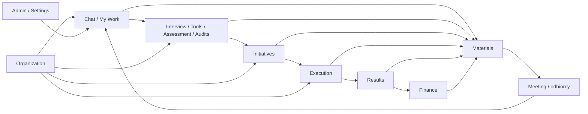

# Model operacyjny Consultinity

## Zasada

Menu nie jest luźną listą ekranów. Każda pozycja pełni określoną rolę w jednym
systemie pracy.

| # | Moduł | Otrzymuje | Jest właścicielem | Przekazuje dalej |
| ---: | --- | --- | --- | --- |
| 1 | Chat | pytanie, kontekst, źródła | rozmowa i propozycje | zadanie, notatka, idea, analiza lub artefakt |
| 2 | My Work | pracę przypisaną użytkownikowi | osobisty cockpit pracy | wykonanie, decyzje i obiekty domenowe |
| 3 | Interview | pytania, respondentów, materiały | sesje, odpowiedzi i insights | Tools, Assessment, Initiatives |
| 4 | Tools | problem, dane i metodykę | sesję narzędzia i wynik analizy | Initiatives, Materials |
| 5 | Assessment | model oceny i odpowiedzi | assessment, scoring i raport oceny | Initiatives, Materials |
| 6 | Initiatives | diagnozy, idee i rekomendacje | inicjatywę i jej uzasadnienie | Execution, Results, Finance |
| 7 | Execution | zatwierdzoną inicjatywę | realizację, zadania, ryzyka i postęp | Results, Materials, My Work |
| 8 | Results | cele, KPI i dane wykonania | wynik, KPI, korzyść i odchylenie | Finance, raportowanie, decyzje |
| 9 | Finance | dane finansowe i założenia | modele, analizy, forecast i wycenę | decyzje, Initiatives, Materials |
| 10 | Materials | źródła z całej platformy | dokumenty, arkusze, prezentacje i raporty | odbiorców, spotkania i dalszą pracę |
| 11 | Audits | zakres, standard i dowody | program audytu i ustalenia | Initiatives, Materials |
| 12 | Meeting | uczestników, agendę i materiały | spotkanie, decyzje i follow-up | My Work, Initiatives, Materials |
| 13 | Organization | dane organizacji i wiedzę | kontekst organizacyjny | wszystkie moduły |
| 14 | Admin Panel | konfigurację tenantów i polityk | administrację organizacji | runtime całej platformy |
| 15 | Settings | preferencje użytkownika | ustawienia osobiste i integracyjne | zachowanie interfejsu i AI |
| 16 | Partner Portal | relację partnerską | klientów, polecenia i rozliczenia partnera | onboarding i współpraca |

## Oś podstawowa

## Własność obiektów

Moduł może wyświetlać obcy obiekt, lecz nie przejmuje jego prawdy.

Przykłady:

- Chat proponuje inicjatywę, ale Initiatives jest jej właścicielem.
- My Work pokazuje zadanie, ale właścicielem stanu wykonania pozostaje właściwy
  proces lub Execution.
- Materials prezentuje dane KPI, ale Results pozostaje właścicielem KPI.
- Prezentacja może pokazywać wynik finansowy, ale Finance pozostaje właścicielem
  modelu i założeń.

## Handoff

Przeniesienie pracy między modułami powinno zapisać:

- obiekt źródłowy,
- obiekt wynikowy,
- autora lub automat,
- czas,
- powód,
- status akceptacji,
- link zwrotny.

## Warstwy wspierające

Organization dostarcza kontekst. Admin Panel i Settings sterują zachowaniem
systemu. My Work zbiera działania użytkownika. Materials opakowuje wyniki.
Te warstwy przekraczają granice modułów, ale nie unieważniają własności danych.
