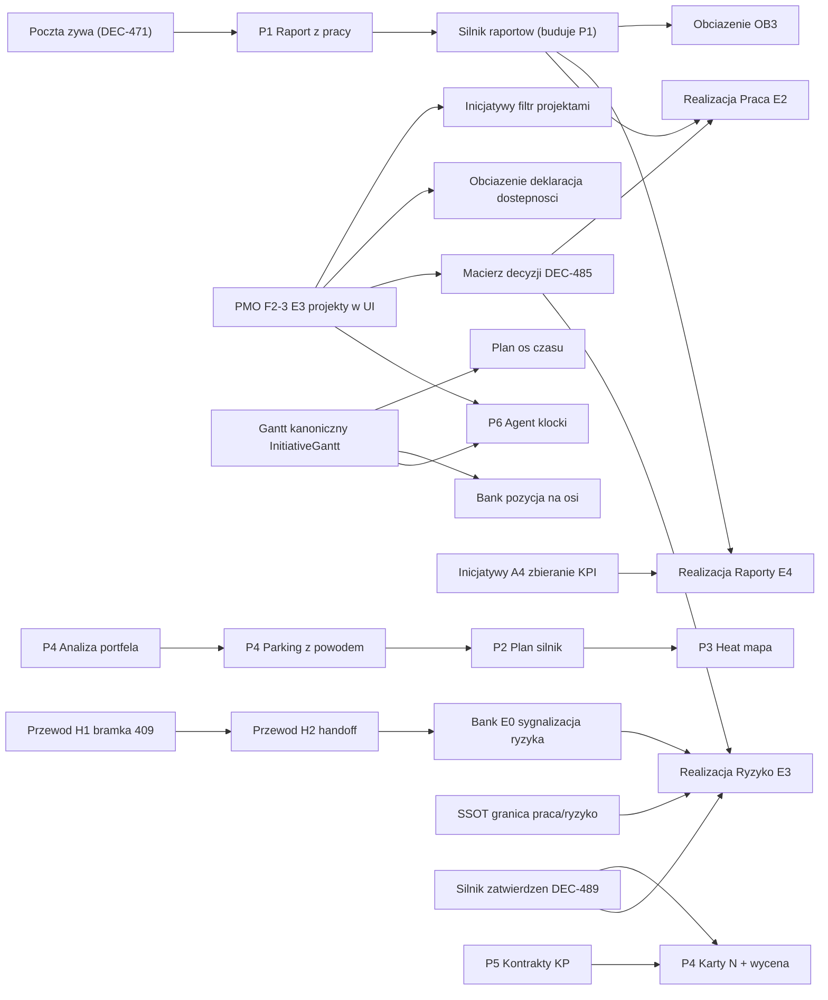

# Trzy pojemniki pracy: MVP rękami właściciela → MVP rękami klienta → Fala 2

> **AKTUALIZACJA 12.09.2026 (wieczór):** rozliczenie stanu wszystkich trzech pojemników znajduje się
> na końcu tego pliku — sekcja „STAN NA 12.09.2026". Szczegóły fali 2 zostały zastąpione dyktandem
> właściciela z lotu: `docs/program/FALA2/SPEC_FALA2_20260912.md` (tam, gdzie się różnią, wiążąca
> jest specyfikacja z 12.09).

Zasada: pojemnik zamyka się mierzalnie (kryteria poniżej), wpisem w „Rejestrze odbioru”
(`PROGRAM_NAPRAWCZY_20260905/01_INDEKS_I_HARMONOGRAM.md`) i słowem właściciela na jednym żywym obrazie.
Następny pojemnik nie startuje, zanim poprzedni nie ma wszystkich kryteriów odhaczonych. Rytm pracy,
podział ról i zakazy: `PRZEKAZANIE_20260906_RANO.md` §8–9 (nie powtarzam ich tutaj).

---

## Pojemnik 1 — MVP rękami właściciela (cel: 10 dni, do ~16.09)
**Definicja:** właściciel przechodzi cały system na stagingu na SWOICH danych, bez asysty, po ścieżce
z `PRZEKAZANIE_20260906_RANO.md` §3, i nie znajduje nic, co go zawstydza.

**Kryterium „gotowe” (wszystkie naraz):**
1. Przejście właściciela: 16 modułów, każdy z werdyktem „Tak” na jednym obrazie; defekty z przejścia = 0 otwartych BLOKER/WAŻNY.
2. Mechanika wartości działa end-to-end na żywo: rezultat KPI poza limitem → czerwony wiersz → wpis w Skrzynce odpowiedzialnego → otwarta karta działania → zadanie osoby (przepływ Playwright + zrzuty + `bledyKonsoli=0`).
3. Jeden dokument i jedna prezentacja z szablonu na danych DBR77 zaakceptowane przez właściciela JAKO PLIK (DOCX/PDF), nie jako zrzut.
4. Jeden prawy panel (Rekord | Teresa) na wszystkich 8 ekranach listowych z P1 (Skrzynka i Wywiad włącznie), zmierzony na żywo 1280/1440/1920.
5. Teresa w każdym module MVP zgodnie z `docs/ssot/KONTRAKTY_NARZEDZI_AI.md` (wejście widoczne, odpowiedź po polsku, źródła z modułu, zero „no_sources” tam, gdzie moduł ma dane).
6. Dane właściciela czyste: jedna ocena wypełniona w 100 %, oceny/inicjatywy/spotkania bez śmieci testowych, `PL · Silesia` = 0, legacy finanse DBR77 albo naprawione (bilans 2024), albo zarchiwizowane z decyzją.
7. Strażniki zielone i dług nie rośnie: `check-list-canon`, `check-artefakt`, `i18nTrescPolska` (ratchet ≤ 484, cel ≤ 300), 0 zmodyfikowanych migracji, tsc serwera.
8. **Środowisko demo dla pojemnika 2 gotowe** (dopisane 06.09 słowem właściciela): `demo.consultify.ai` ma WŁASNĄ bazę (dziś demo i staging dzielą bazę `trolley` — `topologia-srodowisk-staging-demo`, plan rozdziału w 5 fazach), własne zmienne (te same flagi ON co staging, `CSRF_MODE=report`, limiter AI z budżetem), dane pokazowe = DBR77 (Wyniki) + CD PROJEKT (Finanse) + czysta organizacja pilotażowa z jednym nazwanym użytkownikiem; promocja staging → demo opisana i przećwiczona (kopia zapasowa, migracje, health = SHA, cofnięcie); demo zamrożone tagiem `demo-safe-<data>`. Robotnicy nie dotykają demo bez procedury `consultify-promocja-demo`.

**Pozycje (kolejność):**
| # | Pozycja | Wykonawca | Sesje | Zależy od |
|---|---|---|---|---|
| 1.1 | Defekty z przejścia właściciela 06.09 (fale jak w nocy 05/06) | Sonnet/Opus | 1–3 | przejście |
| 1.2 | P1 dokończenie: Skrzynka (`InboxContent.tsx:4324`) i Wywiad (`InterviewHub.tsx:8620`) na wzorzec; 8×3 zrzuty na żywo | Sonnet | 1 | — |
| 1.3 | P9 karta działania + Skrzynka (Codex: 5 powierzchni, K2/K3, e2e, test createActionCard→Skrzynka, sieroty usunięte, rejestr kart N „przed”) | Codex, odbiór Sonnet | 2–3 | — |
| 1.4 | P7K część B: odchylenie → powiadomienie → Skrzynka → karta (na komponencie z 1.3) | Opus | 2 | 1.3 |
| 1.5 | P8 kontrakty Teresy (dokończenie 32 plików Codexa; wejście do Teresy w kanonie `ArtifactRightPanel`, Ocena bez flagi, martwe `AIActionSlot`/`AIConsultantPanel`, `canvasMutationRisk.ts` usunięty) | Codex/Sonnet | 2 | — |
| 1.6 | Dokument i prezentacja z szablonu jako plik (prototyp → akcept właściciela → generator; `szablony-dokumenty-strach-wlasciciela`) | Opus | 2–3 | — |
| 1.7 | Higiena danych właściciela (skrypty idempotentne z dry-run: oceny, śmieci, Silesia, legacy 2024) | Sonnet | 1 | decyzje właściciela |
| 1.8 | Dług i18n: 141 kluczy Czatu (374), 484 pl==en → ≤ 300, 16 testów z mockiem react-router | Sonnet | 1–2 | — |
| 1.9 | Re-audyt A/B na stagingu na sesji właściciela (nie na seedach) + zamrożenie `zamroz.mjs` per moduł | Sonnet ×2 | 1 | 1.1–1.8 |
| 1.10 | **Środowisko demo dla pojemnika 2**: rozdział bazy demo od stagingu (5 faz z `topologia-srodowisk-staging-demo`), zmienne, seedy pokazowe (DBR77 Wyniki, CD PROJEKT Finanse, organizacja pilotażowa), promocja staging → demo przećwiczona z cofnięciem, tag `demo-safe` | Opus + nadzorca | 2–3 | 1.9 |
| 1.11 | **Statusy zatwierdzania inicjatyw — pełne przepracowanie w całym procesie** | jedna tablica statusów i przejść (status · kto · z→na · gdzie widać · co blokuje) obowiązująca w Inicjatywach, Wywiadzie, Ocenie, Narzędziach, Audytach i Realizacji; SSOT + prototyp → akcept właściciela → Codex | Fable (SSOT+prototyp) → Codex | słowo właściciela na tablicę |

**Stan (dopisywany, nie zmienia kryteriów):**
- 06.09 ~08:00: **DEC-399 (właściciel):** Finanse MINIMUM → pojemnik 2, pozycja 2.6; w pojemniku 1 Finanse = pokaz CD PROJEKT. Właściciel: „zgoda, zróbmy to i wypijmy szampana”; panel opublikowany (https://claude.ai/code/artifact/2a86e4bf-46b5-4056-a472-264dc4a26da6).
- 06.09 06:40 (sesja #23): 1.2 W TOKU (`mvp/p1-skrzynka-wywiad`, Sonnet) · 1.8 W TOKU (`mvp/i18n-dlug-1`, Sonnet) · 1.6 W TOKU (`mvp/dokument-prezentacja-plik`, Opus) · 1.3 i 1.5 WYDANE Codexowi jako funkcja celu (wklejki nr 2, wznowienie istniejących worktree) · 1.1 czeka na przejście właściciela · 1.4 czeka na 1.3 · 1.7 czeka na decyzje właściciela. Szczegóły i dowody: rejestr odbioru w `PROGRAM_NAPRAWCZY_20260905/01_INDEKS_I_HARMONOGRAM.md`.

**Decyzje właściciela w tym pojemniku (jedna dziennie):** Finanse MINIMUM do MVP (F1 §0) czy poza; grupowanie inicjatyw po zdjęciu Projektów (rekomendacja: płaska lista + obszar/oś); kropka „Model” w crimson.
### 🍾 Lista kontrolna szampana — koniec pojemnika 1 (co właściciel dowozi, kto potwierdza, jaki artefakt)
| # | Co musi być prawdą | Kto potwierdza | Artefakt dowodu |
|---|---|---|---|
| S1.1 | Przeszedłem 16 modułów na stagingu na swoich danych po ścieżce pokazu; każdy ma moje „Tak” | właściciel | karta per moduł na 3100 (jeden obraz, Tak) |
| S1.2 | Zero otwartych BLOKER/WAŻNY z mojego przejścia | nadzorca | rejestr odbioru: wiersze z SHA i zrzutem PO |
| S1.3 | Widziałem na żywo: rezultat poza limitem → Skrzynka → karta działania → zadanie osoby | właściciel + Playwright | nagranie/zrzuty przepływu + `bledyKonsoli=0` |
| S1.4 | Trzymam w ręku jeden dokument i jedną prezentację z szablonu na danych DBR77 i nie wstydzę się ich | właściciel | pliki DOCX/PDF/PPTX w `evidence/` z moim „Tak” |
| S1.5 | Jeden prawy panel na 8 listach, zwija się i nie wraca po zamknięciu | nadzorca | 8×3 zrzuty na żywo, `aside ≤ 1` |
| S1.6 | Teresa odpowiada po polsku ze źródłami w każdym module MVP | nadzorca | 16 odpowiedzi z `used_sources > 0` w `evidence/` |
| S1.7 | Moje dane są czyste (jedna ocena 100 %, zero śmieci, zero „Silesia”, legacy 2024 rozstrzygnięte) | nadzorca + właściciel | skrypty dry-run/apply z logiem, moje słowo |
| S1.8 | Strażniki zielone, dług nie rośnie, tsc serwera OK, 0 zmodyfikowanych migracji | nadzorca | wynik komend w rejestrze |
| S1.9 | Demo ma własną bazę, dane pokazowe i przećwiczoną promocję z cofnięciem | nadzorca + właściciel (klik na demo) | health demo = SHA, tag `demo-safe-<data>`, zrzuty z demo |
| S1.10 | Trzy decyzje podjęte i zapisane (Finanse MINIMUM, grupowanie inicjatyw, kropka „Model”) | właściciel | ledger decyzji (DEC-…) |
| S1.11 | Wszystkie 16 modułów + Wyniki + Finanse zamrożone tagiem | nadzorca | `zamroz.mjs`, tagi `mvp-wlasciciel-<data>` |
| S1.12 | Przekazanie dla pojemnika 2 napisane (stan, kolejka, decyzje) | nadzorca | `PRZEKAZANIE_<data>.md` + pamięć |
| S1.13 | Analiza kart N (DEC-411, słowo właściciela 06.09): dla każdej karty N ekran + kontrakt treści, tabela rozjazdów „kontrakt mówi / ekran pokazuje / rozjazd”, rozjazdy blokujące naprawione albo rozstrzygnięte słowem właściciela; start: Wnioski (kreator + karta) i Inicjatywy | Sonnet K1 + Codex wklejka nr 6 | `RAPORT_K1.md`, raport Codexa, tabela w rejestrze |
**Komunikat po S1.1–S1.13:** „MVP działa w moich rękach na moich danych, na demo z własną bazą.” Szampan nr 1.


---

## Pojemnik 2 — MVP rękami klienta

> **Adnotacja 10.09 (DEC-461, słowo właściciela):** „teraz budujemy wszystko po angielsku — oprogramowanie i dane
> testowe na stagingu po angielsku; tłumaczenie aplikacji i osobny polski seed dla pokazów później". Wszędzie, gdzie
> kryteria niżej mówią „po polsku" (kryteria 1, 3, 7 oraz S2.11), czytaj: **po angielsku teraz**; wersja polska wchodzi
> w fali tłumaczeń po pilotażu. DEC-467: pokaz w Tokio (11.09) ze stagingu; środowisko pilotażu do decyzji po Tokio. (cel: 3 tygodnie po pojemniku 1, do ~7.10)
**Definicja (uściślona słowem właściciela 06.09):** pilotaż odbywa się **na demo** (własna baza z pozycji 1.10), rękami czterech nazwanych osób pierwszej linii kontaktu z klientem — **Tomek, Kasia, Irina, Justyna** — które zakładają organizację, wchodzą bez asysty właściciela i dochodzą od wywiadu do wyniku bez pytania „gdzie to jest”. Produkcja (`consultify.ai`) wchodzi dopiero po pilotażu, dla pierwszego klienta zewnętrznego. Po starcie pilotażu właściciel buduje **system reakcji** (jak zgłoszenia od czterech osób trafiają do nadzorcy i wracają naprawione — dziś: Feedback w aplikacji + dziennik; docelowo wg decyzji właściciela).

**Kryterium „gotowe”:**
1. Świeża organizacja od zera (rejestracja → kontekst → wywiad → ocena → inicjatywy → realizacja → wyniki) przechodzi przepływ Playwright „pusty stan → pierwsza wartość” w każdym module: puste stany po polsku z jedną akcją, zero ekranów „—” bez wskazówki.
2. Bezpieczeństwo: macierz cross-org 2725 tras zmierzona (dyżur 307) = 0 wycieków; CSRF `enforce` na stagingu po fazie 2 bez regresji; MFA z karencją sprawdzone na koncie obcym; 8 tras admina 403 nie 500 (już); brak 500 w logach stagingu przez 7 dni.
3. Onboarding: kreator „Krok 1 z 3” działa i kończy się, `TRIAL` nie blokuje po 3 pytaniach bez jasnego komunikatu, poczta (zaproszenia, reset hasła) żywa — dziś martwa w całej aplikacji.
4. Wydajność: każdy ekran flagowy < 3 s do treści na stagingu, szkielety z P5 potwierdzone na żywo, Megatrendy 200.
5. Dwa magazyny danych zlikwidowane albo trwale spięte projekcją w SSOT dla: inicjatyw (runtime-v1 vs SQL), ocen (jądro vs zastane), analiz finansowych, artefaktów (aliasy) — z testem, że nowy rekord z UI trafia do obu odczytów.
6. Finanse: jeśli decyzja „MINIMUM do MVP” → F‑M2/M3/M4/M6/M7 wykonane (F1); jeśli „poza” → moduł ukryty za jawnym „wkrótce”, nie za flagą w ciszy.
7. Dokumentacja użytkownika: jedna strona „jak zacząć” po polsku w aplikacji (nie PDF), ścieżka pokazu jako przewodnik.
8. Pilotaż: 2 tygodnie codziennego użycia przez DBR77 z dziennikiem zgłoszeń; 0 BLOKER otwartych na koniec.

**Kryteria dopisane 06.09 po pytaniu właściciela „czy coś pominąłem” (bez nich klient nie istnieje):**
9. **Produkcja:** opisana i przećwiczona ścieżka promocji staging → demo → produkcja (`consultify.ai`, osobna baza): kopia zapasowa przed, migracje addytywne z bramką, health = SHA, cofnięcie wg `_RUNBOOK_COFANIA.md` przećwiczone raz na demo. MVP klienta działa na produkcji, nie na stagingu.
10. **Obserwowalność:** alert na 500/5xx i na padnięcie health (kto dostaje, kanał), logi z `csrf_violation`/AI/błędów przeglądane raz dziennie przez 7 dni pilotażu.
11. **Koszt AI:** limiter AI z powrotem włączony z budżetem per organizacja i czytelnym komunikatem po wyczerpaniu (dziś wyłączony od 05.09 = rachunek bez sufitu).
12. **Dane i prawo:** eksport organizacji (JSON/CSV) i usunięcie na żądanie działają z UI; retencja opisana; umowa powierzenia jako szablon; produkcja nietykalna dla robotników.
13. **Playbook wdrożenia klienta (usługa, nie sklep):** kto zakłada organizację, kto ładuje kontekst, kto prowadzi pierwszy wywiad i ocenę, ile godzin ludzi DBR77 kosztuje pierwszy tydzień klienta — jedna strona, sprawdzona na pilotażu.
14. **Definicja pilotażu:** czterech nazwanych użytkowników (Tomek, Kasia, Irina, Justyna) z własnymi kontami na demo, każdy z własną organizacją testową albo wspólną (decyzja właściciela), dziennik zgłoszeń (Feedback w aplikacji) przeglądany codziennie przez nadzorcę, próg wyjścia: 0 BLOKER, ≤ 3 WAŻNE otwarte, każda z czterech osób potwierdza „doszłam/doszedłem do wyniku sam”.
15. **System reakcji (właściciel, po starcie pilotażu):** kanał zgłoszeń → nadzorca → naprawa → zwrot do zgłaszającego; czas reakcji i rytm przeglądu ustala właściciel; do czasu jego decyzji obowiązuje: Feedback w aplikacji + dziennik + codzienny przegląd nadzorcy.

**Pozycje (kolejność):** 2.0 produkcja i cofnięcie przećwiczone (Opus + nadzorca, 2 sesje) → 2.1 przepływ „pusty stan → pierwsza wartość” per moduł (Sonnet ×2, 2 sesje) → 2.2 macierz cross-org + CSRF enforce + poczta (Sonnet/Opus, 3) → 2.3 dwa magazyny → jedna projekcja (Opus, 3) → 2.4 onboarding i TRIAL (Sonnet, 1) → 2.5 wydajność ekranów flagowych (Sonnet, 1) → 2.6 Finanse wg decyzji (Codex, 5–8) → 2.7 przewodnik w aplikacji (Sonnet, 1) → 2.8 obserwowalność + limiter AI + eksport/usunięcie danych (Sonnet, 3) → 2.9 playbook wdrożenia klienta (właściciel + nadzorca, 1) → 2.10 pilotaż Tomek/Kasia/Irina/Justyna na demo z dziennikiem i systemem reakcji (2 tygodnie) → 2.11 zamrożenie „MVP klienta” tagiem.
### 🍾 Lista kontrolna szampana — koniec pojemnika 2
| # | Co musi być prawdą | Kto potwierdza | Artefakt dowodu |
|---|---|---|---|
| S2.1 | Tomek, Kasia, Irina i Justyna (każde z osobna) założyli organizację na demo i doszli od wywiadu do wyniku bez pytania „gdzie to jest” | czworo użytkowników pilotażu + nadzorca | dziennik pilotażu (Feedback) + 4 potwierdzenia |
| S2.2 | Przepływ „pusty stan → pierwsza wartość” zielony w każdym module na świeżej organizacji | nadzorca | Playwright w CI, raport |
| S2.3 | Bezpieczeństwo: macierz cross-org 2725 tras = 0 wycieków, CSRF enforce, MFA z karencją, 0×500 przez 7 dni | nadzorca | raport pomiaru + logi 7 dni |
| S2.4 | Produkcja gotowa NA klienta zewnętrznego: promocja demo → produkcja przećwiczona z kopią i cofnięciem; health = SHA (pilotaż sam idzie na demo) | nadzorca + właściciel | runbook z datami ćwiczeń, tag `prod-safe-<data>` |
| S2.5 | Alert na 5xx/health dociera do nazwanej osoby; był sprawdzony sztucznym błędem | nadzorca | zrzut alertu |
| S2.6 | Limiter AI z budżetem per organizacja działa i mówi po polsku, co się stało | nadzorca | test na wyczerpanie budżetu |
| S2.7 | Eksport i usunięcie danych organizacji działają z UI; umowa powierzenia jako szablon | nadzorca + właściciel | plik eksportu, zrzut usunięcia, szablon umowy |
| S2.8 | Poczta żywa (zaproszenie, reset hasła) na produkcji | nadzorca | dwa e-maile dostarczone |
| S2.9 | Dwa magazyny danych spięte projekcją z testem „nowy rekord z UI widać wszędzie” | nadzorca | testy + mutacja |
| S2.10 | Finanse wg decyzji: MINIMUM działa na CD PROJEKT albo moduł jawnie „wkrótce” | właściciel | jeden obraz, Tak |
| S2.11 | Przewodnik „jak zacząć” w aplikacji po polsku | właściciel | jeden obraz, Tak |
| S2.12 | Playbook wdrożenia klienta sprawdzony na pilotażu (godziny ludzi DBR77 policzone) | właściciel | jedna strona z liczbami |
| S2.13 | 2 tygodnie pilotażu czterech osób na demo: 0 BLOKER, ≤ 3 WAŻNE otwarte; system reakcji właściciela działa (zgłoszenie → naprawa → zwrot) | nadzorca + właściciel | dziennik z werdyktem, czasy reakcji |
| S2.14 | Zamrożenie „MVP klienta” + przekazanie dla fali 2 | nadzorca | tag `mvp-klient-<data>`, `PRZEKAZANIE_<data>.md` |
**Komunikat po S2.1–S2.14:** „Pierwsza linia pracuje sama na demo, produkcja czeka gotowa na klienta, a my wiemy, kiedy coś pęka.” Szampan nr 2.


---

## Pojemnik 3 — Fala 2 (po pilotażu; decyzje właściciela z 05.09, `MVP_BACKLOG_20260905.md` §E–K)
**Definicja:** funkcje świadomie wyjęte z MVP, każda jako osobny program z własnym SSOT, prototypem
i akceptem przed budową — nigdy hurtem, nigdy za flagą w ciszy.

| # | Program | Co to znaczy | Wejście | Szacunek |
|---|---|---|---|---|
| 3.1 | **Agent** | wykonawcy etapów (0/15 dziś), producent rozpoznawania sprawy, worker `ENABLE_AI_TASKS_WORKER`; zasady w `docs/ssot/ZASADY_AI_TERESA_SSOT.md` (Teresa nie jest silnikiem autonomicznym — Agent ma być jawny, z potwierdzeniem) | SSOT Agenta + prototyp | 6–8 sesji Opus |
| 3.2 | **Projekty / grupowanie inicjatyw** | wg decyzji właściciela (program/portfel/płaska lista) — `project_id` zostaje opcjonalne | decyzja | 2–3 |
| 3.3 | **Menedżer** (rola i widok kierownika) | kokpit dla przełożonego: zespół, Skrzynka zespołu, odchylenia, karty działania | SSOT roli | 3–4 |
| 3.4 | **SIRI** (pakiety metodyczne) | `seed-method-packs-siri`, narzędzia z „już wkrótce” (35/36) — każde narzędzie: sesja → artefakt → dalej | `_FORMULA_MENU_NARZEDZI_12.md` | 8–12 |
| 3.5 | **Finanse PEŁNY** | F‑P1…F‑P11 z F1: Baseline v3 (6 ogniw), prognoza, wycena, porównanie wersji, pełna tabela RZiS/BS/CF | F1 §PEŁNY | 16 |
| 3.6 | **Kręgosłup wartości — reszta konwersji** | 20 z 32 nieklikalnych (`docs/ssot/KREGOSLUP_WARTOSCI.md`), rodowód i zatwierdzenia między modułami | SSOT gotowy | 4–6 |
| 3.7 | **Korpus wiedzy organizacji dla Teresy** | indeksowanie dokumentów org (`teresa-indeksuj-org.ts`), flagi `ENABLE_ORG_KNOWLEDGE_RETRIEVAL` po zaindeksowaniu, limiter AI z powrotem | skrypt gotowy | 2 |
| 3.8 | **Tryb ciemny i dostępność jako bramka** | IV dokończone (E_TRYB_CIEMNY, klawiatura), bramka w CI | przyrząd gotowy | 1–2 |
| 3.9 | **Propozycje Teresy — prostszy przepływ wykonania planu** | mniej kart, mniej ceremonii, jedna decyzja użytkownika (słowo właściciela 06.09, Czat) | 1.1-A domknięte | 1–2 |
| 3.10 | **Dyktowanie notatek głosem** | mowa → tekst w edytorze notatki, na bazie głosu Teresy z 1.1-C (właściciel 06.09, Notatnik) | głos Teresy stabilny | 1–2 |
| 3.11 | **Foldery w Sejfach** | zakładka „Foldery” zdjęta z MVP (DEC-408), wraca jako osobny program (właściciel 06.09, Sejfy) | SSOT Sejfów | 1 |
| 3.12 | **Wywiad: zatwierdzanie i dopuszczanie odpowiedzi** | procedura, w której menedżer zwracający wywiad przyjmuje albo nie przyjmuje udzielonych odpowiedzi (właściciel 06.09, Wywiad); punkt wyjścia = dzisiejsze „zatwierdź / odeślij do poprawy” w Przydzielone; zakładka „Dopuszczenie” usunięta (DEC-410b) | SSOT Wywiadu, decyzja właściciela o krokach | 2–3 |
| 3.13 | **Warsztat sesji DRD — nowy układ graficzny** | „bardzo nawala tego tekstu; poprawimy cały układ graficzny na etapie fali drugiej” (właściciel 06.09, sesja DRD); w MVP tylko kolor stanu odpowiedzi, działające „Zapytaj Teresę” i „Podyktuj” (DEC-415) | prototyp + akcept właściciela | 2–3 |
| 3.14 | **Raporty: eksport PDF i PowerPoint + generator raportów** | „teraz robi tylko w Wordzie; generalnie do fali drugiej” (właściciel 06.09) | szablony (1.6), sufit pptxgenjs | 2–3 |
| 3.15 | **Audyty: wgrywanie założeń pod „Nowy audyt” + generator pytań audytowych** | „normę/formatkę się wgrywa i generator pytań; na razie przycisk zamrozić” (właściciel 06.09) | SSOT Audytów + prototyp | 3–4 |
| 3.16 | **Automatyzacja tworzenia raportów zarządczych** | zbieranie informacji z organizacji, harmonogramy i wyzwalacze (właściciel 06.09: „duże zadanie”); dziś pusty szkielet Raporty › Harmonogramy/Automatyzacja | R2 + szablony 1.6 | 3–4 |
| 3.17 | **Arkusze: źródła danych** | podpięcie i rozwinięcie tabeli „Źródła danych” do arkuszy (właściciel 06.09: „ukryj na razie, zapisz do drugiej fali”) | SSOT Materiałów | 1–2 |
| 3.18 | **Biblioteka wzorców: tworzenie nowych wzorców** | generator „Nowy wzorzec” (właściciel 06.09: „na razie nie zachęca; w MVP wyłączyć przycisk”) | szablony 1.6 + SSOT Materiałów | 2 |

Kolejność w fali 2 ustala właściciel jedną decyzją po pilotażu; rekomendacja CTO: 3.6 → 3.1 → 3.3 → 3.4 → 3.5 → 3.2 → 3.7 → 3.8 (najpierw to, co domyka formułę „sygnał → wartość”, potem Agent).
### 🍾 Lista kontrolna szampana — koniec fali 2 (per program, powtarzana dla każdego z 3.1–3.18)
| # | Co musi być prawdą | Kto potwierdza | Artefakt dowodu |
|---|---|---|---|
| S3.1 | Program ma własny SSOT (jedna strona) i prototyp zaakceptowany PRZED budową | właściciel | SSOT w `docs/ssot/`, karta prototypu z „Tak” |
| S3.2 | Zbudowany na kanonie (StandardTable/SPEC-A/ArtifactRightPanel), zero flag chowających, po polsku | nadzorca | strażniki + zrzuty |
| S3.3 | Mechanika działa end-to-end na produkcji na danych pilotażu, z testem mutacyjnym w zabezpieczenie | nadzorca | Playwright + testy |
| S3.4 | Użytkownik pilotażu użył funkcji sam i dziennik nie ma BLOKER | użytkownik + nadzorca | dziennik |
| S3.5 | Program zamrożony tagiem, rejestr i przekazanie zaktualizowane | nadzorca | tag `fala2-<program>-<data>` |
**Komunikat po każdym programie:** „<Program> działa u klienta.” Szampan nr 3+, po jednym na program — nigdy hurtem.


---

## Jak następca ma z tego korzystać
1. Otwiera ten plik i rejestr odbioru; bierze pierwszą niezamkniętą pozycję pojemnika 1.
2. Każda pozycja = zlecenie z §10 (komendy, progi, STOP) i §11 (wklejka) jak w `PROGRAM_NAPRAWCZY_20260905/00_SZABLON_PACZKI.md`; odbiór rytmem z `PRZEKAZANIE_20260906_RANO.md` §8.
3. Zamknięcie pojemnika = wszystkie kryteria z listy odhaczone w rejestrze z SHA i dowodem + słowo właściciela + tag `mvp-wlasciciel-<data>` / `mvp-klient-<data>`.
4. Ten plik aktualizuje się TYLKO przez dopisanie stanu przy pozycji (data, SHA, werdykt), nie przez zmianę kryteriów — kryteria zmienia właściciel słowem, zapisanym w ledgerze decyzji.

- 06.09 11:35 (słowo właściciela przy przejściu, Czat): „taki wielki plan wykonaj trzeba by też zrobić jakoś prościej i delikatniej — ale to już może iść do fazy 2” → **Fala 2, pozycja 3.9 (nowa): Propozycje Teresy — prostszy i delikatniejszy przepływ wykonania planu** (mniej kart, mniej ceremonii, jedna decyzja użytkownika); w pojemniku 1 tylko 1.1-A (wstaw do dokumentu, zero obiektów bez „Zatwierdź”).

- 06.09 12:33 (właściciel, Notatnik): **Fala 2, pozycja 3.10 (nowa): dyktowanie notatek głosem** — „ja sobie coś gadam, a tu notatki się tworzą” (mowa → tekst w edytorze notatki, na bazie głosu Teresy z 1.1-C).

- 06.09 13:00 (właściciel, Sejfy): **Fala 2, pozycja 3.11 (nowa): Foldery w Sejfach** — zakładka „Foldery” zdjęta z MVP, wraca jako osobny program po pilotażu.

- 06.09 13:31 (właściciel, Wywiad): **Fala 2, pozycja 3.12 (nowa): zatwierdzanie i dopuszczanie odpowiedzi w Wywiadzie** — „menedżer zwracający ma mieć możliwość przyjęcia albo nieprzyjęcia udzielonych odpowiedzi”. W pojemniku 1 tylko porządek: stepper etapów i zakładka „Dopuszczenie” usunięte (DEC-410, DEC-410b), istniejące „zatwierdź / odeślij” w Przydzielone zostaje.

---

# STAN NA 12.09.2026 (wieczór) — rozliczenie trzech pojemników

Pomiar własny nadzorcy, nie deklaracja z raportów. Na żywo: staging i demo = `60051310d7`
(od 12.09 00:20, osiemnaście godzin bez zmiany). Linia integracyjna = `origin/integracja/20260911`.
Kandydat MVP Codexa = gałąź `codex/integrator-mvp-20260912` (67 commitów, 52 pliki kodu, zero
migracji, żadna flaga domyślna nieprzestawiona) — **zbudowany, nieodebrany, niewdrożony**.
Kopie zapasowe sześciu gałęzi Codexa wypchnięte na `origin/backup/*` 12.09 wieczorem.

## Pojemnik 1 — MVP rękami właściciela

| # | Kryterium | Stan 12.09 | Czego brakuje |
|---|---|---|---|
| S1.1 | 16 modułów przeszedł właściciel na swoich danych | **WARUNKOWE TAK** (DEC-466, tylko Inicjatywy i Realizacja) | przejście właściciela wg `KARTA_PRZEJSCIA_WLASCICIELA_20260910.md` — właściciel w podróży |
| S1.2 | Zero otwartych BLOKER/WAŻNY z przejścia | **CZĘŚCIOWO** | 9 dziur zamkniętych i odbiór nr 2 bez regresji; dwa zastane 5xx naprawione **tylko w kandydacie**, niewdrożone |
| S1.3 | Rezultat poza limitem → Skrzynka → karta działania → zadanie | **CZĘŚCIOWO** | pełny cykl RAID i „Close card" zmierzone; ponowne otwarcie karty dopiero w kandydacie |
| S1.4 | Dokument i prezentacja z szablonu na danych DBR77 | **NIEZMIERZONE** | najstarsza niezamknięta obawa właściciela; nikt tego nie pokazał od początku programu |
| S1.5 | Jeden prawy panel na 8 listach | **TAK** | — (8/8 wg DEC-404) |
| S1.6 | Teresa odpowiada ze źródłami w każdym module | **CZĘŚCIOWO / kryterium nieaktualne** | DEC-461 przestawił produkt na angielski; kryterium „po polsku" wymaga przepisania |
| S1.7 | Dane właściciela czyste | **NIE** | na stagingu wróciło 20 klonów „Atelier Toys" z sesji demo + `My Company` + 4 organizacje `TT22TT`; skrypt sprzątania gotowy w kandydacie, nieuruchomiony |
| S1.8 | Strażniki zielone, dług nie rośnie, tsc serwera 0, zero zmienionych migracji | **TAK na wdrożonej wersji** | bramka na kandydacie dopiero przed nami (blok 9) |
| S1.9 | Demo ma własną bazę i przećwiczoną promocję z cofnięciem | **TAK** | cofnięcie przećwiczone realnie 11.09 o 22:22 |
| S1.10 | Trzy decyzje zapisane | **TAK, zaktualizowane** | Finanse: DEC-470 zmienia MINIMUM na jawne „wkrótce" i przenosi całość do fali 2 |
| S1.11 | 16 modułów zamrożonych tagiem | **TAK, wymaga re-tagu** | tagi `mvp-final-*-20260910`; po wdrożeniu kandydata trzeba je przesunąć |
| S1.12 | Przekazanie dla pojemnika 2 napisane | **TAK** | `PRZEKAZANIE_20260912_RANO.md` + pamięć nadzorcy |
| S1.13 | Analiza kart N: ekran + kontrakt treści | **CZĘŚCIOWO** | 7/7 kart zmierzonych w odbiorze nr 2; **kontrakty treści** to teraz osobny punkt fali 2 (spec §7) |

**Werdykt pojemnika 1:** blisko, ale niezamknięty. Trzy rzeczy trzymają: przejście właściciela (S1.1),
dokument i prezentacja z szablonu (S1.4) oraz czystość danych stagingu (S1.7).

## Pojemnik 2 — MVP rękami klienta

**Zmiana środowiska (DEC-472, 12.09):** pilotaż odbywa się na **stagingu**, nie na demo.
To odwraca decyzję z 06.09; demo zostaje środowiskiem pokazowym.

| # | Kryterium | Stan 12.09 | Czego brakuje |
|---|---|---|---|
| S2.1 | Czworo ludzi samodzielnie od wywiadu do wyniku | **NIE** | konta: Tomasz i Justyna istnieją, **Katarzyna i Irina nie istnieją**; hasła wydaję ręcznie, bo poczta martwa (DEC-471) |
| S2.2 | Przepływ „pusty stan → pierwsza wartość" w każdym module | **W TOKU** | paczka C6 na HOLD po niezależnym przeglądzie |
| S2.3 | Bezpieczeństwo: cross-org, CSRF, MFA, zero 5xx przez 7 dni | **CZĘŚCIOWO + NOWE BLOKERY** | CSRF `enforce` działa; **dwa błędy krytyczne z własnych przeglądów Codexa**: eksport sięgający poza organizację oraz obejście ochrony prawnej przy błędzie odczytu i przy wyścigu migawki |
| S2.4 | Ścieżka staging → demo → produkcja przećwiczona | **NIE** | ćwiczenie na demo nierobione; produkcja nietykalna |
| S2.5 | Alert na 5xx i padnięcie health do nazwanej osoby | **NIEZMIERZONE** | nikt tego nie sprawdził sztucznym błędem |
| S2.6 | Limiter AI z budżetem per organizacja | **W TOKU** | etap E3 paczki C6, wstrzymany razem z nią |
| S2.7 | Eksport i usunięcie organizacji z interfejsu | **W TOKU + BLOKER** | etap E4 paczki C6; to właśnie tam siedzą oba błędy krytyczne z S2.3 |
| S2.8 | Poczta żywa (zaproszenie, reset hasła) | **NIE** | DEC-471: właściciel prosi o dostęp do panelu Hostingera; do tego czasu zaproszenia i resety nie działają |
| S2.9 | Dwa magazyny spięte z testem „nowy rekord widać wszędzie" | **W TOKU** | sześciu pisarzy dostarczonych za flagą wyłączoną, niewdrożonych i nieodebranych na żywo |
| S2.10 | Decyzja o Finansach | **ZAMKNIĘTE** | DEC-470: jawne „wkrótce", pełne Finanse w fali 2; etap E0 zbudowany w kandydacie |
| S2.11 | Przewodnik „jak zacząć" w aplikacji | **NIE** | po DEC-461 ma powstać po angielsku |
| S2.12 | Playbook wdrożenia klienta z godzinami | **NIE** | — |
| S2.13 | Dwa tygodnie pilotażu, zero blokerów na koniec | **NIE ROZPOCZĘTY** | start zależy od S2.1, S2.3 i wdrożenia kandydata |
| S2.14 | Zamrożenie „MVP klienta" tagiem i przekazanie | **NIE** | — |

**Werdykt pojemnika 2:** niegotowy do startu. Dwa błędy krytyczne dotyczące danych klienta (S2.3, S2.7)
są twardym warunkiem wstępnym — pilotaż nie może ruszyć, póki są otwarte.

## Fala 2

Lista 3.1–3.20 z tego pliku pozostaje jako historia. **Wiążąca jest specyfikacja właściciela
z 12.09**: `docs/program/FALA2/SPEC_FALA2_20260912.md` — PMO jako fundament (projekty, role,
odpowiedzialności, automatyczne procedury zatwierdzeń, pełny słownik statusów), agent i graficzny
przepływ klocków w stylu n8n, analiza finansowa (pojedyncze sprawozdanie w fali 2, konsolidacja
300 spółek jako faza 3), integracje, KPI/OKR/MBO/ROI ze zbieraniem danych i eskalacją, przegląd
kontraktów kart N, Wywiad, Tools, SIRI i ADMA, Audyt, analiza „wielka trójka", nowy układ Inicjatyw
(cztery przyciski) i Realizacji (Bank, Praca, Zarządzanie ryzykiem, Raporty) oraz moduł Spotkań.

## Co musi się wydarzyć, żeby ruszyć dalej — kolejność

1. Zamknięcie i odbiór kandydata na żywo (blok 9 u Codexa).
2. Naprawa dwóch błędów krytycznych z paczki C6 (eksport poza organizację, ochrona prawna).
3. Wdrożenie na staging z punktem cofnięcia, potem promocja na demo — robi nadzorca.
4. Przejście właściciela: Inicjatywy i Realizacja.
5. Konta pilotażu na stagingu i hasła wydane ręcznie, potem start pilotażu.


# STAN NA 13.09.2026 (rano) — trzy paczki: MVP właściciela · MVP klienta · fala 2

Aktualizacja poprzedniej sekcji (12.09 wieczór, wyżej — **nietknięta**), nie nowy plan. Źródło stanu:
skrzynka na górze `PROGRAM_NAPRAWCZY_20260905/01_INDEKS_I_HARMONOGRAM.md` (pomiar integratora Fable,
13.09 ~07:00 CDT). **Pomiar CTO 13.09:** staging = demo = `60051310d7` (nic z 11–13.09 nie jest
wdrożone). Kandydat Codexa zamrożony na `5de710ff46` = tag `kandydat-mvp-20260913` i scalony na linię
jako `cfea70de8a` (147 commitów, 207 plików kodu, 0 migracji). Flagi `ENABLE_INITIATIVE_*` na stagingu
i demo **nieustawione**. W17 (Materiały/prezentacje/notatnik) i C6-DEL-OFF (odmowa 410
`SET_DELETE_APPROVED_OUT` bez klienta bazy) **są** w kandydacie — premisa nocnego przekazania
„W17 poza kandydatem” była fałszywa (DEC-477: W17 zostaje, wycięcie = przebudowa 147 commitów).
Poza kandydatem zostają tylko dwie gałęzie: `codex/c6-export-contract-20260912` (+19 patchy, pełny
eksport organizacji, HOLD) i `codex/zatwierdzanie-inicjatyw-20260913` (+1 patch, DEC-474, wariant
ceremonii zatwierdzania → fala 2). Bramka K2 (tsc/build/canon/testy) i dowód parytetu flag OFF K3
są **w toku** (agenci Sonnet/Opus) — wdrożenie (K4) czeka na ich wynik. Codex ma STOP na kandydacie
rc2 (zamrożony); dostaje teraz paczkę MVP „zatwierdzanie odpowiedzi Wywiadu” (gałąź
`codex/interview-answer-approval-20260913` od `cfea70de8a`), potem duże prompty fali 2. Dysk:
0,7 GB → 30 GB po sprzątaniu (pomiar CTO 13.09); kopie: `backup/kandydat-rc2-5de710ff46-20260913`,
`backup/integracja-kandydat-cfea70de8a-20260913`, `backup/owner-wip-tracked-20260913`.

**Liczby (policzone z tabel, nie z pamięci):**

| Paczka | 12.09 wieczór | 13.09 rano | Zmiana |
|---|---|---|---|
| Paczka 1 — MVP właściciela | 6 zamkniętych / 13 (7 otwartych) | 6 zamkniętych / 16 (10 otwartych) | +3 kryteria (S1.14–S1.16), 0 zmian werdyktu na TAK |
| Paczka 2 — MVP klienta | 1 zamknięte / 14 (13 otwartych) | 1 zamknięte / 14 (13 otwartych) | liczba zamkniętych bez zmian; **treść** S2.3 i S2.7 zmieniona (patrz niżej) |
| Paczka 3 — fala 2 | — (nie liczona kryteriami TAK/NIE) | 188 z 196 myśli właściciela to fala 2 (8 to MVP, już w paczce 1 jako S1.14/S1.15) | bez zmian liczbowych 13.09; zero programów rozpoczętych budową poza dwiema gałęziami HOLD |

## Paczka 1 — MVP właściciela (pojemnik 1)

| # | Kryterium (skrót) | Werdykt 12.09 | Werdykt 13.09 | Co się zmieniło / co domyka |
|---|---|---|---|---|
| S1.1 | 16 modułów przeszedł właściciel na swoich danych | WARUNKOWE TAK (DEC-466) | **bez zmian** | czeka na K4 (wdrożenie) → K5 (przejście Inicjatywy/Realizacja) |
| S1.2 | Zero otwartych BLOKER/WAŻNY z przejścia | CZĘŚCIOWO | **bez zmian** | naprawy nadal tylko w kandydacie (teraz zamrożonym i scalonym `cfea70de8a`), niewdrożone — domyka K4 |
| S1.3 | Rezultat poza limitem → Skrzynka → karta → zadanie | CZĘŚCIOWO | **bez zmian** | ponowne otwarcie karty nadal tylko w kandydacie, niewdrożone — domyka K4 |
| S1.4 | Dokument i prezentacja z szablonu na danych DBR77 | NIEZMIERZONE | **bez zmian** | brak nowych danych 13.09 w żadnym z przeczytanych źródeł — najstarszy otwarty punkt programu, do pomiaru CTO |
| S1.5 | Jeden prawy panel na 8 listach | TAK | **TAK** | bez zmian |
| S1.6 | Teresa odpowiada ze źródłami w każdym module | CZĘŚCIOWO / nieaktualne (DEC-461) | **bez zmian** | kryterium wymaga przepisania na angielski po DEC-461; nikt tego nie zrobił 13.09 |
| S1.7 | Dane właściciela czyste | NIE | **bez zmian** | skrypt sprzątania nadal w kandydacie, nieuruchomiony na stagingu/demo — domyka K4 |
| S1.8 | Strażniki zielone, dług nie rośnie, tsc serwera 0, zero migracji | TAK na wdrożonej wersji | **bez zmian na wdrożonej wersji** | na kandydacie bramka K2 **W TOKU** (agent Sonnet, „czeka na dysk” w momencie pomiaru) — to jest krok, nie zamknięcie |
| S1.9 | Demo ma własną bazę i przećwiczoną promocję z cofnięciem | TAK | **TAK** | bez zmian |
| S1.10 | Trzy decyzje zapisane | TAK, zaktualizowane | **TAK, zaktualizowane** | dochodzą DEC-477 (W17 zostaje) i DEC-474 (ceremonia zatwierdzania → fala 2) |
| S1.11 | 16 modułów zamrożonych tagiem | TAK, wymaga re-tagu | **bez zmian** | re-tag nadal czeka na wdrożenie kandydata (K4) |
| S1.12 | Przekazanie dla pojemnika 2 napisane | TAK | **TAK** | dochodzi `PRZEKAZANIE_20260913_NOC.md` i skrzynka K1–K9 |
| S1.13 | Analiza kart N: ekran + kontrakt treści | CZĘŚCIOWO | **bez zmian** | kontrakty treści nadal fala 2 (SPEC §7); K8 (rozliczenie SPEC_FALA2 myśl po myśli) w toku 13.09, ale to dokumentacja, nie budowa |
| **S1.14** *(nowe)* | Ręczne przejście Idea/Notatki/Dokumenty: każdy przycisk, ≥3 nielekkie zadania na narzędzie, weryfikacja połączeń z resztą aplikacji | — | **NIE ROZPOCZĘTE** | notatka właściciela 12.09 dosłownie: „(…) wciśnięcie literalnie każdego przycisku i przejście dla każdego z narzędzi conajmniej 3 różnych zadań (nie łatwych) — ale to jest MVP nie fala”; zlecone jako K7, po K4, przed zamknięciem MVP; wykonawca: agenci nadzorcy (Fable), nie Codex |
| **S1.15** *(nowe)* | Zatwierdzanie odpowiedzi Wywiadu: AI / manager / dwa stopnie; manager w panelu sesji odsyła do poprawy albo zatwierdza | — | **ZLECONE Codexowi 13.09** | notatka właściciela dosłownie: „system zatwierdzenia czy odpowiedzi udzielone są wystarczające (…) albo przez AI albo przez managera albo dwa stopnie. Manager w panelu sesji powinien móc odsyłać do poprawy albo zatwierdzać. To jest MVP to zatwierdzenie”; gałąź `codex/interview-answer-approval-20260913` od `cfea70de8a`, dopiero wystartowana — brak jeszcze commitów w przeczytanych źródłach; ocena AI (`w05-ai-evaluation`) już scalona w kandydacie, ceremonia managera/dwustopniowa dopiero budowana |
| **S1.16** *(nowe)* | Przejście właściciela przez Inicjatywy i Realizację po wdrożeniu kandydata | — | **NIE ROZPOCZĘTE** | warunkowe „tak” z 10.09 nadal niepotwierdzone (DEC-476: rdzeń = Inicjatywy + Realizacja, wszystko inne do fali 2); krok K5, po K4; zrzuty robi agent, sprawdza Fable, dopiero potem właściciel patrzy (jeden obraz, Tak/Nie) |

**Werdykt paczki 1:** bez zmiany werdyktu 12.09 → 13.09 na żadnym z 13 pierwotnych kryteriów — postęp
jest w krokach K1 (zamrożenie+scalenie, WYKONANE) i K2/K3 (bramka + dowód parytetu, W TOKU), nie w
zamknięciu kryteriów. Dochodzą trzy nowe kryteria wprost z notatek właściciela (S1.14–S1.16), wszystkie
otwarte. 6 zamkniętych z 16 (było 6 z 13).

## Paczka 2 — MVP klienta (pojemnik 2)

| # | Kryterium (skrót) | Werdykt 12.09 | Werdykt 13.09 | Co się zmieniło |
|---|---|---|---|---|
| S2.1 | Czworo ludzi samodzielnie od wywiadu do wyniku | NIE | **bez zmian** | Katarzyna i Irina nadal nie istnieją; poczta martwa (DEC-471) |
| S2.2 | Przepływ „pusty stan → pierwsza wartość” w każdym module | W TOKU | **bez zmian** | paczka C6 nadal na HOLD |
| S2.3 | Bezpieczeństwo: cross-org, CSRF, MFA, zero 5xx przez 7 dni | CZĘŚCIOWO + NOWE BLOKERY (2 krytyczne) | **CZĘŚCIOWO — jeden z dwóch krytycznych naprawiony** | C6-DEL-OFF (odmowa 410 `SET_DELETE_APPROVED_OUT`, bez klienta bazy, bez wejścia w łańcuch usuwania) już w kandydacie `cfea70de8a` — zamyka błąd „obejście ochrony prawnej przy usuwaniu”; błąd „eksport sięgający poza organizację” nadal otwarty na osobnej gałęzi `codex/c6-export-contract-20260912` (+19, HOLD, poza kandydatem) |
| S2.4 | Ścieżka staging → demo → produkcja przećwiczona | NIE | **bez zmian** | — |
| S2.5 | Alert na 5xx i padnięcie health do nazwanej osoby | NIEZMIERZONE | **bez zmian** | — |
| S2.6 | Limiter AI z budżetem per organizacja | W TOKU | **bez zmian** | etap E3 paczki C6, nadal wstrzymany z całością C6 |
| S2.7 | Eksport i usunięcie organizacji z interfejsu | W TOKU + BLOKER | **CZĘŚCIOWO** | usuwanie teraz bezpieczne przez odmowę (C6-DEL-OFF w kandydacie); pełny eksport nadal HOLD (`c6-export-contract`, kontrakt 1 EXPORT/4 EXCLUDE/1918 UNRESOLVED wg audytu C6 13.09) — **rekomendacja CTO: pilotaż startuje bez pełnego eksportu, pełny eksport = fala 2 (do potwierdzenia słowem właściciela)** |
| S2.8 | Poczta żywa (zaproszenie, reset hasła) | NIE | **bez zmian** | DEC-471 nadal czeka na dostęp do panelu Hostingera |
| S2.9 | Dwa magazyny spięte z testem „nowy rekord widać wszędzie” | W TOKU | **bez zmian** | sześciu pisarzy nadal za flagą wyłączoną, niewdrożonych |
| S2.10 | Decyzja o Finansach | ZAMKNIĘTE | **ZAMKNIĘTE** | bez zmian (DEC-470) |
| S2.11 | Przewodnik „jak zacząć” w aplikacji | NIE | **bez zmian** | — |
| S2.12 | Playbook wdrożenia klienta z godzinami | NIE | **bez zmian** | — |
| S2.13 | Dwa tygodnie pilotażu, zero blokerów na koniec | NIE ROZPOCZĘTY | **bez zmian** | start nadal zależy od S2.1, S2.3 i wdrożenia kandydata (K4→K6) |
| S2.14 | Zamrożenie „MVP klienta” tagiem i przekazanie | NIE | **bez zmian** | — |

**Werdykt paczki 2:** nadal niegotowa do startu, ale jeden z dwóch krytycznych błędów bezpieczeństwa
z 12.09 (S2.3) jest już naprawiony i w kandydacie. Drugi (eksport poza organizację) zostaje otwarty
na gałęzi HOLD poza kandydatem — to jest teraz twardy warunek wstępny razem z kontami pilotażu (S2.1).
Kryteria zamknięte bez zmian: 1 z 14 (S2.10).

## Paczka 3 — fala 2 (pojemnik 3)

Wiążąca specyfikacja: `docs/program/FALA2/SPEC_FALA2_20260912.md`, rozliczona myśl po myśli w tabeli
pokrycia na końcu tego dokumentu (196 wierszy, K8 — w toku 13.09). Policzone z tej tabeli: **188 z 196**
myśli właściciela to fala 2 (109 „F2 docelowo” w Inicjatywach/Realizacji + 72 F2 wprost w pozostałych
programach + 6 F3 konsolidacja finansowa + 1 wiersz rozgraniczenia F2/F3); **8 z 196** to MVP (już
policzone w paczce 1 jako S1.14 i S1.15, nie tutaj). Żaden z 13 programów niżej nie ma jeszcze
rozpoczętej budowy głównego zakresu — poza dwiema gałęziami, które **już są materiałem fali 2**:
`codex/c6-export-contract-20260912` (+19 patchy, pełny eksport organizacji, dziedziczy z pilotażu
paczki 2) i `codex/zatwierdzanie-inicjatyw-20260913` (+1 patch, DEC-474, wariant ceremonii
zatwierdzania w Inicjatywach).

| Program | Źródło (SPEC / notatka) | Myśli z tabeli pokrycia | Stan | Wykonawca |
|---|---|---|---|---|
| PMO + statusy + zatwierdzanie | SPEC §1 (N2-B1) | 5 | nierozpoczęty (materiał HOLD: `codex/zatwierdzanie-inicjatyw-20260913`, +1, DEC-474) | Codex, duży prompt |
| Agent — rozmowa + przepływ klocków jak n8n | SPEC §2 (N2-B2) | 10 | nierozpoczęty | Codex, duży prompt |
| Spotkania — 3 fazy, kreator 3 tryby, ekran z Teresą, nagranie lokalne/Teams | SPEC „MODUŁ SPOTKANIA” (N1-P11/P12) | 20 | nierozpoczęty | Codex, duży prompt |
| Finanse — pojedyncze sprawozdanie | SPEC §3 (N2-B3) | 9 (F2) + 1 rozgraniczenie; **konsolidacja 300 spółek = 6 myśli, faza 3, poza zakresem fali 2** | nierozpoczęty (placeholder „wkrótce” C8 E0 już w MVP jako zaślepka menu, nie jako budowa) | Codex, duży prompt |
| KPI/OKR/ROI — generator + zbieranie danych + eskalacje | SPEC §5 (N2-B5) | 10 | nierozpoczęty | Codex, duży prompt |
| Kontrakty kanoniczne wszystkich narzędzi | SPEC §7 (N2-B7) | 3 | nierozpoczęty (K8 dopiero rozlicza spec, nie buduje kontraktów) | Codex, duży prompt |
| Interview — rozmowa z Teresą, generator wniosków, onboarding z listy | SPEC §8 (N2-B8, część F2) | 5 (F2; 4 dalsze myśli tego samego paragrafu = MVP, patrz S1.15) | nierozpoczęty dla części F2; ocena AI (`w05-ai-evaluation`) już w kandydacie MVP, ceremonia zatwierdzania (S1.15) świeżo zlecona osobno | Codex, duży prompt |
| Tools — pozostałe narzędzia konsultingowe | SPEC §9 (N2-B9) | 2 | nierozpoczęty | Codex, duży prompt |
| Assessment — SIRI i ADMA | SPEC §10 (N2-B10) | 2 | nierozpoczęty | Codex, duży prompt |
| Audit — zgodność z normą/instrukcją, generator, wysyłki | SPEC §11 (N2-B11) | 3 | nierozpoczęty | Codex, duży prompt |
| Integracje z innymi środowiskami | SPEC §4 (N2-B4) | 1 | nierozpoczęty | Codex, duży prompt |
| Analiza „CEO wielkiej trójki” | SPEC §12 (N2-B12) | 1 | nierozpoczęty | Codex, duży prompt |
| Docelowy kształt Inicjatyw (4 przyciski: Inicjatywy/Plan/Obciążenie/Raport) i Realizacji (Bank/Praca/Ryzyko/Raporty) | SPEC „MODUŁ INICJATYWY” + „MODUŁ REALIZACJA” (N1-P1–P10), notatka 1 | 110 (109 „F2 docelowo” + 1 F2) | częściowo materiał: **rdzeń** (nie docelowy 4-przyciskowy układ) budowany w kandydacie MVP paczki 1 (IE01 ścieżka inicjatywy, Bank realizacji, rozbicie karty — DEC-476); docelowy układ menu i pełne Plan/Obciążenie/Raport **nierozpoczęte**; materiał HOLD: `codex/zatwierdzanie-inicjatyw-20260913` | Codex, duży prompt |

## Definicja końca każdej paczki i kolejność

**Paczka 1 kończy się**, gdy wszystkie 16 kryteriów S1.1–S1.16 mają werdykt TAK albo świadomie
zaakceptowane przez właściciela odstępstwo — włącznie z wdrożeniem kandydata, przejściem właściciela
przez Inicjatywy/Realizację, ręcznym przejściem Idea/Notatki/Dokumenty i zatwierdzaniem odpowiedzi
Wywiadu. **Paczka 2 kończy się**, gdy pilotaż czterech osób (Tomasz, Justyna, Katarzyna, Irina)
przejdzie dwa tygodnie na stagingu bez otwartego blokera bezpieczeństwa danych klienta, a granica
eksportu/usunięcia organizacji jest jednoznacznie ustalona słowem właściciela (pełny eksport w MVP
albo świadomie odłożony do fali 2). **Paczka 3 nie ma jednego zamknięcia** — kończy się per program:
każdy z 13 programów wyżej ma własny duży prompt do Codexa, własny niezależny przegląd i własny
odbiór wzrokowy nadzorcy przed pokazaniem właścicielowi (zakaz masowego włączania, jeden po drugim).

**Kolejność:** paczka 1 (K2 → K3 → K4 → K5 → S1.14–S1.16) → paczka 2 (K6, pilotaż 2 tygodnie na
stagingu) → paczka 3 równolegle u Codexa od dziś (K9, zaczynając od PMO i Agenta jako fundamentu pod
pozostałe programy).

---

# PLAN WDROŻEŃ INICJATYWY + REALIZACJA — 14.09.2026 (DEC-498)

> Polecenie właściciela (14.09, dosłownie): *„A ty musisz dokładnie dopiać cały plan dla wzsystkich
> wdrozen w narzeziach inicjatywy oraz wdrozenie"*. „Wdrożenie" = moduł **Realizacja (Execution)**.
> Ten plan nie zmienia żadnej decyzji właściciela — składa DEC-453, DEC-469…476, DEC-481…497
> i SPEC_FALA2 w jedną oś wykonania: per przycisk, per etap, z falami wdrożeń.
> Wiążące źródła treści: `docs/program/FALA2/SPEC_FALA2_20260912.md` (moduł Inicjatywy l.195-320,
> Realizacja l.316-379) i `docs/program/FALA2/WIZJA_INICJATYWY_4_PRZYCISKI_20260914.md`.
> Przydział pakietów Codexa P1-P6: DEC-497.

## §0 Zasady wdrożeń — jedna oś dla KAŻDEGO etapu w tym planie

Każdy etap (a nie każdy pakiet, nie każdy moduł) przechodzi tę samą ścieżkę, bez skrótów:

1. **Gałąź** od aktualnej linii integracyjnej (dziś `integracja/20260911` = `c3ac90ca73`; pakiety
   Codexa P1-P6 na bazie `c3ac90ca73` wg DEC-497), worktree izolowany, commit-per-krok.
2. **Bramka lite** u wykonawcy: `scripts/check-list-canon.sh` (listy) i `check-artefakt.sh`
   (artefakty N), tsc serwera, esbuild per plik. Zakaz pełnego vitest u robotników.
3. **Freeze + niezależny przegląd** (inny agent niż autor) — bez tego dostawa nie wchodzi do odbioru.
4. **Staging za flagą OFF.** Flaga zawsze domyślnie wyłączona (DEC-492f, DEC-495f).
   Zakaz masowego włączania: jedna flaga naraz (CLAUDE.md §9).
5. **Zrzut jasny + ciemny robi AGENT, nie właściciel** (CLAUDE.md §7 — właściciel nigdy nie jest
   pierwszym testerem wizualnym). Motyw przełączany przez zustand, nie `prefers-color-scheme`.
6. **CTO ogląda zrzuty** i odrzuca wszystko, co nie przechodzi TRIADA_KANON (listy) /
   ARTIFACT_ANATOMY §18.1 (artefakty), zanim cokolwiek trafi do właściciela.
7. **Właściciel: Tak/Nie na JEDNYM obrazie**, jedno zdanie opisu. Nic więcej od niego nie wymagamy.
8. **Flaga ON na stagingu** → pilotaż (Tomasz, Justyna, Katarzyna, Irina, Paweł) → dopiero potem
   **demo**: `gh workflow run railway-deploy.yml --ref staging -f environment=demo -f confirm_demo=yes`.
9. **Tag cofnięcia przed każdą promocją**: `demo-safe-<data>-<nazwa>` = stan sprzed wdrożenia.
   Dramat wizualny → flaga OFF natychmiast; zły deploy → Railway rollback / `git revert`.

**Kto co robi (bez wyjątków):**

| Rola | Zakres | Czego NIE robi |
|---|---|---|
| **Codex** (pakiety P1-P6, F2-1/2/3/E) | duże pakiety mechaniki i ekranów fali 2, etapami E1..En, STOP po E1 | nie pushuje na staging/demo/Londyn/integrację, nie pisze migracji bez zgody CTO w kanale |
| **Opus** (agenci CTO) | naprawy punktowe, przewody (409, handoff), trudny kod, konflikty scaleń | nie prowadzi dużych pakietów (to Codex, DEC-497) |
| **Sonnet** (agenci CTO) | zrzuty jasny+ciemny, SSOT/dokumenty, higiena danych, rejestry | nie dotyka kodu produktowego bez zlecenia |
| **CTO (Fable)** | scalanie, push, workflow, tagi, rejestr, KANAL — **jedyny** | nie koduje (DEC z 13.09) |
| **Właściciel** | Tak/Nie na jednym obrazie; decyzje kierunku produktu | nie testuje, nie odkrywa zepsucia, nie włącza flag |

**Kryterium „gotowe" = 5 punktów bramki MVP (DEC-400)**, powtarzane przy KAŻDYM etapie:
(1) jeden obraz wystarcza do oceny; (2) nic na ekranie nie kłamie (zero atrap, zero „v—"/„Unknown");
(3) dane prawdziwe z żywej bazy, nie seed; (4) obie wersje motywu poprawne; (5) zero czerwieni
`primary-*` poza semantyką krytyczną.

### §0.1 Ewidencja postępu

> Polecenie właściciela (14.09, dosłownie): *„Wprowadz do tego raportu 'Plan wdrożeń: Inicjatywy ·
> Realizacja' formułe ewidencjonowania postpów do tego nie wiem gdzie jestesmy w realizacji planu
> MVP samego i Fali 2."* Rejestr: **DEC-501**.

**Sześć stanów etapu** (jeden na etap, najwyższy osiągnięty):

| Symbol | Stan | Znaczenie |
|---|---|---|
| ⬜ | NIE ZACZĘTE | zero kodu/dokumentu dla tego etapu |
| 🔧 | W TOKU | gałąź/pakiet w budowie — podaj gałąź/pakiet i SHA |
| 🧪 | NA STAGINGU | scalone do linii integracyjnej, flaga może być OFF — podaj SHA i datę |
| 👁 | CZEKA NA AKCEPT WŁAŚCICIELA | zrzut jasny+ciemny wysłany, czeka na Tak/Nie — podaj datę wysyłki |
| ✅ | ZAAKCEPTOWANE | właściciel powiedział Tak na obrazie — podaj nr DEC |
| 🚀 | NA DEMO | wypchnięte na `demo.consultify.ai` — podaj SHA i datę |
| ⛔ | ZABLOKOWANE | dodatkowy stan, niezależny od powyższych — podaj czym |

**Reguła aktualizacji.** Po KAŻDYM wdrożeniu na staging/demo i po KAŻDYM akcepcie właściciela
dokumentalista aktualizuje tabelę §5 w tym pliku (SSOT) i przepublikowuje artefakt HTML
(widok, nie źródło prawdy). Nagłówek artefaktu niesie datę „stan na". Dwa liczniki na górze:
**MVP (pojemnik 1 = rdzeń Inicjatywy + Realizacja + pilotaż)** i **FALA 2 (pakiety Codexa + fale
B–F)**. Skrzynka **Z-17**: „aktualizacja ewidencji po każdej fali" — obowiązek dokumentalisty,
nie opcja.

## EWIDENCJA POSTĘPU — stan na 14.09.2026

**Zmierzone 14.09 ~06:30 UTC → zaktualizowane 14.09 noc (fala B zamknięta po stronie kodu,
DEC-505):** staging `88f1a1994d` (fala A cz.1–4 + fala B2 Inicjatywy `90059a1054` + fala B1
Realizacja, run `34817397120`/`34818029950`, oba success), demo `90833bc94adb` — **fala A i fala B
nadal nie na demo**, demo zamrożone do domknięcia stagingu (DEC-503).
Źródła pomiaru: `curl .../api/health` (oba środowiska), `git merge-base --is-ancestor <SHA> HEAD`
na `~/Developer/wt/rejestr-0914` dla każdego SHA cytowanego w tym pliku i w `OD_CODEXA.md`, tabele
P-T01…P-T22 / P-P01…P-P15 wyżej w rejestrze — przeliczone wiersz po wierszu (metoda: „na stagingu”
liczy się tylko wtedy, gdy SHA naprawy jest przodkiem `54f07e0ccd`, nie gdy gałąź jest tylko
„scalona do swojej kopii”/„gotowa”); wynik: **23/37** (wcześniej 18/35).

**Cz. 4 — WDROŻONA na staging (14.09, run `34814866980`).** `drd-output-en` `bcfbe94a42` +
`answer-state-hints` `7a19c38ab6` + `pawel-0539` `40bf4d9441` + `chunk-reload` `54f07e0ccd`
scalone, 0 konfliktów; tag cofnięcia `rollback-pre-fala-a4-20260914` = `13070169a4`. P-P02 DRD EN,
P-P08/09 etykiety, P-P14 dyktowanie, P-P15 widget (decyzja CTO Report = tylko Bug), Z-11
auto-odświeżenie → **🧪 NA STAGINGU**. Dowody: `~/Developer/cto-codex/zrzuty-fala-a4-20260914/`
(harness + i18n z żywego builda; sesja QA wygasła — zrzuty nie z zalogowanej sesji stagingu,
**Z-20**: odświeżyć `storageState` QA lub włączyć `test-support` na stagingu).

**Fala B2 — Inicjatywy E1 WDROŻONA na staging (14.09, run `34817397120`, success).** Linia
`9e9a5f94e7` → `90059a1054`: merge `7e0891ccae` kandydata `1c811a8b19` (kopia
`backup/fala-b-inicjatywy-20260914`) + poprawki parytetu `86e246ab54` (przy OFF „Analysis" z
Menu 2 wracał do tabeli — przywrócone; pstryczek Current/Archive w slocie filtrów łamał kanon
pasków — wyciągnięty, nowy test `InitiativesHub.kanonPaskow`) — **A1 Analiza portfela**
(StandardTable/Preview, 5 kryteriów Coverage gap · Overlap · Priority · New or extension ·
Decision history, „dlaczego" w podglądzie) + **A2 Parking** (IN/PARKING/ARCHIVE z powodem i
warunkiem powrotu, propozycja AI widoczna) → **🧪 NA STAGINGU**. Zero migracji, flaga
`VITE_INITIATIVES_FOUR_BUTTONS` OFF; parytet z żywego chunku (fourButtonsWorkspace 0, workReport 0,
gantt 0, portfolio-analyses 0). Tag cofnięcia `rollback-pre-fala-b2-20260914` = `9e9a5f94e7`.
Bramka: tsc 0/188, język OK, canon 349, artefakt 8-0-117, 50+32 testów zielone. HOLD-y Codexa
zamknięte: „migracja 919 BLOCKED" = artefakt przyrządu (ZAMKNIĘTY); „real model
EVIDENCE_MISSING" — brama deterministyczna wystarcza na testy, model AI nadal nieudowodniony;
„PMO authority PARTIAL" → **DEC-504 (CTO, 14.09): zostaje fail-closed**
(`initiative.review` + `canReview && canSelfApprove`, bez fallbacku OWNER/ADMIN). Nowy czerwony
przepuszczony jako dług: `InitiativeConsultingAnalysisView.behavior.test` „shows rationale…" —
zależność kolejnościowa w pliku testu (3/3 czerwony w pliku, 3/3 zielony w izolacji), widok za
flagą OFF → **Z-22** (do autora/Codex dyżur D-i). Dowody:
`~/Developer/cto-codex/zrzuty-fala-b2-20260914/`. Włączenie ON =
`railway variables --set VITE_INITIATIVES_FOUR_BUTTONS=true` + redeploy ~9 min (po akcepcie
właściciela na zrzutach); **UWAGA**: na stagingu brama deterministyczna wyłączona
(`NODE_ENV=production`) → „Run portfolio analysis" idzie realnym modelem (OpenRouter).

**Fala B1 — Realizacja E1 WDROŻONA na staging (14.09, run `34818029950`, success).** Kandydat
`942748423c` (kopia `backup/fala-b-realizacja-20260914`) → merge `d6cfc1cd27` → po wejściu B2
ponowny merge `88f1a1994d` (wdrożony), zero konfliktów, 21 nowych kluczy i18n — H1 `75304fbb7a` +
H2+B-E0 `2e20c10d26` → **🧪 NA STAGINGU**. Dowód H1 lokalnie: `proposals` → 400 walidacja / 409
domenowe, `executions` → 403 `approved_review_required`, `raid` → 409 bramki (kontrola: linia
dawała 409 bramki na wszystkim). Wiersza w `initiative_lifecycle_gate_decisions` brak — writer
wymaga `transformation_cases`/`plans`/`artifact_links` + rola PROJECT_SPONSOR/STEERING_COMMITTEE
(→ **H1b** w toku: skrzynka recenzenta, gałąź `integracja/kandydat-h1b-skrzynka-20260914`, patrz
§5). Parytet OFF: `GET runtime-v1/execution-cases` identyczne; na żywym stagingu kolumny Banku bez
Risk/Handoff. Tag cofnięcia `rollback-pre-fala-b1-20260914` = `90059a1054`. Bramka: tsc 0/188,
język 3250, canon 349, artefakt 8-0-117, 83 testy zielone; zastane 9 czerwonych w
`src/components/Execution/__tests__` (`ExecutionRuntimeSpine.contract` ×2,
`ExecutionWorkSurface.edycjaWierszem` ×6, `ownerNames` ×1) identyczne na linii. Dowody:
`~/Developer/cto-codex/zrzuty-fala-b1-20260914/` (01–06 ON lokalnie, 07 staging OFF). Flagi:
`VITE_EXEC_RISK_SIGNAL`, `VITE_EXEC_HANDOFF_TRACE`. **Codex:** wpis 22 w `KANAL.md` (podział
pracy) czeka na wklejenie przez właściciela; wpisy 23/24/25 (zgoda migracja B + czystka, kolejka
Q1–Q5/dyżury D-a..D-f, restart Dockera/Colimy) potwierdzone.

**DEC-505 (14.09) — Fala B zamknięta po stronie kodu; akcept wyglądu właściciela = warunek
włączenia flag na stagingu.** Staging `88f1a1994d` = fala A cz.1–4 + fala B (Inicjatywy A1/A2,
Realizacja H1/H2/B-E0) za flagami OFF; demo `90833bc94a` bez zmian (DEC-503). Następne: H1b (w
toku), fala C = P1 (Codex S2, `REQUEST_CHANGES` w naprawie) + RA-E4 (Codex Q2), fala D = P2
(Codex S3, re-review) + Praca (Codex S4, po rebase na fali B), PMO E3 (S5, migracja `20262190` —
zgoda wpis 27).

**Incydent Docker/Colima 14.09.** Silnik kontenerów = **Colima**, nie Docker Desktop; ENOSPC
uszkodził `containerd` (`meta.db` + content store), 4 kontenery umarły same. Naprawa: `colima
stop/start` ~01:54 + `docker start` na 9 bazach → 9/9 `pg_isready`. Reguła nowa: `--restart
unless-stopped`. Osobno: `docker system prune -af --volumes` w ENOSPC skasował zatrzymane
kontenery i wolumeny sieroce (**Z-21**, `fizzup`/`selix`, do wiadomości właściciela) i uciął do
0 B `public/locales/en/translation.json`, odtworzony z HEAD.

**Licznik MVP (pojemnik 1).** Rdzeń: **2/2** filarów zaakceptowane (Inicjatywy DEC-481, Realizacja
DEC-494). Pilotaż: **5** kont, aktywni dziś Paweł + Justyna, Tomek testował 10–11.09 (gmail).
Zgłoszenia pilotażu: **23/37 (62%) naprawione na stagingu** (fala A cz. 4 przenosi P-P02, P-P08,
P-P09, P-P14, P-P15 do 🧪 NA STAGINGU), 1 naprawiona czeka na retest/wdrożenie, 2 nie są defektem
(decyzja produktu/wiedza), 2 czekają na decyzję właściciela, 9 nadal otwarte. Na demo z tych
napraw: **0/37** — demo zamrożone do domknięcia stagingu (DEC-503), patrz „Co blokuje".

```
MVP rdzeń        [██████████████████████████████████████████████████] 2/2 zaakceptowane
MVP zgłoszenia    [█████████████████████████████████░░░░░░░░░░░░░░░░░] 23/37 na stagingu (62%)
```

**Licznik FALA 2 (pakiety Codexa + fale B–F).** Etapy planu §5 poza rdzeniem/pilotażem: **41**
(+1 = H1e dołożone 14.09 po wdrożeniu fali B3). Z tego: 0 zaakceptowanych, **8 na stagingu** (20%,
A1+A2 fali B2 Inicjatywy `90059a1054` + H1/H2/B-E0 fali B1 Realizacja `88f1a1994d` + H1b/H1c/H1d
fali B3 `78086fb2c8`, wszystkie za flagami OFF), **8 w toku** (A4 DEC-499, B-E1 F2-2, silnik
raportów, PMO E3, P6, H1e — gotowe do scalenia `1b9d467823` warunek DEC-507, RP1 — gotowe do
odbioru CTO Codex S2 `4d8113fa46`, OB1 — gotowe do odbioru Codex Q1 `d27172ed3c`), **25 nie
zaczętych**. Duże
pakiety Codexa: **5/5 w toku, 1 na stagingu** (F2-1 HOLD, F2-2 scoped ACCEPT/HOLD, F2-3 E1+E2
dostarczone/nie scalone, F2-E non-migration ACCEPT/pełne E1 HOLD, paczka 5 v3 PRZYJĘTA i
WDROŻONA na staging `19baa6d8bc` za flagą `ENABLE_INTERVIEW_ANSWER_APPROVAL` OFF — patrz EWIDENCJA
niżej). Nowe pakiety P1–P6 (DEC-497): **0/6 przyjęte** — Codex milczy w `OD_CODEXA.md` od
13.09 22:29. Fale B–F: **0/5** zamknięte na demo (fala B3 WDROŻONA na staging za flagami OFF —
DEC-507; akcept wyglądu właściciela na zrzucie w powłoce (Z-27) = warunek włączenia flag).

```
Fala2 etapy §5    [██████████░░░░░░░░░░░░░░░░░░░░░░░░░░░░░░░░░░░░░░░░] 8/41 na stagingu (20%)
Fala2 pakiety P1-6[░░░░░░░░░░░░░░░░░░░░░░░░░░░░░░░░░░░░░░░░░░░░░░░░░░] 0/6 przyjęte
```

**Zgłoszenia pilotażu 37 — rozbicie (P-T01…22 Tomek + P-P01…15 Paweł):**

**Zaktualizowane 14.09 wieczór (dokumentalista, rozliczenie wierszy P-T po SHA-przodkach `54f07e0ccd`):**
same liczby ✅/23 (P-T02/03/08/11 były już liczone tu, tekst wiersza w tabeli był tylko nieaktualny —
poprawiony), ⛔/⚪-zamknięte/🔧 rozdzielone precyzyjniej; suma nadal 37, licznik nagłówkowy **23/37
bez zmian**.

| Kategoria | Liczba | Przykłady |
|---|---|---|
| ✅ naprawione, 🧪 na stagingu | 23 | P-T02/03/04/07/08/09/10/11/21, P-P01/02/03/04/05/06/07/08/09/10/12/13/14/15 |
| 🔧 naprawione danymi/kodem, czekają na retest/scalenie | 4 | P-T17, P-T19, P-T20 (Z-14: flagi v8 org `tt2tt` naprawione danymi 14.09), P-T22 (retest po wdrożeniu cz. 3) |
| ⚪ nie jest defektem / wiedza użytkownika | 1 | P-T18 (ctrl+click, SPA) |
| ⚪ czeka na decyzję właściciela | 2 | P-T01 (adres wsparcia, Z-5), P-T13 (kontekst Teresy, Z-13) |
| ⛔ zablokowane (infrastruktura) | 1 | P-T05 (avatar, wolumen Railway, Z-9) |
| ⚪ zamknięte (infrastruktura, nie defekt) | 1 | P-T12 (reset hasła — SMTP po restarcie 02:30 UTC działa 2/2) |
| 🔴 otwarte | 5 | P-T06 (kandydat dyżuru Codexa D-h), P-T14, P-T15, P-T16, P-P11 |

**Co blokuje (14.09):**
- **Codex milczy** w `OD_CODEXA.md` od 22:29 13.09 — Wpis 17 (DEC-497, pakiety P1–P6) czeka na
  przyjęcie; bez tego fale B–F się nie zaczynają.
- **Demo zamrożone (DEC-503)** — nic z 23 napraw na stagingu jeszcze nie trafiło na
  `demo.consultify.ai`; promocja czeka na domknięcie stagingu, nie na Codexa.
- **Migracja F2-E** — pełne E1 eksportu HOLD/MIGRATION_REQUIRED, czeka na decyzję CTO o trwałym
  snapshot/resume (pula `20262200–20262219`).
- **Wolumen avatarów** (P-T05) — `STORAGE_DIR` na dysk kontenera Railway znika; decyzja przy
  najbliższym wdrożeniu (Z-9).
- **Z-18 (z fali A cz. 3)** — „Delete” w kebabie listy Processes nie otwiera dialogu (sesja
  DRD QA `8cdf5624` na stagingu); do przydziału.
- **Z-19** — kopie sierpniowe 32 GB, czeka decyzja właściciela o usunięciu. **Z-9** — wolumen
  `STORAGE_DIR`, czeka decyzja właściciela. **Z-20** (nowa) — sesja QA na stagingu wygasła, zrzuty
  fali A4 do powtórki po zalogowaniu. **Z-21** (nowa) — wolumeny sieroce skasowane w ENOSPC
  (`fizzup`/`selix`), do wiadomości właściciela. **Z-22** (nowa) —
  `InitiativeConsultingAnalysisView.behavior.test` „shows rationale…" czerwony w pliku
  (zależność kolejnościowa), zielony w izolacji; widok za flagą OFF, dług do dyżuru
  Codexa D-i.
- **Decyzja właściciela w toku (DEC-505)** — Tak/Nie na wygląd fali B (Inicjatywy A1/A2 +
  Realizacja H1/H2/B-E0), oba pakiety WDROŻONE na staging za flagami OFF; akcept właściciela na
  zrzutach = warunek `railway variables --set ...=true` + redeploy.
- **Z-23 (nowa, DEC-506)** — decyzja właściciela otwarta: rejestr Inicjatyw pokazuje kod (7) czy
  etap (12)? Rekomendacja CTO: kolumna „Etap" (12) za flagą 4 przycisków, kod (7) jako filtr
  statusu.
- **Z-24 (nowa, z H1b/H1c)** — ten sam człowiek musi być PROJECT_SPONSOR (recenzja) i PMO
  (wykonanie); przejścia praktycznie niewykonalne bez podwójnej roli; decyzja produktu do S5
  PMO E3 Codexa: rozdzielić role recenzenta i wykonawcy.
- **Kopie 32 GB (Z-19)** i **wolumen avatarów (Z-9)** nadal czekają na decyzję właściciela —
  bez zmian od poprzedniego wpisu.

**DEC-506 (14.09, decyzja CTO na mandacie) — Etapy 12 vs kody 7: bez migracji, mapowanie w
writerze.** Sprzeczność zastana: DEC-490 „12 etapów silnika jedyną prawdą" vs migracja P12
`20262103_p12_initiative_status_slownik.sql` + CHECK `initiatives_status_check_p12` = 7 kodów
(`PROPOSED`/`DRAFT`/`PENDING_APPROVAL`/`APPROVED`/`IN_EXECUTION`/`CLOSED`/`REJECTED`). Etap silnika
żyje w `ie_aggregate_state.payload_json.lifecycleState` (NIE `initiatives.current_stage` — inny
słownik `KICKOFF`/`PILOT`/`SCALE`/`DESIGN` z migracji 064). Mapowanie 12→7 =
`server/src/constants/initiativeLifecycleStages.ts` (parytet z
`src/contracts/initiatives-execution/statusMapping.ts`, test w 3 kierunkach): `REGISTERED_DRAFT`→
`DRAFT`, `DEFINED`→`DRAFT`, `ANALYZING`→`PENDING_APPROVAL`, `READY_FOR_DECISION`→
`PENDING_APPROVAL`, `APPROVED_BACKLOG`→`APPROVED`, `SCHEDULED`→`APPROVED`, `IN_EXECUTION`→
`IN_EXECUTION`, `DELIVERED`→`CLOSED` ★, `BENEFITS_TRACKING`→`CLOSED` ★,
`EFFECTIVENESS_REVIEWED`→`CLOSED` ★, `CLOSED`→`CLOSED`, `ARCHIVED`→`CLOSED`+flaga archived.
★ Delivered/Benefits/Effectiveness kolapsują na `CLOSED` w kolumnie (rozdzielenie = migracja,
zakazana tą decyzją); rozróżnienie zachowane w etapie silnika. Decyzja właściciela otwarta →
**Z-23**.

**Fala B — H1b + H1c gotowe, H1d w toku (14.09, Opus, gałąź
`integracja/kandydat-h1b-skrzynka-20260914`, HEAD `119ad9af3f`, kopia
`backup/h1b-skrzynka-20260914`; baza `9e9a5f94e7` + lokalny merge fali B).** **H1b —
sprostowanie:** ścieżka ludzka jest TRZYSTOPNIOWA (proposal → recenzja A05
`POST /api/v8/agent-proposals/:id/scopes/:scopeKey/review` → execution); brak był tylko GET listy
→ dodane `GET /initiatives/lifecycle-transition-proposals?status=` (skrzynka org, fail-closed
autor/recenzent) + `GET /initiatives/:id/lifecycle-transition-proposals` (`a518894120`, 7 testów
RealPG na produkcyjnym routerze); UI `TransitionInboxSurface` = zakładka „Do akceptacji" w Menu 1
Inicjatyw za flagą `VITE_TRANSITION_INBOX` OFF (`d625e2cc88`; StandardTable+StandardPreview,
akcje-pill Approve/Reject). **H1c:** rozjazd kod/etap w 4 miejscach (`coerceInitiativeStatusForWrite`,
`EXPECTED_BY_TARGET`, readback adaptera, guard `expectedCurrentStatus`) naprawiony; dowód RealPG:
SELECT przed `{APPROVED/SCHEDULED}` → po `{IN_EXECUTION/IN_EXECUTION}` + wiersz
`initiative_handoffs`; zrzuty 01–09 jasny+ciemny (skrzynka, podgląd, pusty, OFF, po akcepcie).
**Znaleziska:** (a) ten sam człowiek musi być PROJECT_SPONSOR i PMO — przejścia praktycznie
niewykonalne bez podwójnej roli → do S5 PMO E3 Codexa (**Z-24**); (b) MARTWA bramka GO/NO-GO w
`initiativeTransitionService` (porównania `'SCHEDULED'`/`'EXECUTING'`/`'DONE'` z kodami P12 →
reguła H16/INI-005 nie działa; `execution_started_at`/`review_requested_at` nieustawiane) →
**H1d w toku** (Opus, ta sama gałąź); (c) 3 zastane czerwone w `services/initiative` (fikstura
`'PLANNING'`, grep po skasowanym SQL, `ARCHIVED` poza macierzą). **EWIDENCJA:** H1b
🔧→**gotowe do scalenia `119ad9af3f`**; dodane wiersze H1c (gotowe) i H1d (🔧).

**H1d — martwa bramka GO/NO-GO naprawiona (14.09, Opus, gałąź
`integracja/kandydat-h1b-skrzynka-20260914`, HEAD `36b83f3e04`, kopia
`backup/h1b-skrzynka-20260914`).** **Dowód martwoty:** CHECK P12
(`PROPOSED`/`DRAFT`/`PENDING_APPROVAL`/`APPROVED`/`IN_EXECUTION`/`CLOSED`/`REJECTED`) vs stare
predykaty legacy `'SCHEDULED'`/`'EXECUTING'`/`'DONE'`/`'PROMOTED'`/`'PLANNING'`/`'BLOCKED'` →
COUNT=0 na każdym z sześciu (`evidence/h1b-20260914/h1d-realpg-dowod.txt`). **Naprawy w
`initiativeTransitionService.ts`:** bramki kluczowane przez `gate` z
`INITIATIVE_TRANSITION_MATRIX` (APPROVE/START/COMPLETE); START bez aktualnej decyzji GO
(najwyższa zatwierdzona niewygasła wersja w `initiative_lifecycle_gate_decisions`, `pmo_domain`
`GOVERNANCE_DECISION_MAKING`) → 409 `GATE_DECISION_REQUIRED`; stemple
`execution_started_at`/`done_at`/`cancelled_at` na kodach P12; usunięte martwe przejścia
PROMOTED→PLANNING, APPROVED→SCHEDULED (właściciel: `scheduleDecision.ts`), BLOCKED/TRACKING
(flaga `on_hold`/etap); cron `initiativeAutoStartJob.ts:96` selektor poprawiony na kolumnę
`APPROVED` + etap `SCHEDULED` (był `scanned=0` zawsze). **Wymóg decyzji CLOSURE przy domknięciu
NIE przywrócony** — `initiativeClosureService` jej nie zapisuje, co dałoby 409 na każdym ludzkim
domknięciu. **Zastany defekt naprawiony przy okazji:**
`resolveInitiativeStageWriteTarget('REJECTED')` zapisywało `CLOSED`. **Testy** RealPG
`h1d-start-execution-go-gate.pg.test.ts` 3/3 (A RED→GREEN, B z decyzją, C cron); regresja
4 failed/191 → 3 failed/194 (zastane, bez zmian tą gałęzią). **Sanitizer**
`scripts/dev/h1d-sanitizer-inexecution-bez-lancucha-go.sql` (raport, zero zapisu).
**NIENAPRAWIONE — dyżur Codexa D-j (KANAL wpis 31):** ten sam kształt martwych porównań w
`ExecutionReportCron.ts:26`, `transformationCaseService.ts:6288/6459/6676`,
`resultsROIService.ts:1127`, `planningPortfolioReadService.ts:1037/1047/1124/1169`. **Długi:**
`review_requested_at`/`approved_at` nie istnieją po strict migrate (**Z-25**: stempel prośby o
recenzję wymaga migracji — decyzja właściciela później); bramka `RESOURCE_RESPONSIBILITY` bez
kodu (**Z-26**, decyzja właściciela); okno `tracking_*` bez właściciela; testy H1c/H1d tylko na
bazie jednorazowej (wyzwalacz niezmienności do zapamiętania). **EWIDENCJA:** H1d
🔧→**gotowe do scalenia `36b83f3e04`**; dodany wiersz D-j (Codex, dyżur — nienaprawione).

**Codex 14.09, 02:40–02:46 (KANAL Wpisy 28–29).** S1 paczka 5 v2 **ACCEPT** (`e1a2c2c160`) →
odbiór CTO w toku (integrator paczka5v2 → staging, flaga OFF). S2 **REQUEST_CHANGES** (P1: receipt
UUID/`SENDING` bez lease/MEMBER w pickerze; SMTP lokalny do E1, doręczenie na skrzynkę stagingu
przy odbiorze CTO — Wpis 29). S3 rebase. S4 freeze `a0c6770b35` na `88f1` — kolejka odbioru po S1.
S5 migracja `20262190` PASS + zaakceptowana (Wpis 29), E3 trwa.

**Odbiór paczki 5 v2 (Codex S1) — WSTRZYMANE, wraca (KANAL wpis 30) — 14.09.** Scalenie
`8b6d3f2671` (`e1a2c2c160` na `21d7d27ecf`, 0 konfliktów) na
`origin/backup/kandydat-paczka5v2-odbior-20260914`, worktree `wt/paczka5v2` zostawiony. D1–D4
potwierdzone: `InterviewController.ts:3739`; `gateway.pg.test:44` env
`INTERVIEW_APPROVAL_TEST_DATABASE`; `migration.test:10` `testPath`;
`interviewAnswerApprovalPolicy.ts:30` `=== 'true'` + parametr org, oba wymagane. Parytet OFF: 11
żądań przez realny ApiGateway+JWT+PG18, linia vs kandydat identyczne co do bajtu (addytywne: `code`
w błędach, nowa trasa `GET …/answer-approvals` 200 `{approvals:[]}`). Smoke ON: ledger 1 wiersz;
migracja `20262170` idempotentna (pusta 2×, schemat stagingu 2×). Bramka: tsc 0/188, canon 349,
artefakt 8-0-117, build OK, 104+85 testów zielone. **BLOKER:**
`tests/unit/backend/controllers/InterviewAssignmentsController.test.ts` (przepisany +958 linii)
21 failed/11 passed (ON: 28/32); nieobjęty `FOCUSED_TESTS.json` Codexa (8 plików) — „62/62" nie
obejmowało testów własnej funkcji; mieszane przyczyny (stała asercja `aiReview:null` vs defekt
`retryAiAnswerApprovals` 404≠503, LLM wołany mimo asercji, autoryzacja/redakcja nieudowodnione).
**Nowa reguła (wpis 30):** FOCUSED_TESTS = wszystkie pliki testowe z delty. D6/D7 zostają. Zastane:
pełny ścisły łańcuch migracji na klonie schematu stagingu pada na 919 (ledger 225/915) — dyżur D-g.
**Lekcja nadzorcy:** „focused tests" wykonawcy nie dowodzą jego własnej zmiany, jeśli lista nie
pochodzi z delty — nowy kształt fałszywego „gotowe" (kandydat do pamięci).

**Codex 14.09, 03:01–03:09.** S2 nowy freeze → final review **REQUEST_CHANGES** (drugi raz); S4/S5
checkpoint; S5 PMO E3 E1 **FREEZE** (do odbioru CTO po independent review).

**Z-2 (aktualizacja, H1d gotowe).** H1d gotowe do scalenia `36b83f3e04` (martwa bramka GO/NO-GO
naprawiona). Integrator fali B3 w toku: H1b+H1c+H1d → staging za flagą `VITE_TRANSITION_INBOX`
OFF; bramka GO ewentualnie za osobną flagą serwera `ENABLE_LIFECYCLE_GO_GATE`, jeśli UI nie ma
dziś sposobu zapisu decyzji GO — decyzja w raporcie integratora.

**EWIDENCJA (uzupełnienie 14.09 noc, po odbiorze paczki 5 v2).** Paczka 5 (Wywiad) →
**🔧 wraca** (wpis 30). S5 PMO E3 → **🔧 freeze E1**.

**EWIDENCJA (uzupełnienie 14.09 noc, po H1d).** §2 przewód: **H1d 🔧 →
„gotowe do scalenia `36b83f3e04`"**; dodany wiersz **D-j** (Codex, dyżur — 4 rodziny martwych
porównań poza `initiativeTransitionService`, nienaprawione, KANAL wpis 31). Liczniki §5
przeliczone: 44 etapy (+1 D-j) — ✅ 2 · 🧪 6 · 🔧 8 · ⬜ 28 · 👁 0 · 🚀 0 · ⛔ 0; FALA 2 = 40
etapów (0 ✅, 5 🧪, 8 🔧, 27 ⬜).

**Fala B3 — H1b+H1c+H1d WDROŻONA na staging (14.09, integrator, run `34824636382`, success).**
§2 przewód: **H1b 🔧 → 🧪 NA STAGINGU `78086fb2c8`** (flaga `VITE_TRANSITION_INBOX` OFF), **H1c
🔧 → 🧪 NA STAGINGU `78086fb2c8`**, **H1d 🔧 → 🧪 NA STAGINGU `78086fb2c8`** (flaga
`ENABLE_LIFECYCLE_GO_GATE` OFF, DEC-507). Linia `61334b2c21`/`f9239fe307` → `78086fb2c8`: merge
kandydata `36b83f3e04` = `40fd649d2b` + commit flagi `f662fa1c0b` + merge rejestru `78086fb2c8`.
Jedyny konflikt: importy w `InitiativesHub.tsx` (`PortfolioHealthView` z B2 vs
`TransitionInboxSurface` z H1b) — oba zostały. Tag cofnięcia `rollback-pre-fala-b3-20260914` =
`88f1a1994d`. Bramka: tsc 0/189 (⚠ próg wyczerpany, pierwszy przebieg OOM dał fałszywe „0",
powtórzony z `--max-old-space-size`), język OK, canon 349, artefakt 8-0-117, build OK, RealPG H1b
7/7, H1c 1/1, H1d 4/4 (w tym nowy test parytetu za flagą OFF), `initiativeLifecycleCanon` 3→2
czerwienie. Parytet na żywym chunku stagingu: `transitionInbox` 0, `lifecycle-transition-proposals`
0. Nowy wiersz **H1e** (Sonnet, gałąź `integracja/kandydat-h1e-20260914`) — warunek włączenia
bramki GO (DEC-507): `CURRENT_GO_DECISION` w wierszu START macierzy przy ON + i18n
`CLOSURE_WORK_INCOMPLETE`. Skrzynka: **Z-27** (nowa — zrzuty fali B3 pokazują powierzchnię
komponentu bez powłoki Menu 1/2/3; przed pokazaniem właścicielowi potrzebny zrzut w powłoce).
Liczniki §5 przeliczone: 45 etapów (+1 H1e) — ✅ 2 · 🧪 9 · 🔧 6 · ⬜ 28 · 👁 0 · 🚀 0 · ⛔ 0;
FALA 2 = 41 etapów (0 ✅, 8 🧪, 6 🔧, 27 ⬜). Co blokuje: akcept wyglądu fali B na czystym zrzucie
w powłoce (Z-27), H1e (warunek włączenia DEC-507), Z-25/Z-26 (decyzje właściciela).

**H1e gotowe (14.09, Sonnet, gałąź `integracja/kandydat-h1e-20260914`, HEAD `1b9d467823`, kopia
`backup/h1e-20260914`).** Preflight START (`initiativeTransitionPreflightService.ts:158-172`)
warstwuje `evaluateInitiativeTransitionCondition` dla `CURRENT_GO_DECISION` **tylko** przy
`ENABLE_LIFECYCLE_GO_GATE` ON (`dfffcc5ab9`; 3 przypadki testowe). Komunikat
`CLOSURE_WORK_INCOMPLETE` dodany w `initiativeLifecycleMessages` + i18n en/pl (`b3919f055b`).
Po drodze naprawiony duplikat klucza `initiatives.analysis` (2 bloki: legacy 11 kluczy + portfolio
38 → scalone 49, bez kolizji podkluczy; EN l.12230/14982, PL l.11399/14157) i podpięty
`scripts/i18n/detect-duplicate-json-keys.mjs` do i18nTrescPolska (`1b9d467823`). Warunek włączenia
bramki GO (DEC-507) spełniony po wejściu na linię (fala B4). **EWIDENCJA:** §5 H1e
🔧 W TOKU → **🔧 gotowe do scalenia `1b9d467823`**.

**Z-27 rozliczone + H1f (14.09, Sonnet, gałąź `integracja/kandydat-z27-zrzuty-20260914`, HEAD
`04b2cdf5ca`, kopia `backup/z27-zrzuty-20260914`).** Harness
`dev-render/screens/z27-inicjatywy-skrzynka.tsx` montuje cały `InitiativesHub` (flagi budowy →
dwa procesy vite ON/OFF); zrzuty w powłoce `~/Developer/cto-codex/zrzuty-z27-skrzynka-20260914/v2/`
(jasny+ciemny: lista, podgląd, OFF). Poprawki po oku CTO: pigułki Menu 3 rejestru przeciekały do
zakładki (`InitiativesHub.tsx:3079` `commandRowContent` — wyłączone dla `transitionInbox`,
`9602bd949c`), surowe kody przejść/obszaru → etykiety i18n (`initiativeStatusLabels.ts`
wydzielone z `InitiativePreviewV3`; 9 brakujących kluczy `initiatives.status.*` — nigdy nie
istniały, mock testowy zwracał `defaultValue`; `c86f2e5c5e`, `04b2cdf5ca`); kolory akcji-pill
(zielony Zatwierdź / czerwony Odrzuć) = kanon TABLE_AND_PREVIEW_CANON §7.3b — **bez zmian**
(premisa CTO błędna, agent poprawnie odmówił). Zrzut wysłany właścicielowi (Tak/Nie wygląd
skrzynki). **Dług — Z-28 (nowy, dyżur i18n):** etykieta „Zatwierdzony" (rodzaj męski) przy
inicjatywie (żeński: „Zatwierdzona") — klucz `initiatives.status.approved`.

**Codex 14.09, 03:43–04:17.** **S2 P1 Raport z pracy — FINAL ACCEPT** (`4d8113fa46`, baza
`61334b2c21`, kopia `backup/codex/raport-z-pracy-inicjatyw-20260914-final-gate2-20260914`;
9 plików testów delty 31/31, RealPG runner→PDF→EmailService→lokalny SMTP→PG→dashboard 2/2; żywy
SMTP stagingu nietknięty) → odbiór CTO w toku (integrator `p1-raport`). **S5 PMO E3 R2
REQUEST_CHANGES.** **Q1 P3 Obciążenie E1 — ACCEPT** (`d27172ed3c`, receipt `bdf4321105`, kopia
`backup/codex/obciazenie-inicjatyw-20260914-20260914`; heatmapa osoba×tydzień
StandardTable+Preview, progi <85/85–100/>100, horyzont 4/8/12/26 tyg., flagi OFF, bez migracji;
E2–E4 nie zaczęte) → kolejka odbioru (KANAL wpis 33: S1 v3 → P1 → Q1 → S4 → S5 → S3). Wpisy KANAL
32–33.

**Z-2 (aktualizacja 14.09, integratory w toku).** Cztery równoległe: paczka 5 v3
(`wt/paczka5v3`), P1 (`wt/p1-raport`), fala B4 = H1e + Z-27 (`wt/fala-b4`). Worktree usunięte po
scaleniu/porzuceniu: `fala-a2`, `fala-b3`, `h1b`, `paczka5v2`. Dysk ~25 GiB.

**EWIDENCJA (uzupełnienie 14.09, po H1e/Z-27/S2/Q1).** §5: H1e → **🔧 gotowe do scalenia**;
RP1 → **🔧 gotowe do odbioru CTO** (Codex S2 FINAL ACCEPT `4d8113fa46`); OB1 → **🔧 gotowe do
odbioru** (Codex Q1 E1 ACCEPT `d27172ed3c`). Skrzynka: Z-27 rozliczone, **Z-28** nowy (etykieta
rodzaju żeńskiego „Zatwierdzona"). Liczniki §5 przeliczone: 45 etapów — ✅ 2 · 🧪 9 · 🔧 8 ·
⬜ 26 · 👁 0 · 🚀 0 · ⛔ 0; FALA 2 = 41 etapów (0 ✅, 8 🧪, 8 🔧, 25 ⬜).

**P1 Raport z pracy — ODEBRANY i WDROŻONY na staging (14.09, CTO, run `34826961239`, success).**
Linia `78086fb2c8` → `3e1363d01a` (kandydat `4d8113fa46` + docs `7724358c0b`, merge `fa3893df45`;
jeden konflikt `InitiativesHub.tsx` — zakładka `workReport` rozstrzygnięta pod nową flagą
`WORK_REPORT_ENABLED`, nie pod `FOUR_BUTTONS`; `?lens=parking` bez zmian; Menu 3 czyste). Tag
cofnięcia `rollback-pre-p1-raport-20260914` = `78086fb2c8`. 11/11 plików testów delty 33/33.
Własna sonda CTO (nie tylko dowód Codexa): runner → PDF (`work-report-3a588c6f….pdf`, 24 773 B,
2 strony, PDFKit) → MailHog (Message-ID `work-report-scheduled-delivery-…`) → PG (`PUBLISHED`,
odbiorcy `DELIVERED`, `contentHash`) + osobno ścieżka porażki bez SMTP (`APPROVED`/`FAILED`,
`EMAIL_DELIVERY_FAILED`, receipty puste) — **publikacja bez doręczenia nie przechodzi sondy**.
Parytet flag OFF potwierdzony: `ENABLE_INITIATIVES_WORK_REPORT` (6 wołaczy w kodzie, nie fantom)
i `VITE_INITIATIVES_WORK_REPORT` nieustawione; pełny spider 872 chunków żywego stagingu = 0
trafień kreatora. Autoryzacja: MEMBER dostaje 403 na create/transitions/przebieg. Bramka: tsc
0/189, język bez wzrostu, kanon 349, artefakt 8-0-117, build OK. Żywy SMTP stagingu nietknięty tą
sondą (doręczenie na żywą skrzynkę właściciela wymaga jego zgody — patrz **Z-31**). Zrzuty
Codexa z odbioru wcześniejszego (S2 FINAL ACCEPT) były gołym `<main>` bez powłoki Menu 1/2/3 —
przekazane do **Z-29**.

**Z-29 zrzuty P1 w powłoce (Sonnet, gałąź `integracja/kandydat-z29-zrzuty-20260914`, HEAD
`fb79dd4190`, kopia `backup/z29-zrzuty-20260914`; harness
`dev-render/screens/z29-inicjatywy-raport-pracy.tsx`).** Zrzuty w
`~/Developer/cto-codex/zrzuty-z29-raport-pracy-20260914/` (lista, kreator, przebieg, OFF;
jasny+ciemny). **SKAZY poniżej kanonu** (zmierzone w kodzie `InitiativeWorkReportView.tsx`; review
Codexa oglądał samą powierzchnię komponentu, nie montaż w Hub): brak `StandardPreview` przebiegu
(klik w wiersz nic nie robi — brak statusu doręczeń/PDF w podglądzie), surowe kody enum
`PUBLISHED`/`WEEKLY`/`ON_DEMAND` w tabeli zamiast etykiet, 2 przyciski zamiast kebaba, natywne
`<select>`, kreator jako blok nad tabelą zamiast modala/panelu, przeciek pigułek Menu 3 do
zakładki. **Etap RP1b „przejazd kanonu"** (Opus, gałąź `integracja/kandydat-p1-kanon-20260914`,
w toku) naprawia powyższe. KANAŁ wpis 35 (reguła dla Codexa): każdy ekran przed freeze =
`StandardTable`+`StandardPreview`+`StandardModuleBar`, etykiety i18n, kebab, zrzut w powłoce.
**Lekcja nadzorcy (kandydat do pamięci):** „review powierzchni ≠ odbiór ekranu" — Codex i CTO
oglądali komponent bez powłoki; dopiero montaż całego Hub pokazał brak podglądu.

**Codex 14.09, 04:30–04:44.** S5 PMO E3 R3 **ACCEPT** → kolejka odbioru po Q1. S4 F2-2 E2
rereview **HOLD** → poprawki zamrożone (04:44). KANAŁ wpis 34 (P1 na linii, Q2 start, rebase
S3/S4), wpis 35 (reguła StandardTable/Preview/ModuleBar przed freeze, patrz Z-29 wyżej).

**Z-2 (aktualizacja 14.09, integratory w toku — druga fala).** Cztery równoległe: paczka 5 v3
(push `19baa6d8bc` — run `34828181888` krok „Deploy app to staging" **FAILURE**, ale health
stagingu = `19baa6d8bc`, tag `staging-deployed` został `3e1363d01a` — znany kształt „timeout
workflow nie przesuwa tagu"; wyjaśnienie w raporcie integratora), fala B4 (H1e + Z-27), Q1
Obciążenie, RP1b (przejazd kanonu). Dysk: 8,7 → ~26 GiB po czystce (z27, h1e, Caches). Worktree
usunięte: `p1-raport`, `fala-a2`; `z29` (w toku — RP1b jeszcze aktywne).

**EWIDENCJA (uzupełnienie 14.09, po P1 odbiorze/Z-29/RP1b).** §5: RP1 →
**🧪 NA STAGINGU `3e1363d01a`** (za flagą `ENABLE_INITIATIVES_WORK_REPORT`/
`VITE_INITIATIVES_WORK_REPORT` OFF), 🔧 GOTOWE DO ODBIORU CTO → 🧪 NA STAGINGU; **RP1b** (przejazd
kanonu, skazy Z-29) w toku pod tym samym wierszem RP1, nie liczony osobno. Skrzynka: **Z-29
rozliczone** (skazy przekazane do RP1b), **Z-31 nowy** (żywe doręczenie maila do właściciela —
wymaga jego zgody, patrz sonda CTO wyżej). Liczniki §5 przeliczone: 45 etapów — ✅ 2 · 🧪 10 ·
🔧 7 · ⬜ 26 · 👁 0 · 🚀 0 · ⛔ 0; FALA 2 = 41 etapów (0 ✅, 9 🧪, 7 🔧, 25 ⬜).

**EWIDENCJA (uzupełnienie 14.09 noc, po odbiorze paczki 5 v3).** Paczka 5 v3 (Wywiad —
zatwierdzanie odpowiedzi, Codex S1) **PRZYJĘTA i WDROŻONA na staging** (push `19baa6d8bc`; run
`34828181888` „failure" = tylko timeout czekania na Railway „Timed out waiting for staging app
deployment", wdrożenie realne: `/api/health` gitSha `19baa6d8bc`; tag `staging-deployed` NIE
przesunięty (został `3e1363d01a`) — przy zamrożonym demo stan pożądany). Linia `3e1363d01a` →
merge `b677f46d11` (kandydat `c971ce6ef6`, 0 konfliktów) → HEAD `19baa6d8bc` (merge aktualnej
linii z falą B3); tag cofnięcia `rollback-pre-paczka5v3-20260914` = `3e1363d01a`. Delta test vs
kod v2→v3 (`git diff e1a2c2c160..c971ce6ef6 -- server/src src`) PUSTA — poprawka wyłącznie w
teście (własny mock `organization_ai_policy` + env w before/afterEach, uczciwa; ścieżka ON
testowana w pliku, OFF pokrywa sonda parytetu). Testy: bloker 32/32, 12 plików unit 202/202,
RealPG 19/19 (zero skipped); migracja `20262170` pusta baza 2× idempotentna; pułapka 919
potwierdzona jako artefakt schema-only; zastane czerwienie 46 plików bez zmian (3 na linii i
kandydacie identyczne, zero nowych); parytet OFF: 5/6 żądań bajtowo identyczne, 6. = nowy
tylko-do-odczytu GET `…/answer-approvals` 200 `{approvals:[]}`, `answer-decisions`/`retry-ai` przy
OFF → 404, 0 wierszy w nowych tabelach. Bramka: tsc serwer 0, front 189 (limit; sama paczka 188,
+1 z fali B3), język OK, canon 349, artefakt 8-0-117, build OK. Flaga
`ENABLE_INTERVIEW_ANSWER_APPROVAL` nieustawiona (OFF) — włączenie po akcepcie właściciela na
zrzutach ON. Skrzynka: **Z-33 nowy** (luka `schema_migrations` 1009/1133, zastana, do
wyjaśnienia), **Z-34 nowy** (akcept właściciela na zrzutach ON = warunek włączenia flagi).
Pełny dowód (bramka, parytet, migracja): `docs/program/PROGRAM_NAPRAWCZY_20260905/01_INDEKS_I_HARMONOGRAM.md`,
wpis „Paczka 5 v3". Liczniki „Duże pakiety Codexa" przeliczone (§0.1): 5/5 w toku → **1 na
stagingu** (paczka 5 v3), 4 pozostają w toku (F2-1, F2-2, F2-3, F2-E).

**Fala B4 — H1e + H1f (skrzynka v2) WDROŻONA na staging (14.09, push `94754c3b4d`; run
`34829819090` „failure" = 12-min timeout czekania na Railway, wdrożenie realne: health gitSha
`94754c3b4d`; tag `staging-deployed` celowo na `3e1363d01a`).** Linia `19baa6d8bc` → merge H1e
`afc6f19cc0` (8 plików, 0 konfliktów) → merge Z-27 `fedc288ea3` (12 plików, 0 konfliktów) → merge
linii `94754c3b4d`; delta 18 plików. Wykrywacz duplikatów kluczy en 0 / pl 0 (lokalnie i na
plikach serwowanych przez staging). Tag cofnięcia `rollback-pre-fala-b4-20260914` = `19baa6d8bc`.
Bramka: tsc serwer 0, front 189 (=linia; jedyny błąd w plikach fali TS2493 w
`TransitionInboxSurface.behavior.test` zastany), język OK, canon 349, artefakt
8/8-0/0-117/117, build 36,7 s, testy 5 plików 26/26 (`i18nTrescPolska` z wykrywaczem,
`preflight.h1e`, `TransitionInboxSurface.behavior`, `kanonPaskow.source`,
`closureWorkIncomplete`). Parytet OFF na żywym chunku `InitiativesHub-Va9_D_GT.js`:
`initiatives.tabs.transitionInbox` 0, komponent skrzynki 0, `transitionInbox` 1 = martwa gałąź w
`commandRowContent` (nieosiągalna przy OFF), kontrola pozytywna capacity 1. Klucze i18n na
serwowanych plikach: `initiatives.status.scheduled` = Scheduled/Zaplanowana,
`lifecycle.blocked.CLOSURE_WORK_INCOMPLETE` en+pl. Warunek włączenia skrzynki + bramki GO
(DEC-507) po stronie kodu **SPEŁNIONY**: `VITE_TRANSITION_INBOX` + `ENABLE_LIFECYCLE_GO_GATE`
razem, po akcepcie właściciela na zrzucie skrzynki (v2, wysłany). Pułapka: tsc bez heap 8 GB =
OOM = fałszywe „0". KANAŁ wpis 37 (baza `94754c3b4d` do rebase S3/S4; wykrywacz duplikatów =
reguła; `initiativeStatusLabels.ts` jedyne źródło etykiet). Worktree usunięte: `fala-b4`,
`paczka5v3`, `z29`, `p1-raport`, `fala-a2`, `z27`, `h1e`. Dysk ~28 GiB. **EWIDENCJA:** §5 H1e,
H1f → **🧪 NA STAGINGU `94754c3b4d`** (za flagą); Q1 Obciążenie, S5 PMO E3, RP1b pozostają
integratory w toku (Z-2). Liczniki §5 przeliczone: 46 etapów (+1 H1f) — ✅ 2 · 🧪 12 · 🔧 6 ·
⬜ 26 · 👁 0 · 🚀 0 · ⛔ 0; FALA 2 = 42 etapy (0 ✅, 11 🧪, 6 🔧, 25 ⬜).

**Q1 P3 Obciążenie E1 (Codex) — ODEBRANE i WDROŻONE na staging (14.09; push `257e851d94`; run
`34831157717` „failure" = timeout workflow, Railway SUCCESS 10:05 UTC; health ok; klucze
`initiatives.workload.*` na żywych `/locales`; tag `staging-deployed` nadal `3e1363d01a`).**
Linia `19baa6d8bc` → `94754c3b4d` → `093ec35248` w trakcie; merge kopii Codexa `bdf4321105` =
`336ee8dd72`; merge linii `60687a8e32`, `257e851d94`. Tag cofnięcia
`rollback-pre-q1-obciazenie-20260914` = `94754c3b4d`. Konflikt `InitiativesHub.tsx` (2 hunki) —
zachowana struktura flag linii + `INITIATIVES_WORKLOAD_ENABLED`; Menu 3 nienaruszone (P3 podmienia
środek zakładki capacity; kanonPaskow 10/10); wykrywacz duplikatów 0 (19+19 kluczy Q1); testy
delty 5 plików/7 PASS + 14 z linii; zastane: `executionResourcePlan.test.ts` 6/10 czerwone na
linii. Sonda progów CTO: 70% zielony, 90% bursztyn, 120% czerwony, 0 h + popyt →
`capacityExceeded` krytyczny; filtr po `initiatives.project_id` mimo sprzecznego
`tasks.project_id`; PLANNING → 400; serwer OFF → 404; parytet OFF: bundle bez
`VITE_INITIATIVES_WORKLOAD` → false statycznie, capacity = `CapacityScenarioSurface` jak linia.
Bramka: tsc 0/189, canon 349, artefakt 8-0-117, język OK, build OK. Zrzuty
`~/Developer/cto-codex/zrzuty-q1-obciazenie-20260914/` W POWŁOCE (Menu 1 Initiatives · Plan ·
Load); braki: podgląd StandardPreview, PL, stan krytyczny; chipy Menu 3 rejestru przeciekają do
„Load" → kosmetyka Q1 (Sonnet, gałąź `integracja/kandydat-q1-kosmetyka-20260914`, w toku).
**Znaleziska:** (a) **Z-35** — tag `staging-deployed` = `3e1363d01a` od 4 wdrożeń, krok „Record
successful staging SHA" skipped po timeoucie workflow (12 min); przed promocją na demo tag musi
wskazywać realny SHA stagingu (przesunięcie tagu = decyzja CTO przy promocji; nigdy force na
gałęzie); do rozważenia: podnieść timeout czekania w `railway-deploy.yml` (dyżur). (b) lokalny
worktree Codexa `1f0d65f778` ma ZACOMMITOWANE znaczniki konfliktu w `InitiativesHub.tsx` — Codex
ostrzeżony (KANAL wpis 38: reset na `257e851d94`; luka w hooku `check-conflict-markers` do
wyjaśnienia — **Z-37**). Flagi: `VITE_INITIATIVES_WORKLOAD` + `ENABLE_INITIATIVES_WORKLOAD` OFF.
**EWIDENCJA:** OB1 → **🧪 NA STAGINGU `257e851d94`** (za flagą); liczniki §5 przeliczone niżej
(`TRZY_POJEMNIKI_PRACY_20260906.md` §5). Skrzynka: **Z-35**, **Z-36** (podgląd w heatmapie — do
sprawdzenia w kosmetyce), **Z-37**; Z-2: integratory w toku: S5 PMO E3, RP1b, kosmetyka Q1;
worktree usunięte: `fala-b4`, `q1-obciazenie`.

**RP1b — przejazd kanonu Raportu z pracy GOTOWY (14.09, Opus, gałąź
`integracja/kandydat-p1-kanon-20260914`, HEAD `e9d5592f3f`, kopia `backup/p1-kanon-20260914`;
baza `94754c3b4d`).** 6 commitów: harness z29 cherry-pick `3e2b8c5e25`; `workReportLabels.ts`
`718d611350`; StandardPreview 6 bloków + kebab wiersza `30a8965e2b`; SelectField zamiast
natywnych `<select>` + kreator zwinięty pod listą + przycisk „Nowy raport" `6f61834304`; pigułki
Menu 3 wyłączone dla workReport (`InitiativesHub.tsx:3097/:3112`) `333e254c83`; poprawki po
zrzutach `e9d5592f3f` (ucięty status w kolumnie — FilterableTable + własny render, łamana pigułka
szablonu, nagłówek „Raporty z pracy"). Serwer nietknięty (`deliveryAttempts` już był w
`GET /report-runs`). 29 testów zielonych (mutacje RED). Bramka: canon 349, artefakt 8-0-117,
front tsc 189. Zrzuty `~/Developer/cto-codex/zrzuty-p1-kanon-20260914/` (14, jasny+ciemny, w
powłoce; podgląd z doręczeniami per adresat) — wysłany właścicielowi, czeka Tak/Nie.
„What's-next" pominięte świadomie (kanon §7.3a: tylko dla źródła cross-module); kreator jako
modal = osobna decyzja, nie ta gałąź. 13 błędów konsoli harnessu = szum atrapy (obecne też przy
OFF, nie regresja tej gałęzi). → integrator fala C1 (`wt/fala-c1`) w toku. **EWIDENCJA:** RP1 →
**🔧 gotowe do scalenia `e9d5592f3f`** (fala C1).

**Q1 kosmetyka (14.09, Sonnet, gałąź `integracja/kandydat-q1-kosmetyka-20260914`, HEAD
`a427ef7af9`, kopia `backup/q1-kosmetyka-20260914`).** Premisa CTO nieaktualna
(`commandRowContent` wyłączał capacity dopiero od `c7faa68b0d`) — dodany test-strażnik
`06ba9fba5f`. REALNY przeciek: `canonicalMenu3Definitions.capacity` (Drafts/Published/With gaps)
+ dropdown „Status" renderowane bezwarunkowo nad heatmapą → gated `INITIATIVES_WORKLOAD_ENABLED`
(`28fc516145`; `InitiativesHub.tsx:2856-2896, :3018`; 3 testy mutation-killed). Harness
`dev-render/screens/z30-inicjatywy-obciazenie.tsx` + skrypty ON/OFF (`a427ef7af9`). Zrzuty v2 (7)
`~/Developer/cto-codex/zrzuty-q1-obciazenie-20260914/v2/`: heatmapa EN jasny/ciemny czysta, klik
wiersza → StandardPreview osoby (Z-36 NIE DOTYCZY — podgląd działa; komórki tygodni bąbelkują do
wiersza), PL: pigułka „Brak dostępności" ucięta w kolumnach tygodni + mylące nagłówki
„Dostępność tygodniowa"/„Dostępność" (`pl/translation.json:10627-10628,10643`) → **Z-38 nowy**
(dyżur i18n/UI). OFF = linia, bez regresji. Efekt uboczny: niecommitowane wpisy w
`~/Developer/Consultify/.claude/launch.json` + 2 skrypty `scripts/dev/z30-*` (do wglądu
właściciela, nie scalać bez przeglądu). → integrator fala C2 (`wt/fala-c2`) w toku. **EWIDENCJA:**
OB1 kosmetyka → **gotowe do scalenia `a427ef7af9`** (fala C2).

**Z-2 (aktualizacja 14.09, po RP1b/Q1 kosmetyce).** S5 PMO E3 push `7332fa2a6f` w wdrożeniu
(integrator `wt/s5-pmo`, raport w toku); fala C1 (RP1b) i fala C2 (Q1 kosmetyka) w toku. Codex: S4
F2-2 E2 `READY_FOR_EXACT_SHA_REVIEW` (05:14) → **HOLD** po exact-SHA review (05:22) — nadal
pracuje. KANAŁ wpisy 37–38 (baza `94754c3b4d`→`257e851d94`, ostrzeżenie o znacznikach konfliktu w
worktree Q1 Codexa — **Z-37**, bez zmian). Worktree usunięte: `q1-obciazenie`, `p1-kanon`,
`q1-kosmetyka` (integratory fali C1/C2 w toku, sprzątanie po scaleniu). Dysk ~30 GiB.

**EWIDENCJA (uzupełnienie 14.09, RP1b + Q1 kosmetyka).** §5: RP1 → **🔧 gotowe do scalenia
`e9d5592f3f`** (fala C1, tekst wiersza dopisany „RP1b przejazd kanonu GOTOWY"); OB1 → **🧪 NA
STAGINGU `257e851d94`** (za flagą; kosmetyka gotowa do scalenia `a427ef7af9`, fala C2). Skrzynka:
**Z-36 ROZLICZONE** (podgląd StandardPreview osoby działa, potwierdzone w kosmetyce v2 —
zamknięte); **Z-38 nowy** (pigułka „Brak dostępności" ucięta + mylące nagłówki PL, dyżur
i18n/UI). Liczniki §5 bez zmiany stanu (RP1b/kosmetyka są przejazdami wewnątrz istniejących
wierszy RP1/OB1, nie osobnymi etapami) — przeliczyć ponownie po scaleniu fal C1/C2.

**EWIDENCJA (uzupełnienie 14.09, S5 PMO E3).** „PMO E3 projekty w UI" (§3 fundamenty / §5 wiersz
PMO) → **🧪 NA STAGINGU `7332fa2a6f`** (za flagą `VITE_PMO_PROJECTS`); dodaj wiersz **S5 E3b**
(⬜ Codex — czworo oczu `passGate`, Z-24). Liczniki §5 przeliczone. Skrzynka: **Z-39** (schemat
poza migracjami — `projects.current_phase` brak w migracjach, obecny na stagingu), **Z-40**
(surowe podpisy faz PMO → i18n), **Z-41** (zrzuty PMO po polsku — DEC-461 EN-first) nowe; **Z-24**
→ „w S5 E3b" (nie zamknięte, przeniesione do zadania Codexa); Z-2: fala C1 (RP1b) i C2 (Q1
kosmetyka) w wdrożeniu. Flagi na stagingu: dopisz `VITE_PMO_PROJECTS` OFF.

**Fala C1 — RP1b (przejazd kanonu Raportu z pracy) WDROŻONA na staging (14.09; push
`6dfb338ba0`; run `34833778187` **success** — tym razem workflow zdążył, tag `staging-deployed`
przesunięty przez workflow na `6dfb338ba0` — **Z-35 częściowo rozwiązane: tag = realny
staging**).** Staging przed `7332fa2a6f`; kandydat `e9d5592f3f` (6 commitów) → merge `5936105611`
→ merge linii `39277d8d86` → `6dfb338ba0`; zero konfliktów (Q1 `INITIATIVES_WORKLOAD_ENABLED` i
RP1b `WORK_REPORT_ENABLED` w rozłącznych hunkach `InitiativesHub.tsx`); wykrywacz duplikatów
kluczy pl 0 / en 0 (55 kluczy `initiatives.workReport` w obu). Tag cofnięcia
`rollback-pre-fala-c1-20260914` = `7332fa2a6f`. Bramka: tsc serwer 0, front 189 (0 w plikach P1),
język OK, canon 349, artefakt 8-0-117, build 35 s, testy delty 28/28 + `i18nTrescPolska` 5/5.
Parytet OFF na zbudowanym artefakcie: 0 plików z
`initiatives.workReport|workReportLabels|InitiativeWorkReportView` w `dist/assets`, chunk
kreatora tree-shaken; żywe `/locales` pl 55 kluczy (listTitle „Raporty z pracy"), en 55 („Work
reports"); demo nietknięte (`origin/demo` `790c828fc0`). Zrzuty
`~/Developer/cto-codex/zrzuty-p1-kanon-20260914/` = wdrożony kod (diff pusty). Włączenie
`VITE_INITIATIVES_WORK_REPORT` po akcepcie właściciela (zrzut wysłany). **Pułapka:** tsc bez
heap → OOM → fałszywe „0" (trzeci raz dziś — kandydat do reguły w skryptach bramki: **Z-42
nowy** — bramka lite ma wymuszać `--max-old-space-size=8192` i traktować OOM jako brak pomiaru).
**EWIDENCJA:** §5 RP1 → tekst wiersza „RP1b przejazd kanonu GOTOWY, gotowe do scalenia
`e9d5592f3f`" zastąpiony „RP1b WDROŻONA na staging `6dfb338ba0`, fala C1"; SHA wiersza
`3e1363d01a` → `6dfb338ba0`; stan RP1 bez zmiany kategorii (pozostaje 🧪 NA STAGINGU — RP1b jest
przejazdem wewnątrz istniejącego wiersza, nie osobnym etapem). Skrzynka: **Z-35** uzupełnij (tag
przesunięty przez run `34833778187`; wcześniejsze 4 wdrożenia bez przesunięcia tagu — przy
promocji na demo weryfikować tag = health); **Z-42 nowy**; **Z-41** (zrzuty PMO po polsku) i
**Z-38** (pigułka „Brak dostępności" ucięta, heatmapa PL) nadal w toku. Liczniki §5/§0.1 bez
zmiany stanu (kategoria RP1 niezmieniona).

---

## §1 INICJATYWY — cztery przyciski Menu 2, etap po etapie

Menu 2 = **Inicjatywy · Plan · Obciążenie · Raport z pracy**. Menu 3 Inicjatyw = **Lista · Analiza**
(DEC-495a). Zasada nadrzędna: wszystkie inicjatywy w jednym miejscu, filtry statusami +
Archiwum/Aktualne + (docelowo) projektami.

### 1.1 Przycisk 1 — Inicjatywy, Menu 3 „Lista"

**Stan dziś: JEST na żywo** (staging = demo `90833bc94a`, DEC-481/492/494). Lista, kanban po
statusie, kalendarz, Gantt; kolumny z typami; podgląd 6 bloków. Plik: `src/components/Initiatives/InitiativesHub.tsx`.

| Etap | Co widać na ekranie | Co zapisuje baza | Dowód | Flaga | Migracja | Zależność | Wykonawca | Akcept właściciela | Dni | Ryzyko |
|---|---|---|---|---|---|---|---|---|---|---|
| **L1** rdzeń list/kanban/kalendarz/Gantt | ZROBIONE | — | DEC-481 | brak (na żywo) | nie | — | zamknięte | TAK 13.09 | 0 | — |
| **L2** filtr Archiwum/Aktualne jako **przełącznik** (nie rozwijana) | **GOTOWE 14.09** — pstryczek Aktywne/Wszystkie/Archiwalne w Menu 2 | `?archived=true\|false` + `includeArchived=true` czytane, nie zmieniane | agent CTO, `574eb6e20c` | — | nie | — | agent CTO | obraz listy z pstryczkiem ON/OFF | 0 (zrobione) | — |
| **L3** filtr **projektami** | rozwijana „Projekt" obok statusów; brak PMO = „wszystkie projekty" bez błędu | nie | zrzut + test degradacji bez PMO | ta sama | nie | **F2-3 PMO E3** | Codex P4 po PMO | obraz listy przefiltrowanej jednym projektem | 1 | twarde sprzężenie z PMO = zakleszczenie (dlatego degradacja) |

### 1.2 Przycisk 1 — Inicjatywy, Menu 3 „Analiza"

**Stan dziś: CZĘŚCIOWO** — tylko ten przycisk jest realnie budowany (F2-1 `cc1c23b139`), pełne E1 na
HOLD (real model EVIDENCE_MISSING, PMO authority PARTIAL, migracja 919 BLOCKED). Pakiet **P4**
przejmuje i kończy (DEC-497, STOP-meldunek przed startem, żeby nie powstały dwie wersje ekranu).

| Etap | Co widać | Co zapisuje baza | Dowód | Flaga | Migracja | Zależność | Wykonawca | Akcept | Dni | Ryzyko |
|---|---|---|---|---|---|---|---|---|---|---|
| **A1** przycisk „Analiza portfela inicjatyw" + 5 kryteriów obowiązkowych (pokrycie obszaru · nakładanie się · priorytety · duplikaty vs realizowane · historia doświadczeń) | tabela analizy z wierszem per inicjatywa i werdyktem per kryterium; karta „dlaczego AI tak rekomenduje" | przebieg analizy + uzasadnienia (trwałe, nie w pamięci) | RealPG, zrzuty jasny+ciemny tabeli i karty uzasadnienia | `VITE_INITIATIVES_PORTFOLIO_ANALYSIS` | **TAK** (pula `20262330-20262339`, STOP przed napisaniem) | brak twardej | Codex **P4 E1** | jeden obraz: tabela analizy + otwarta karta „dlaczego" | 3-4 | AI rekomenduje bez uzasadnienia = natychmiastowe „Nie" |
| **A2** decyzja: zatwierdzona → do Planu/Obciążenia; niezatwierdzona → **parking z powodem** albo archiwum „no Done" | dwa przyciski decyzji, pole powodu obowiązkowe, lista parkingu | powód + warunek ponownego zaproponowania | test: inicjatywa z parkingu NIE wraca w kolejnej analizie; po usunięciu przeszkody WRACA (trigger, nie plakietka) | ta sama | TAK (jw.) | — | Codex **P4 E2** | obraz parkingu z powodami | 2-3 | „no Done" jako sama plakietka = kształt fałszywego gotowe |
| **A3** karty N: zawsze-widoczne vs dodawane; **wycena kart** + zatwierdzenie uprawnionego | karta N inicjatywy wg ARTIFACT_ANATOMY, część kart zwinięta, wycena widoczna, przycisk zatwierdzenia zależny od uprawnienia | wycena + zatwierdzenie z autorem i czasem | zrzuty artefaktu (DoD §18.1), test odmowy dla nieuprawnionego | ta sama | TAK (jw.) | silnik zatwierdzeń (DEC-489 — rozszerzenie istniejącego) | Codex **P4 E3** | obraz karty N z wyceną i przyciskiem zatwierdzenia | 3 | budowa nowego silnika zatwierdzeń zamiast rozszerzenia = naruszenie DEC-489 |
| **A4** **zbieranie KPI na etapie inicjatywy** (wymóg wiążący ze SPEC „MODUŁ REALIZACJA / R.4”) | karta KPI w inicjatywie: KPI podpowiadane przez AI, zatwierdzane przez właściciela/admina/komitet | definicje KPI powiązane z inicjatywą | test: KPI zatwierdzone w Inicjatywach widoczne w Realizacji/Raportach | ta sama | TAK (jw.) | R.4 Raporty (konsument) | Codex **P4** (DEC-499 Q2 TAK — wchodzi do pakietu P4, fala B) | obraz karty KPI z podpowiedzią AI | 2-3 | przydzielone P4/fala B (DEC-499); DoD: KPI zapisane przy inicjatywie, widoczne w karcie N, dostępne dla RA-E4c |

### 1.3 Przycisk 2 — Plan

**Stan dziś: ATRAPA.** `src/components/Initiatives/PlanScenarioSurface.tsx` (podłączony
w `InitiativesHub.tsx:1848`) — to reużyty scenariusz, nie analiza kolejności z notatki właściciela.
Właściciel wprost: *„nie robiłbym kreatora tylko analizę"*.

| Etap | Co widać | Co zapisuje baza | Dowód | Flaga | Migracja | Zależność | Wykonawca | Akcept | Dni | Ryzyko |
|---|---|---|---|---|---|---|---|---|---|---|
| **PL1** silnik: współzależności merytoryczne, ścieżki krytyczne **bezwzględne i warunkowe**, kontrakt następstwa | — (mechanika) | wynik analizy trwale, jeśli pomiar wykaże potrzebę | test: analiza rozróżnia ścieżkę bezwzględną od warunkowej na realnych danych | `VITE_INITIATIVES_PLAN` + `ENABLE_INITIATIVES_PLAN` | prawdopodobnie NIE (pula `20262310-20262319` w rezerwie) | — | Codex **P2 E1** | — (bez ekranu nie pokazujemy) | 3-4 | „kolejność" udająca „ścieżkę krytyczną" |
| **PL2** UI akceptu obserwacji AI: pojedynczo / hurtem / **komentarz zmieniający propozycję** | lista obserwacji, przy każdej trzy akcje; komentarz przelicza układ | akcept/odrzucenie/komentarz per obserwacja, z autorem | zrzuty jasny+ciemny; test: komentarz ZMIENIA propozycję (nie tylko notuje) | ta sama | jw. | — | Codex **P2 E2** | obraz listy obserwacji z jedną zaakceptowaną i jedną skomentowaną | 3 | komentarz jako notatka = nie spełnia słów właściciela |
| **PL3** oś czasu 1/3/6/12 mies. (1 i 3 tygodniowo, 6 i 12 miesięcznie) + **kolor „w realizacji = zamrożone"** (ciemnogranatowy, niezmienialny) | kalendarz z Ganttem tygodniowym, inicjatywy w statusach, zamrożone wizualnie odróżnione | nie | zrzuty 4 horyzontów × 2 motywy; test: próba przesunięcia zamrożonej = blokada | ta sama | nie | **Gantt kanoniczny** `src/components/Initiatives/gantt/InitiativeGantt.tsx` (DEC-493, po pomiarze) | Codex **P2 E3** | obraz osi czasu 3 mies. z jedną pozycją zamrożoną | 3 | zbudowanie **piątego** Gantta zamiast adopcji kanonicznego |

### 1.4 Przycisk 3 — Obciążenie

**Stan dziś: ATRAPA.** `src/components/Initiatives/CapacityScenarioSurface.tsx`
(`InitiativesHub.tsx:1875`). Analiza finansowa obciążenia jest **poza zakresem** — właściciel sam ją
odrzucił (*„nie da się zrobić bez kompletnego modelowania finansowego"*), czeka na moduł Finanse.

| Etap | Co widać | Co zapisuje baza | Dowód | Flaga | Migracja | Zależność | Wykonawca | Akcept | Dni | Ryzyko |
|---|---|---|---|---|---|---|---|---|---|---|
| **OB1** heat mapa per osoba × tydzień, widok „w projekcie" i „we wszystkich projektach", przełączalna po statusach | siatka osoby×tygodnie, progi **<85 zielony / 85-100 bursztyn / >100 czerwony** (wzór `ExecutionWorkloadView.tsx`) | nie (czyta) | zrzuty jasny+ciemny z realnym >100% i <85% | `VITE_INITIATIVES_WORKLOAD` | nie | — | Codex **P3 E1** | obraz heat mapy z jednym czerwonym tygodniem | 3 | czerwień >100% to **semantyka krytyczna** — dozwolona, ale reszta ekranu neutralna |
| **OB2** deklaracja dostępności tygodniowej per osoba (wpisuje człowiek, nie wylicza system) | pole „ile mojego czasu tygodniowo idzie na projekty" | deklaracja per osoba/tydzień | test: zmiana deklaracji przelicza heat mapę | ta sama | **TAK** (pula `20262320-20262329`) | PMO (docelowo źródło osób) | Codex **P3 E2** | obraz formularza + przeliczonej mapy | 2 | wyliczanie zamiast deklaracji = sprzeczne z DEC-480 |
| **OB3** generator raportów obciążenia: wzorce, kto wywołuje, kto uwzględniany; forma kalendarzowa (linie=osoby, projekty/inicjatywy w stosach) | kreator + wygenerowany wykres kalendarzowy | definicje raportów + przebiegi | zrzuty raportu; reużycie wspólnego silnika z §3 | ta sama | TAK (jw.) | **silnik raportów P1** | Codex **P3 E3** | obraz raportu obciążenia zespołu | 3 | drugi silnik raportów obok P1 |
| **OB4** AI proponuje przesunięcia — **wyłącznie na etapie projektowania** | lista propozycji AI do zatwierdzenia; po zatwierdzeniu zmienia przypisania | zmiany przypisań tylko dla nieuruchomionych | **test negatywny obowiązkowy**: próba zmiany biegnącego przydziału z TEGO ekranu = zablokowana (DEC-495e; w Realizacji wolno — DEC-486) | ta sama | TAK (jw.) | OB1-OB3 | Codex **P3 E4** | obraz propozycji AI + komunikat blokady na biegnącym | 3-4 | pomylenie zakazu z Realizacją = złamanie DEC-486/495e |

### 1.5 Przycisk 4 — Raport z pracy

**Stan dziś: ATRAPA, schowana za flagą.** `InitiativePreparationReadView` z `report={true}`
(`InitiativesHub.tsx:2001`), za `VITE_INITIATIVES_FOUR_BUTTONS` (OFF) — właściciel na żywo 13.09:
*„nie wiem, co to jest"*. Komponent ma być **zastąpiony, nie rozbudowany**.

| Etap | Co widać | Co zapisuje baza | Dowód | Flaga | Migracja | Zależność | Wykonawca | Akcept | Dni | Ryzyko |
|---|---|---|---|---|---|---|---|---|---|---|
| **RP1** kreator raportu: tytuł, adresaci, na żądanie/okresowo, **5 szablonów startowych**; PDF + wysyłka | kreator 4 kroków, podgląd raportu jako jedna wystandaryzowana karta, przycisk „Pobierz PDF" i „Wyślij" | definicje raportów, harmonogram, log wysyłek | **PDF z realnych danych załączony do dowodu** + nagłówki maila w skrzynce testowej (nie sam log) | `VITE_INITIATIVES_WORK_REPORT` | **TAK** (pula `20262300-20262309`) | **poczta żywa** (DEC-471 — patrz Q1); silnik `reportDefinition`/`reportRun`, PDF przez istniejący `pdfkit` w `report-builder.routes.ts` | Codex **P1 E1** | obraz raportu + realny plik PDF | 4-5 | „wysłane" wg logu ≠ dostarczone (kształt fałszywego gotowe) |
| **RP2** treść: **kto zalega z jakimi działaniami / na czyje decyzje czekamy**; filtrowanie i grupowanie projektami | sekcja „oczekujące decyzje" z nazwiskiem i czasem oczekiwania | nie | test: zaległa decyzja pojawia się z właściwą osobą | ta sama | nie | PMO dla „per projekt" (degraduje się do „cała organizacja") | Codex **P1 E2** | obraz raportu z sekcją zaległości | 2-3 | pusta sekcja przy realnych zaległościach |
| **RP3** usunięcie atrapy `InitiativePreparationReadView` (`report={true}`) | stara zakładka znika | nie | grep: zero wołaczy starego komponentu | ta sama | nie | RP1-RP2 | Codex **P1 E3** | — (higiena, bez odrębnego obrazu) | 0,5 | budowa OBOK atrapy zamiast zastąpienia |

---

## §2 REALIZACJA — Bank · Praca · Ryzyko · Raporty + przewód z Inicjatyw

**Zweryfikowane 14.09:** Menu 2 Realizacji ma już cztery funkcje w wiążącej kolejności —
`src/components/Execution/executionModuleTabs.ts`: `['list','work','control','reports']` =
Bank realizacji · Praca · Zarządzanie ryzykiem · Raporty. Stare powierzchnie
(`resources`, `summary`, `rollout`) żyją jako **deep-linki**, nie jako przyciski Menu 2.

Zasada nadrzędna właściciela: Realizacja to **ta sama inicjatywa w innej fazie życia**, nie drugi
rekord. Przejście ma być automatyczne i bezszwowe, z zachowaną tożsamością, historią i kartami N.

### 2.1 Bank realizacji

**Stan dziś: CZĘŚCIOWO** — scoped E0/E1 ACCEPT (F2-2), bank na `TableWithPreviewLayout`, typy kolumn,
3 kolumny wtórne schowane. **Luka: graficzna sygnalizacja ryzyka.**

| Etap | Co widać | Co zapisuje baza | Dowód | Flaga | Migracja | Zależność | Wykonawca | Akcept | Dni | Ryzyko |
|---|---|---|---|---|---|---|---|---|---|---|
| **B-E0** sygnalizacja ryzyka: **trzy osie × cztery poziomy** (termin · zakres/postęp · zasoby), **zawsze kolor + tekst + ikona**, szary „brak danych" tylko gdy wszystkie osie puste; pastylka = najwyższy zmierzony poziom (DEC-487, DEC-493) | kolumna/pastylka w banku + w podglądzie | nie (czyta) | zrzuty jasny+ciemny 4 poziomów; test: szary tylko przy pustych wszystkich osiach | `VITE_EXECUTION_RISK_SIGNAL` (nowa, OFF) | nie | **prototyp CTO do akceptu PRZED kodem** (DEC-487); backend częściowo istnieje: `server/src/services/execution/threeAxisReportService.ts` — **zbudowany, dziś bez konsumenta w `src/components/Execution`** | Codex **F2-2** + prototyp CTO | obraz banku z 3-4 wierszami na różnych poziomach | 3 | sam kolor bez tekstu = niedostępne i sprzeczne z DEC-487; budowa nowego liczenia zamiast podpięcia istniejącego serwisu |
| **B-E1** pozycja na osi czasu inicjatywy + filtry/widoki (tabela/kanban/kalendarz/Gantt) | „gdzie jesteśmy" na pasku czasu w wierszu | nie | zrzuty 4 widoków | ta sama | nie | Gantt kanoniczny | Codex F2-2 | obraz banku z widokiem Gantta | 2 | czwarty widok jako bespoke grid (złamanie kanonu, krach 07-12) |

### 2.2 Praca

**Stan dziś: NIEDOSTARCZONE.** Serwis akcji przełożonego istnieje —
`server/src/services/v8/managerActionExecutionService.ts` (uwaga: **nie** w `server/src/services/`,
jak podawał inwentarz), wołany z `server/src/routes/v8/execution-control.routes.ts`.

| Etap | Co widać | Co zapisuje baza | Dowód | Flaga | Migracja | Zależność | Wykonawca | Akcept | Dni | Ryzyko |
|---|---|---|---|---|---|---|---|---|---|---|
| **P-E2a** generator analizy realizacji w **trzech oknach czasu**: ostatni tydzień · nadchodzący tydzień · nadchodzący miesiąc; zadania i decyzje z podziałem na priorytety i projekty; sekcja „na co zwrócić szczególną uwagę" | raport-analiza w trzech blokach | przebieg analizy | zrzuty jasny+ciemny; test: analiza dla wskazanego tygodnia ≠ dla bieżącego | `VITE_EXECUTION_WORK_ANALYSIS` (OFF) | prawdopodobnie nie | silnik raportów z §3 | Codex **F2-2** | obraz analizy tygodnia | 4 | statyczny wykaz udający analizę |
| **P-E2b** generuje się **sam na początek tygodnia** albo na żądanie dla wskazanego tygodnia | przełącznik „automatycznie / dla tygodnia X" | harmonogram | test kadencji na żywej bazie | ta sama | TAK, jeśli harmonogram trwały | wspólny harmonogram z RP1 | Codex F2-2 | — (część obrazu P-E2a) | 1-2 | drugi harmonogram obok raportowego |
| **P-E2c** akcje przełożonego w ramach projektu: **eskalacja · delegacja · zmiana przypisanych zasobów** (w Realizacji zmiana przydziałów DOZWOLONA — DEC-486) | trzy akcje przy zadaniu/decyzji, wg macierzy poziomów decyzji (DEC-485) | realna zmiana przypisania + ślad kto/kiedy | test: zmiana przydziału z Realizacji przechodzi, ta sama próba z ekranu Obciążenia = blokada | ta sama | nie | `managerActionExecutionService` (istnieje), macierz DEC-485 | Codex F2-2 | obraz akcji + wynik po zmianie | 3 | ciche awarie `.catch(() => {})` — przyczyna DEC-453 |

### 2.3 Zarządzanie ryzykiem

**Stan dziś: NIEROZPOCZĘTE.**

| Etap | Co widać | Co zapisuje baza | Dowód | Flaga | Migracja | Zależność | Wykonawca | Akcept | Dni | Ryzyko |
|---|---|---|---|---|---|---|---|---|---|---|
| **R-E3a** **SSOT granicy „codzienna praca" vs „zarządzanie ryzykiem"** — spisanie DEC-485 (trzy poziomy decyzji: zadanie/członek · inicjatywa/PM · baza odniesienia/komitet) do `docs/ssot/GRANICA_PRACA_RYZYKO.md` | — (dokument) | — | plik istnieje i jest cytowany w zleceniu Codexa | brak | nie | DEC-485 (już rozstrzygnięte) | **Sonnet** | — | 0,5 | **ZWERYFIKOWANE: pliku DZIŚ NIE MA** — SPEC ma tu „[DO ROZSTRZYGNIĘCIA]", choć decyzja zapadła |
| **R-E3b** generator: lista obserwacji + propozycje grubych zmian (założenia strategiczne/operacyjne) | ekran analizy ryzyka z listą obserwacji | przebieg | zrzuty jasny+ciemny | `VITE_EXECUTION_RISK_MGMT` (OFF) | TAK (prawdopodobnie: ryzyka, decyzje, powiadomienia) | R-E3a, B-E0 | Codex **F2-2** | obraz listy obserwacji | 3 | mieszanie z codzienną pracą (dlatego R-E3a pierwsze) |
| **R-E3c** **artefakt N — cztery karty**: (1) opis sytuacji i zagrożeń, (2) lista działań, (3) analiza skutków, (4) lista poinformowanych osób | karta N wg ARTIFACT_ANATOMY, archetyp C/Rekord | karty trwale | zrzuty artefaktu, DoD §18.1 | ta sama | TAK | ARTIFACT_ANATOMY | Codex F2-2 | obraz artefaktu ryzyka z 4 kartami | 3 | powłoka z własnym kebabem/panelem zamiast `ArtifactRightPanel` |
| **R-E3d** **realne wdrożenie decyzji**: nowe plany, nowe przypisania, nowy harmonogram **ORAZ** realne powiadomienie zaangażowanych — obie części wiążące | po zatwierdzeniu widać zmieniony plan i listę powiadomionych | zmiany + wysłane powiadomienia | test: zatwierdzenie zmienia PLAN (nie tylko plakietkę) i generuje powiadomienie u adresata | ta sama | TAK | poczta / powiadomienia w aplikacji | Codex F2-2 | obraz „przed/po" planu + skrzynka adresata | 3-4 | **najgroźniejszy punkt planu**: plakietka zamiast zmiany = dokładnie to, co właściciel wyklucza wprost |

### 2.4 Raporty

**Stan dziś: NIEROZPOCZĘTE** (menu istnieje, pusty stan „New report"/„Report templates" wdrożony
13.09). Migracja `server/migrations/20262104_execution_report_snapshots.sql` **istnieje** —
potwierdzone.

| Etap | Co widać | Co zapisuje baza | Dowód | Flaga | Migracja | Zależność | Wykonawca | Akcept | Dni | Ryzyko |
|---|---|---|---|---|---|---|---|---|---|---|
| **RA-E4a** kadencja: raport na czas albo na wezwanie, wg wzorców | kreator wzorca + harmonogram | definicje + snapshoty (`execution_report_snapshots` już jest) | test kadencji | `VITE_EXECUTION_REPORTS` (OFF) | częściowo gotowa | **wspólny silnik z P1** | Codex **F2-2** (reużywa P1) | obraz kreatora | 2 | drugi silnik raportów |
| **RA-E4b** **trzy poziomy szczegółowości** (organizacja · projekt · inicjatywa), forma tabelaryczno-opisowa z kalendarzem, grafika lekka | przełącznik poziomu w jednym raporcie | nie | zrzuty 3 poziomów × 2 motywy | ta sama | nie | — | Codex F2-2 | obraz raportu na poziomie projektu | 2-3 | trzy różne raporty zamiast jednego z przełącznikiem |
| **RA-E4c** treść: **ile pasków i inicjatyw zrealizowano i jakie są rezultaty** — rezultaty czytane z KPI zebranych w Inicjatywach (A4) | sekcja rezultatów z wartościami KPI | nie | test: KPI zatwierdzone w Inicjatywach widoczne tutaj | ta sama | nie | **§1.2 A4** | Codex F2-2 | obraz sekcji rezultatów | 2 | brak A4 = sekcja pusta na zawsze |
| **RA-E4d** doręczenie (PDF + wysyłka do listy osób) | przyciski „PDF"/„Wyślij" | log wysyłek | PDF + nagłówki maila | ta sama | nie | **poczta żywa (Q1)**, P1 E1 | Codex F2-2 | — (część obrazu RA-E4a) | 1 | jak RP1 |

### 2.5 PRZEWÓD Inicjatywa → Realizacja (osobny etap, nie „przy okazji")

To jest **dług z DEC-453** — właściciel cofnął odbiór obu modułów, bo zapisy nie działały, a część
awarii była połykana w ciszy (`.catch(() => {})`).

| Etap | Co jest dziś (zweryfikowane 14.09) | Co ma być | Dowód | Wykonawca | Dni | Ryzyko |
|---|---|---|---|---|---|---|
| **H1** bramka 409 | `POST /:id/lifecycle-gate-decisions` **zbudowany** (`server/src/routes/pmo/initiatives.routes.ts:3939`), ale `executionSpineLegacyReadOnly.middleware.ts:85` zwraca 409; **zero wołaczy we froncie** (grep `src/` = 0 trafień poza komentarzem w `ExecutionControlSurface.tsx:1676`) | albo trasa kanoniczna Runtime-v1 z realnym wołaczem, albo świadome usunięcie martwej trasy — **nie zostawiamy zbudowanego bez przewodu** | test: klik w UI → 2xx w sieci, nie 409; zero `.catch(() => {})` na ścieżce | **Opus** | 2 | „naprawa" przez zdjęcie middleware = otwarcie wycofanych zapisów |
| **H2** `initiative_handoffs` | tabela tworzona migracją `server/migrations/20260626_initiative_handoffs.sql`, **zero wołaczy produkcyjnych** (trafienia tylko w fixture'ach testowych i evidence) | realny zapis przy przejściu Inicjatywa→Realizacja i realny odczyt historii w Realizacji — **ta sama tożsamość, nie drugi rekord** | test end-to-end: zatwierdzenie w Inicjatywach → ten sam artefakt widoczny w Banku z historią i kartami N | **Opus** | 3 | tworzenie kopii rekordu zamiast zmiany fazy życia = sprzeczne ze SPEC |
| **H1b** ścieżka ludzka jest TRZYSTOPNIOWA (proposal → recenzja A05 `POST /agent-proposals/:id/scopes/:scopeKey/review` → execution); brakował tylko GET listy | **gotowe (14.09)**: `GET /initiatives/lifecycle-transition-proposals?status=` (skrzynka org, fail-closed autor/recenzent) + `GET /initiatives/:id/lifecycle-transition-proposals` (`a518894120`, 7 testów RealPG); UI `TransitionInboxSurface` — zakładka „Do akceptacji" w Menu 1 Inicjatyw za flagą `VITE_TRANSITION_INBOX` OFF (`d625e2cc88`, StandardTable+StandardPreview, akcje-pill Approve/Reject) | 7 testów RealPG + zrzuty 01–09 jasny/ciemny (skrzynka, podgląd, pusty, OFF, po akcepcie) | **Opus** | — | ten sam człowiek musi być PROJECT_SPONSOR i PMO — przejścia praktycznie niewykonalne bez podwójnej roli (**Z-24**, do S5 PMO E3) |
| **H1c** rozjazd kod (7)/etap (12) w 4 miejscach zapisu: `coerceInitiativeStatusForWrite`, `EXPECTED_BY_TARGET`, readback adaptera, guard `expectedCurrentStatus` | naprawione (14.09), parytet z `server/src/constants/initiativeLifecycleStages.ts` ↔ `src/contracts/initiatives-execution/statusMapping.ts` (DEC-506) | dowód RealPG: SELECT przed `{APPROVED/SCHEDULED}` → po `{IN_EXECUTION/IN_EXECUTION}` + wiersz `initiative_handoffs` | **Opus** | — | mapowanie 12→7 rozjechane w jednym z 4 miejsc = zapis cichnie na niewłaściwym statusie |
| **H1d** bramka GO/NO-GO w `initiativeTransitionService` porównuje kody P12 z etykietami legacy `'SCHEDULED'`/`'EXECUTING'`/`'DONE'` — MARTWA; `execution_started_at`/`review_requested_at` nieustawiane | reguła H16/INI-005 „decyzja GO aktualna przy starcie" ma faktycznie blokować przejście z nieaktualnym GO | test: GO starszy niż próg + próba przejścia → blokada, nie przepuszczenie | **Opus** | 2 | **W TOKU** (gałąź `integracja/kandydat-h1b-skrzynka-20260914`) — dopóki martwa, bramka wygląda na istniejącą, ale niczego nie zatrzymuje |

### 2.6 Wygaszenie starych powierzchni

`resources` · `summary` · `rollout` żyją jako deep-linki (`EXECUTION_SUBVIEW_DEEP_LINK_IDS`).
SPEC mówi wprost: Praca **zastępuje** Zasoby i Pracę; Ryzyko **zastępuje** Sterowanie oraz Decyzje
i ryzyka; Raporty **zastępują** Raporty oraz Wdrożenie i zamknięcie.
**Etap W1** (Codex F2-2, 1 dzień): po akcepcie Praca + Raporty usuwamy deep-linki i komponenty,
z aliasami przekierowującymi przez jeden cykl wdrożenia. **Warunek: pytanie Q4.**

### 2.7 Jedna otwarta uwaga z DEC-491 (8 uwag, 7 zamkniętych — U1 domknięte 14.09)

| Uwaga | Stan | Naprawa | Wykonawca | Fala |
|---|---|---|---|---|
| Puste ramki **Relations** w podglądach (U1) | **DOMKNIĘTE** (Szampan D3, `6a6966b1bb`) — kontrakt `relations.emptyLabel` w `tableSurface/validators.ts:470` rozstrzygnięty zgodnie z kanonem TRIADA §A7 (blok bez danych = ukryty) | usunięty wymóg etykiety z walidatora, strażnik R5 zostaje | **Sonnet** | **A** |
| „What's next" tekstowe w podglądzie **Decisions** | otwarte (bank naprawiony, Decisions nie) | zdanie luzem → „Co dalej" w meta wg kanonu podglądu (6 bloków) | **Sonnet** | **A** |

---

## §3 Wspólne fundamenty — co musi powstać raz, dla obu modułów

1. **Silnik raportów (jeden, nie pięć).** Buduje **P1 E1**; reużywają: Obciążenie OB3,
   Realizacja RA-E4a/d, Praca P-E2b. Baza istnieje: `server/src/routes/report-builder.routes.ts`
   (z `pdfkit` i `docx`), `server/src/domain/initiatives-execution/reportRun.ts`,
   `server/src/routes/executionReports.routes.ts`, `server/src/services/report/reportContract.ts`.
   **Zakaz budowy drugiego generatora w którymkolwiek z pakietów P2/P3/F2-2.**
2. **Poczta żywa.** `server/src/services/emailService.ts` istnieje; DEC-471 (dostęp do panelu
   Hostingera) **nadal otwarte** — to twardy warunek RP1 i RA-E4d. Patrz **Q1**.
3. **PMO (F2-3).** E1/E2/E3 dostarczone i **🧪 NA STAGINGU `7332fa2a6f`** (za flagą
   `VITE_PMO_PROJECTS`, 14.09) — warunkuje filtr projektami (L3, RP2 „per projekt"), deklarację
   dostępności per osoba (OB2 docelowo) i role do macierzy DEC-485. Do czasu akceptu właściciela
   na zrzucie i włączenia flagi wszystkie ekrany **nadal degradują się do „cała organizacja" bez
   błędu**. Dług: **S5 E3b** (czworo oczu `passGate` — Z-24), Z-39 (schemat poza migracjami),
   Z-40 (i18n podpisów faz).
4. **Gantt kanoniczny.** DEC-493: kandydat `src/components/Initiatives/gantt/InitiativeGantt.tsx`
   **po pomiarze** zależności i ścieżki krytycznej. Używają: PL3, B-E1, P6. Zakaz piątego Gantta.
5. **Silnik zatwierdzeń.** DEC-489: **rozszerzenie istniejącego** (bramki, poziomy, quorum,
   delegacje), role z PMO jako źródło. Używają: A3, R-E3d, A4.
6. **Macierz poziomów decyzji (DEC-485).** Do SSOT w R-E3a, potem cytowana przez P-E2c i R-E3.
7. **F2-7b kontrakty pracy konsultanta (P5).** 19 paczek; przecina jakość kart N (A3). Po fali F.
8. **Agent — edytor przepływu (P6).** Po fali F; używa Gantta kanonicznego i PMO.



---

## §4 Harmonogram — sześć fal, jedna po drugiej

Zasada: **fala = jedna partia akceptu właściciela**, nie jeden dzień. Wewnątrz fali flagi włączamy
**pojedynczo**, nigdy hurtem (CLAUDE.md §9). Każda fala kończy się tagiem cofnięcia i promocją demo.

### Fala A — porządki i pilotaż (dziś/jutro)
**Zawartość:** paczka 5 (Wywiad, `d73ccb90a7`, odbiór) · pilot-blokery (`6b73ee95bd`, bezpiecznik LLM
po circuit breakerze 03:42 UTC) · drobne (`b9164136fa`) · `archived-filter` (L2, **GOTOWE 14.09**,
`574eb6e20c`) · `drd-en` · `tomek-konto` · `tomek-czat` · `pawel-wywiad` · U1 **DOMKNIĘTE** (Szampan
D3, `6a6966b1bb`) i U2 z DEC-491 (§2.7) · SSOT granicy R-E3a.
**Uzasadnienie:** pilotaż jest dziś zablokowany (Tomasz 0 logowań w organizacji, reset hasła nie
działa, czat gubi rozmowy). Bez tego kolejne fale trafiają w środowisko, którego nikt nie używa.
**Co zobaczy właściciel:** jeden obraz — lista 22 uwag Tomka ze stanem „naprawione/otwarte".
**Tag cofnięcia:** `demo-safe-20260914-falaA`.
**Gotowe gdy:** 5 punktów bramki MVP + zero otwartych 🔴 blokerów z DEC-496.

### Fala B — decyzja o portfelu i widoczne ryzyko
**Zawartość:** P4 (A1·A2·A3·A4 — DEC-499 Q2 TAK, KPI wchodzi do P4) · Realizacja B-E0 (sygnalizacja
ryzyka, prototyp CTO przed kodem) · przewód H1+H2. (L2 pstryczek Archiwum przeniesiony do fali A —
**GOTOWE 14.09**, `574eb6e20c`.)
**Uzasadnienie:** to jest „prawdziwa praca" wg właściciela i zamyka dług DEC-453 (przewód).
Ryzyko w Banku podpina istniejący `threeAxisReportService` — najwyższy stosunek wartości do kosztu.
**Co zobaczy właściciel:** jeden obraz — tabela analizy portfela z otwartą kartą „dlaczego AI to
rekomenduje" + bank z pastylkami ryzyka.
**Tag cofnięcia:** `demo-safe-<data>-falaB`.
**Gotowe gdy:** 5 punktów bramki + parking realnie wstrzymuje ponowną propozycję + klik w UI daje
2xx zamiast 409.

### Fala C — raporty na jednym silniku
**Zawartość:** P1 (RP1·RP2·RP3) · Realizacja RA-E4a-d na TYM SAMYM silniku.
**Uzasadnienie:** oba moduły potrzebują raportów; zbudowanie ich osobno to gwarantowany dług.
Właściciel widział atrapę i powiedział „nie wiem, co to jest" — to najbardziej namacalna naprawa.
**Warunek wejścia:** spełniony — poczta żywa od 14.09 02:30 UTC (restart SMTP Hostinger,
`noreply@consultinity.ai`, 2/2 maile dostarczone); wysyłka mailem wchodzi do fali C w pełnym
zakresie (RP1 i RA-E4d z realnym mailem, nie tylko ekran+PDF) — potwierdzenie właściciela 14.09
(„1 drugi agent melduje ze zrobił").
**Co zobaczy właściciel:** jeden obraz — raport z pracy jako jedna karta + realny plik PDF + mail
doręczony.
**Tag cofnięcia:** `demo-safe-<data>-falaC`.

### Fala D — plan i bieżąca praca
**Zawartość:** P2 (PL1·PL2·PL3) · Realizacja P-E2a/b/c · adopcja Gantta kanonicznego · W1 (Q4).
**Uzasadnienie:** Plan porządkuje kolejność, Praca obsługuje tydzień — obie opierają się o tę samą
oś czasu, więc adopcja Gantta kanonicznego dzieje się raz.
**Co zobaczy właściciel:** jeden obraz — oś czasu 3 miesięcy z pozycją zamrożoną na ciemnogranatowo.
**Tag cofnięcia:** `demo-safe-<data>-falaD`.

### Fala E — obciążenie i ryzyko projektu
**Zawartość:** P3 (OB1·OB2·OB3·OB4) · Realizacja R-E3b/c/d.
**Uzasadnienie:** Obciążenie wymaga kolejności z fali D („gdy mamy kolejność i przypisane zasoby").
Ryzyko wymaga sygnalizacji z fali B i granicy z fali A.
**Co zobaczy właściciel:** jeden obraz — heat mapa zespołu z czerwonym tygodniem + artefakt ryzyka.
**Tag cofnięcia:** `demo-safe-<data>-falaE`.

### Fala F — PMO w interfejsie i domknięcie filtrów
**Zawartość:** F2-3 E3 (projekty w UI) · L3 filtr projektami · RP2 „per projekt" · OB2 źródło osób.
**Uzasadnienie:** świadomie ostatnia — wszystkie wcześniejsze ekrany degradują się do „cała
organizacja" bez błędu, więc PMO nie blokuje niczego, a wchodzi raz i podnosi wszystkie naraz.
**Co zobaczy właściciel:** jeden obraz — ta sama lista Inicjatyw przefiltrowana jednym projektem.

### Po fali F
**P5 ‖ P6 równolegle** — właściciel 14.09 („Oba :)"): **P6 Agent-edytor klocków** i **P5 F2-7b
kontrakty** startują jednocześnie w dwóch slotach, nie sekwencyjnie (rekomendacja CTO „P6 przed
P5" nieaktualna). Spotkania pozostają OFF (DEC-483).

---

## §5 Tabela zbiorcza — **✅ 11 · 🧪 11 · 🔧 19 · ⬜ 6 (47 etapów)**
### pomiar kodu 15.09.2026 (DEC-529) + akcepty właściciela z 15.09 02:00 UTC (DEC-516/DEC-530) + akcept nr 2 15.09 ~23:45 UTC (DEC-532) — przeliczone `policz.sh`, patrz EWIDENCJA DEC-532 niżej

| Moduł | Przycisk | Etap | Wykonawca | Zależność | Fala | Akcept właściciela (jeden obraz) | STAN | SHA/DEC | DATA |
|---|---|---|---|---|---|---|---|---|---|
| Inicjatywy | Lista | L1 rdzeń (lista/kanban/kalendarz/Gantt) | — | — | — | TAK 13.09 (DEC-481) | ✅ ZAAKCEPTOWANE | DEC-481 | 13.09 |
| Inicjatywy | Lista | L2 pstryczek Archiwum/Aktualne | agent CTO | — | A | lista z pstryczkiem ON/OFF | ✅ ZAAKCEPTOWANE (DEC-516, akcept właściciela 15.09 02:00 UTC, na stagingu ON od wdrożenia 6/7) — **obraz:** `flagi-20260915/zrzuty/01-inicjatywy-lista.png` (żywy staging) + `wdrozenie-7-20260915/zrzuty/02-initiatives-lista.png`. **Otwarte mimo ✅:** archiwizacja to sam toast (`InitiativesHub.tsx:1795-1808`) — defekt zachowania, nie obrazu | DEC-516 · `9badae5335` · `https://staging.consultify.ai/initiatives` · `GET /api/initiatives` = **200** (14 wierszy) | 15.09 (akcept) |
| Inicjatywy | Lista | L3 filtr projektami | Codex P4 | PMO E3 | F | lista przefiltrowana projektem | 🧪 NA STAGINGU (flaga ON) — **było ⬜ błędnie** | `InitiativesHub.tsx:3034-3049`, `api.ts:3591` | 15.09 |
| Inicjatywy | Analiza | A1 analiza portfela, 5 kryteriów + „dlaczego AI" | Codex P4 | — | B | tabela analizy + karta uzasadnienia | ✅ ZAAKCEPTOWANE (DEC-516, akcept właściciela 15.09 02:00 UTC, na stagingu ON od wdrożenia 6/7) — **obraz:** `zrzuty-fala-b2-20260914/01-analiza-rekomendacje-{light,dark}.png` (harness) + żywy `flagi-20260915/zrzuty/02-inicjatywy-analiza-portfela.png`. **Otwarte mimo ✅:** na stagingu stan pusty (dane), pełna tabela widziana tylko w harnessie | DEC-516 · `https://staging.consultify.ai/initiatives` → Menu 3 „Initiative analysis" · `GET /api/initiatives/runtime-v1/portfolio-scenarios` = **200** (scenariusz `portfolio-468b234c…-roboczy`, PUBLISHED) | 15.09 (akcept) |
| Inicjatywy | Analiza | A2 parking z powodem + ponowna propozycja | Codex P4 | A1 | B | lista parkingu z powodami | ✅ ZAAKCEPTOWANE (DEC-516, akcept właściciela 15.09 02:00 UTC, na stagingu ON od wdrożenia 6/7) (ekran parkingu, jaki jest) — **obraz:** `zrzuty-fala-b2-20260914/02-parking-powod-warunek-*.png` + `03-lista-parkingu-*.png`, żywy `flagi-20260915/zrzuty/03-inicjatywy-parking-po-naprawie.png`. **Otwarte mimo ✅ (osobno, NIE było na obrazie):** „ponowna propozycja" = 0 kodu — `returnCondition` zapisywany, nikt go nie konsumuje | DEC-516 · `https://staging.consultify.ai/initiatives` → Menu 3 „Parking" · `GET /api/initiatives/runtime-v1/portfolio-dispositions` = **200** `{"dispositions":[]}` | 15.09 (akcept) |
| Inicjatywy | Analiza | A3 karty N + wycena + zatwierdzenie (A-1 wycena) | Codex P4 | silnik zatwierdzeń | B | karta N z wyceną | 🧪 NA LINII (jeszcze NIE na stagingu) — **A-1 wycena karty N scalona `ad6c78abb3`** (odbiór CTO ACCEPT, `~/Developer/cto-codex/odbior-fala2-1-20260915/POSTEP.md`), flaga `VITE_INITIATIVES_PORTFOLIO_ANALYSIS` **default OFF**, ARG+ENV w `Dockerfile.api` — **było 🔧 blokowane flagą `ENABLE_INITIATIVE_APPROVAL_V2`** | `cardRegistry.ts:1-28`, `DefinitionApprovalContent.tsx:99`; wycena `InitiativeDocumentView.tsx:3470-3533`; merge `ad6c78abb3` (`8d765403af` → linia) | 15.09 |
| Inicjatywy | Analiza | A4 zbieranie KPI w inicjatywie (A-2 zatwierdzanie KPI) | Codex P4 | RA-E4c | B | karta KPI z podpowiedzią AI | 🧪 NA LINII (jeszcze NIE na stagingu) — **A-2 zatwierdzanie KPI scalone `ad6c78abb3`** (odbiór CTO ACCEPT, RealPG 2/2 PASS), flaga `VITE_INITIATIVES_PORTFOLIO_ANALYSIS` **default OFF** — **było 🔧 API 404**. **Zastrzeżenie z odbioru (P1, nie blokuje tej zmiany stanu):** `approvedForExecution`/`approvalReceipt` typowane, ale **0 konsumentów w UI Realizacji** — widoczność potwierdzona tylko na poziomie read modelu/RealPG, nie ekranu | `KpisSection.tsx:123/350`, `initiativeKpiAssignmentService.ts:254-266`; merge `ad6c78abb3` | 15.09 |
| Inicjatywy | Plan | PL1 silnik ścieżek krytycznych | Codex P2 | — | D | — | 🔧 silnik pełny, flaga `VITE_INITIATIVES_PLAN` **bez ARG** — **było ⬜ „atrapa" błędnie** | `planDependencyAnalysisService.ts:208-236`, `criticalPathService.ts:128-280`, trasa `:4854` | 15.09 |
| Inicjatywy | Plan | PL2 akcept obserwacji AI + komentarz | Codex P2 | PL1 | D | lista obserwacji, jedna zaakceptowana | 🔧 panel + walidacja są; komentarz nie przelicza; flaga bez ARG — **było ⬜ błędnie** | `PlanDependencyAnalysisPanel.tsx:259`, `planAnalysisProposal.ts:202-279` | 15.09 |
| Inicjatywy | Plan | PL3 oś czasu 1/3/6/12 + kolor zamrożenia | Codex P2 | Gantt kanoniczny | D | oś czasu 3 mies. z zamrożoną pozycją | 🧪 NA STAGINGU (bez flagi) — **było ⬜ „atrapa" błędnie** | `PlanCard.tsx:720-748`, `InitiativeGantt.tsx:410-420` | 15.09 |
| Inicjatywy | Obciążenie | OB1 heat mapa per osoba × tydzień | Codex P3 | — | E | heat mapa z czerwonym tygodniem | 🔧 **NIE widać** — `VITE_INITIATIVES_WORKLOAD` bez ARG (było 🧪 zawyżone) | `InitiativeWorkloadSurface.tsx:309-369` ← `InitiativesHub.tsx:2041` | 15.09 |
| Inicjatywy | Obciążenie | OB2 deklaracja dostępności tygodniowej | Codex P3 | PMO (docelowo) | E | formularz + przeliczona mapa | 🔧 **NIE widać** — jak OB1 (było 🧪 zawyżone) | `InitiativeWorkloadSurface.tsx:172-233,506-535` | 15.09 |
| Inicjatywy | Obciążenie | OB3 generator raportów obciążenia | Codex P3 | silnik raportów P1 | E | raport obciążenia zespołu | 🔧 **NIE widać** — podwójna flaga (było 🧪 zawyżone) | `InitiativeWorkloadSurface.tsx:254-297`, bramka `:9708-9710` | 15.09 |
| Inicjatywy | Obciążenie | OB4 AI przesuwa (tylko projektowanie) | Codex P3 | OB1-3 | E | propozycje AI + blokada na biegnącym | 🔧 **NIE widać**; „AI" to reguła, nie model (było 🧪 zawyżone) | `workloadCapacityService.ts:1090`, trasa `:1790-1826` `RULE_BASED_AI` | 15.09 |
| Inicjatywy | Raport z pracy | RP1 kreator + 5 szablonów + PDF + wysyłka | Codex P1 | poczta (Q1) | C | raport + realny PDF | ✅ ZAAKCEPTOWANE (DEC-516, akcept właściciela 15.09 02:00 UTC, na stagingu ON od wdrożenia 6/7) — **obraz:** `zrzuty-p1-kanon-20260914/01-lista-kreator-zwiniety-{light,dark}.png` … `05-flaga-off-*` (14 zrzutów, w powłoce) + żywy `wdrozenie-6-20260915/zrzuty/19-initiatives-workreport-l6.png` (układ 1:1 z obrazem, tylko EN). **Uwaga:** ster wejścia zmieniony PO akcepcie (`6e3924cc38`, `df3428e7e0`) — „Work report" jest dziś pozycją przełącznika „Status", nie pigułką Menu 2 → **✅ DEC-531** — właściciel zobaczył nowy ster i odpowiedział **„Tak"** 15.09 22:50 UTC (akcept nr 1 kolejki; dowód: `~/Developer/cto-codex/akcept-1-2-20260915/AKCEPT.md`, obraz `~/Developer/cto-codex/wdrozenie-7-20260915/zrzuty/02-initiatives-lista.png` — ten sam przelot; rozwinięty przełącznik „Status" z „Work report"/„For approval" widać na `04-initiatives-status.png`). **Zastrzeżenie steru ZDJĘTE** — ✅ RP1 jest pełne | DEC-516 · `https://staging.consultify.ai/initiatives?tab=workReport` · `POST …/runtime-v1/work-reports/preview` = **400 VALIDATION_FAILED** (trasa i bramka flagi żyją) | 15.09 (akcept) |
| Inicjatywy | Raport z pracy | RP2 „kto zalega / na czyje decyzje czekamy" | Codex P1 | RP1 | C | raport z sekcją zaległości | 🧪 w PDF raportu — **było ⬜ błędnie** (to nie sam licznik) | `postgresInitiativeReader.ts:258-292` `authorityName`+`overdue`+`oldestDueAt` | 15.09 |
| Inicjatywy | Raport z pracy | RP3 usunięcie atrapy `InitiativePreparationReadView` | Codex P1 | RP1-2 | C | — (higiena) | ⬜ atrapa żyje i ma wołacza | `InitiativePreparationReadView.tsx` ← `InitiativesHub.tsx:136,2209` | 15.09 |
| Realizacja | Bank | B-E0 ryzyko: 3 osie × 4 poziomy, kolor+tekst+ikona | Opus (fala B) | DEC-487 | B | bank z pastylkami ryzyka | 🔧 **NIE widać** — `VITE_EXEC_RISK_SIGNAL` bez ARG (było 🧪 zawyżone) | `executionRiskSignal.ts:1-160` ← `ExecutionHub.tsx:975,6149` | 15.09 |
| Realizacja | Bank | B-E1 pozycja na osi czasu + 4 widoki | Codex F2-2 | Gantt kanoniczny | B | bank w widoku Gantta | ✅ ZAAKCEPTOWANE — **akcept nr 2, DEC-532** (właściciel „Tak", 15.09 ~23:45 UTC, formularz CTO) — **obraz:** `~/Developer/cto-codex/fala-f12-20260915/zrzuty/01-04-*.png` (4 widoki: lista/kanban/oś czasu/kalendarz, 1440×900, EN jasny, dane Northwind ŻYWE ze stagingu przez proxy). Na stagingu od wdrożenia 10. Dowód: `~/Developer/cto-codex/akcept-1-2-20260915/AKCEPT.md`. **Otwarte mimo ✅ (osobne znaleziska z F12, do kolejki):** przy 1280 px bank przewija się poziomo (8 kolumn = 1213 px podłóg > obszar ~1120 px); domyślny horyzont osi czasu/kalendarza (~3 mies.) nie sięga końca 2027 (inicjatywy poza `1m/3m` wpadają do „Outside visible range" — trzeba ręcznie przełączyć na 12m); kolumna VARIANCE łamie się na 2 linie przy części szerokości | fala **F12** `59f192c9f6` (ff `d467f4ed90..59f192c9f6`) · DEC-532 · `ExecutionBankViews.tsx:246,708,853,1123` ← `ExecutionHub.tsx:6146` | 15.09 (akcept) |
| Realizacja | Praca | P-E2a generator 3 okien czasu | Codex F2-2 | silnik raportów | D | analiza tygodnia | 🔧 kod kompletny front+serwer, `VITE_EXECUTION_WORK_ANALYSIS` bez ARG — **było ⬜ błędnie** | `workAnalysisModel.ts:22-27`, `executionReports.routes.ts:497-522` ← `ExecutionHub.tsx:5870` | 15.09 |
| Realizacja | Praca | P-E2b kadencja tygodniowa / na żądanie | Codex F2-2 | harmonogram P1 | D | (część P-E2a) | 🔧 cron zarejestrowany, wyłączony zmienną — **było ⬜ błędnie** | `Scheduler.ts:102-119,1072` (job47, `0 5 * * 1`) | 15.09 |
| Realizacja | Praca | P-E2c eskalacja/delegacja/zmiana zasobów | Codex F2-2 | DEC-485/486 | D | akcja + wynik po zmianie | 🔧 **ekran ISTNIEJE** — teza „bez ekranu" obalona; blokuje brak ARG | `WorkIntelligenceReport.tsx:450-486`, `managerActionExecutionService.ts:221-556` | 15.09 |
| Realizacja | Ryzyko | R-E3a SSOT granicy praca/ryzyko | Sonnet | DEC-485 | A | — (dokument) | ⬜ pliku nie ma (treść rozproszona) | `docs/ssot/PMO_METODYKA_SSOT.md:69,86`, `SYGNALIZACJA_RYZYKA_REALIZACJI.md` | 15.09 |
| Realizacja | Ryzyko | R-E3b generator obserwacji i grubych zmian | Codex F2-2 | R-E3a, B-E0 | E | lista obserwacji | ⬜ 0 kodu | grep `riskObservation`/`RiskManagement` = 0 | 15.09 |
| Realizacja | Ryzyko | R-E3c artefakt N, 4 karty | Codex F2-2 | ARTIFACT_ANATOMY | E | artefakt z 4 kartami | ⬜ 0 kodu (jest tylko kontrakt) | `docs/ssot/KARTA_N_KONTRAKT.md` | 15.09 |
| Realizacja | Ryzyko | R-E3d realne wdrożenie zmiany + powiadomienie | Codex F2-2 | powiadomienia | E | plan „przed/po" + skrzynka adresata | ⬜ 0 kodu dla ścieżki ryzyka | grep `notifyAffected`/`notifiedPeople` = 0 | 15.09 |
| Realizacja | Raporty | RA-E4a kadencja i wzorce | Codex F2-2 | silnik P1 | C | kreator raportu | 🔧 **`eba9d72ad9` JEST na stagingu** — blokuje `VITE_EXECUTION_REPORT_E4` bez ARG | `ExecutionReportE4Surface.tsx:232-254` ← `ExecutionHub.tsx:6222` (fallback `:6231`) | 15.09 |
| Realizacja | Raporty | RA-E4b trzy poziomy szczegółowości | Codex F2-2 | — | C | raport na poziomie projektu | 🔧 jw. + brak przełącznika poziomu w gotowym raporcie | `ExecutionReportE4Surface.tsx:246`, serwer `:1358-1368` | 15.09 |
| Realizacja | Raporty | RA-E4c rezultaty z KPI | Codex F2-2 | A4 | C | sekcja rezultatów | 🔧 realny SQL istnieje — **było ⬜ błędnie** | `executionReports.routes.ts:339-400` `withCanonicalKpiResults` | 15.09 |
| Realizacja | Raporty | RA-E4d PDF + wysyłka | Codex F2-2 | poczta (Q1) | C | (część RA-E4a) | 🔧 mechanika kompletna, blokuje ARG | `ExecutionReportE4Surface.tsx:412,420-429`, `reportRun.ts:198,376-379` | 15.09 |
| Realizacja | przewód | H1 bramka 409 lifecycle-gate-decisions | Opus | — | B | 2xx zamiast 409 | 🧪 NA STAGINGU (flaga **ON**, nie OFF) | `initiatives.routes.ts:4005`, `initiativeTransitionService.ts:931` · `ENABLE_LIFECYCLE_GO_GATE=true` | 15.09 |
| Realizacja | przewód | H2 `initiative_handoffs` realny zapis/odczyt | Opus | H1 | B | ten sam artefakt w nowej fazie | 🧪 NA STAGINGU (bez własnej flagi) | `stageHandoffService.ts:304`, `initiativeTransitionConditions.ts:135` | 15.09 |
| Realizacja | przewód | H1b front prowenencji maszynowej (`sourceDigest`/`a05ApprovalReceiptRef`) + `GET lifecycle-transition-proposals` + skrzynka recenzenta (`TransitionInboxSurface`) | Opus | H1 | B3 | ekran recenzji z prowenencją, nie 409 | ✅ ZAAKCEPTOWANE (DEC-516, akcept właściciela 15.09 02:00 UTC, na stagingu ON od wdrożenia 6/7) **dla ekranu skrzynki, jaki jest** — **obraz:** `zrzuty-z27-skrzynka-20260914/v2/01-skrzynka-lista-{light,dark}.png`, `02-skrzynka-podglad-*`, `03-skrzynka-flaga-off-*` + żywy `wdrozenie-6-20260915/zrzuty/20-initiatives-inbox-l6.png`. **Otwarte mimo ✅ (NIE było na zaakceptowanym obrazie):** prowenencja maszynowa (`sourceDigest`/`a05ApprovalReceiptRef`) liczona przez serwer, **nie renderowana przez front** (`TransitionInboxSurface.tsx:12`); na żywo skrzynka pusta — lista z wierszami widziana tylko w harnessie. **Zastrzeżenie steru wejścia („For approval" jako pozycja przełącznika „Status") ZDJĘTE — DEC-531** (akcept nr 1, 15.09 22:50 UTC, `akcept-1-2-20260915/AKCEPT.md`) | DEC-516 · DEC-507 · `https://staging.consultify.ai/initiatives?tab=transitionInbox` · `GET /api/initiatives/lifecycle-transition-proposals` = **200** `{"proposals":[]}` · `VITE_TRANSITION_INBOX`=ON, ARG `Dockerfile.api:230` | 15.09 (akcept) |
| Realizacja | przewód | H1c parytet kod/etap w 4 miejscach zapisu (`coerceInitiativeStatusForWrite`, `EXPECTED_BY_TARGET`, readback adaptera, guard `expectedCurrentStatus`) | Opus | H1, DEC-506 | B3 | dowód RealPG APPROVED/SCHEDULED → IN_EXECUTION + wiersz `initiative_handoffs` | 🧪 NA STAGINGU — komplet 4 miejsc | `initiativeLifecycleCanon.ts:286`, `…AdapterService.ts:32,46,256,483`, guard `:561-570` | 15.09 |
| Realizacja | przewód | H1d naprawa martwej bramki GO/NO-GO (`initiativeTransitionService` porównuje kody P12 z etykietami legacy `SCHEDULED`/`EXECUTING`/`DONE`; `execution_started_at`/`review_requested_at` nieustawiane) | Opus | H1, H1c | B3 | reguła H16/INI-005 „decyzja GO aktualna przy starcie" faktycznie blokuje | 🧪 NA STAGINGU (flaga **ON**, nie OFF) | `initiativeTransitionService.ts:135,928-931,1023-1074` | 15.09 |
| Realizacja | przewód | H1e `CURRENT_GO_DECISION` w wierszu START macierzy przy `ENABLE_LIFECYCLE_GO_GATE=ON` + i18n `CLOSURE_WORK_INCOMPLETE` (warunek włączenia bramki, DEC-507) | Sonnet | H1d, DEC-507 | B3 | START macierzy z warunkiem GO aktualnej decyzji; komunikat CLOSURE po polsku/angielsku | ✅ ZAAKCEPTOWANE (DEC-516, akcept właściciela 15.09 02:00 UTC, na stagingu ON od wdrożenia 6/7) (warunek włączenia bramki wg DEC-507 spełniony i włączony) — **obraz:** ten sam co H1b (DEC-507, skrzynka + bramka GO) | DEC-516 · DEC-507 · `ENABLE_LIFECYCLE_GO_GATE`=ON na stagingu · i18n EN `translation.json:16083` / PL `:15256` · `initiativeTransitionConditions.ts:116-125` | 15.09 (akcept) |
| Realizacja | przewód | H1f poprawki skrzynki v2 po oku CTO (pigułki Menu 3 wyłączone dla `transitionInbox` w `commandRowContent`, surowe kody przejść/obszaru → etykiety i18n przez `initiativeStatusLabels.ts` wydzielone z `InitiativePreviewV3`, 9 brakujących kluczy `initiatives.status.*` dołożonych) | Sonnet | H1b, Z-27 | B4 | zrzuty jasny+ciemny lista/podgląd/OFF (`~/Developer/cto-codex/zrzuty-z27-skrzynka-20260914/v2/`) wysłane właścicielowi | 🧪 NA STAGINGU (flaga **ON**); kluczy `initiatives.status.*` jest **19**, nie 9 | `InitiativesHub.tsx:2934,3215-3231`, `initiativeStatusLabels.ts` (5 powierzchni) | 15.09 |
| Realizacja | przewód | D-j dyżur Codexa — 4 rodziny martwych porównań legacy poza `initiativeTransitionService` (ten sam kształt jak H1d) | Codex | H1d, KANAL wpis 31 | B | zamiana literałów legacy na kody P12/etapy w `ExecutionReportCron.ts:26`, `transformationCaseService.ts:6288/6459/6676`, `resultsROIService.ts:1127`, `planningPortfolioReadService.ts:1037/1047/1124/1169` | 🔧 **defekt żywy**: warunki zawsze fałszywe (cron ślepy, ROI nie klasyfikuje) | `cron/ExecutionReportCron.ts:25` (nie `services/`), `transformationCaseService.ts:6288/6459/6676`, `resultsROIService.ts:1127`, `planningPortfolioReadService.ts:1037-1169` | 15.09 |
| Realizacja | wygaszenie | W1 usunięcie Zasoby/Rollout/Summary | Codex F2-2 | Q4 | D | — (higiena) | 🔧 zakładki zdjęte, deep-linki + 4 gałęzie renderu żyją | `executionModuleTabs.ts:14,31`, `ExecutionHub.tsx:6191,6243,6301,6494` | 15.09 |
| Realizacja | uwagi | U1 kontrakt `relations.emptyLabel` | Sonnet | — | A | — | ✅ ZAAKCEPTOWANE (Szampan D3) | `6a6966b1bb` · `PreviewRelations.tsx:40,161,185` | 14.09 |
| Realizacja | uwagi | U2 „What's next" w podglądzie Decisions | Sonnet | — | A | zamknięte kanonem (strefa nieobecna z zasady, Decisions bez konwersji) | ✅ ZAAKCEPTOWANE (kanon: strefa nieobecna z zasady) | zrzuty `zrzuty-u2-decisions-20260914/`; uwaga: `dd4fc82b38` to merge linii, nie commit zmiany | 15.09 |
| Wspólne | — | Silnik raportów (jeden) | Codex P1 | poczta | C | (w obrazie RP1) | 🔧 **nie jest jeden**: 15 plików tras `report*`, ~140 serwisów `*[Rr]eport*`, 12 z własnym `generateReport` | `report-builder.routes.ts` ← `Gateway.ts:269,1200` | 15.09 |
| Wspólne | — | PMO E3 projekty w UI | Codex F2-3 | — | F | lista przefiltrowana projektem | ✅ ZAAKCEPTOWANE (DEC-516, akcept właściciela 15.09 02:00 UTC, na stagingu ON od wdrożenia 6/7) — **obraz:** `zrzuty-s5-pmo-20260914/en/v2/01-en-jasny-lista-podglad.png`, `02-en-ciemny-*`, `07-en-jasny-header-pelny.png`, `08-en-jasny-1280px.png` + żywy `wdrozenie-6-20260915/zrzuty/16-projects-PMO-l6.png` (3 wiersze). **Otwarte mimo ✅:** Z-43 dotyczyło szerokości kolumn panelu bramek (zrobione); **kolumn bramek w samej liście nadal nie ma** — bramki żyją w `ProjectStageGatesPanel` | DEC-516 · `https://staging.consultify.ai/projects` (pozycja „Projects" w menu bocznym: `menuConfig.ts:143`, obecna w żywym chunku `MainLayout-CYiHXr6i.js`) · `GET /api/pmo/projects` = **200** (3 projekty, nazwa systemowa EN po migracji `20262220_f9`) | 15.09 (akcept) |
| Wspólne | — | S5 E3b PMO czworo oczu `passGate` (Z-24: `requested_by`≠`approved_by`, ciało 403) | Codex | S5 PMO E3, Z-24 | F | 403 z komunikatem, brak samo-zatwierdzenia | 🧪 NA STAGINGU | `stageGateService.ts:509`, `StageGateController.ts:186-193` · `POST /api/stage-gates/:projectId/pass/:gateType` | 15.09 |
| Wspólne | — | Gantt kanoniczny (pomiar + adopcja) | Codex P2 | DEC-493 | D | (w obrazie PL3) | 🔧 pomiar zrobiony, **adopcja 2/5**, 1 martwy — **było ⬜** | `InitiativeGantt.tsx:87` (2 wołacze); `GanttView.tsx`, `RoadmapGantt.tsx`, `TimelinePlanner.tsx:3843` żywe; `Reports/GanttChart.tsx` MARTWY | 15.09 |
| Wspólne | — | P5 kontrakty KP (19 paczek) | Codex P5 | — | po F | per paczka | ⬜ 0 kodu; gałęzi `codex/kontrakty-pracy-konsultanta-etap2-20260914` nie ma | grep `consultantWorkContract`/`workContract` = 0 | 15.09 |
| Wspólne | — | P6 Agent-edytor klocków | Codex P6 | PMO, Gantt | po F | paleta + Gantt z przepływu | 🔧 **jedyny 🔧 z ARG** — wystarczy zmienna `VITE_AGENT_PLAN` + zrzut | `AgentPlanPanel.tsx:69,507` ← `AgentPlanView.tsx:33` ← `MyWorkHub.tsx:1971`; ARG :93/:277 | 15.09 |

**Liczniki §5 (47 etapów) — PRZELICZONE POMIAREM KODU 15.09.2026, nie meldunkiem.**
Liczone skryptem po symbolach (`~/Developer/cto-codex/audyt-47-20260915/policz.sh`), pełny dowód
per wiersz w `~/Developer/cto-codex/audyt-47-20260915/AUDYT.md`. Linia `ede0921b20`, **staging
`9badae5335`** (`/api/health` 15.09 21:23 UTC; wdrożenie 8 weszło — audyt mierzył jeszcze
`df3428e7e0`, które jest jego przodkiem: delta = 4 commity Wywiad/a11y, żaden plik z 47 wierszy).

| | ✅ | 🧪 | 🔧 | ⬜ | 👁 | 🚀 | ⛔ | razem |
|---|---|---|---|---|---|---|---|---|
| **PRZED** (symbole w tabeli, 14.09) | 3 | 19 | 6 | 19 | 0 | 0 | 0 | 47 |
| **PO POMIARZE KODU** (15.09, DEC-529) | 3 | 15 | 23 | 6 | 0 | 0 | 0 | 47 |
| **PO AKCEPTACH** (15.09 02:00 UTC, DEC-516/DEC-530) | **10** | **10** | **21** | **6** | 0 | 0 | 0 | 47 |
| **PO AKCEPCIE NR 1** (15.09 22:50 UTC, DEC-531) | **10** | **10** | **21** | **6** | 0 | 0 | 0 | 47 |

**DEC-531 nie zmienia żadnego symbolu** (przeliczone `policz.sh`: 47 · ✅ 10 · 🧪 10 · 🔧 21 · ⬜ 6 —
tak samo jak po DEC-530). Akcept nr 1 zdejmuje **zastrzeżenie** przy RP1/H1b („ster wejścia zmieniony
po akcepcie") i **pozycję 1 kolejki akceptów**, a nie stan etapu — RP1 i H1b były ✅ już za DEC-516.

**Siedem wierszy weszło na ✅ za DEC-516** (właściciel: „Akceptuję wszystkie" na 5 obrazach,
15.09 ~02:00 UTC — KANAL Wpis 70; flagi włączone partiami 1 i 2, wdrożenia 6–8):
**L2** (pstryczek Current/Archive — był na obrazie 4 przycisków), **A1**, **A2**, **RP1**,
**H1b**, **H1e**, **PMO E3**. Każdy zmierzony na ŻYWYM stagingu kontem Iriny
(`~/Developer/cto-codex/irina-20260914/DOSTEP.md`, GET/POST-walidacyjny, User-Agent przeglądarkowy):
`GET /api/initiatives` 200 · `…/portfolio-scenarios` 200 · `…/portfolio-dispositions` 200 ·
`POST …/work-reports/preview` 400 VALIDATION_FAILED (bramka flagi przepuszcza) ·
`GET …/lifecycle-transition-proposals` 200 · `GET /api/pmo/projects` 200 (3 projekty) ·
`GET /api/v8/interview/assignments/<nieistniejący>/answer-approvals` 404 ASSIGNMENT_NOT_FOUND
(dowód, że `ENABLE_INTERVIEW_ANSWER_APPROVAL` jest ON — przy OFF byłoby 200 `{approvals:[]}`).
Flagi `VITE_*` potwierdzone w ŻYWYM bundlu, nie w panelu Railway: `VITE_PMO_PROJECTS:"true"`
w obiekcie env (`assets/App-IXxVuN9_.js`), `fourButtonsWorkspace` 3 / `initiatives-archive-scope` 1 /
`initiatives.tabs.workReport` 1 / `initiatives.tabs.transitionInbox` 1 w
`assets/InitiativesHub-CVFje-Rf.js`, `MODULE_PROJECTS` + `sidebar.projects` w `assets/MainLayout-CYiHXr6i.js`.

**Czego ✅ NIE obejmuje** (świadomie wypisane, żeby akcept nie zamiótł długu):
prowenencja maszynowa we froncie skrzynki (H1b — nie było jej na zaakceptowanym obrazie),
„ponowna propozycja" w parkingu (A2 — 0 kodu), archiwizacja wołająca API (L2 — dziś sam toast),
kolumny bramek w liście projektów (PMO E3). To zostaje otwarte MIMO ✅.

**Z-34 / S1.15 (zatwierdzanie odpowiedzi Wywiadu)** nie jest wierszem §5 — to kryterium MVP;
jest **ZAMKNIĘTE** w tabeli 16 kryteriów niżej (flaga + polityka org ON, ceremonia mierzalna).
Zastrzeżenie: panelu zatwierdzania **nikt nie widział na żywym stagingu** (Northwind nie ma
przydziału z odpowiedziami; `flagi-20260915/README.md`, „Czego NIE udało się pokazać") —
zaakceptowany obraz był z ewidencji Codexa → pozycja w kolejce akceptów niżej.

*Nagłówek §5 deklarował wcześniej „✅ 2 · 🧪 17 · 🔧 7 · ⬜ 21" — to nie zgadzało się z symbolami we
własnej tabeli. Kolumna PRZED podaje symbole, nie deklarację.*

**Co ten ruch znaczy — odpowiedź na „w pojemnikach nic nie ubywa":**
- **⬜ 19 → 6**: trzynaście wierszy miało w kodzie znacznie więcej, niż mówił rejestr (PL1, PL2, PL3,
  L3, RP2, A3, P-E2a, P-E2b, P-E2c, RA-E4c, D-j, W1, Gantt). Praca była wykonana i nikt jej nie zapisał.
- **🧪 19 → 15**: cztery wiersze meldowane jako „NA STAGINGU" **nie są widoczne** (OB1–OB4), dwa
  zmieniły charakter w dół (B-E0, H1b).
- **🔧 6 → 23**: tu zatrzymuje się cała praca.
- **✅ 3 → 3 → 10**: pomiar kodu sam z siebie nie daje akceptu. Dziesięć ✅ jest dopiero po
  zapisaniu słowa właściciela z 15.09 02:00 UTC jako DEC (DEC-516/DEC-530) — audyt DEC-529 tego
  zapisu nie miał i dlatego zostawił 3.

**Jedna przyczyna trzyma 11 z 23 wierszy 🔧 — brak `ARG`/`ENV` w `Dockerfile.api`.** `vite build`
wpala `VITE_*` w czasie budowy; bez `ARG` zmienna z Railway nie dociera i front dostaje `undefined`
niezależnie od panelu. Zmierzone: **197** zmiennych `VITE_*` czytanych w `src/`, **188** `ARG`,
**30 bez ARG**, z tego **15 to realne flagi produktowe**: `VITE_INITIATIVES_PLAN`,
`VITE_INITIATIVES_WORKLOAD`, `VITE_EXECUTION_WORK_ANALYSIS`, `VITE_EXECUTION_REPORT_E4`,
`VITE_EXEC_RISK_SIGNAL`, `VITE_EXEC_HANDOFF_TRACE`, `VITE_EXECUTION_FOUR_BUTTONS`,
**`VITE_MODULE_MEETINGS`**, `VITE_ARTIFACT_RIGHT_RAIL_ENABLED`, `VITE_ENABLE_NOTEBOOK_SPEC_A_SHELL`,
`VITE_FINANCE_MINIMUM`, `VITE_IDEA_NOTEBOOK_RIGHT_PANEL_PROTOTYPE`,
`VITE_RESULTS_VNEXT_LEGACY_ARCHIVE_ENABLED`, `VITE_VF1_DYNAMIC_SWOT_SEVEN_STAGES`,
`VITE_VF1_INITIATIVE_SECTIONS_COMPLETE`.

**★ Znalezisko poza §5:** `VITE_MODULE_MEETINGS = true` **jest ustawione na stagingu i nie działa**,
bo nie ma `ARG`. Ktoś włączył moduł Meeting i był przekonany, że go włączył — to wyjaśnia zgłoszenie
**P-T23 („brak Meeting")** i ósmy ekran kryterium **S1.5**. To jedyna z 15 martwych flag, którą
ktokolwiek próbował ustawić; pozostałych 14 nikt nie ruszał, więc nikt nie zauważył.

**Sześć flag serwerowych brakujących na stagingu (te NIE wymagają rebuildu):**
`ENABLE_INITIATIVE_APPROVAL_V2` (blokuje A3), `ENABLE_INITIATIVE_UNIFIED_READ` (A4 → 404),
`ENABLE_INITIATIVES_PLAN` (PL1/PL2), `ENABLE_INITIATIVES_WORKLOAD` (OB1–OB4),
`ENABLE_EXECUTION_WORK_ANALYSIS` (P-E2a/b/c), `ENABLE_EXECUTION_REPORT_E4` (RA-E4a–d).

**Najtańsza droga 🔧 → 🧪:** jeden commit z 6 parami `ARG`/`ENV` + sześć zmiennych serwerowych
przenosi **14 wierszy**: PL1, PL2, OB1–OB4, B-E0, P-E2a/b/c, RA-E4a/b/c/d. Plus bezpiecznik w
`pre-push`: „każda `VITE_*` czytana w `src/` ma `ARG` w `Dockerfile.api`". **To NIE zamienia ich w ✅** —
dopiero wtedy zaczyna się kolejka zrzutów do akceptu, jeden ekran po drugim (zakaz masowego włączania).

Z tego do **MVP** (rdzeń + pilotaż) należą L1, L2, U1, U2 — **4 ✅, 0 🧪**; pozostałe **43 etapy to
FALA 2** (6 ✅, 10 🧪, 21 🔧, 6 ⬜).

---

### Kolejka akceptów (1 ekran dziennie)

Zasada (reguła 9 CLAUDE.md — zakaz masowego włączania): **jeden ekran dziennie, jeden obraz,
EN + motyw jasny, w PEŁNEJ powłoce aplikacji (Menu 1/2/3 + treść), z żywego stagingu, nie z harnessu.**
Zrzut robi i ogląda CTO, zanim zobaczy go właściciel (reguła 7). Właściciel odpowiada Tak/Nie.
Baza: dziesięć wierszy **🧪** z AUDYT.md (`~/Developer/cto-codex/audyt-47-20260915/AUDYT.md`)
+ jedna pozycja spoza tabeli (zmiana w JUŻ zaakceptowanym ekranie — **zdjęta 15.09, DEC-531**) i jedna z Wywiadu (Z-34). **Stan 15.09 22:50 UTC: pozycja 1 ZDJĘTA** — właściciel odpowiedział „Tak" na Menu 2 Inicjatyw po zmianie steru (**DEC-531**, dowód `~/Developer/cto-codex/akcept-1-2-20260915/AKCEPT.md`). **Stan 15.09 ~23:45 UTC: pozycja 2 (B-E1) TEŻ ZDJĘTA** — właściciel odpowiedział „Tak" na Bank Realizacji w 4 widokach po fali F12 (**akcept nr 2, DEC-532**, dowód `~/Developer/cto-codex/akcept-1-2-20260915/AKCEPT.md`); w kolejce zostaje **dziewięć** pozycji, numeracja poniżej bez zmian (3–11), żeby odwołania nie gniły. Uwagi z F12 (przewijanie poziome 1280 px, horyzont osi czasu/kalendarza, VARIANCE na 2 liniach) dopisane niżej jako nowe pozycje kolejki.
Wszystkie pozycje kolejki są dziś widoczne — **żadna nie czeka na `ARG` w `Dockerfile.api`**.
**Aktualizacja tego samego dnia:** brak `ARG` przestał być blokerem *na linii* — fala **F11**
(`d13dfc758b`) dołożyła `ARG`+`ENV` dla **15** flag `VITE_*` i bramkę `check:flagi:dockerfile`
(pre-push + CI). To jeszcze **nie jest na stagingu** i **żadnej flagi nie włącza** — wartości
zostają OFF do akceptu. Po wdrożeniu F11 + sześciu zmiennych serwerowych do kolejki wejdzie
**14 wierszy 🔧**: PL1, PL2, OB1–OB4, B-E0, P-E2a/b/c, RA-E4a–d. Dopiero wtedy — jeden po drugim,
nadal jeden ekran dziennie (reguła 9: zakaz masowego włączania).

| # | Data | Wiersz | Co pokazać (JEDEN obraz, EN/jasny, w powłoce) | URL | Flaga, która musi być ON | Co blokuje zrzut dziś |
|---|---|---|---|---|---|---|
| 3 | **16.09** | **H1f** skrzynka v2 — etykiety i18n | skrzynka „For approval": lista + podgląd z etykietami statusów z `initiativeStatusLabels.ts` (bez surowych kodów), jasny | `/initiatives?tab=transitionInbox` | `VITE_TRANSITION_INBOX` | zrzuty v2 istnieją, ale są z **harnessu** (`zrzuty-z27-skrzynka-20260914/v2/`); na żywo skrzynka jest PUSTA → potrzebna jedna propozycja przejścia w Northwind (dane, nie kod) |
| 4 | 17.09 | **L3** filtr projektami | lista Inicjatyw z rozwiniętym filtrem „Project": „All projects · Digital & Automation Roadmap · Operational Excellence Programme · Portfolio — direct initiatives" — nazwy, zero UUID | `/initiatives` | `VITE_INITIATIVES_FOUR_BUTTONS` | filtr to natywny `<select>` — opcje są overlayem systemowym, nie łapią się na zrzut Playwrighta (`wdrozenie-7.../README.md`); trzeba zrzutu z realnej przeglądarki albo zamiany na `SelectField` |
| 5 | 17.09 | **PL3** oś czasu 1/3/6/12 + kolor zamrożenia | Plan: przełącznik horyzontu na „3 mies." + Gantt z pozycją zamrożoną (navy) | `/initiatives?tab=plan` | **żadna** (kod poza blokiem flagi) | dane: potrzebna inicjatywa z `frozenId` w Northwind |
| 6 | 17.09 | **H1c** parytet kod/etap w 4 miejscach | to nie ekran — dowód RealPG: APPROVED/SCHEDULED → IN_EXECUTION + wiersz w `initiative_handoffs`; obraz = podgląd inicjatywy PO przejściu | `/initiatives` → podgląd | `ENABLE_LIFECYCLE_GO_GATE` | wykonanie przejścia na stagingu wymaga roli PROJECT_SPONSOR/STEERING_COMMITTEE (Z-24) — Irina ma ADMIN |
| 7 | 18.09 | **H1** + **H1d** bramka GO realnie blokuje | komunikat blokady przy próbie startu bez aktualnej decyzji GO (`CLOSURE_WORK_INCOMPLETE` / warunek `CURRENT_GO_DECISION`), EN | `/initiatives` → podgląd → start | `ENABLE_LIFECYCLE_GO_GATE` (ON) | scenariusz ról jak w #6; bez tego nie da się pokazać BLOKADY, a nie samego przycisku |
| 8 | 18.09 | **S5 E3b** czworo oczu `passGate` | 403 `SEPARATION_OF_DUTIES_REQUIRED` z czytelnym komunikatem w panelu bramek projektu | `/projects` → podgląd projektu | `VITE_PMO_PROJECTS` | trasa żyje (`POST /api/stage-gates/:id/pass/:gate` = 400 walidacji), ale potrzebne dwa konta (requested_by ≠ approved_by) |
| 9 | 18.09 | **H2** `initiative_handoffs` zapis/odczyt | ten sam artefakt w nowej fazie — podgląd inicjatywy z historią przekazania | `/initiatives` → podgląd | **żadna** | pomiar na żywej bazie (czy tabela ma wiersze) NIEWYKONANY — zrobić przed zrzutem |
| 10 | po 18.09 | **RP2** „kto zalega / na czyje decyzje czekamy" | sekcja zaległości w raporcie z pracy | `/initiatives?tab=workReport` | `VITE_INITIATIVES_WORK_REPORT` + `ENABLE_INITIATIVES_WORK_REPORT` | **dziś istnieje TYLKO w PDF**, nie ma widoku w UI — najpierw kod, potem obraz |
| 11 | po 18.09 | *(poza §5)* **Z-34 / S1.15** panel zatwierdzania odpowiedzi Wywiadu | panel recenzenta z odpowiedzią do zatwierdzenia/odesłania, EN | `/interview` → przydział | `ENABLE_INTERVIEW_ANSWER_APPROVAL` (ON) + polityka org | Northwind nie ma przydziału z odpowiedziami, a tworzenie rekordu testowego na stagingu jest zakazane → potrzebny **zasiew danych demo**, nie sonda |
| 12 | po 18.09 | *(znalezisko F12, poza §5)* **B-E1 przy 1280 px** | Bank Realizacji przewija się poziomo przy oknie 1280 px (8 kolumn = 1213 px podłóg > ~1120 px obszaru) | `/execution` (Bank), okno 1280 px | **żadna** | decyzja właściciela: zejść niżej wymaga zdjęcia kolumny „Owner" albo „Execution phase" z domyślnego widoku (`fala-f12-20260915/POSTEP.md` §2) |
| 13 | po 18.09 | *(znalezisko F12, poza §5)* **B-E1 horyzont osi czasu/kalendarza** | domyślny horyzont (~3 mies., tygodniowy) nie sięga końca 2027 — inicjatywy z prognozą w 2027 wpadają do „Outside visible range"; zrzuty akceptu nr 2 zrobione świadomie na 12m | `/execution` (Bank) → oś czasu / kalendarz | **żadna** | decyzja: zmienić domyślny horyzont czy zostawić 12m jako ręczny wybór — do ustalenia z właścicielem |
| 14 | po 18.09 | *(znalezisko F12, poza §5)* **B-E1 kolumna VARIANCE łamie się na 2 linie** | nagłówek/wartość VARIANCE zawija się na dwie linie przy części szerokości mimo mieszczenia się w podłodze | `/execution` (Bank) | **żadna** | pomiar szczegółowy nie wykonany w F12 (poza zakresem naprawy nagłówka „VARIAN…") — do zmierzenia osobno |

**Wniosek operacyjny:** siedem z jedenastu pozycji nie blokuje kod, tylko **brak danych na stagingu**
(pusta skrzynka, brak zamrożonej pozycji, brak przydziału Wywiadu, dwa konta do czworga oczu).
Najtańszy ruch, który odblokowuje kolejkę na cały tydzień, to **jedna paczka zasiewu Northwind**
pod te scenariusze — tańsza niż osobne dyżury per ekran.

---

### Pojemnik 1 — co realnie ubywa (stan 15.09.2026, pomiar)

#### A. 16 kryteriów MVP (baza: `pomiar-mvp-20260914/v2/POMIAR_16_v2.md` + pomiar 15.09 na `df3428e7e0`)

| # | Kryterium | 14.09 | **15.09** | Co się zmieniło / co zostało (dowód) |
|---|---|---|---|---|
| S1.1 | 16 modułów przeszedł właściciel | ZAMKNIĘTE* | **ZAMKNIĘTE*** | akcept na `90833bc94a`; do stagingu `df3428e7e0` dystans dalej rośnie — zastrzeżenie, nie ubytek |
| S1.2 | Zero otwartych BLOKER/WAŻNY z przejścia właściciela | ZAMKNIĘTE* | **ZAMKNIĘTE*** | z przejścia właściciela nadal 0; otwarte wiersze należą do pilotażu (pojemnik 2) |
| S1.3 | Rezultat poza limitem → Skrzynka → karta → zadanie | OTWARTE (ogniwo 2) | **OTWARTE — bez ruchu** | `GET /api/action-cards` = **30** kart `kpi_deviation`, ale **30/30 `actionText` puste**; `GET /api/notifications` = 6 i **wszystkie z Wywiadu**, zero z odchyleń KPI → ogniwa 3 i 4 nadal 0 |
| S1.4 | Dokument i prezentacja, których się nie wstydzę | OTWARTE (92 PL w DOCX) | **OTWARTE — naprawa techniczna WESZŁA** | polski `matrixCaption` zastąpiony `reportI18n(language).matrixCaptionSentence()` — `assessmentNarrativeComposer.ts:199`, commit `39ce9eaf7a` (DEC-510), **jest na stagingu**. Zostaje: regeneracja plików + „Tak" właściciela |
| S1.5 | Jeden prawy panel na 8 listach | ZAMKNIĘTE 7/7** | **ZAMKNIĘTE 7/7**  | ósmy ekran (Meeting) to zaślepka Fali 2 — czeka na słowo właściciela (P-T23) |
| S1.6 | Teresa ze źródłami w 16 modułach | OTWARTE 12/16 | **OTWARTE 12/16** | `admin` i `settings` nadal **bez gałęzi gruntowania** (grep `case 'admin'` w `moduleContextGrounding.ts` = 0) |
| S1.7 | Moje dane czyste | OTWARTE | **OTWARTE — duży ubytek** | czystka DBR77 15.09 **wykonana** (`czystka-dbr77-20260915/apply-del-wynik.txt`: DELETE 35 + 4 + 4 + 5 + 9, COMMIT) — duplikaty inicjatyw, stuby SWOT/QA, `finance_periods`; Northwind **wykonana** (`DELETE 2`, rekord „P11 weryfikacja zapisu" usunięty). Zostaje: ocena 100 % w DBR77, 3 wnioski-śmiecie, 2 „(Fork)", 37 klonów `*-demo-session-*` |
| S1.8 | Strażniki zielone, dług nie rośnie | ZAMKNIĘTE | **ZAMKNIĘTE** | ratchet językowy trzyma (baseline niżej) |
| S1.9 | Demo ma własną bazę i przećwiczoną promocję | ZAMKNIĘTE | **ZAMKNIĘTE** | demo `trolley`, staging `thomas`; promocja 17.09 (DEC-520) |
| S1.10 | Trzy decyzje podjęte i zapisane | ZAMKNIĘTE | **ZAMKNIĘTE** | — |
| S1.11 | 16 modułów zamrożonych tagiem | OTWARTE (570 odmrożeń) | **OTWARTE — gorzej** | `MVP_FINAL_ZAMROZONE.json` nadal **15 modułów**, `_zaktualizowano: 2026-09-10`, **`10_FINANCE` nie istnieje**; commitów `[ODMROZENIE …]` od `90833bc94a` = **512**; tagów `mvp-wlasciciel-*` = 0 |
| S1.12 | Przekazanie dla pojemnika 2 napisane | ZAMKNIĘTE* | **ZAMKNIĘTE*** | ostatnie przekazanie dalej z 13.09; 14–15.09 żyje tylko w rejestrze i KANALE |
| S1.13 | Analiza kart N: ekran + kontrakt treści | ZAMKNIĘTE | **ZAMKNIĘTE (potwierdzone)** | `VITE_VF1_INSIGHT_CARD_CONTRACT` to **fantom** — jedyne trafienie w `src/` to komentarz `insightCardContract.ts:87`; kontrakt bezwarunkowy od DEC-432 |
| S1.14 | Ręczne przejście Idea/Notatki/Dokumenty (K7) | NIE ROZPOCZĘTE | **NIE ROZPOCZĘTE** | brak raportu przejścia w repo (`git ls-tree` po `K7` = same stare dowody) |
| S1.15 | Zatwierdzanie odpowiedzi Wywiadu | OTWARTE (flaga OFF) | **★ ZAMKNIĘTE — funkcja WŁĄCZONA** | `ENABLE_INTERVIEW_ANSWER_APPROVAL = true` na stagingu **i ceremonia realnie działa**: 6 powiadomień „Interview submitted for review" w `GET /api/notifications` (Northwind) |
| S1.16 | Przejście właściciela Inicjatywy + Realizacja | ZAMKNIĘTE* | **ZAMKNIĘTE*** | jak S1.1 |

**\*** warunkowo · **\*\*** na 7 z 7 istniejących ekranów.

**Licznik: 9/16 → 10/16 zamkniętych.** Jedyny wiersz, który **realnie ubył 15.09: S1.15**
(z „kod wdrożony, funkcja wyłączona" na „włączona i mierzalnie działa").
S1.4 i S1.7 przesunęły się mocno, ale nie przekroczyły progu zamknięcia.

#### B. Zgłoszenia pilotażu — 46 w rejestrze (P-P01…P-P24, P-T01…P-T22)

| Kubełek | Ile | Kto / co dalej |
|---|---|---|
| **Rozliczone** (naprawa na stagingu albo zamknięte bez akcji) | **19** | P-P01, P-P06, P-P10, P-P12, P-P13, P-P14, P-P15, P-P22, P-T02, P-T03, P-T04, P-T07, P-T08, P-T09, P-T10, P-T11, P-T12, P-T18, P-T21 |
| **Otwarte — naprawa w toku** | 12 | P-P02/03/04/05 (gałęzie kandydackie), P-P07, P-P16/17/19 (liczniki → Codex D-3), P-T06, P-T14/15/16 |
| **Otwarte — czekają na retest** | 6 | P-P20, P-P21, P-T17, P-T19, P-T20, P-T22 |
| **Otwarte — blokujące, fala F1 CTO** | 4 | P-P18 (SWOT 0 %), P-P23 (Teresa deklaruje, nie robi), P-P24 (odpowiedź DE przy wątku EN), P-T05 ⛔ (wolumen Railway) |
| **Otwarte — decyzja właściciela/produktu** | 5 | P-T01, P-T13, P-P08, P-P09, P-P11 |
| **RAZEM** | **46** | **19 rozliczonych · 27 otwartych** |

**Poza rejestrem — 8 nowych z 14–15.09** (`feedback-triaz-20260915/TRIAZ.md`): P-P25, P-P26,
P-J01, P-J02, P-T23, P-I01, P-I02, P-I03. Z tego **4 to nie-defekty** (Meeting za flagą = Fala 2;
Irina jest ADMIN, więc widzi Admin/Organization; zakładka nazywa się „Inbox"). Realne: P-P25/26
(paczka CZAT-JĘZYK), P-J01/02 (bloker Wywiadu — fala F10 CTO).
**Nie są jeszcze wpisane do `01_INDEKS_I_HARMONOGRAM.md` — do dopisania jako P-P25…P-I03.**

#### C. Dług językowy (`docs/program/JEZYK_EN_PL_20260908/baseline.json` z linii, sha `59a8c44c04`)

| Klasa | Liczba | Co znaczy |
|---|---|---|
| **K4pl** | **22** | polskie `defaultValue` w `t()` — widoczne na koncie EN |
| **K8spl** | **91** | polskie napisy po stronie serwera (`K8sen` = 825) |
| **K9pPL** | **33** | polskie nazwy własne/etykiety danych (`K9pBRAK` = 77, `K9pMIX` = 0) |
| kontekst | K5pl 256 · K7 271 · K1 2 · K2 4 · K3a/K3b 0 | ratchet trzyma: bramka `--baseline` exit 0 |

**Uwaga metodyczna nierozliczona od 14.09:** `pomiar-jezyka.mjs` bez `--baseline` daje RAZEM
**3247**, z `--baseline` mówi „nic nie wzrosło". Która liczba jest kryterium S1.8 — **nierozstrzygnięte**.


## §6 Pięć pytań do właściciela (Tak/Nie) — i założenia, które CTO bierze na siebie

**Odpowiedzi CTO na mandacie właściciela (14.09, DEC-499):** Q1 TAK (raport na ekranie + realny
PDF; wysyłka mailem dokładana osobno, po potwierdzeniu poczty stagingu — pomiar SMTP 14.09), Q2 TAK
(KPI wchodzi do P4, fala B), Q3 TAK (filtr projektami raz, w fali F; do tego czasu cała
organizacja), Q4 TAK (słowa właściciela: „nie potrzebujemy wielu zakładek" — Zasoby/Rollout/
Podsumowanie usuwamy po dowiezieniu Pracy i Raportów, fala D), Q5 czeka na właściciela (rekomendacja
CTO: Agent z klockami przed kontraktami). Treść pytań niżej bez zmian — historia.

**Potwierdzenie właściciela 14.09 (dosłownie): «pytanie 1 drugi agent melduje ze zrobił. jak nie
to moze to zorbic bo ma dostpey. 2 TAK, 3 TAK, 4 TAK, 5 Oba :)»** — Q1: poczta stagingu DZIAŁA
(restart 02:30 UTC, 2/2 maile) → wysyłka raportów mailem wchodzi do fali C bez odkładania (RP1,
RA-E4d = pełne, z realnym mailem). Q2/Q3/Q4: TAK potwierdzone (bez zmian wobec odpowiedzi CTO
powyżej). Q5: **Oba** równolegle po fali F — P6 Agent z klockami i P5 kontrakty w dwóch slotach,
nie sekwencyjnie.

**Q1 — Raport bez wysyłki.** Poczta żywa (DEC-471, dostęp do panelu Hostingera) nadal nie działa.
Czy falę C odbieramy na **raporcie widocznym na ekranie + pliku PDF do pobrania**, a automatyczną
wysyłkę mailem dokładamy osobno, gdy poczta ruszy? **Tak = fala C nie czeka. Nie = fala C stoi.**

**Q2 — Zbieranie KPI.** SPEC wymaga wprost narzędzia zbierania KPI **już na etapie inicjatywy**
(bez tego Raporty Realizacji nigdy nie pokażą rezultatów), ale dziś to **nie jest przydzielone
nikomu**. Czy wchodzi do pakietu P4 w fali B (czyli razem z kartami N)? **Tak/Nie.**

**Q3 — Filtr projektami czeka na PMO.** Do czasu PMO wszystkie ekrany pokazują **całą organizację**,
bez rozwijanej „Projekt" i bez komunikatu o błędzie. Czy zgoda, żeby filtr projektami wszedł raz,
na końcu (fala F), zamiast blokować fale B-E? **Tak/Nie.**

**Q4 — Wygaszenie starych ekranów Realizacji.** Po dowiezieniu Pracy i Raportów usuwamy Zasoby,
Rollout i Podsumowanie **całkowicie** (dziś żyją jako ukryte linki). Czy zgoda na usunięcie,
czy zostawiamy je dostępne jeszcze przez czas pilotażu? **Tak = usuwamy.**

**Q5 — Kolejność po fali F.** Rekomendacja CTO: **najpierw Agent-edytor klocków (P6)**, potem
kontrakty pracy konsultanta (P5) — bo Agenta nazwał Pan „krytycznie ważnym elementem", a kontrakty
mogą poczekać bez szkody. **Tak/Nie.**

### Założenia rozstrzygnięte przez CTO na mandacie (bez pytania właściciela)
1. Fale A-F w podanej kolejności; wewnątrz fali flagi włączane pojedynczo.
2. Silnik raportów budowany **raz** w P1; P2/P3/F2-2 go reużywają — zakaz drugiego generatora.
3. Gantt kanoniczny = `InitiativeGantt.tsx` po pomiarze (DEC-493), zakaz piątego Gantta.
4. Przewód (H1/H2) to **osobny etap z własnym dowodem**, nie praca „przy okazji" pakietu.
5. Prototyp sygnalizacji ryzyka (B-E0) powstaje po stronie CTO **przed** kodem Codexa (DEC-487).
6. Granica praca/ryzyko nie jest pytaniem — DEC-485 ją rozstrzygnął; brakuje tylko zapisania do SSOT.
7. Analiza finansowa obciążenia pozostaje poza falą 2 (słowo właściciela), czeka na Finanse.
8. Spotkania pozostają OFF (DEC-483); Agent-klocki mogą być budowane równolegle za flagą OFF (DEC-493).

---

**EWIDENCJA (uzupełnienie 14.09, Z-41/Z-43/Z-38).** „Z-41 rozliczone — zrzuty PMO E3 w EN w
powłoce (Sonnet, gałąź `integracja/kandydat-z41-zrzuty-20260914`, HEAD `9db76ba132`, kopia
`backup/z41-zrzuty-20260914`)": harness `dev-render/screens/z41-pmo-projekty.tsx` (realny
MyProjects, atrapa 1 projekt + 5 bramek wg kontraktu `api.ts:3656-3680`/
`projectStageGateModel.ts`) + `z41-pmo-projekty-off.tsx` (realny `AppRoutes` na `/projects` przy
OFF → My Work; pułapka: podwójny Router crashuje — `history.replaceState` zamiast owijania) +
skrypt; zrzuty `~/Developer/cto-codex/zrzuty-s5-pmo-20260914/en/` (EN jasny/ciemny luma 248/23,
PL jasny, kreator „New project", OFF). Oko CTO: przy 1440 px **etykiety stanów bramek i przycisk
„Pass gate" ucięte** („Pas"/„Not"/„Upc") — panel podglądu ~360 px, prawa kolumna wiersza bramki za
wąska; na zrzucie Codexa 1728 px mieściło się → **Z-43** (Sonnet, gałąź
`integracja/kandydat-z43-bramki-20260914`, w toku: układ wiersza bramki = plakietka statusu
`nowrap` + akcja w osobnej linii/kebab; test w kontenerze 360 px). Zrzut PMO dla właściciela
dopiero po Z-43.

„Z-38 gotowe (Sonnet, gałąź `integracja/kandydat-z38-heatmapa-pl-20260914`, HEAD `018c72c4f1`,
kopia `backup/z38-heatmapa-pl-20260914`; zawiera merge `q1-kosmetyka` `a427ef7af9`)":
`InitiativeWorkloadSurface.tsx:168-192` pigułka „Brak"/„None" (`initiatives.workload.noCapacityShort`,
`cellHintNoCapacity` w title/aria-label; pl:10640-10646, en:11420-11426), nagłówki PL
„Dostępność (h/tydz.)"/„Dostępność (%)" (pl:10627-10628); testy 3/3 + `i18nTrescPolska` 5/5;
zrzuty v3 `~/Developer/cto-codex/zrzuty-q1-obciazenie-20260914/v3/` → integrator fala C3
(`wt/fala-c3`) w toku. Uwaga: gałąź `kandydat-q1-kosmetyka` nie istnieje na `origin` pod nazwą
kandydata (tylko `backup/`) — konwencja: kopie zawsze `backup/*`.

**Z-2 (aktualizacja 14.09, po Z-41/Z-38/Z-43).** Fala C2 (kosmetyka Q1, push `ba0edc6eb1`) w
wdrożeniu; C3 (Z-38) w toku; Z-43 (bramki PMO) w toku. Codex (kopie z ostatniej godziny): S4
`e2-line94754-ui-canon` → `e2-final-review-hold`; Q1 `e234-prereset` (reset przed E2–E4 wg wpisu
38). Worktree CTO usunięte: `fala-c1`, `z38`, `z41` (Z-43 w toku). Dysk ~32 GiB. Skrzynka: **Z-41
rozliczone**, **Z-43 nowe**.

**Fala C2 — kosmetyka Q1 Obciążenia WDROŻONA na staging (14.09, push `ba0edc6eb1`; run
`34834974795` **success**, 13 min; tag `staging-deployed` przesunięty przez workflow na
`ba0edc6eb1`).** Staging przed `6dfb338ba0`; kandydat `a427ef7af9` (3 commity: test-strażnik
`06ba9fba5f`, chipy Menu 3 + dropdown „Status" gated `INITIATIVES_WORKLOAD_ENABLED`
`28fc516145`, harness z30 `a427ef7af9`) → merge `57708dac31` → +2 merge linii (`2366869d35`,
`63dd6605a8`) → `ba0edc6eb1`. Zero konfliktów (C1 już na linii: `commandRowContent` ma oba
warunki capacity+workReport; `dev-render/main.tsx` z29+z30). Tag cofnięcia
`rollback-pre-fala-c2-20260914` = `6dfb338ba0`; bramka: tsc serwer 0, front 189, język OK,
canon 349, artefakt 8-0-117, build 36 s (heap 12 GB), testy kanonPaskow 14/14 (C1 dołożyła
przypadek), workReport 17/17; delta = 7 plików. Zrzuty
`~/Developer/cto-codex/zrzuty-q1-obciazenie-20260914/v2/` ważne (diff InitiativesHub = tylko
dodatki C1 z merge). Flaga OFF. Pułapki: tsc przez potok `| grep -c` + alarm → fałszywe 0
(bramka mierząca echo) — powtórzone do pliku z RC; build OOM bez heapu (zastane). **EWIDENCJA:**
OB1 kosmetyka → **🧪 NA STAGINGU `ba0edc6eb1`** (za flagą; OB1 już 🧪 — dopisane tylko SHA/uwaga,
liczniki §5 bez zmiany stanu).

**Z-43 naprawione (14.09, Sonnet, gałąź `integracja/kandydat-z43-bramki-20260914`, HEAD
`a843ef5b13`, kopia `backup/z43-bramki-20260914`; zawiera harness Z-41).** Przyczyna zmierzona:
`ProjectStageGatesPanel.tsx:109-195` deklarował kolumny 230+170 px w panelu podglądu dającym
~285 px (`clamp(340px,28%,480px)`); kolumna `gateType` z `primary:true` → twarda podłoga 200 px
w `FilterableTable` (`getColumnTypeFloor`) niezależna od kontenera. Naprawa: `gateType` bez
`primary` (podłoga 140), szerokości 140/130 px, plakietka statusu `whitespace-nowrap`, przycisk
„Pass gate" w drugiej linii (może zawinąć). Test `ProjectStageGatesPanel.columnWidth.test.tsx`
3/3 (suma kolumn ⊂ 285 px, brak `primary`, `nowrap` na plakiecie). Zrzuty v2
`~/Developer/cto-codex/zrzuty-s5-pmo-20260914/en/v2/` (EN jasny/ciemny, PL, 1280 px) bez ucięć —
oko CTO ✓. **Zrzut PMO wysłany właścicielowi (Tak/Nie, czwarty obraz).** → integrator fala C4
(`wt/fala-c4`) w toku.

**Fala C3 — Z-38 heatmapa PL (push `7722319dfc`; wdrożenie w toku przy pisaniu — status i
health dopisze kolejny wpis).** Kandydat `018c72c4f1` (zawiera q1-kosmetyka `a427ef7af9` —
wspólna historia z C2); szczegóły w raporcie integratora.

**Z-2 (aktualizacja 14.09, po Z-41/Z-38/Z-43).** Odbiory w kolejce: S4 (Codex HOLD w review), S3
(rebase), S5 E3b, Q2 E1 (Codex). Zrzuty do decyzji właściciela: 4 (4 przyciski, skrzynka, Raport
pracy, PMO). Worktree CTO: `fala-c3`, `fala-c4`, `z43` (do sprzątnięcia po C4), `rejestr-0914`,
`kandydat-20260913`. Dysk ~32 GiB.

**EWIDENCJA (uzupełnienie 14.09, Z-43/C4).** Z-43 → **🔧 gotowe do scalenia `a843ef5b13` (C4)**;
Z-38 → **w wdrożeniu (C3)**; PMO E3 — dopisz „zrzut EN v2 wysłany właścicielowi 14.09". Skrzynka:
**Z-43 → w C4**.

**EWIDENCJA (uzupełnienie 14.09 noc, po C3/C4/Z-44/Z-45/Z-46/Z-47).** §5: **OB1** → Z-38
heatmapa PL **WDROŻONA** na staging `7722319dfc` (fala C3, 11:06 UTC success; bramka tsc 0/189,
canon 349, artefakt 8-0-117, testy 22/22) — stan pozostaje 🧪 NA STAGINGU (był już 🧪 przed falą
C3; dopisane SHA/uwaga, bez zmiany stanu). **PMO E3** → Z-43 (kolumny bramek 140/130 px) scalone
do linii `29d1db9f00` (fala C4), wdrożenie na staging **w toku** po naprawie Z-44 (jedno
wyzwolenie na wdrożenie: push ALBO dispatch, nigdy oba na to samo SHA) — stan pozostaje 🧪 NA
STAGINGU (SHA `7332fa2a6f` to ostatnie wdrożenie na staging; kod naprawy Z-43 jest na linii, ale
**jeszcze nie na stagingu** — \* formuła §0.1 nie ma osobnego stanu dla „na linii, nie na
stagingu"; jeśli C4 nie wejdzie na staging do następnego pomiaru, rozważyć doprecyzowanie
formuły). **B-E1 (S4)** → odbiór **HOLD CTO** (Z-45): `executionBankModel.ts:938`
`identityMode ?? 'INITIATIVE'` łamie 3 testy rodzeństwa poza deltą; stan pozostaje 🔧 W TOKU
(scoped ACCEPT, pełne HOLD do naprawy domyślnej wartości u Codexa). Q2/Q1 — odbiór w toku, bez
wyniku, liczniki bez zmiany. Pilotaż (Z-46): instrukcja testerów u właściciela, konta stagingu
DBR77 zmierzone (Justyna/Paweł pewne; Tomek/Kasia do potwierdzenia; Irina do założenia) — poza
zakresem §5 (nie jest etapem tabeli). Dysk 3,5 → 44 GiB (Z-47, dług: cache `ms-playwright`
wyczyszczony).

**Liczniki §5 — bez zmiany stanu żadnego etapu 14.09 noc (po C3/C4):** ✅ 2 · 🧪 14 · 🔧 4 ·
⬜ 27 · 👁 0 · 🚀 0 · ⛔ 0 (47 etapów, jak w poprzednim przeliczeniu). Powód: OB1 i PMO E3 były
już 🧪 NA STAGINGU przed falą C3/C4 (dopisane tylko SHA/gałęzie), B-E1 był już 🔧 W TOKU (HOLD
doprecyzowany, nie zmieniony). Skrzynka: **Z-43 → w C4 (na linii, nie na stagingu)**, **Z-44
nowa (rozliczona)**, **Z-45 nowa (otwarta, u Codexa)**, **Z-46 nowa (otwarta)**, **Z-47 nowa
(dług drobny, otwarta)**.

**EWIDENCJA (uzupełnienie 14.09 noc, po Q1 E2–E4/Q2 E4/Z-48/Z-49/Z-50).** §5: **OB2/OB3/OB4** →
Q1 P3 Obciążenie E2–E4 (Codex) **PRZYJĘTA i WDROŻONA** na staging `174f371a13` za flagą (health
potwierdzony 13:3x UTC, tag `staging-deployed` przesunięty ręcznie po weryfikacji — Z-35; parytet
OFF 6 bramek `InitiativesHub` + 404 `FEATURE_DISABLED`, kanon bez natywnego `<select>`, Menu 3 =
0 pigułek, RealPG 2/2 `planningOnly`/`applied:false`, rodzeństwo 67 plików — 0 nowych regresji;
tag cofnięcia `rollback-pre-q1e234-20260914`) — stan przechodzi ⬜ NIE ZACZĘTE → **🧪 NA STAGINGU**
(3 etapy). Drobne do Codexa Q1 E5: `WORKLOAD_CAPACITY` w `InitiativeWorkReportView.tsx:124` bez
bramki flagi, angielski literał `workloadCapacityService.ts:1197`, fałszywy alarm hooka na
komentarzu z30. **RA-E4a/RA-E4b/RA-E4d** → Q2 E4 Raporty Realizacji HOLD → naprawa CTO
`7ca474282f` (warianty akcji podglądu `positive`/`neutral` z unii `PreviewActionVariant` zamiast
`accept`/`secondary`; pusty stan → przycisk „New report"; „Report template" z Menu 3 do dropdownu
Menu 2; test canon 1 → 4 przypadki; tsc 195 → 189) → **PRZYJĘTA** na linię `eba9d72ad9` (parytet
OFF `executionReportE4Flag.ts` strict + 3 trasy 404, kanon StandardTable/StandardPreview w
`TableWithPreviewLayout`, RealPG 5/5 PDF/SMTP/receipt, rodzeństwo addytywne; zrzuty
`~/Developer/cto-codex/zrzuty-q2-raporty-20260914/` — 5 obejrzane przez CTO; tag cofnięcia
`rollback-pre-q2-staging-20260914`) — stan przechodzi ⬜ NIE ZACZĘTE → **🔧 na linii**, wdrożenie
na staging w toku (3 etapy). **Z-48** (drobna, tor D): `StandardTable` ucina polskie etykiety
statusu przy domyślnej szerokości kolumny (Raporty Realizacji PL) — ten sam wzorzec co Z-43 w
PMO, naprawa w kanonie. **Z-49** (procedura): `APP_BUILD_SHA` musi być ustawiona przed pushem na
`staging` (`--skip-deploys`), inaczej `/api/health.gitSha` kłamie (28. kształt) — `174f371a13`
wymagało redeployu, `eba9d72ad9` poszło poprawnie. **Z-50** (zamknięta): integrator Opus utknął
po merge (watchdog 600 s), praca była zacommitowana, dokończył drugi agent — reguła commit-per-
etap zapisana. S4 (Codex A, 08:08 CDT): 2/3 plików zielone, rozszerzona bramka; B/C/D nadal
wstrzymane u właściciela (bez zmiany stanu B-E1, nadal 🔧 W TOKU / HOLD CTO).

**Liczniki §5 — po Q1 E2–E4/Q2 E4 (14.09 noc):** ✅ 2 · 🧪 17 · 🔧 7 · ⬜ 21 · 👁 0 · 🚀 0 · ⛔ 0
(47 etapów). Zmiana wobec poprzedniego przeliczenia: 🧪 14→17 (+3: OB2/OB3/OB4), 🔧 4→7
(+3: RA-E4a/RA-E4b/RA-E4d), ⬜ 27→21 (−6). Skrzynka: **Z-43 → w C4 (na linii, nie na
stagingu)**, **Z-44 rozliczona**, **Z-45 otwarta (u Codexa)**, **Z-46 otwarta**, **Z-47 dług
drobny (otwarta)**, **Z-48 nowa (drobna, tor D, otwarta)**, **Z-49 nowa (procedura, zapisana)**,
**Z-50 nowa (zamknięta — reguła zapisana)**.

**EWIDENCJA (uzupełnienie 14.09, po S4 v3/Q1 E5).** §5: **B-E1 (S4)** → v2 HOLD (10× `as any` w
`ExecutionHub`, 2 testy source-contract czerwone, wykryte równolegle przez CTO i review Codexa)
→ **v3 `861db8842f` PRZYJĘTE** (0 `as any`, typy jawne `core.ts:2667`,
`executionBankModel.ts:124`, `executionRealData.ts:50`; 20/20 source-contract z niezmienionymi
asercjami; golden-flow RealPG 12/12; tsc 177; Z-45 zamknięta naprawą domyślnej wartości +
wołaczy + testów rodzeństwa) → linia `1e6c435fa9` → stan przechodzi **🔧 W TOKU (HOLD) →
🧪 NA STAGINGU** `1154ebd809` (jedno wdrożenie wg Z-44/Z-49, health+tag potwierdzone). **OB2/
OB3/OB4** → Q1 E5 `f05fabae66` PRZYJĘTE (bramka `WORKLOAD_CAPACITY` osłonięta flagą,
`reasonKey+params` zamiast literału EN w `workloadCapacityService.ts:1197`, komentarz do
fałszywego alarmu hooka z30) → linia **`1154ebd809`** — stan pozostaje **🧪 NA STAGINGU** (był już
🧪 na `174f371a13`; dopisane tylko SHA linii, bez zmiany stanu). Dwa P3 nieblokujące zastane przy
okazji, do Codexa tor D (poza liczeniem §5): `WorkIntelligenceReport.tsx:718` klucze
`common.property/value` nie istnieją; 7 `as any` poza `ExecutionHub` w delcie S4. Nowa reguła
bramki **Z-51** (rodzeństwo z pełnej listy importerów, nie z delty; `as any` w delcie = regresja
do uzasadnienia) zapisana do Z-45. **DEC-508** — zgoda CTO na migrację addytywną Z-39
`20262200_projects_current_phase.sql`, warunkowa (zero danych, test świeżej bazy + no-op na
stagingu, 4 suity RealPG S5 zielone) → odblokowuje S5 E3b po spełnieniu warunków, poza zakresem
§5 (nie jest jeszcze etapem tabeli). Pilotaż (Z-46, domknięte częściowo): org prezentacyjna EN =
**Northwind Manufacturing Ltd.** (`468b234c-…`, 13 inicjatyw, 46 zadań, ocena APPROVED, raport
EN, 2 decki EN), Piotr OWNER, 5 testerów ADMIN, Irina założona (login 200) — poza zakresem §5.

**Liczniki §5 — po S4 v3/Q1 E5 (14.09, koniec dnia):** ✅ 2 · 🧪 18 · 🔧 6 · ⬜ 21 · 👁 0 · 🚀 0 ·
⛔ 0 (47 etapów). Zmiana wobec poprzedniego przeliczenia: 🧪 17→18 (+1: B-E1), 🔧 7→6 (−1: B-E1
wyszło z HOLD), reszta bez zmiany (OB2/OB3/OB4 były już 🧪, dopisane tylko SHA `1154ebd809`).
Skrzynka: **Z-43 → w C4 (na linii, nie na stagingu — bez zmiany)**, **Z-45 zamknięta (S4 v3
PRZYJĘTE)**, **Z-46 domknięte częściowo (Northwind + Irina; 2 konta testerów nadal do
potwierdzenia przez właściciela — Tomek/Kasia)**, **Z-47 dług drobny (otwarta, bez zmiany)**,
**Z-48 nowa (drobna, tor D, otwarta, bez zmiany)**, **Z-49 procedura (zapisana, bez zmiany)**,
**Z-50 zamknięta (bez zmiany)**, **Z-51 nowa (reguła bramki, zapisana)**, **Z-52 nowa (biblioteka
bez wywołania, DRD-EN `compileDrdPack.ts`, u Codexa fala J1)**, **Z-53 nowa (luka pomiaru
S1.1–S1.16, ostatni pomiar 13.09, otwarta)**.

**EWIDENCJA (uzupełnienie 14.09 wieczór, po D1/D2/J1/D-i/pomiarze 8/16/czystce DBR77/DEC-510/
DEC-511).** §5: **U2** „What's next" w Decisions → **✅ ZAAKCEPTOWANE**, zamknięte kanonem — blok
był obecny i pusty, `TABLE_AND_PREVIEW_CANON` §7.3 pkt 4.4/„Reguła strefy": strefa tylko przy
konwersji, Decisions bez konwersji → strefa nieobecna z zasady, nie defekt; naprawa
`executionPreviewHead.tsx` dla 9 podglądów Realizacji, 8 testów, zrzuty
`zrzuty-u2-decisions-20260914/`; linia `dd4fc82b38`. Fala **D1** poza U2: **P-T15 NAPRAWIONE**
(kosz Wywiadu był `disabled` na sztywno mimo gotowej trasy/handlera — „zbudowane, niepodłączone";
404 obca org, 403 nie-właściciel, testy 4/4+4/4), **P-T06 NAPRAWIONE** (kontrast toru 1,00→1,46
jasny/6,24 ciemny, `SettingsToggleControl` współdzielony, rodzina `AISettings/SettingsToggle` ×8
ON-w-crimsonie usunięta). Fala **D2** `4f9db7f9c6`: **P-T14** (Pomysły/Moja praca — zmiana etapu
jednym kliknięciem, „Przejrzyj kandydaturę" nazwana zamiast hasha, 11 testów), **P-T16** (bełkot
Wywiadu → stała odpowiedź EN/PL zamiast wywołania modelu, 21 testów); dług do D3: natywny
`<select>` w `IdeaStageSelectCell` (kanon), zrzut harnessu porównawczego. Fala **J1** `08c1bb7a26`
(DEC-509): kwestionariusz DRD po angielsku okablowany (`compileDrdPack(lang)`, `useDrdPack`,
`namePL||name` usunięte), 39/233/699 zielone oba języki — **Z-52 zamknięte**; nowy dług **Z-58**
(25 tytułów poziomów PL osi 5–6 bez EN, decyzja właściciela metodyki). **D-i** Codexa `1003bc636d`
PRZYJĘTE → linia `61f945b28e` — **Z-33/D-g zamknięte** (ledger strict 916/916, bez backfillu).
Pomiar 16 kryteriów S1.1–S1.16 (Z-53 rozliczone): 8/16 zamknięte (S1.1/S1.2 warunkowo/S1.5/S1.8/
S1.9/S1.10/S1.12/S1.16), 8 otwarte (S1.3/S1.4/S1.6/S1.7/S1.11/S1.13/S1.14/S1.15); retest P-T17/
P-T20/P-T22 naprawione (P-T22 → **Z-54** cudza sesja `roles=[]` bez etykiety); **Z-55** kebab
„Delete" ocen kłamie sukcesem (`DELETE /api/assessments`) → do D3. S1.7 czystka DBR77 wykonana
(rollback 559 wierszy), decyzje o kilku wnioskach/ocenie czekają na właściciela. DEC-510 (język):
resolver `users.language → organizations.default_language → en`, bez migracji/snapshotów w tej
fali. DEC-511: druga migracja addytywna `normalized_project_role` (**Z-56**, luka Z-39), **Z-57**
kandydat pomiaru (diff kolumn staging vs świeża baza). **Staging `dd4fc82b38` w wdrożeniu** — nie
potwierdzony health/tag, nie zakładać wdrożonego stanu przed weryfikacją.

**Liczniki §5 — po D1/U2 (14.09 wieczór):** ✅ 3 · 🧪 18 · 🔧 6 · ⬜ 20 · 👁 0 · 🚀 0 · ⛔ 0
(47 etapów). Zmiana wobec poprzedniego przeliczenia: ✅ 2→3 (+1: U2), ⬜ 21→20 (−1: U2 wyszło).
Z tego do **MVP** (rdzeń + pilotaż) należą L1, L2, U1, U2 (3 ✅, 1 🧪, 0 ⬜) — MVP-rdzeń bez
otwartych etapów w §5 (pozostają otwarte długi poza tabelą: Z-54..Z-58, S1.3/S1.4/S1.6/S1.7/S1.11/
S1.13/S1.14/S1.15 z pomiaru 16 kryteriów). Skrzynka: **Z-33/D-g zamknięte**, **Z-52 zamknięte**,
**Z-54 nowa (cudza sesja bez etykiety, P-T22, otwarta)**, **Z-55 nowa (kebab Delete ocen kłamie
sukcesem, do D3)**, **Z-56 nowa (druga migracja addytywna `normalized_project_role`, luka Z-39)**,
**Z-57 nowa (kandydat pomiaru — diff kolumn staging vs świeża baza)**, **Z-58 nowa (25 tytułów
poziomów DRD PL bez EN, decyzja właściciela metodyki)**, **DEC-510 (język, resolver
`users.language`, fala 2 bez migracji)**, **DEC-511 (zgoda migracja addytywna
`normalized_project_role`, warunkowa)**.

**EWIDENCJA (uzupełnienie 14.09 noc, po falach D3/J2, Z-59/Z-60, DEC-512, S3 P2 HOLD,
testerach).** Staging: `f996f03a6a` (fala D3 + Z-39; 18:28) → **`a2b0a0fe32`** (fala J2; 19:00),
health i tag potwierdzone; tagi cofnięcia `rollback-pre-fala-d3-20260914`,
`rollback-pre-fala-j2-20260914`. Fala **D3** `f996f03a6a` (CTO): **Z-54** pasek „Read only" +
tooltipy (przewód `canWrite` istniał, brakowało wyjaśnienia), **Z-55** realny
`DELETE /api/method/sessions/:id` (twardy DELETE w transakcji; uprawnienie właściciel/OWNER/
ADMIN; `DELETE /api/assessments` przestał kłamać; naprawiona projekcja `source`), kanon **P-T14**
— premisa obalona (natywny `<select>` w komórce JEST kanonem `StandardEditableCell`), „Sesja/
Pytanie x z y" → i18n, klucze `standardPreview.property/value` zamiast nieistniejących
`common.*`, P-T14 reszta (synchronizacja nazwy, obca karta) naprawiona; nowe trasy zwracają kody
błędów bez prozy (DEC-461). **Z-39** migracja `6f545e222e` PRZYJĘTA (fresh strict 917, S5 70/70 z
`ENABLE_V8_GLOBAL=true`) → linia `19b633c81e`; ledger stagingu +20262200.

**Z-59 nowa („dramat właściciela", DEC-512).** Sesja DRD frozen/closed pokazywała surowy zrzut
kontraktu A6 (`FrozenOutputHttpView`, `DrdHttpMethodWorkspaceScreen.tsx:1313` early-return przed
`MethodWorkspaceShell`; slice z 13.08 `0a4a0719f7`, bramka rozbrojona) zamiast raportu; teksty
`scope/limitations` zamrożone w bazie po polsku (sesja Northwind 08.09 14:47, EN dodano 22:09);
findings zaszyte PL; 0 celów (`DECISION_APPROVED target_level`) w całej bazie → GAP null;
CURRENT=3 wszędzie (seed). Fala **J2** `a2b0a0fe32` (CTO): frozen/closed zostaje w powłoce
(Interview·Matrix·Report readOnly z powodem `readOnlyReason`), domyślnie Report = kanoniczny
`AssessmentReportView(outputId)`, surowy widok pod Ustawienia → „Technical details"
(+`?ff_drdFrozenRaw=1`); `TEKSTY_OUTPUTU` bez nazw repo, `deriveFindingsFromEvents(events, lang)`
EN/PL; zrzuty `zrzuty-j2-frozen-20260914/`. Długi → Codex tor D (Wpis 57): spec e2e
`asm-ui-canon-technical.spec.ts`, ścieżka legacy `DrdMethodWorkspaceScreen.tsx:429`, mock
`dev-render/screens/assessment-output-report.tsx`, `unitName=unitId`. Zasiew Northwind przez API
(39 jednostek, poziomy 2–4, cele 3–5, dowody EN → output v2) w toku; skrypt
`cto-codex/seed-northwind-20260914/` (dry-run 1388/1388); atrapy `614e5f28` (Northwind) i
`203d5476` (DBR77) do usunięcia trasą Z-55.

**S3 P2 Plan `075f239f55` — HOLD CTO (Wpis 58).** Paczka chowa istniejącą zakładkę Plan za flagą
OFF (Menu 2 3→2, trasy 404), 2 testy kanonu Menu 2 czerwone tylko na kandydacie; reszta zielona
(RealPG 24/24, tsc 177, canon 349). Decyzja CTO A: flaga bramkuje tylko nowość; + natywny select
w `PlanDependencyAnalysisPanel.tsx:183`, fantom `VITE_INITIATIVES_PLAN_ANALYSIS` w docs. **Z-60
nowa (P2).** `DocumentCardMenu5.tsx:31` `isPolish = true` domyślnie, `PlanCard.tsx:992` nie
przekazuje → powłoka artefaktu po polsku w EN — dotyczy KAŻDEGO artefaktu, do Codexa tor D.

**Testerzy (Z-46 domknięte).** Tomek = `tomasz.jankowski@`, Kasia = `katarzyna.szwarocka@`
(konto założone 14.09, ADMIN DBR77+Northwind; Wójcik to inna osoba), Irina założona. Maile ze
scenariuszami wysłane 14.09 z Outlooka właściciela (treść
`cto-codex/maile-testerzy-20260914/`).

**Codex — stan.** Z-56/DEC-511 w toku, E2d Teresa w toku, S3 v2 po HOLD. Dysk 34 GiB.

**Liczniki §5 — po D3/J2 (14.09 noc): nie przeliczone w tym wpisie.** Poprzedni zmierzony stan
✅3 · 🧪18 · 🔧6 · ⬜20 (47 etapów, po fali D1/U2, patrz wyżej). P-T14 dokończone falą D3;
Z-54/Z-55 to nowe naprawy poza katalogiem P-T, obie zamknięte tą samą falą. Przeliczenie liczników
§5 i stanu pilotażu po D3/J2 zostaje jako zadanie kolejnej sesji/Codexa — brak w tym przekazaniu
narzędzia pomiaru na żywo, zgodnie z zasadą „brak pomiaru nie jest wynikiem". Skrzynka: **P-T14
zamknięte**, **Z-54 zamknięte (naprawa D3)**, **Z-55 zamknięte (naprawa D3)**, **Z-58 nadal
otwarta (25 tytułów poziomów DRD PL bez EN)**, **Z-59 nowa (surowy kontrakt A6 zamiast raportu na
frozen/closed, DEC-512)**, **Z-60 nowa (powłoka artefaktu PL w EN, `isPolish` domyślne, P2)**,
**DEC-512 (frozen/closed w powłoce, Report kanoniczny domyślnie)**. S3 P2 Plan `075f239f55` —
**HOLD CTO** (nie wchodzi na staging bez decyzji o flagowaniu/naprawie 2 testów kanonu Menu 2).

**EWIDENCJA (uzupełnienie 14.09 noc 2, po Z-56/DEC-511, E2d/E2c locale, S3 v2 PRZYJĘTA, fali
J3/E2b-1/D-1/D-2).** Staging: `a2b0a0fe32` → `4de31efbcb` (Z-56 migracja
`20262210_project_members_normalized_project_role.sql`, DEC-511 — fresh strict 918, S5 4 pliki/
10 testów na czystej bazie → **W51(4) zamknięte, Z-56 zamknięte**; E2d Teresa locale DEC-510
`0ffb1c2f30` — helper `withResolvedLocaleInstruction` w 8 miejscach, `DEFAULT_AI_LANGUAGE='en'`,
sonda: PL przy `users.language=en` → EN; E2c serwer locale `5117b3d545` — `reportLocale.ts` 36
kluczy EN/PL, locale joba zamrożone w e-mail/PDF; dług 32 klucze + ternar
`scheduledReportService.ts:673` → E2c-bis) → `7ecfcf007b` (S3 Plan v2 `1a18e16c5a` PRZYJĘTA —
gate tylko na nowość, Menu 2 = 3 przy OFF, trasy 200, Dropdown kanoniczny; Z-58 zamknięte) →
**`5810afe184`** (J3 CTO `0a9583bbdc` + E2b-1 Codexa `6a9642ffd8` + D-1 `2a80b6016d` + D-2
`605a71fc13`, scalenie paczki pilotaż — tylko docs+evidence). Tagi
`rollback-pre-{z56,e2d,e2c,s3v2,e2b1,d1,d2}-20260914`.

Fala **J3** (CTO, Z-59 domknięcie, DEC-512): D1 nazwa obszaru po locale w
`drdMatrixCellContent.ts`, D3 klucz `assessment.report.area.scale`, D4 audyt
`method-core.routes.ts:1709` EN/PL, D5 `outputUnitNames.ts` → `unitName` EN/PL; D2
`DRDLevel.titleEN/descriptionEN` dla 60 poziomów osi 5–6 — **Z-62 nowa** (akcept właściciela
metodyki, kompilator „AWAITING SIGN-OFF"); 0 polskich fragmentów w EN. **Z-61 obalone**
(`x-org-context` celowo pomijany na hostach kanonicznych, zamierzone). **Z-63 nowa**:
`method_sessions` bez `name` → lista pokazuje hash zamiast nazwy, wymaga migracji addytywnej +
PATCH + UI, decyzja właściciela/CTO. **E2b-1** (Codex): 5 plików `MaturityMatrix`/
`DRDAssessmentEditor`, 36 kluczy EN+PL, K4 Assessment 3→1. **D-1** (Codex): 7 `as any` → typy,
`DrdMethodWorkspaceScreenLegacy` usunięty (1129→45 linii), **Z-60 zamknięte** (`isPolish` z
i18n), **Z-48 zamknięte** (min-width statusu 130→160 px), testy czerwone 23→12 (11 wygaszonych).
**D-2** (Codex, tylko docs/evidence): **P-T19 PASS lokalnie** (rejestracja → v8 → bez 404);
**P-P11 PARTIAL — Z-64 nowa** (brak sesji w Library dla ADMIN tej samej org — sesja OWNER-a; brak
error/retry po przerwaniu żądania offline); **P-T13 STOP — rekomendacja B** (manifest nawigacji
filtrowany rolą/org/flagą), decyzja właściciela.

**Northwind.** Zasiew przez API sesja `381966f5` (39 jednostek, poziomy 2–4, cele 3–5, gap 39/39,
dowody 39, teksty EN), atrapy usunięte trasą Z-55 (rekordy `614e5f28` Northwind, `203d5476`
DBR77, `1a2ef057`, `61e2f96b`); po J3 ponowny zasiew w toku i DELETE `381966f5`.

**Rejestr zastanych czerwieni (D-3 Codexa).** `contractMirrorDrift.test.ts` 4,
`DrdHttpMethodWorkspaceScreen.{naglowekIStanOdpowiedzi 3, zapytajTerese 2}`, `skipCode` 6,
`registry.kompletnosc` 1, `AssessmentQualityReviewPanel.tiles` 1,
`AssessmentReportDocxDownload.day50` 3/4, `MyWork` 12/11 plików — oczekują PL przy EN domyślnym
(DEC-461). Workflow „IRIS 6.0" czerwony na Lint & Type Check od ≥5 pushy (dług 177 tsc).

**Liczniki §5 — po J3/E2b-1/D-1/D-2 (14.09 noc 2): bez zmiany stanu żadnego etapu tabeli** (żaden
z powyższych torów nie dotyka wiersza §5 — to naprawy locale/i18n/kanonu poza tabelą etapów).
Poprzedni zmierzony stan pozostaje: ✅ 3 · 🧪 18 · 🔧 6 · ⬜ 20 (47 etapów, po fali D1/U2/D3/J2).
Pełne przeliczenie §5 i pilotażu nadal zadaniem kolejnej sesji (brak narzędzia pomiaru na żywo).
Pilotaż z tego przekazania: **P-T19 PASS lokalnie**, **P-P11 PARTIAL**. Skrzynka: **Z-48
zamknięte (min-width statusu, D-1)**, **Z-56 zamknięte (migracja `normalized_project_role`,
W51(4))**, **Z-58 zamknięte (S3 v2)**, **Z-59 zamknięte (domknięcie falą J3)**, **Z-60 zamknięte
(`isPolish` z i18n, D-1)**, **Z-61 obalona (`x-org-context` zamierzone)**, **Z-62 nowa (25
tytułów poziomów EN, akcept metodyki właściciela)**, **Z-63 nowa (`method_sessions` bez `name`,
decyzja migracji)**, **Z-64 nowa (P-P11 PARTIAL, 2 defekty Library/offline)**.

**EWIDENCJA (uzupełnienie 14.09 noc 3, po S5 E3b/E2c-bis/E2a-bis, Z-65, Northwind v2).** Staging:
`5810afe184` → rejestr `5ded11a336` → **S5 E3b `56dba2ebd4`** (PMO czworo oczu Z-24: 403
`SEPARATION_OF_DUTIES_REQUIRED` w `stageGateService.ts:581-587`, role recenzent SPONSOR/STEERING
vs wykonawca PMO/LEADER wg `bindingType` `projectOperatingModel.ts:141-161`, autoryzacja przed
odczytem, i18n faz „Context → Assessment"/„Kontekst → Ocena"; RealPG 12/12; **Z-24 i Z-40
zamknięte**) → **E2c-bis `4de33d4824`** (37 kluczy `reportLocale.ts` w obu locale, ternar
`scheduledReportService.ts:673` usunięty; dług z E2c zamknięty) → **E2a-bis `34888b0445`**
(licencja method-pack EN/PL w obu lustrach method-core; 25 tytułów poziomów DRD = superseded
przez falę J3 D2). Tagi `rollback-pre-{s5e3b,e2cbis,e2abis}-20260914`. Wszystkie tory Codexa z
Wpisów 39–63 zamknięte; nowa baza linii `34888b0445`; Codex przechodzi do E2b-2 (+ projekt Z-63
STOP) i D-3.

**Z-65 nowa (P1, regresja własna).**
`src/components/MyWork/__tests__/ProjectStageGatesPanel.columnWidth.test.tsx` czerwony na linii
(„expected 300 ≤ 285") — identycznie na `5810afe184`; hipoteza CTO: D-1(g) min-width kolumny
statusu 130→160 (Z-48) koliduje ze strażnikiem Z-43 (kolumny bramek 140/130 px, próg 285) — do
D-3 jako P1, sprawdzić oba warunki jednocześnie.

**Zastane do D-3 (dopisane).** Pusty stan Projektów PL „…w module Initiatives…" (nazwa modułu po
angielsku w polskim komunikacie); klucz `approvalRoles.GATE_AUTHORITY` bez producenta po zmianie
`PROJECT_LEADER → GATE_REQUESTER`; `contractMirrorDrift` 4 (lustra `contracts/session.ts`,
`methodPack.ts`, `index.ts`).

**Northwind po J3 re-zasiany.** Sesja `a9c8f477-8d8f-4d31-804d-a39700de4b0a`, output
`566e5de3-…`, `unitName` EN 39/39, 0 fragmentów PL w outputcie, `ownerName`/`actorName` „Irina
Lebedjuk"; sesja `381966f5` usunięta (snapshoty w `northwind-seed-exec-20260914/v2/`); zrzuty v2
wysłane właścicielowi (0 fragmentów PL w EN). Otwarte: **Z-63** (nazwa sesji), puste kolumny
BUSINESS UNIT/SCORE/CONFIDENCE na liście (dopisane do Z-63).

**Pułapki testowe (Z-51 uzupełnienie).** `executionReportE4.gateway.smtp` wymaga PUSTEJ bazy
`consultify_q2` (po migracji → „5 skipped"); e3bramki wymagają `ENABLE_V8_GLOBAL=true`; frontowe
suity nie znoszą `MOCK_DB=false`.

**Liczniki §5 — po S5 E3b/E2c-bis/E2a-bis (14.09 noc 3).** Wiersz **S5 E3b** (PMO czworo oczu
`passGate`, Z-24) przechodzi ⬜ NIE ZACZĘTE → **🧪 NA STAGINGU `56dba2ebd4`** (poprawka: linia
świeża/rejestr = `34888b0445`, patrz EWIDENCJA wyżej). Poprzedni stan ✅ 3 · 🧪 18 · 🔧 6 · ⬜ 20
(47 etapów) → **✅ 3 · 🧪 19 · 🔧 6 · ⬜ 19** (47 etapów). Pilotaż: bez zmian (32/37). Skrzynka:
**Z-24 zamknięte (S5 E3b)**, **Z-40 zamknięte (S5 E3b)**, **Z-65 nowa (P1, regresja kolumn
`ProjectStageGatesPanel`)**.

**EWIDENCJA (uzupełnienie 15.09 noc, po fali E2f Z-66, triażu Pawła Z-67, podziale E2b Z-68).**
Linia bez zmian `34888b0445` (E2a-bis) — tory tej nocy dotyczą bramki i18n i triażu, nie kodu
produktu. **Z-66 nowa**: fala **E2f** (CTO, DEC-510 pkt E2f) — `scripts/i18n/pomiar-jezyka.mjs`
rozszerzona o warstwy serwer/prompty/DRD z baseline (`_meta.sha=59a8c44c04`) i ratchetem per
suma/moduł w `check:jezyk:ci`; `--report`/`check:jezyk:raport`/`check:jezyk:baseline`; mapa
`docs/ui-standards/MAPA_JEZYKA.md`; testy 22/22. Nowy dług: K8spl 91, K8sen 825 (do przesiania),
K9pPL 33, K9pMIX 0, **K9pBRAK 77** (pliki systemowego promptu bez `withResolvedLocaleInstruction`
— przyczyna klasy N9/P-P24), K10dPL 0 (DRD EN czyste, ratchet), K10dROZ 2; bez zmian K3a 0, K4en
869, K4pl 22, K7 271. Naprawa przyrządu: testy `scripts/i18n/__tests__` dostawały jsdom →
`@vitest-environment node` (test J0 był czerwony przez przyrząd).

**Z-67 nowa**: triaż 24 zgłoszeń Pawła (13–14.09, widget „Opinie", `feedback_items`) — 15
rozliczone jako P-P01…P-P15, **9 nowych P-P16…P-P24** (patrz rejestr, sekcja „Uzupełnienie
DEC-512/Z-67"): N3 SWOT „AI Draft" 0% (P-P18), N8 Teresa deklaruje akcję bez skutku (P-P23), N9
EN→DE odpowiedź (P-P24; decyzja CTO: `users.language` przed językiem wątku, tylko `{en,pl}`) —
wszystkie trzy **blokują** → fala **F1 CTO w toku**; N5 „pytanie 1/7" PL przy EN (P-P20), N6
licznik kroków (P-P21) → retest CTO w toku; N1 Materials 43≠8+34 (P-P16), N2 Audits 9 vs 3
(P-P17), N4 Claims 727 vs 200 (P-P19) → Codex D-3 „liczniki" (wpis 67); N7 żart (P-P22) zamknięte
bez akcji. Plik `cto-codex/feedback-triaz-20260914/TRIAZ.md`.

**Z-68 nowa**: podział E2b (wpis 66) — CTO: Execution (E2b-Exec, w toku), Settings/Admin/MyWork
(E2b-Settings, w toku), scripts. Codex: Interview/Initiatives/Chat (E2b-2) + D-3 (Z-65 P1
`ProjectStageGatesPanel`, liczniki N1/N2/N4 z Z-67, `contractMirrorDrift`, Z-64, asercje PL) +
E2d-bis (77 plików promptów K9pBRAK z Z-66, wpis 68). Pomiar 16 kryteriów v2 w toku (CTO).

**Liczniki §5/pilotaż — po Z-66/Z-67/Z-68 (15.09 noc).** §5 bez zmian stanu żadnego etapu: **✅
3 · 🧪 19 · 🔧 6 · ⬜ 19** (47 etapów) — tory tej nocy poza tabelą etapów (bramka i18n + triaż).
Pilotaż: mianownik przeliczony **37 → 46** zgłoszeń (37 + 9 nowych P-P16…P-P24); wdrożone/🧪 bez
zmian tą nocą — **32/46**, **+1 zamknięte bez akcji** (P-P22/N7). Skrzynka: **Z-66 nowa** (dług
i18n E2f: K8spl 91, K8sen 825, K9pPL 33, K9pBRAK 77, K10dROZ 2), **Z-67 nowa** (triaż Pawła,
P-P16…P-P24, fala F1 blokująca N3/N8/N9), **Z-68 nowa** (podział E2b CTO/Codex).

**EWIDENCJA (uzupełnienie 15.09, po Wpisach 70–74, DEC-513..517, falach F1–F7b/G1/E2b-Settings/
E2b-Exec/E2b-Exec-bis/E2b-2, targi Northwind).** Linia: `e6a3fc173b` → `33d9d05d87` (F1) →
`a523058b47` (E2b-Exec, merge) → `40413144f8` (F3) → `652e3c458c` (F4, merge) → `da8e1ece24`
(E2b-Settings, merge) → `f246a2596e`/`f2628a0d36` (E2b-Exec-bis) → `8767bbdd58` (E2b-2 ACCEPT,
merge) → `ca21c282e6` (F5, raport DRD) → `571b637462` (F6, paleta) → `391c343d98`→`4bc98a0eb1`→
`6efc4a5bfa`→`cbe5bab5bb` (F7/1–4, ostatnie polskie stałe) → **`6c34292eb0`** (F7b, szablony
arkuszy EN first). Staging: `34888b0445` → `bb6735d713` (flagi partii 1, DEC-516) →
`de73155bc7` (Dockerfile VITE partia 2 + wdrożenie linii) → **`571b637462`** (F6, health
zmierzone 15.09 03:29 UTC: `curl -s -A Mozilla https://staging.consultify.ai/api/health` →
`gitSha=571b637462…`). **F7/F7b (`6c34292eb0`) NIE są jeszcze wdrożone na staging** — health
wciąż pokazuje `571b637462`, weryfikacja na żywo, nie z kodu. Demo: `90833bc94a`, bez zmian
(zamrożone DEC-503; health 15.09 03:29 UTC potwierdza ten sam SHA). Tagi cofnięcia:
`rollback-pre-flagi1-20260915` → `34888b0445`, `rollback-pre-linia-20260915` → `bb6735d713`.
Dowody: `cto-codex/{flagi-20260915,fala-f4-20260915,fala-f5-20260915,fala-f7-20260915,
fala-e2b-settings-20260914,fala-e2b-exec-20260914,fala-e2b-exec-bis-20260915,wdrozenie-linii-
20260915}/`.

**Decyzje właściciela 15.09 (~02:00 UTC, KANAL Wpis 70, 13 odpowiedzi) → DEC-513..517:**
1. Flagi partia 1 na stagingu = **DEC-516**: `VITE_INITIATIVES_FOUR_BUTTONS`,
   `VITE_INITIATIVES_WORK_REPORT`+`ENABLE_INITIATIVES_WORK_REPORT`,
   `ENABLE_INTERVIEW_ANSWER_APPROVAL` (+ polityka `organization_ai_policy.policy.interview.
   answerApproval={enabled:true,mode:"manager"}` wstawiona INSERT dla DBR77 i Northwind, tabela
   była pusta) — WYKONANE, dwa odstępstwa udokumentowane (`Dockerfile.api` nie miał ARG/ENV dla
   obu `VITE_*`, naprawione `bb6735d713`; Parking wymagał DODATKOWEJ flagi serwerowej
   `ENABLE_INITIATIVE_PORTFOLIO_ANALYSIS`, dołożonej poza pierwotnym zleceniem — patrz Z-79).
   Weryfikacja live: `work-reports/preview` 400 zamiast 404, `answer-approvals` 404
   `ASSIGNMENT_NOT_FOUND` zamiast 200 pustej listy, `portfolio-dispositions` 200. Dowód:
   `cto-codex/flagi-20260915/README.md`.
2. Z-62 sign-off = **DEC-514**: 60 definicji poziomów osi 5–6 (25 tytułów + 53 opisy z fali J3
   D2) uznane za kanon metodyki; `compileDrdPack.ts` przestaje raportować „AWAITING THE
   METHODOLOGY OWNER'S SIGN-OFF" dla tych tytułów (zadanie 1 z Wpisu 70, zlecone A/Codex).
3. Z-63 = **DEC-513** GO: nazwa sesji DRD (`method_sessions.name`, migracja
   `20262230_method_sessions_name.sql`, `PATCH /api/method/sessions/:id`, pole w kreatorze i
   liście Processes/Library). Projekt STOP z 14.09 (`docs/program/
   FALA2_E2B2_Z63_D7_PROJEKT_STOP_20260914.md`) odblokowany decyzją właściciela; zlecone A jako
   zadanie 2 Wpisu 70 (Codex K9/backlog) — **wykonanie nie potwierdzone w przeczytanych
   meldunkach 14/15.09; do zweryfikowania w kolejnej sesji** (brak SHA/dowodu commit w źródłach
   dostępnych temu wpisowi).
4. P-T13 wariant B (manifest nawigacji `routeConfig.ts` filtrowany rolą/organizacją/flagą,
   grounding Teresy) — GO, zlecone A jako zadanie 3 Wpisu 70; **DEC-515** dotyczy osobnej sprawy
   (patrz niżej), nie myl numeracji.
5. **DEC-515**: `contractMirror` — wariant B (autorytet serwerowy `TransitionAuthority/authority`
   + `compiledLanguage` w osobnym kontrakcie `server/src/...`; publiczne lustra
   `src/method-core/contracts/*` ↔ `server/.../contracts/*` zsynchronizowane 1:1;
   `contractMirrorDrift` ma przejść 7/7 bez osłabiania testu) — decyzja CTO (Wpis 72), osobna
   paczka po Z-63.
6. **DEC-517**: duży backlog dla Codexa (K1–K9, KANAL Wpis 73) — decyzja właściciela „więcej
   pracy u Codexa, mniej u agentów CTO"; agenci CTO ograniczeni do wdrożeń/danych/odbiorów.
   K1 przyrząd językowy (obiekty/K4obj/K11), K2 superadmin i18n (543 K4en+174 K7), K3 narracja
   raportu oceny EN, K4 K8sen 825 przesiew, K5 TTL sandboxów demo-session, K6 reszta etykiet
   Realizacji, K7 dług tsc 177, K8 kolumny list D7 + S1.11 re-tag, K9 manifest nawigacji P-T13.
7. Pozostałe decyzje 15.09 (bez osobnego numeru DEC, wykonanie CTO): czystka DBR77 „wywal";
   DBR77 dane → EN; Northwind wszystkie ekrany wypełnione 2–4 pozycjami; Z-9 wolumen dysku;
   P-T01 adres wsparcia = domena `.ai` (`support@consultify.ai`, literówka nadawcy maili
   `noreply@consultinity.ai` — patrz Z-75, wciąż OTWARTA); Z-19 kopie dysku; Z-31 mail
   testowy ze stagingu; Meeting → Fala 2 (poza pojemnikiem 1); promocja na demo po pilotażu
   testerów = TAK (warunkowa, po odbiorze).

**Wynik falowy 15.09 (dowody `cto-codex/fala-f*-20260915/`, `fala-e2b-*-20260914/`,
`fala-e2b-exec-bis-20260915/`):**
- **F3** `40413144f8` — enum `generatorType` w `my-work.routes.ts:6456` bez `process_brief`/
  `process_savings` (dziura kontraktu front↔trasa); `VSMTimelineBar` NaN.
- **F4** `652e3c458c` — `IdeaMapWorkspace.tsx:479` efekt boczny na `isChatCollapsed` otwierał
  panel bumerangiem; „Panel"/„Work with AI" ujednolicone (19 konsumentów `PracujZAI`).
- **F5** `ca21c282e6` — `LegacyAssessmentReportRedirect.tsx` przepisany: rozstrzyga
  builder→kreator / raport oceny→`/assessment/outputs/:id/report` / nieznane→stan „Report not
  available" (i18n) zamiast surowego `ApiError: Report not found`. **To zamyka defekt „raport z
  ogólnego backlogu 404" zmierzony w Z-59/D-3(e) i potwierdzony ponownie na targach (Z-73
  niżej).** Testy: 6+2, `check-list-canon` 349=baseline, `check-artefakt` 8-0-117=baseline.
- **F6** `571b637462` — paleta nie zasłania węzła procesu.
- **F7/1–4** `391c343d98`/`4bc98a0eb1`/`6efc4a5bfa`/`cbe5bab5bb` — bufor kontekstu organizacji
  PL na 5 ekranach → i18n; „Arkusz1"/„Pusty arkusz" (`workbook.routes.ts:1335,1373`,
  `ExceleView.tsx:443,503-506`) → i18n; AI wywiadu po polsku mimo `en`
  (`InterviewInsightService.ts` prompt naprawczy PISANY po polsku, `managementReports.
  routes.ts:91` domyślny `pl` z `Accept-Language`) → `withResolvedLocaleInstruction`/
  `resolveLocale` (DEC-510); SWOT twardo polski (`buildSwotOutput.ts:162,245` + mirror
  serwerowy) → warianty EN. Bramki: server tsc 0, front tsc 177 (sufit RC), canon 349, artefakt
  8-0-117, `check:jezyk:ci` spadki K4en -68/K7 -1/K9pPL -1/K9pBRAK -1, zero regresji testów.
- **F7b** `6c34292eb0` — szablony arkuszy EN first (Materials → Template Library), patrz Z-71.
- **E2b-Settings** `da8e1ece24` — 02 My Work K4en 52→15, 15 Settings K4en 31→0, +994 kluczy;
  14 Admin Panel (543 K4en+174 K7, `src/views/superadmin/**`) świadomie POZA zakresem →
  DEC-517/K2.
- **E2b-Exec / E2b-Exec-bis** `a523058b47`/`f246a2596e` — 50+50 etykiet Realizacji z obiektów do
  i18n; przyrząd językowy NIE widzi etykiet w obiektach (`label: '…'`) → DEC-517/K1 (E2f-bis).
- **E2b-2** (Codex `967a29d4c7`) — **ACCEPT** na linię `8767bbdd58` (Wpis 74); 82P/0F po
  scaleniu, 10 porażek Wywiadu na linii = dług zastany (identyczne nazwy testów przed i po).
- **D-3** (Codex `50a5bf7e94`) — **HOLD** (Wpis 74): P1-A (11 testów, atrapa bez
  `listClaimsPage()`), P1-B (3 testy, „Retry" vs kanoniczne „Try again") = defekty TESTÓW
  rodzeństwa, nie produktu; backup `origin/backup/cto/odbior-d3-20260915` = `a93fbc03a7`;
  dyżur D-3-fix wydany.

**Northwind — dosiew i sprzątanie przed targami (dowody `cto-codex/{northwind-full-seed-
20260915,northwind-2-4-20260915,sprzatanie-northwind-targi-20260915,gotowosc-targi-20260915}/`):**
- **Z-69 (nowa, zamknięta tego samego dnia).** Dwie sondy w Initiatives („P11 weryfikacja zapisu
  po czystce", „PROBE W1A 2026-09-10") żyły w silniku zdarzeniowym `ie_*` (nie w klasycznej
  tabeli `initiatives`, tam ich nigdy nie było) — 4 `ie_aggregate_state` + 9 `ie_audit_events` +
  9 `ie_command_receipts` + 9 `ie_outbox_events` + 2 `ie_aggregate_relations` usunięte
  transakcyjnie; rollback SQL zapisany. Weryfikacja żywym API: `initiatives/runtime-v1/
  initiatives` 8, 0 trafień „PROBE"/„P11". Konto Katarzyna Wójcik usunięte z organizacji
  Northwind (konto zostaje, ma dane w DBR77).
- **Z-70 (nowa, otwarta).** Management reports: `reportType STEERING_COMMITTEE` i `RAID` → **500
  DATABASE_ERROR**; `TEAM_WEEKLY`/`TEAM_MEETING` → **500 INTERNAL_ERROR**. Działa TYLKO
  `PORTFOLIO_HEALTH`. Dodatkowo defekt językowy: komentarz w `managementReports.routes.ts`
  mówi wprost „domyślny `pl` (nie `en`)" (`resolveAiLanguageFromRequest`) — bez jawnego
  `language:'en'` raporty generują się po polsku (to samo źródło co F7/3 wywiadu, naprawione
  tam tylko dla insightów wywiadu, NIE dla management reports). Komunikat błędu 500 też po
  polsku („Nie udało się odczytać danych..."). Dowód: `northwind-2-4-20260915/POSTEP.md:167-174`.
- **Z-71 (nowa, zamknięta 15.09 falą szablonów).** Katalog szablonów systemowych (Materials →
  Template Library) miał treść PL: `report_builder_templates` 15 wierszy globalnych PL (13+2
  bez diakrytyków), `tp_base_templates` 1 wiersz PL („Rejestr inicjatyw"), `document_studio_
  templates` 22 wiersze z `purpose` PL (struktura sekcji już EN w obu wariantach). Odkrycie po
  drodze: filtr `provenance_status='approved'` sprawia, że katalog widziany DZIŚ przez Irinę
  pokazuje tylko 6 własnych szablonów Northwind (EN) — 35 wierszy/131 znaków z wcześniejszego
  audytu (`47-materials-templates`) nie były „approved" w tej samej chwili; mimo to WSZYSTKIE
  polskie wiersze global/system przetłumaczone (36+6 UPDATE, rollback 1:1 zapisany). Dowód:
  `cto-codex/szablony-parking-20260915/LOG.md`.
- **Z-72 (nowa, dotyczy F5 wyżej — potwierdzona na targach, zamknięta F5).** Ekran „gotowość na
  targi" (`gotowosc-targi-20260915/MELDUNEK.md`, 20 zrzutów) wykrył raport DRD pod
  `/assessment-reports/<id>` (dwa różne id, w tym błędnie zaszyte w skrypcie dziedziczonym po
  poprzednim agencie) → **404 + `ApiError: Report not found`, aplikacja cicho pokazuje pusty
  nietytułowany Report Builder** zamiast czytelnego błędu — dokładnie wzorzec „wołacz istnieje,
  nie renderuje". **Naprawione falą F5 (`ca21c282e6`, wyżej) — do retestu na żywym SHA po
  wdrożeniu F5 na staging** (F5 jest na linii `6c34292eb0`, staging jeszcze na `571b637462` —
  patrz SHA wyżej).
- **Z-73 (nowa, otwarta — wymaga weryfikacji ręcznej).** Ekran Process Flow z otwartym panelem
  właściwości: pływające menu narzędzi w lewym górnym rogu canvasu nachodzi na tekst węzła
  procesu (tekst ucięty, „SELECT" na środku słowa). Niejasne czy to artefakt nagrywania zrzutu
  (menu kontekstowe zostało otwarte podczas zrzutu) czy realny błąd z-index/warstw canvasu —
  **nie pokazywać na targach dopóki nie sprawdzone ręcznie, bez automatu**.
- **Z-74 (nowa, otwarta — sprzeczność do zmierzenia, DEC-517/K6 zbliżone).** `POST /report-
  runs/:id/transitions {action:'PUBLISH'}` na przebiegu z `workReport` jest odrzucany
  BEZWARUNKOWO (`initiativesExecutionRuntime.routes.ts:7720`,
  `run.workReport && payload.action === 'PUBLISH' → 403`), a alternatywa `POST /work-reports/
  :id/deliver` (Kasia/Irina) zwraca **500 INITIATIVES_EXECUTION_RUNTIME_FAILED** dla obu kont —
  mimo że Z-31 (14.09 noc, inny report_run, ten sam endpoint) dostarczył 200 i realny mail SMTP.
  Stan końcowy pozostaje APPROVED, nigdy PUBLISHED przez ten front. Sprzeczność między dwoma
  pomiarami tego samego endpointu wymaga zmierzenia przyczyny (dane vs kod), nie zgadywania.
  Dowód: `cto-codex/northwind-2-4-20260915/POSTEP.md:264-273`.
- **Z-75 (otwarta, z Wpisu 71, P-T01 częściowo zrealizowane).** Nadawca maili ze stagingu =
  `noreply@consultinity.ai` (literówka domeny). DEC-517 pkt P-T01 ustalił docelowo
  `support@consultify.ai` dla adresu WSPARCIA — literówka NADAWCY dostarczeń (`SMTP_FROM`/
  `EMAIL_FROM` czy literał w `EmailService`) pozostaje niezmierzona/niezamknięta w
  przeczytanych źródłach 15.09.
- **Z-76 (przypomnienie, patrz Wpis 71/D-3(e)).** `POST /report-definitions/:id/transitions`
  → 404 dla `scope.projectIds=[]`+`generalBacklogAllowed=true` — przyczyna: `authorizeProjects`
  odrzuca pustą listę projektów przy transitions, choć create ją akceptuje jako
  `['GENERAL_BACKLOG']`. Nie potwierdzone jako naprawione w przeczytanych źródłach — **nadal
  otwarta**, sierota `d473903e-…` w Northwind (usunięta przy sprzątaniu targowym, ale przyczyna
  kodowa zostaje).
- **Z-77 (nowa, DEC-517/K1).** Przyrząd językowy (`scripts/i18n/pomiar-jezyka.mjs`) nie widzi
  etykiet w obiektach (`label:`/`title:`/`placeholder:`/…) ani słów spoza ~100-wyrazowego
  słownika — zlecone Codexowi jako K1 (kubełki K4obj/K4objPL, K11 „t-w-literale"), warunek
  wstępny dla uczciwych liczb K2–K4.
- **Sprzątanie targowe (zamknięte 15.09, `sprzatanie-northwind-targi-20260915/LOG.md`):**
  rekord testowy Z-31 („[Consultify staging test] CTO Z-31 executive summary test report") w
  Initiatives → Work report USUNIĘTY (3 agregaty `ie_*`, 12+12+12+3 wiersze, rollback SQL
  zapisany, zweryfikowane żywym API `report-runs`/`report-definitions` = `{"items":[]}`);
  Organization Type Northwind `OTHER` → **`MANUFACTURING`** (był rozjazd z `industry=
  "Manufacturing"`), zmiana przez API (nie bezpośrednio bazą), rollback SQL zapisany.
- **Wynik pomiaru wolumenu (Etap 7, `northwind-2-4-20260915/POSTEP.md`).** **53 z 56** mierzonych
  powierzchni ekranowych Northwind mają ≥2 pozycje (S1.7-adjacent, nie S1.7 sam w sobie); 3 poza
  zasięgiem rozsądnym: Initiatives → Parking (silnik zdarzeniowy, brak uczciwej ścieżki API bez
  fałszowania sklepu zdarzeń), Load (za flagą OFF), Finance (COMING_SOON w kodzie — patrz
  niżej). 0 rekordów test/probe/pomiar na 54 zrzutach po sprzątaniu.
- **Z-78 (przypomnienie, poza zakresem zmian 15.09).** Finance = `COMING_SOON` na sztywno
  (`betaMenuStatus.ts:80`) — świadomie wyłączony moduł Wave 2, potwierdzone ponownie na
  zrzutach gotowości targowej (nie defekt, ale nie pokazywać bez zapowiedzi).
- **Z-79 (przypomnienie, patrz DEC-516 wyżej).** Parking wymaga TRZECH bramek jednocześnie:
  `VITE_INITIATIVES_FOUR_BUTTONS` (front), `ENABLE_INITIATIVE_PORTFOLIO_ANALYSIS` (serwer,
  dołożona poza pierwotnym zleceniem), i pełnego łańcucha bramki portfelowej
  (`portfolio-analyses` → `gates/portfolio/decisions`) — bez trzeciej `GET /portfolio-
  dispositions` zwraca 200 z pustą listą, nie 404, ale pozostaje puste bez przejścia przez
  cały łańcuch.

**§5 liczniki (tabela etapów, przeliczone LICZENIEM symboli w wierszach `sed -n '1266,1312p'`,
nie zgadywaniem): ✅ 3 · 🧪 19 · 🔧 6 · ⬜ 19 (47 etapów) — BEZ ZMIANY względem ostatniego
przeliczenia (Wpis 68, 15.09 noc). Dzisiejsze fale (F1–F7b, E2b-Settings/Exec/Exec-bis/E2b-2,
D-3, targi Northwind) dotyczą i18n/locale/higieny danych, nie stanu żadnego wiersza tabeli §5 —
zgodnie z tym samym wzorcem co poprzednie EWIDENCJE tej nocy. Pilotaż: bez nowego pomiaru
mianownika 15.09 w przeczytanych źródłach (ostatni: 32/46, Wpis 68).

**Pomiar 16 kryteriów MVP S1.1–S1.16 — aktualizacja 15.09 (dowody jak wyżej):**
- **S1.15 (zatwierdzanie odpowiedzi Wywiadu) → DOMKNIĘTE.** Kod istniał od 13.09
  (`ENABLE_INTERVIEW_ANSWER_APPROVAL`); DEC-516 włączyło flagę NA STAGINGU + politykę
  `answerApproval` dla DBR77 i Northwind; weryfikacja żywa: `answer-approvals` 404
  `ASSIGNMENT_NOT_FOUND` (nie 200 pustej listy) w obu organizacjach potwierdza aktywną flagę
  i politykę. Kryterium przechodzi z „kod jest, flaga OFF" na **domknięte za flagą ON na
  stagingu**.
- **S1.4 (dokument i prezentacja z szablonu, DBR77) → CZĘŚCIOWO.** Poprawa 15.09: caption/
  cover szablonów po angielsku (F7b, Z-71) — katalog szablonów systemowych czysty EN. **Nadal
  otwarte: narracja raportu oceny pozostaje po polsku** (`assessmentNarrativeComposer.ts`,
  ~390 linii gramatyki PL wylewającej 9 bloków prozy do DOCX EN — zlecone Codexowi jako
  **DEC-517/K3**). Kryterium NIE jest TAK dopóki K3 nie zamknięty.
- **S1.6 (Teresa odpowiada ze źródłami w każdym module) → zależne od K9.** Manifest nawigacji
  P-T13 wariant B (grounding zgodny z tym, co użytkownik faktycznie widzi) zlecony jako
  DEC-517/K9 — dopóki niedomknięty, S1.6 pozostaje w stanie sprzed 15.09 (CZĘŚCIOWO/nieaktualne
  po DEC-461).
- **S1.7 (dane właściciela czyste) → DOMKNIĘTE dla Northwind/DBR77 jako organizacji
  demonstracyjnych (nie całego S1.7).** Northwind: sondy usunięte (Z-69), rekord testowy Z-31
  usunięty (sprzątanie targowe), Organization Type poprawiony. DBR77: czystka „wywal"
  wykonana 14.09 (`czystka-dbr77-20260915/`, apply-del.sql + apply-tr-initiatives.sql +
  apply-tr-inne.sql, rollbacki zapisane) — usunięcia (30+2+6+6+6+6+3+3 wierszy w pierwszej
  transakcji, kaskada A2 „[ACCEPTANCE]" 4 wiersze w drugiej, duplikaty inicjatyw w trzeciej,
  sandboxy w czwartej) + 74 UPDATE tłumaczeń (nazwy/opisy inicjatyw i ROI na EN). **Pozostaje
  otwarty szerszy problem sandboxów demo-session bez TTL** (39 klonów × ~11,5 tys. wierszy w
  49 tabelach na stagingu, tylko 20 z 39 sprzątniętych ręcznie w tej czystce) — zlecone jako
  **DEC-517/K5** (TTL 24h + scheduler). S1.7 więc **domknięte dla treści widocznej klientowi w
  DBR77/Northwind, NIE dla higieny infrastrukturalnej sandboxów** — rozróżnienie ważne, nie
  ogłaszać kryterium w pełni TAK.

---

**EWIDENCJA DEC-532 (uzupełnienie 15.09 ~23:45–24:00 UTC, akcept nr 2 + odbiór A-1/A-2 + N1/K6).**

- **Akcept nr 2 — DEC-532.** Właściciel odpowiedział **„Tak"** na pytanie o Bank Realizacji w
  czterech widokach (lista/kanban/oś czasu/kalendarz), fala **F12** `59f192c9f6` (ff
  `d467f4ed90..59f192c9f6` na `origin/integracja/20260911`), dane Northwind żywe ze stagingu
  (proxy `dist/` kandydata → API stagingu, wzór F5/F8a). Obraz: `~/Developer/cto-codex/
  fala-f12-20260915/zrzuty/01-04-*.png`. Dowód: `~/Developer/cto-codex/akcept-1-2-20260915/
  AKCEPT.md` (sekcja „Akcept nr 2 — DEC-532"). §5 wiersz **B-E1** → **✅ DEC-532**. **Na stagingu
  od wdrożenia 10** (kod na linii od F12; zrzuty akceptu zrobione z `dist/` kandydata przez
  proxy do żywego API stagingu, staging sam NIE był przebudowywany w chwili F12 — health po
  wdrożeniu 10 do potwierdzenia osobno). Pozycja 2 zdjęta z „Kolejki akceptów" (zostaje 9:
  3–11), numeracja bez zmian; dopisane 3 nowe pozycje kolejki (12–14) z uwag F12: przewijanie
  poziome przy 1280 px (8 kolumn = 1213 px), domyślny horyzont osi czasu/kalendarza (~3 mies.)
  nie sięga końca 2027 (osobne znalezisko, nie naprawiane w F12), kolumna VARIANCE łamie się na
  2 linie.
- **A-1 (wycena karty N) i A-2 (zatwierdzanie KPI) są na linii.** Merge `ad6c78abb3` na
  `origin/integracja/20260911` (linia `462d44d67b`→`8d765403af`→`ad6c78abb3`), odbiór CTO
  **ACCEPT** (`~/Developer/cto-codex/odbior-fala2-1-20260915/POSTEP.md`): 32 pliki +1427/-22,
  nowe `as any` = 0, migracja `20262240_initiative_card_estimate` fresh strict = 921/0 drugi
  przebieg, RealPG 2/2 PASS 0 skipped, testy delty 38/1 (FAIL zastany, ten sam na linii), TSC
  front 193=linia/server 22/22, `check-list-canon` 349, `check-artefakt` 8/0/117. Flaga
  `VITE_INITIATIVES_PORTFOLIO_ANALYSIS`, **default OFF**, ARG+ENV w `Dockerfile.api`. §5 wiersze
  **A3** (karty N + wycena) i **A4** (zbieranie KPI) → **🔧 → 🧪 NA LINII** (jeszcze NIE na
  stagingu — rozróżnienie ważne, „na linii" ≠ „na stagingu"). **Zastrzeżenie z odbioru (P1,
  nie blokuje zmiany stanu):** `approvedForExecution`/`approvalReceipt` nie mają ani jednego
  konsumenta w UI Realizacji — widoczność potwierdzona tylko na poziomie read modelu/RealPG.
- **N1 / DEC-524 — wykonanie odnotowane.** `Menu2AIButton` neutralny (CTA „Analyze with AI"
  bez `c-ai`), merge `3e285fa8e2` (linia `8d765403af`→`3e285fa8e2`), `scripts/check-artefakt.sh`
  wzmocniony nowym wąskim strażnikiem, zero rozluźnienia; własny zrzut EN light+dark, 0 page
  errors (`~/Developer/cto-codex/odbior-fala2-1-20260915/POSTEP.md`). Poza tabelą §5 (higiena
  artefaktu, nie etap produktowy) — odnotowane tu jako wykonane, zgodne z DEC-524.
- **K6 v3 → K6 ZAMKNIĘTE.** Merge K6 `50ab6ef914` + dociągnięcie F12 Banku (wspólny plik
  `ExecutionBankViews.tsx`, auto-merge, testy Banku 34/34 PASS po scaleniu) → `59f192c9f6` →
  `85c102ff40`. 82 pliki/660 testów, 21 czerwieni identyczne na linii (delta 0), front TSC
  193=linia, artefakt 8/0/117, build PASS, bramka językowa spadki (K4en −6, K4obj −36). K6
  (etykiety Realizacji, DEC-517/K6) zamknięte tym scaleniem.
- **§5 liczniki po DEC-532 (`policz.sh` na `TRZY_POJEMNIKI_PRACY_20260906.md`): ✅ 11 · 🧪 11 ·
  🔧 19 · ⬜ 6 (47 etapów).** PRZED (Wpis 68/nagłówek §5 sprzed DEC-532): ✅ 10 · 🧪 10 · 🔧 21 ·
  ⬜ 6. Zmiana: ✅ +1 (B-E1 → DEC-532), 🧪 +1 netto (−1 B-E1 wyszedł do ✅, +2 A3/A4 weszły z
  🔧), 🔧 −2 (A3, A4). Dowody źródłowe tego wpisu: `~/Developer/cto-codex/{akcept-1-2-20260915,
  fala-f12-20260915,odbior-fala2-1-20260915,audyt-47-20260915}/`.
