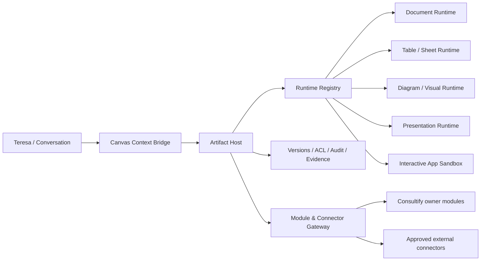

# Canvas — techniczny blueprint elastycznego runtime artefaktów

## 1. Cel architektury

Canvas ma zachowywać jeden shell, a dynamicznie montować właściwe środowisko
pracy. Dodanie nowego typu nie może wymagać dopisywania warunków w gigantycznym
komponencie panelu. Rdzeniem jest `Artifact Host + Runtime Registry + Host SDK`.



## 2. Artifact Envelope

Każdy typ implementuje wspólny envelope:

```ts
interface ArtifactEnvelope<TContent = unknown> {
  id: string;
  organizationId: string;
  projectId?: string;
  type: ArtifactType;
  schemaVersion: string;
  title: string;
  canonicalFormat: 'markdown' | 'json' | 'binary-ref';
  content: TContent;
  markdownProjection: string;
  projectionStatus: 'synced' | 'stale' | 'failed' | 'missing';
  lifecycle: 'draft' | 'ready_for_review' | 'in_review' |
    'changes_requested' | 'approved' | 'published' | 'archived';
  headVersionId: string;
  sourceRefs: SourceRef[];
  linkedEntities: EntityRef[];
  capabilities: ArtifactCapability[];
  runtimeManifest: RuntimeManifest;
  createdBy: string;
  updatedAt: string;
}
```

Envelope przechowuje metadane wspólne. Treść jest walidowana przez schema
właściwe dla typu. Nie zapisujemy React state ani HTML DOM jako źródła prawdy.

## 3. Runtime Manifest i registry

```ts
interface RuntimeManifest {
  runtimeId: string;
  artifactTypes: string[];
  renderer: 'host-native' | 'sandboxed-web';
  modes: Array<'edit' | 'preview' | 'source' | 'present' | 'interact'>;
  actions: string[];
  imports: string[];
  exports: string[];
  networkPolicy: 'none' | 'host-mediated';
  storagePolicy: 'artifact-state-only' | 'none';
  requiredCapabilities: string[];
}
```

Registry zwraca adapter zawierający: `validate`, `render`, `edit`, `diff`,
`projectToMarkdown`, `export`, `migrate`, `extractContext`, `qualityCheck`.
Nieznany typ otwiera bezpieczny generic preview z możliwością pobrania, a nie
crash lub raw JSON jako normalny interfejs.

## 4. Rozdział Host / Runtime

Host odpowiada za:

- shell, artifact switcher i aktywny target;
- identity, ACL, tenant/project scope;
- create/load/save/version/fork/restore;
- autosave, optimistic concurrency i recovery;
- conversation link, sources, comments, lifecycle i audit;
- global actions: share, export, materialize;
- capability honesty i error boundaries.

Runtime odpowiada za:

- właściwy renderer i interakcje;
- selection model;
- lokalne komendy i skróty;
- schema validation i structural diff;
- type-specific import/export;
- tekstową projekcję dla Teresy/search.

Runtime nie wywołuje bezpośrednio API modułów ani connectorów.

## 5. Canvas Context Bridge

Chat i Canvas komunikują się zdarzeniami, nie ukrytym czytaniem stanu komponentu.

### 5.1 Canvas -> Teresa

```ts
type CanvasContextPacket = {
  conversationId: string;
  artifact: { id: string; type: string; versionId: string; lifecycle: string };
  scope: { organizationId: string; projectId?: string };
  selection?: TypedSelection;
  markdownProjection: string;
  visibleBlockRefs: string[];
  sourceRefs: SourceRef[];
  linkedEntities: EntityRef[];
  limitations: string[];
};
```

Packet jest wersjonowany, ograniczony tokenowo i zgodny z ACL. Duże dane są
referencją pobieraną narzędziem, nie wklejane w całości do promptu.

### 5.2 Teresa -> Canvas

Teresa zwraca `CanvasCommand`, nigdy arbitralny side effect:

```ts
type CanvasCommand =
  | { type: 'create_artifact'; artifactType: string; seed: unknown }
  | { type: 'propose_patch'; baseVersionId: string; patch: TypedPatch }
  | { type: 'add_comment'; anchor: SelectionAnchor; body: string }
  | { type: 'request_runtime_action'; actionId: string; args: unknown }
  | { type: 'propose_materialization'; target: EntityType; payload: unknown };
```

Command router waliduje schema, capability, base version, scope i ryzyko. UI
pokazuje preview. Apply tworzy nową wersję i audit event.

## 6. Selection i typed patches

Selection zależy od runtime:

- dokument: stable block IDs + text offsets/relative positions;
- tabela: row IDs + column IDs + cell range;
- diagram: node/edge IDs;
- deck: slide/block IDs;
- interaktywna aplikacja: component/state path tylko w dozwolonym modelu.

Patch może być `replace_text`, `insert_blocks`, `update_cells`, `graph_ops`,
`slide_ops` albo `replace_runtime_bundle`. Każdy patch zawiera `baseVersionId`,
affected IDs, before hash, proposed state, validation result i human summary.
Stary patch nie nadpisuje nowszej ręcznej pracy; przechodzi rebase albo conflict.

## 7. Wiele artefaktów i branchowanie

```text
conversation 1---N conversation_artifact_links N---1 artifact
artifact 1---N versions
artifact 1---N branches/forks
artifact 1---N source_refs / linked_entities / materializations
```

Aktualny artefakt jest jawny. Polecenie typu „popraw tabelę” przy dwóch tabelach
wymaga wyboru albo jednoznacznej referencji. Fork kopiuje wersję i dozwolone
źródła, zapisuje lineage oraz ponownie oblicza uprawnienia w docelowym scope.

## 8. Interactive App Sandbox

Elastyczny artifact może renderować HTML/SVG/React, ale bundle działa w
izolowanym iframe/workerze:

- unikalny origin lub restrykcyjny sandbox;
- CSP bez `unsafe-eval`, brak cookies i tokenów hosta;
- brak bezpośredniego DOM parenta;
- limit CPU, pamięci, rozmiaru bundle i czasu;
- dependency allowlist, lockfile i skan pakietów;
- sanitization wejść/wyjść;
- network `none` domyślnie;
- persistence tylko przez zatwierdzony artifact state API;
- kill switch i widoczny console/error boundary.

Komunikacja odbywa się wersjonowanym `postMessage` z kontrolą origin, request ID,
schema validation i capability tokenem krótkiego życia.

## 9. Host SDK

Minimalny SDK dla runtime:

```ts
interface CanvasHostSDK {
  getArtifact(): Promise<ReadonlyArtifact>;
  saveArtifactPatch(patch: TypedPatch): Promise<VersionReadBack>;
  requestAI(request: ScopedAIRequest): Promise<AIProposal>;
  readBoundData(ref: DataBindingRef): Promise<RedactedData>;
  proposeAction(command: ModuleCommand): Promise<ProposalReceipt>;
  emitOutput(request: OutputRequest): Promise<OutputReadBack>;
  openEntity(ref: EntityRef): void;
  requestExternalFetch(request: ExternalRequest): Promise<ConsentResult>;
}
```

SDK nie udostępnia raw database, secrets ani dowolnego `fetch`.

## 10. Połączenie z modułami Consultify

Canvas nie zna endpointów wszystkich modułów. Używa `Module Gateway` z
adapterami owner-domain:

```text
Canvas proposal
 -> target schema validation
 -> capability/ACL check
 -> business validation
 -> human approval if required
 -> idempotent owner-module command
 -> owner-module read-back
 -> artifact materialization ledger + backlink
```

Adaptery obowiązkowe dla MVP: Notes, Ideas, Tasks, Decisions, Initiative
Candidates i Outputs/Materials. Adaptery kolejnej kolejności: Finance, KPI,
Execution, Interview, Assessment, Tools, Audit i Meeting.

## 11. Data binding

Dynamiczna tabela, wykres lub dashboard nie kopiuje danych bez końca. Binding
zawiera query/selector, source version, refresh policy, snapshot, freshness,
owner i ACL. Tryby:

- `snapshot` — zamrożone dane konkretnej wersji;
- `manual_refresh` — użytkownik widzi diff przed zmianą;
- `live_read` — tylko do prezentacji danych o niskim ryzyku;
- `governed_refresh` — refresh wymaga review, gdy wpływa na zatwierdzony output.

Eksport zawsze wskazuje, z jakiego snapshotu powstał.

## 12. Network i connectory

External access przechodzi przez wspólny Connector Gateway. Runtime zgłasza
intencję i widzi wyłącznie wynik ograniczony capability. Dla web preview host
pokazuje domenę, wysyłane klasy danych i ryzyko. Admin może ustawić allowlist,
denylist, DLP, brak sieci lub approval per request. Zgoda UI nie zastępuje
polityki organizacji.

## 13. Wersje, diff i eventy

Każda mutacja emituje:

```text
artifact.created | artifact.patch_proposed | artifact.patch_applied
artifact.version_created | artifact.restored | artifact.forked
artifact.review_requested | artifact.approved | artifact.shared
artifact.materialization_proposed | artifact.materialized
artifact.runtime_failed | artifact.external_access_requested
```

Event zawiera actor, artifact/version, conversation, scope, operation ID,
source, timestamp, result i audit reference. Diff jest renderer-specific, ale ma
wspólne summary.

## 14. Migracja z obecnego runtime

1. Zachować `work_canvas_drafts`, wersje, proposals, workflow i
   `materializedTo`; nie przepisywać danych.
2. Wydzielić obecny dokument jako pierwszy `document-runtime`.
3. Przenieść warunki typów do registry/adapters.
4. Ujednolicić standalone i chat-mounted Canvas na jednym Host.
5. Podłączyć table, deck i diagram runtimes stopniowo za capability flags.
6. Dodać sandbox dopiero dla interactive HTML/React; dokumenty i firmowe
   natywne renderery pozostają host-native.
7. Przenieść handoffy do Module Gateway bez zmiany ownerów domen.

## 15. Definition of Done technologii

- nowy typ artefaktu można dodać bez edycji centralnego panelu poza rejestracją;
- ten sam artifact otwiera się w Chat Canvas i standalone bez różnicy danych;
- każda operacja AI ma base version, typed selection/patch, preview i audit;
- conflict nie usuwa ręcznej pracy;
- interactive runtime nie ma bezpośredniej sieci, storage ani modułowych API;
- materializacja jest idempotentna i potwierdzona read-backiem;
- source ACL obowiązuje w renderze, Teresie, eksporcie, share i fork;
- capability deklarowana w UI ma test end-to-end.
