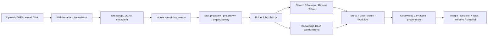

# Client Vault / Sejf klienta — kontrakt nadrzędny

## 1. Cel produktu

Client Vault jest bezpieczną warstwą dokumentów, źródeł i wiedzy, która dostarcza
zweryfikowany kontekst Teresie, Chatowi, agentom, workflowom i modułom Consultify.
Nie jest tylko magazynem plików ani zastępstwem Materials:

- Vault przechowuje **źródła wejściowe i wiedzę**;
- Materials tworzy i publikuje **produkty pracy**;
- Notes przechowuje **wiedzę roboczą użytkownika**;
- Outputs/Reports pozostają artefaktami modułów właścicielskich.

## 2. Wzorzec benchmarkowy Harvey

Z Harvey przyjmujemy wzorzec, nie kopię interfejsu:

- praca na dużych kolekcjach dokumentów, nie tylko pojedynczym pliku;
- analiza, porównanie i ustrukturyzowana ekstrakcja w Review Tables;
- publikowanie zatwierdzonych zbiorów jako Knowledge Bases;
- używanie pliku, folderu, całego Vault lub Knowledge Base jako kontekstu
  Assistant/Workflow bez ponownego uploadu;
- automatyczna aktualizacja kontekstu po zmianie źródłowego zbioru;
- synchronizacja folderów z DMS w trybie one-way, gdy źródło jest nadrzędne;
- pełne cytowanie oraz dziedziczenie uprawnień źródła;
- kontrola pobierania, duplikowania i ujawniania promptów dla view-only;
- retencja konfigurowana per klient/projekt oraz bezpieczna współpraca zewnętrzna.

Consultify rozszerza ten wzorzec o jawne powiązania dokumentów z projektami,
inicjatywami, decyzjami, taskami, KPI, assessmentami, narzędziami i rezultatami.

Źródła benchmarku (stan na 2026-07-31):

- [Harvey — Next Version of Vault](https://www.harvey.ai/blog/introducing-the-next-version-of-vault);
- [Harvey — Vault Knowledge Bases](https://help.harvey.ai/release-notes/introducing-vault-knowledge-bases);
- [Harvey — Work with Large Document Sets](https://eu.help.harvey.ai/articles/harvey-user-quick-start-part-3);
- [Harvey — Embed Vaults in Workflow Builder](https://help.harvey.ai/articles/embed-files-and-knowledge-sources-in-workflow-builder);
- [Harvey — Folder Uploads and One-Way Sync](https://help.harvey.ai/release-notes/folder-uploads);
- [Harvey — Advanced Vault Controls](https://help.harvey.ai/release-notes/advanced-vault-controls).

## 3. Model produktu

## 4. Hierarchia i zakres

1. **Mój sejf** — dokumenty widoczne wyłącznie dla właściciela i AI działającej
   w jego autoryzowanym kontekście.
2. **Sejf projektu** — dokumenty dostępne członkom konkretnego projektu zgodnie
   z project roles i dodatkową polityką dokumentu.
3. **Sejf organizacji** — zatwierdzona wiedza dostępna zgodnie z rolą organizacji.

Folder porządkuje temat wewnątrz jednego sejfu; nie jest granicą bezpieczeństwa.
Kolekcja może grupować dokumenty do analizy bez zmiany ich lokalizacji. Knowledge
Base jest zatwierdzoną, wersjonowaną publikacją wybranego zbioru.

## 5. Główne powierzchnie

| Powierzchnia | Cel |
| --- | --- |
| Lista sejfów | wejście do prywatnego, organizacyjnego i projektowych zakresów |
| Wnętrze sejfu | dokumenty, foldery, kolekcje, status ingest i bulk actions |
| Preview dokumentu | treść, strony, metadane, cytowanie, wersje i relacje |
| Ask / Analyze | rozmowa i deep analysis wyłącznie na wybranych źródłach |
| Review Table | powtarzalna ekstrakcja kolumn z wielu dokumentów |
| Knowledge Bases | zatwierdzone pakiety wiedzy do ponownego użycia |
| Activity / Access | audyt użycia, zmian, eksportów i uprawnień |

## 6. Zasada dostarczania kontekstu

Użytkownik ma rozumieć dokładnie, z czego korzysta AI. W Chat/Teresie/Agencie
wybiera plik, folder, kolekcję, cały sejf albo Knowledge Base. Każde uruchomienie
zamraża manifest użytych źródeł: ID i wersję dokumentu, fragmenty, zakres,
uprawnienia, czas retrieval i konfigurację modelu. Odpowiedź cytuje dokument,
stronę/sekcję i pozwala otworzyć podgląd w miejscu źródłowym.

AI nie może rozszerzyć scope ponad wybór użytkownika ani jego ACL. Brak trafnego
źródła ma dać uczciwy komunikat, a nie odpowiedź „z wiedzy ogólnej” podszytą pod
dokumenty klienta.

## 7. Relacje z systemem

- Chat/Canvas: wybór źródeł i cytowane odpowiedzi;
- Run Agent: pinowane źródła wejściowe z kontrolą wersji i permission check;
- Interview/Meeting: materiały wejściowe i zatwierdzone transkrypcje;
- Tools/Assessment/Audit/Finance: evidence i knowledge packs;
- Initiatives/Tasks/Decisions: załączniki i evidence, bez kopiowania pliku;
- Materials: źródła generacji i publikacja gotowego produktu pracy;
- Admin/Settings: integracje, klasyfikacja, retencja, DLP, modele i audyt.

## 8. Pytania do wspólnego odbioru

1. Czy nazwa docelowa pozostaje „Sejf klienta”, czy wybieramy szersze „Wiedza”?
2. Czy Knowledge Base może publikować project lead, czy wyłącznie admin/knowledge owner?
3. Czy klient zewnętrzny otrzyma Shared Space w MVP, czy dopiero po MVP?
4. Czy domyślnie każdy nowy dokument jest prywatny, czy dziedziczy aktywny projekt?
5. Które moduły mogą automatycznie proponować zapis efektu do Vault?

## 9. Dokumenty wykonawcze pakietu

- [`CLIENT_VAULT_HARVEY_BENCHMARK_AND_CONSULTIFY_ADAPTATION.md`](CLIENT_VAULT_HARVEY_BENCHMARK_AND_CONSULTIFY_ADAPTATION.md) — potwierdzone funkcje Harvey, granice i świadome adaptacje;
- [`CLIENT_VAULT_INFORMATION_ARCHITECTURE_AND_FUNCTION_CATALOG.md`](CLIENT_VAULT_INFORMATION_ARCHITECTURE_AND_FUNCTION_CATALOG.md) — komplet powierzchni i funkcji;
- [`CLIENT_VAULT_UI_UX_AND_AI_INTERACTION_STANDARD.md`](CLIENT_VAULT_UI_UX_AND_AI_INTERACTION_STANDARD.md) — dokładna nawigacja, menu, ekrany i zachowanie AI;
- [`CLIENT_VAULT_END_TO_END_WORKFLOWS_AND_HANDOFFS.md`](CLIENT_VAULT_END_TO_END_WORKFLOWS_AND_HANDOFFS.md) — przebiegi Ask, Review, KB, DMS i handoffów;
- [`CLIENT_VAULT_INGESTION_INDEXING_AND_SYNCHRONIZATION_CONTRACT.md`](CLIENT_VAULT_INGESTION_INDEXING_AND_SYNCHRONIZATION_CONTRACT.md) — pipeline pliku i sync;
- [`CLIENT_VAULT_AI_RETRIEVAL_CITATION_AND_KNOWLEDGE_CONTRACT.md`](CLIENT_VAULT_AI_RETRIEVAL_CITATION_AND_KNOWLEDGE_CONTRACT.md) — retrieval, manifest i cytowania;
- [`CLIENT_VAULT_SECURITY_GOVERNANCE_AND_LIFECYCLE_CONTRACT.md`](CLIENT_VAULT_SECURITY_GOVERNANCE_AND_LIFECYCLE_CONTRACT.md) — access, ochrona, retencja i audyt;
- [`CLIENT_VAULT_DATA_API_EVENTS_AND_OBSERVABILITY_BLUEPRINT.md`](CLIENT_VAULT_DATA_API_EVENTS_AND_OBSERVABILITY_BLUEPRINT.md) — model implementacyjny;
- [`CLIENT_VAULT_AS_IS_MVP_GAPS_AND_QUESTIONS.md`](CLIENT_VAULT_AS_IS_MVP_GAPS_AND_QUESTIONS.md) — dowody, priorytety, testy i pytania.
