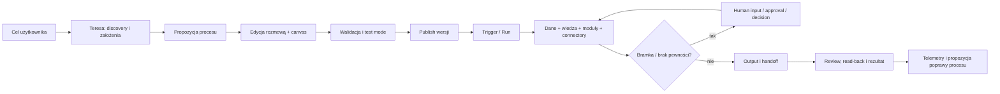

# Run Agent — nadrzędny kontrakt systemu orkiestracji Consultify

## 1. Misja

Run Agent jest miejscem, w którym Consultify przestaje być zbiorem modułów i
staje się systemem prowadzącym transformację. Użytkownik opisuje cel, sytuację
i ograniczenia, a Teresa pomaga zaprojektować proces: jakie informacje zebrać,
jakiej wiedzy użyć, które narzędzia i moduły uruchomić, gdzie potrzebna jest
decyzja człowieka, co przekazać na zewnątrz i jakie artefakty mają powstać.

Agent nie jest pojedynczym promptem ani makrem. Jest wersjonowanym, testowalnym
i audytowalnym procesem, który łączy:

- rozmowę i rozumowanie Teresy;
- dane oraz funkcje wszystkich modułów Consultify;
- Client Vault, Knowledge Bases, Review Tables i web;
- zewnętrzne aplikacje przez connectory/MCP;
- pracę ludzi, role projektowe, decyzje, taski i approvals;
- harmonogram, zdarzenia, czekanie i cykliczność;
- tworzenie dokumentów, prezentacji, arkuszy i innych outputs;
- monitoring, retry, kompensację i pełne provenance.

## 2. Obietnica produktowa

> Opisz rezultat. Teresa zaproponuje profesjonalny proces konsultingowy,
> pokaże jego logikę i ryzyka, pozwoli go poprawić rozmową lub na canvasie,
> przetestuje go, poprosi o zgody w odpowiednich miejscach i bezpiecznie
> doprowadzi od danych wejściowych do przyjętych rezultatów i działań.

## 3. Trzy różne obiekty

| Obiekt | Znaczenie | Mutowalność |
| --- | --- | --- |
| Agent Definition | projekt sposobu pracy: graf, instrukcje, narzędzia, policy | draft edytowalny; published version immutable |
| Agent Run | konkretne wykonanie danej wersji na konkretnych wejściach | append-only state i audit |
| Agent Output | wynik kroku/runu oraz linki do obiektów aplikacji | własność właściwego modułu po handoff |

Ekran „My processes” pokazuje definicje i ich ostatnie wykonania, ale status
definicji (`draft/published/deprecated`) nie może być mieszany ze statusem runu
(`queued/running/waiting/completed/failed`).

## 4. Model pracy

## 5. Poziomy autonomii

1. `Assist` — Teresa proponuje kroki i treść; człowiek wykonuje.
2. `Prepare` — agent czyta i przygotowuje drafts; człowiek zatwierdza mutations.
3. `Execute guarded` — agent wykonuje dozwolone akcje i zatrzymuje się na
   policy gates, niepewności lub wyjątku.
4. `Autonomous bounded` — agent działa samodzielnie w określonym budżecie,
   scope, czasie i reversible tool set, z możliwością natychmiastowego stopu.

Autonomia jest ustawiana per agent i może być dodatkowo zawężona per krok/run.
Model nigdy sam nie rozszerza swojego mandatu.

## 6. Pozycja w architekturze aplikacji

Run Agent orkiestruje, ale nie przejmuje źródeł prawdy. Czyta przez kontrakty
modułów i zapisuje przez jawne commands/handoffs. Każdy downstream write ma
proposal, policy decision, wykonanie przez owner API i read-back.

| Obszar | Przykładowa rola w procesie |
| --- | --- |
| Chat/Meeting/Interview | zbieranie danych i human interaction |
| Vault/Notes/Web | kontekst i evidence |
| Tools/Assessment/Audit | diagnoza i analiza |
| Finance/KPI/Results | kalkulacje, cele, pomiar efektów |
| Initiatives/Decisions | koncepcja zmiany i governance |
| Execution/Tasks/Calendar | realizacja, zasoby i czas |
| Materials/Canvas | produkty pracy i prezentacja wyniku |
| Admin/Connectors | role, policy, credentials i external capabilities |

## 7. Niezmienne zasady

- definition version użyta przez run nie zmienia się w trakcie wykonania;
- każde wejście i wyjście ma schema, provenance i sensitivity;
- knowledge/tool access jest server-derived i per-step least privilege;
- side effect jest jawnie widoczny przed publish oraz przed wykonaniem wg policy;
- człowiek widzi dokładnie, na co wyraża zgodę, z diffem i konsekwencją;
- retry nie może duplikować taska, wiadomości, płatności ani publikacji;
- pauza/wait/approval przetrwa restart i nie blokuje procesu w pamięci;
- error policy jest jawna: stop, retry, fallback, skip lub compensate;
- AI nie deklaruje sukcesu przed authoritative read-back;
- run ma kill switch, budżet, deadline i pełny audit.

## 8. Dokumenty wykonawcze

- [`RUN_AGENT_BENCHMARK_AND_PRODUCT_DOCTRINE.md`](RUN_AGENT_BENCHMARK_AND_PRODUCT_DOCTRINE.md)
- [`RUN_AGENT_INFORMATION_ARCHITECTURE_AND_UX_STANDARD.md`](RUN_AGENT_INFORMATION_ARCHITECTURE_AND_UX_STANDARD.md)
- [`RUN_AGENT_PROCESS_MODEL_AND_BLOCK_CATALOG.md`](RUN_AGENT_PROCESS_MODEL_AND_BLOCK_CATALOG.md)
- [`RUN_AGENT_TERESA_COPILOT_AND_PROCESS_DESIGN_STANDARD.md`](RUN_AGENT_TERESA_COPILOT_AND_PROCESS_DESIGN_STANDARD.md)
- [`RUN_AGENT_EXECUTION_APPROVALS_RESILIENCE_AND_SECURITY.md`](RUN_AGENT_EXECUTION_APPROVALS_RESILIENCE_AND_SECURITY.md)
- [`RUN_AGENT_DATA_API_EVENTS_AND_OBSERVABILITY_BLUEPRINT.md`](RUN_AGENT_DATA_API_EVENTS_AND_OBSERVABILITY_BLUEPRINT.md)
- [`RUN_AGENT_CROSS_MODULE_AND_CONNECTOR_CONTRACT.md`](RUN_AGENT_CROSS_MODULE_AND_CONNECTOR_CONTRACT.md)
- [`RUN_AGENT_AS_IS_MVP_GAPS_GOLDEN_FLOWS_AND_AUDIT.md`](RUN_AGENT_AS_IS_MVP_GAPS_GOLDEN_FLOWS_AND_AUDIT.md)
- [`RUN_AGENT_ROLES_MANUAL_EDITING_TERESA_AND_CONNECTIONS_AUDIT.md`](RUN_AGENT_ROLES_MANUAL_EDITING_TERESA_AND_CONNECTIONS_AUDIT.md)

## 9. Pytania do wspólnego odbioru

1. Czy nazwą docelową pozostaje `Run Agent`, czy `Processes / Agent Studio`?
2. Czy MVP dopuszcza wyłącznie procesy prywatne/projektowe, czy także organizacyjne?
3. Jaki najwyższy poziom autonomii udostępniamy na staging?
4. Kto może publikować agentów do biblioteki organizacji?
5. Czy proces konsultingowy jest jednym agentem nadrzędnym z podprocesami, czy portfelem agentów?
