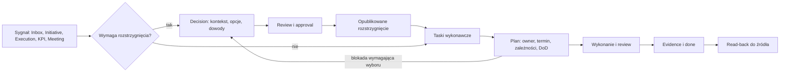

# Tasks + Decisions — wspólny system operacyjny pracy

## 1. Rozstrzygnięcie

Tasks i Decisions są dwiema powierzchniami jednego systemu pracy, ale dwoma
różnymi obiektami prawdy:

- **Decision** odpowiada: „co i dlaczego rozstrzygamy?”;
- **Task** odpowiada: „kto, co i do kiedy ma wykonać?”.

Decyzja może utworzyć zadania, zmienić ich zakres albo je anulować. Zadanie może
ujawnić potrzebę decyzji, lecz nigdy nie zastępuje rozstrzygnięcia komentarzem.
Relacja jest jawna, dwukierunkowa i audytowalna.

## 2. Model pracy

## 3. Własność i źródła prawdy

| Obiekt | Właściciel prawdy | My Work pokazuje | Nie wolno |
| --- | --- | --- | --- |
| Task | domena Tasks | listę, board, kalendarz, detail | duplikować taska w Initiative/Execution |
| Decision | domena Decisions | listę, board, timeline, detail | utożsamiać approval z wynikiem decyzji |
| Initiative | Initiatives | kontekst i postęp | zmieniać lifecycle bez handoff/read-back |
| Execution | Execution | wykonanie programu/projektu | ogłaszać sukces wyłącznie po task status |
| Calendar | Calendar | projekcję czasu | traktować event jako task |
| Inbox | Inbox | sygnał uwagi | przechowywać stan źródłowego obiektu |

Każde połączenie przechowuje `sourceType`, `sourceId`, `relationType`, deep link,
autora, czas i scope organizacji/projektu. Utworzenie obiektu downstream kończy
się dopiero po read-backu jego właściciela.

## 4. Role i odpowiedzialność

- `creator` opisuje potrzebę, ale nie musi być wykonawcą ani decydentem;
- `owner/assignee` odpowiada za dowiezienie taska;
- `reviewer` ocenia kompletność i dowody wykonania;
- `decision owner` pilnuje przygotowania decyzji;
- `decider/approver` ma mandat do rozstrzygnięcia;
- `contributors` dostarczają dane i wykonują podzadania;
- `watchers/informed` otrzymują istotne zmiany;
- `project lead` zarządza priorytetem, zdolnością i eskalacją;
- Teresa przygotowuje analizę, wykrywa luki i proponuje działania, ale nie
  przejmuje odpowiedzialności człowieka.

Minimalny model ma działać dla jednej osoby: creator = owner = reviewer, a dla
większych projektów role można rozdzielić. Uprawnienia aplikacyjne i role
projektowe pozostają odrębnymi osiami.

## 5. Wspólna anatomia ekranów

1. Nagłówek: tytuł, typ, projekt, priorytet, stan, owner i termin.
2. Pasek komend: search, zapisane widoki, filtry, sortowanie, utworzenie.
3. Widok pracy: tabela oraz widok właściwy domenie.
4. Detail: lewa nawigacja kart, treść, prawy panel relacji/AI/audytu.
5. Pasek następnej akcji: tylko akcje dozwolone w aktualnym stanie.

Zmiana widoku nie może zmieniać znaczenia filtrów ani ukrywać aktywnego scope.
Powrót z detail zachowuje widok, filtry, scroll i zaznaczenie.

## 6. Wspólne automatyzacje

- termin i przypisanie tworzą właściwe projekcje Calendar/Inbox;
- blokada uruchamia alert właściciela i opcjonalną eskalację;
- opublikowana decyzja proponuje taski, nigdy nie tworzy ich po cichu;
- task `done` wymaga wskazanego evidence, gdy polityka tego wymaga;
- zmiana decyzji ostrzega właścicieli zależnych tasków;
- synchronizacja zewnętrzna używa wspólnego connector control plane i pokazuje
  stan sync/conflict, bez przekazywania tokenów modułowi.

## 7. Golden flow systemu

1. Użytkownik lub Teresa rozpoznaje sygnał.
2. System klasyfikuje: informacja, task albo decision; człowiek zatwierdza.
3. Obiekt otrzymuje projekt, provenance, role, priorytet i oczekiwany wynik.
4. Decision przechodzi quality gate i approval; task przechodzi readiness gate.
5. Kalendarz i Inbox pokazują uwagę/czas, a portfolio projektu widzi obciążenie.
6. Wykonanie ma aktualizacje, komentarze, blokady i eskalacje.
7. Review potwierdza wynik i evidence.
8. Źródłowy moduł otrzymuje read-back, a audit log zachowuje pełną historię.

## 8. Zakazy projektowe

- brak automatycznego przypisania odpowiedzialności bez widocznego potwierdzenia;
- brak statusu `done` wywnioskowanego wyłącznie z wypowiedzi AI;
- brak decyzji bez decydenta i przedmiotu rozstrzygnięcia;
- brak „magicznych” zmian w Initiative/Execution bez proposal i read-back;
- brak jednego pola `status`, które miesza wynik decyzji z procesem approval;
- brak powiadomień bez właściciela, powodu i możliwej następnej akcji.
