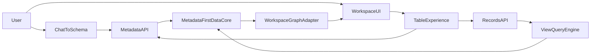

# Consultify Airtable-Like Platform
## 90-Day Delivery Plan

Version: draft v1  
Owner: Product + Engineering  
Horizon: 90 days  
Delivery model: 6 implementation sprints + 1 stabilization week

## 1. Purpose

This document defines a realistic 90-day plan for building the first production-grade, Airtable-like table platform inside Consultify.

The target is not "a better grid". The target is a new metadata-first platform layer that supports:

- structured data modeling
- records CRUD
- schema CRUD
- saved views
- linked records
- chat-to-schema
- controlled migration from the current graph-first workspace model

This document is meant for pre-kickoff review by Product, Engineering, Design, and founders.

## 2. Executive Summary

Consultify can build a credible Airtable-like core, but only if we stop treating the current table as the long-term source of truth.

Today, table state is stored as part of the shared workspace graph and persisted via `nodes`, `edges`, and `extensions.table`:

```120:146:src/components/MyWork/table/useTablePersistence.ts
const buildPayload = useCallback(
  () => ({
    nodes: nodes as any,
    edges: edges as any,
    preferredTool: 'table' as CanvasToolType,
    extensions: {
      ...extensions,
      table: {
        columns: columns.map((c) => ({
          key: c.key,
          header: c.header,
          type: c.type,
          visible: c.visible,
          width: c.width,
          options: c.options,
          optionColors: c.optionColors,
          formula: c.formula,
          aiPrompt: c.aiPrompt,
          aggregation: c.aggregation,
        })),
```

This is good enough for a rich UI prototype, but not for a production data platform with schema versioning, record semantics, server-side querying, linked records, and chat-driven schema mutations.

The recommended path is:

1. Build a new metadata-first backend.
2. Move table persistence and querying to that backend.
3. Keep the current workspace graph as a projection and compatibility layer.
4. Introduce chat-to-schema through a strict `proposal -> approval -> execution` flow.

## 3. Current State Assessment

## 3.1 Frontend reality

The current `table` is not a standalone data product. It is one of several tools mounted inside the shared workspace shell:

- [src/components/MyWork/IdeaMapWorkspace.tsx](src/components/MyWork/IdeaMapWorkspace.tsx)
- [src/components/MyWork/IdeaTableTool.tsx](src/components/MyWork/IdeaTableTool.tsx)
- [src/components/MyWork/canvas/workspaceGraphRuntime.ts](src/components/MyWork/canvas/workspaceGraphRuntime.ts)
- [src/components/MyWork/table/useTablePersistence.ts](src/components/MyWork/table/useTablePersistence.ts)
- [src/components/MyWork/table/useTableRows.ts](src/components/MyWork/table/useTableRows.ts)
- [src/components/MyWork/table/useTableViews.ts](src/components/MyWork/table/useTableViews.ts)
- [src/components/MyWork/table/AITableAssistant.tsx](src/components/MyWork/table/AITableAssistant.tsx)
- [src/components/AIChat/UnifiedChatPanel.tsx](src/components/AIChat/UnifiedChatPanel.tsx)

The table mounts through the workspace orchestrator:

```2150:2168:src/components/MyWork/IdeaMapWorkspace.tsx
{activeTool === 'table' && (
  <CanvasToolErrorBoundary
    key={`eb-table-${realId}`}
    toolName="Table"
  >
    <IdeaTableTool
      open
      ideaId={realId}
      locked={canvasLocked}
      refreshToken={mapRefreshToken}
      onSelectionChange={handleSelectionChange}
      onGraphChange={(graph) => graphRuntime.replaceGraph(graph)}
```

Key implications:

- table is a tool, not a first-class data platform
- the graph runtime is the current collaboration and persistence shell
- UI components are rich, but their backing data model is not yet platform-grade

## 3.2 Backend reality

The backend source of truth for this area is centered around the workspace document, not a relational table platform:

- [server/src/routes/my-work.routes.ts](server/src/routes/my-work.routes.ts)
- [server/src/validators/ideaWorkspaceGraph.validators.ts](server/src/validators/ideaWorkspaceGraph.validators.ts)
- [server/migrations/20260312_my_idea_maps.sql](server/migrations/20260312_my_idea_maps.sql)
- [server/migrations/20260313_my_idea_maps_graph_contract_v3.sql](server/migrations/20260313_my_idea_maps_graph_contract_v3.sql)

The current backend exposes workspace persistence, AI actions, CSV export, presence, conversion, and graph expansion through a single domain surface rather than a dedicated table platform.

CSV export still reads schema from `extensions.table` and row data from `nodes`:

```10416:10433:server/src/routes/my-work.routes.ts
const columns: Array<{ key: string; header: string; visible?: boolean }> =
  extensions?.table?.columns || [{ key: 'label', header: 'Name' }];
const visibleCols = columns.filter((c: any) => c.visible !== false);

const headerLine = visibleCols.map((c: any) => escapeCSV(c.header || c.key)).join(',');
const dataLines = nodes.map((node: any) =>
  visibleCols.map((col: any) => {
    const val = col.key === 'type' ? (node.type || '') : (node.data?.[col.key] ?? '');
```

Key implications:

- no first-class `base/table/field/record/view` backend model exists yet
- schema is not canonical on the server
- records are effectively graph nodes
- current API is a strong transition point, but not yet the desired final architecture

## 3.3 Current chat integration

Natural-language table actions already exist, but they currently operate against a lightweight frontend schema model:

```90:106:src/components/MyWork/table/AITableAssistant.tsx
try {
  const schema = columns.map((c) => ({ key: c.key, header: c.header, type: c.type }));
  const payload: Record<string, unknown> = {
    command: command.trim(),
    schema,
    language: i18n.language,
  };
  if (artifactContext?.length) {
    payload.artifactContext = artifactContext.map((a) => ({
      id: a.id,
      type: a.type,
      title: a.title,
      snippet: a.snippet,
    }));
  }
```

This is a strong foundation for `chat-to-schema`, but it must evolve from:

- prompt -> UI action

to:

- prompt -> structured proposal -> validated schema mutation -> backend execution

## 3.4 Strategic diagnosis

The current table stack is good enough to reuse as an experience layer, but not as the durable core.

The core problem is not missing widgets. The core problem is missing first-class metadata and records infrastructure.

## 4. Target Architecture

The target model is a metadata-first platform with clear separation between schema, records, views, and workspace projections.



## 4.1 Core domain objects

The new canonical model should introduce:

- `workspace`
- `base`
- `table`
- `field`
- `view`
- `record`
- `attachment`
- `record_link`
- `audit_event`

## 4.2 Source of truth

The canonical source of truth should move to:

- backend metadata store for schema
- backend records store for data
- backend query engine for views

The current workspace graph should remain:

- a compatibility layer
- a projection layer
- a future consumer of canonical table data

It should no longer remain the only source of truth for table semantics.

## 4.3 Transition adapters

The most important transition points are:

- [src/components/MyWork/table/useTablePersistence.ts](src/components/MyWork/table/useTablePersistence.ts)
- [src/components/MyWork/table/AITableAssistant.tsx](src/components/MyWork/table/AITableAssistant.tsx)
- [src/components/AIChat/UnifiedChatPanel.tsx](src/components/AIChat/UnifiedChatPanel.tsx)
- [server/src/routes/my-work.routes.ts](server/src/routes/my-work.routes.ts)

These files should be treated as controlled integration adapters, not long-term domain homes.

## 5. MVP Definition

The 90-day MVP should deliver:

- `Metadata API v1`
- `Records API v1`
- `View Query Engine v1`
- `Grid UI v1` on the new backend
- `Saved Views v1`
- `Linked Records v1`
- `Audit Trail v1`
- `Chat-to-Schema v1`

The 90-day MVP should not attempt to deliver:

- full Airtable parity
- full formula engine
- advanced automations
- interface builder
- extension runtime
- sync/connectors ecosystem
- enterprise SCIM/SSO as a release blocker

## 6. Guiding Principles

- `metadata-first`: schema is a real product asset
- `proposal before mutation`: AI never mutates schema directly without approval
- `server-side query`: filtering, sorting, grouping, and pagination belong on the backend
- `stable IDs`: all objects get first-class durable identifiers
- `adapter migration`: existing workspace experiences should be adapted, not rewritten blindly
- `scope discipline`: MVP must stay narrowly useful

## 7. Team Shape

Minimum team for a serious 90-day attempt:

- 1 Tech Lead / Architect
- 2 Backend Engineers
- 2 Frontend Engineers
- 1 AI / Application Engineer
- 1 Product Designer
- 1 Product Owner / PM
- QA support shared or embedded

## 8. Delivery Model

The program will run as:

- Sprint 0: architecture and execution setup
- Sprint 1: metadata core
- Sprint 2: records and query engine
- Sprint 3: grid experience
- Sprint 4: linked records
- Sprint 5: chat-to-schema
- Sprint 6: hardening and release candidate
- Final stabilization week

## 9. Sprint 0
### Objective

Lock the architecture, source of truth, and MVP boundaries before implementation starts.

### Scope

Backend:

- confirm canonical object model
- define storage strategy
- define API surface boundaries
- define migration approach from workspace graph

Frontend:

- identify reusable UI components
- identify adapter boundaries
- confirm state ownership model

AI:

- define proposal schema
- define approval flow
- define validation layer

### Deliverables

- ADR for `graph-first -> metadata-first`
- domain model diagram
- draft API contracts
- MVP boundary definition
- sprint backlog

### Exit criteria

- one agreed source of truth
- one agreed MVP scope
- no unresolved architecture blocker for Sprint 1

### Risks

- unresolved conflict between graph model and new records model
- trying to preserve too much legacy behavior in the core data layer

## 10. Sprint 1
### Objective

Build the first version of the metadata-first backend foundation.

### Scope

Backend:

- create metadata tables
- create records table
- create attachments metadata model
- create base services for schema CRUD
- create versioning primitives

Suggested entities:

- `workspaces`
- `bases`
- `tables`
- `fields`
- `views`
- `records`
- `attachments`

Frontend:

- internal verification tooling only
- no production UI dependency yet

### Deliverables

- DB schema v1
- metadata service layer
- records service skeleton
- API contract draft implemented for internal use

### Exit criteria

- create a base
- create a table
- create fields
- create a view
- insert records
- retrieve schema with stable identifiers

### Risks

- weak field options model
- unstable primary field design
- premature UI binding

## 11. Sprint 2
### Objective

Deliver `Records API v1` and `View Query Engine v1`.

### Scope

Backend:

- list/get/create/update/delete record
- batch operations
- server-side filtering
- server-side sorting
- pagination
- projection by fields
- query by view id

Frontend:

- first read-only grid on the new backend
- pagination UX
- load/error/empty states

Supported field types in v1:

- text
- long_text
- number
- currency
- percent
- checkbox
- date
- single_select
- multi_select
- url
- email
- phone
- attachment
- created_time/by
- last_modified_time/by

### Deliverables

- `Records API v1`
- `View Query Engine v1`
- grid reader prototype backed by real APIs

### Exit criteria

- table reads come from the new backend
- basic sort and filter no longer require full client-side table scans
- one table can scale beyond local in-memory UX assumptions

### Risks

- leaving core query logic on the client
- missing indexes for high-traffic fields

## 12. Sprint 3
### Objective

Ship the first usable `Grid Experience` on top of the new platform.

### Scope

Frontend:

- inline cell editing
- add row
- edit row
- delete row
- bulk select v1
- visible columns
- column resize/reorder v1
- saved views UI
- row detail panel backed by record IDs

Backend:

- save/update/delete views
- field config updates
- audit logging for schema and record mutations

### Deliverables

- `Grid UI v1`
- `Saved Views UI v1`
- `Audit Trail v1`

### Exit criteria

- user can work in grid without relying on `extensions.table` as the main storage mechanism
- saved views persist against the new platform
- record and schema mutations are logged

### Risks

- leaking legacy `node.data` assumptions into new UI contracts
- overfitting the UI to old graph-specific state

## 13. Sprint 4
### Objective

Deliver the first relational layer with `Linked Records v1`.

### Scope

Backend:

- linked record field type
- relation metadata
- relation persistence
- reverse relation semantics v1
- count field v1
- lookup v1
- rollup v1 minimal
- recompute job v1

Frontend:

- relation picker
- linked record display
- related record open flow
- lookup and rollup rendering

### Deliverables

- `Linked Records v1`
- `Count / Lookup / Rollup v1`
- end-to-end example with two related tables

### Exit criteria

- user can relate records across tables
- user can count related records
- user can view looked-up data

### Risks

- overbuilding formulas too early
- relation consistency issues under batch updates

## 14. Sprint 5
### Objective

Ship `Chat-to-Schema v1`.

### Scope

AI / orchestration:

- intent parsing
- schema grounding
- structured proposal generation
- approval flow
- execution orchestration
- mutation validation

Supported use cases:

- create base
- create table
- add fields
- suggest field types
- suggest select options
- create default views
- create simple related tables
- optionally seed sample rows

Frontend:

- proposal preview card
- approve / reject / refine controls
- execution progress feedback

### Deliverables

- `Chat-to-Schema v1`
- structured proposal contract
- proposal renderer
- execution audit logging

### Exit criteria

- user can describe a simple table in natural language
- system proposes a structured plan
- approved plan becomes a usable table in the product

### Risks

- AI returning free-form instructions instead of structured mutations
- insufficient validation before schema changes execute

## 15. Sprint 6
### Objective

Harden the MVP and prepare a release candidate for pilot users.

### Scope

Backend:

- permissions v1
- attachments upload v1
- CSV import v1
- migration helpers
- telemetry and observability

Frontend:

- polish critical flows
- handle failure modes
- improve setup guidance

QA / release:

- end-to-end smoke tests
- known limitations document
- rollout checklist

### Deliverables

- `MVP Release Candidate`
- permissions v1
- attachments v1
- CSV import v1
- rollout package

### Exit criteria

- pilot user can create a table from chat and use it end-to-end
- attachments work in the new model
- CSV import works for basic scenarios
- known limitations are documented

### Risks

- trying to squeeze automations into the MVP
- insufficient integration testing across chat, metadata, and UI

## 16. Stabilization Week
### Objective

Decide whether the product is ready for pilot rollout.

### Scope

- bug triage
- performance tuning
- security review
- load testing
- UX fixes in top workflows
- go/no-go review

### Deliverables

- pilot go/no-go memo
- support playbook
- pilot release notes
- metrics dashboard

## 17. Critical Decisions Before Start

These decisions must be made before Sprint 1:

- Is `workspace` allowed to contain multiple bases?
- Does every workspace get a default base?
- Is the current graph a consumer of the new table platform, or a parallel source of truth?
- Can chat create new bases, or only tables inside an existing base?
- Which field types are mandatory for MVP?
- Are attachments first-class in MVP, or deferred to metadata plus upload URL only?
- Do we expose the new platform inside current `My Work`, or as a new surfaced capability first?

## 18. Current State vs Target State

| Area | Current state | Target state |
| --- | --- | --- |
| Persistence | `nodes/edges/extensions.table` | first-class metadata + records backend |
| Schema authority | mostly frontend-local | server-canonical metadata |
| Records model | graph nodes | record entities with stable IDs |
| Views | mostly UI state | backend-evaluated views |
| Chat-to-table | prompt -> UI action | prompt -> proposal -> approval -> execution |
| Relations | graph edges / partial support | linked records as first-class relation model |
| Auditability | partial / workspace-oriented | record + schema audit trail |
| Reusability | tool-specific | platform layer reusable across workspace tools |

## 19. Success Metrics

### Product metrics

- user can create a table from chat in under 2 minutes
- user can create 5-10 fields without manual technical configuration
- user can save at least 3 views
- user can create a relation between 2 tables

### Technical metrics

- p95 list records under 500 ms for normal view queries
- p95 update record under 250 ms
- no basic flow depends on loading the full table for local filtering
- all schema mutations are logged

### Delivery metrics

- no critical source-of-truth conflict between graph and records platform
- no critical pilot blocker in chat-to-schema end-to-end flow

## 20. Major Risks

### Product risks

- MVP scope expands into Airtable parity fantasy
- too many personas are served at once
- trying to become Airtable, Notion, and BI in a single release

### Architecture risks

- two sources of truth live too long
- query engine remains partially client-side
- graph contracts continue leaking into core platform design

### AI risks

- no reliable proposal contract
- poor type inference and relation inference
- no schema grounding

### Delivery risks

- backend effort underestimated
- end-to-end testing starts too late
- performance is validated too late

## 21. Go / No-Go Criteria After 90 Days

The pilot should start only if all of the following are true:

- `Metadata API` works
- `Records API` works
- grid runs on the new backend
- saved views work
- linked records v1 work
- chat creates tables through `proposal -> approval -> execution`
- audit trail exists
- critical failure modes are documented

The pilot should not start if any of the following are true:

- schema mutations are not reliably validated
- record identity is unstable
- views are still effectively local-only state
- relation writes can corrupt or desynchronize data
- graph and records source-of-truth boundaries are unclear

## 22. Known Limitations of the MVP

These limitations should be explicitly accepted before pilot launch:

- no full formula engine
- no advanced automations builder
- no interface designer
- no offline-first support
- no extension runtime
- no external sync ecosystem
- no enterprise-grade granular IAM as a launch requirement

## 23. Backlog After Day 90

Next-phase candidates:

- formulas v2
- automations v1
- forms v1
- comments and activity per record
- interface-like dashboard layer
- richer sharing model
- better import/export
- workspace projections from records into mindmap and whiteboard

Later-phase candidates:

- webhooks
- automation history
- snapshots and revision history v2
- permissions per table and view
- external forms and intake flows
- integrations
- enterprise auth and governance

## 24. Recommended Working Model

Treat this as a named product program:

`Consultify Table Platform`

or

`Consultify Data Workspace`

Do not treat it as:

`an upgrade to the current table tool`

That framing is important because it changes:

- staffing
- architecture expectations
- sequencing discipline
- migration decisions
- success criteria

## 25. Final Recommendation

Proceed, but only under four conditions:

1. The team agrees to a metadata-first source of truth.
2. The current graph becomes a projection layer, not the forever core.
3. Chat-driven schema mutation is always mediated by proposal and approval.
4. MVP scope remains strict and intentionally incomplete.

If those conditions are met, Consultify can deliver a serious Airtable-like core in 90 days.

If those conditions are not met, the likely result is a richer UI on top of the same structural limitation, not a true platform shift.
