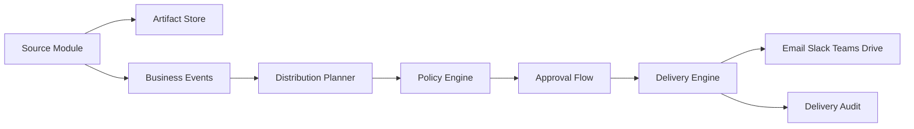

# Consultify Artifact Distribution Automation
## Cross-Module Strategy

Version: draft v1  
Owner: Product + Engineering  
Scope: future shared capability

## 1. Purpose

This document defines the strategy for a shared distribution and communication automation capability for Consultify artifacts.

The goal is to keep communication automation out of individual product modules and instead introduce one reusable module that can handle outbound delivery for:

- reports
- presentations
- idea maps
- notes
- tables

This capability should be treated as a platform service, not as local logic embedded inside Finance, Results, My Work, or Presentations.

## 2. Strategic decision

Consultify should not implement report sending, deck sending, note sending, or table sharing as separate automation systems inside each module.

Instead, the product should introduce a shared capability:

`Artifact Distribution Automation`

This capability should own:

- delivery rules
- recipient logic
- approval gates
- outbound channels
- scheduling
- audit trail
- delivery retries and failure handling

Product modules should only be responsible for creating trustworthy artifacts and exposing stable contracts for those artifacts.

## 3. Why this separation is correct

Without this separation, the product will drift into multiple incompatible delivery systems:

- Finance creates one send flow
- Reports creates another
- Presentations creates a third
- My Work creates informal ad hoc sharing

That creates duplicated logic for:

- recipients
- approvals
- message templates
- audit
- retries
- permission checks
- scheduling

It also makes enterprise governance much harder.

## 4. Core principle

The system must separate:

1. artifact creation
2. artifact publishing
3. artifact distribution

Meaning:

- the source module creates the artifact
- the source module may publish or finalize the artifact
- the distribution module decides whether, when, and how it should be sent or routed

## 5. Canonical artifact contract

Every artifact that wants to participate in distribution should expose a stable contract with at least:

- `artifact_id`
- `artifact_type`
- `organization_id`
- `owner_id`
- `title`
- `status`
- `version`
- `render_state`
- `export_capabilities`
- `access_scope`
- `source_module`
- `created_at`
- `updated_at`

Recommended artifact statuses:

- `draft`
- `ready_for_review`
- `approved`
- `published`
- `archived`

Distribution should operate primarily on `approved` or `published` artifacts unless policy explicitly allows draft distribution.

## 6. Business events required from modules

Modules should emit business events instead of performing local communication automation.

Examples:

- `report.generated`
- `report.approved`
- `presentation.published`
- `idea_map.snapshot_ready`
- `note.approved`
- `table.view_published`

These events become the trigger surface for the future automation module.

## 7. Distribution capability scope

The shared automation module should support:

- one-off send
- scheduled send
- recurring digest
- milestone-based distribution
- approval-required distribution
- routing by role, group, project, initiative, or stakeholder list
- export attachment or secure link delivery
- acknowledgement tracking
- failure and retry handling
- full delivery audit

## 8. Channels

The first serious implementation should support:

- email
- Slack
- Microsoft Teams
- secure in-app inbox or notification center
- link publication to Drive or SharePoint when policy requires file destination

Future channels can be added later, but these should be enough for the first enterprise-grade wave.

## 9. Policy model

Distribution must be policy-driven.

Required policy dimensions:

- which artifact types may be sent
- who may trigger sending
- which channels are allowed for each artifact type
- whether approval is required
- whether attachment export is allowed
- whether only secure links are allowed
- retention window
- recipient restrictions

## 10. What source modules must not do

The following must stay outside source modules:

- local message routing engines
- local schedule engines
- module-specific retry queues
- channel-specific delivery secrets
- duplicated approval logic

Modules may provide a simple "share" or "request send" entry point, but execution should be delegated to the shared distribution capability.

## 11. Recommended architecture

## 12. Rollout recommendation

The rollout should be phased:

### Phase 1

- define artifact contracts
- define event catalog
- add delivery audit model
- implement manual "send via shared service" for one artifact family

### Phase 2

- add approval-aware sending
- add recurring schedules
- add policy enforcement

### Phase 3

- unify all artifact families
- add stakeholder routing rules
- add analytics on delivery and acknowledgements

## 13. MVP recommendation

The MVP for this capability should not attempt full workflow automation.

It should focus on:

- reports
- presentations
- secure link or file distribution
- approval-aware send
- full audit trail

Idea maps, notes, and tables can join after the core contract is proven.

## 14. Success condition

This strategy is successful only if Consultify ends up with:

- one distribution policy model
- one delivery audit surface
- one channel adapter layer
- no duplicated send logic across modules

## 15. Final recommendation

Proceed with this capability as a separate cross-module program.

Do not bury communication automation inside Finance, Results, Reports, Presentations, or My Work.

Treat distribution as a reusable operating layer for all approved artifacts in the product.
