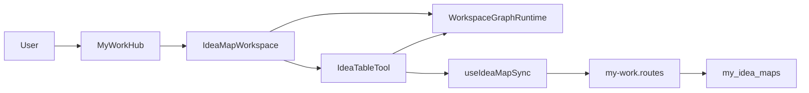
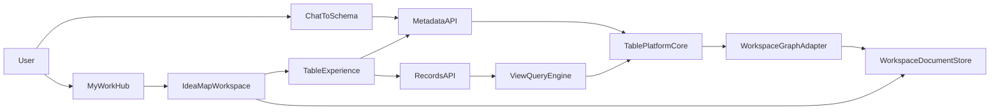
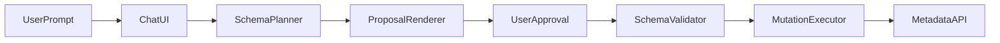

# Consultify Table Platform
## Target Architecture

This document defines the target architecture for the future Airtable-like table platform inside Consultify.

It is intentionally written against the current state of the codebase, not against a hypothetical greenfield system.

## 1. Architectural problem statement

Today the table experience is rich, but the data architecture behind it is not yet platform-grade.

Current persistence is centered around shared workspace graph documents:

- [src/components/MyWork/table/useTablePersistence.ts](src/components/MyWork/table/useTablePersistence.ts)
- [server/src/routes/my-work.routes.ts](server/src/routes/my-work.routes.ts)
- [server/src/validators/ideaWorkspaceGraph.validators.ts](server/src/validators/ideaWorkspaceGraph.validators.ts)

This gives us:

- flexible UI experimentation
- shared state across workspace tools
- quick feature iteration

But it does not give us:

- canonical schema ownership
- first-class record semantics
- backend-evaluated views
- safe schema mutation by chat
- durable relational behavior

## 2. Architectural thesis

Consultify should evolve from:

- `graph-first workspace with a table tool`

to:

- `metadata-first table platform with workspace projections`

The current graph should remain useful, but it should stop being the only durable model for table semantics.

## 3. Current architecture

### Properties of the current model

- workspace graph is the durable shell
- table schema lives mainly in `extensions.table`
- rows are derived from graph nodes
- relations are partly graph edges, partly local semantics
- chat actions are schema-light and UI-oriented

## 4. Target architecture

## 5. Canonical domains

The future platform should contain the following first-class domains:

- `workspace`
- `base`
- `table`
- `field`
- `view`
- `record`
- `attachment`
- `record_link`
- `audit_event`

## 6. Domain boundaries

### Workspace domain
Responsible for:

- tool orchestration
- panel state
- selection contract
- graph projections
- compatibility with non-table tools

### Table platform domain
Responsible for:

- schema ownership
- record ownership
- view evaluation
- relation semantics
- schema mutation logging

### Chat orchestration domain
Responsible for:

- intent understanding
- schema grounding
- proposal generation
- execution approval
- mutation dispatch

## 7. Strategic adapters

These files are the most important transition adapters.

### Frontend adapters

- [src/components/MyWork/table/useTablePersistence.ts](src/components/MyWork/table/useTablePersistence.ts)  
  Current table persistence boundary. This is the safest place to switch from graph-backed persistence to backend-backed schema and records.

- [src/components/MyWork/table/AITableAssistant.tsx](src/components/MyWork/table/AITableAssistant.tsx)  
  Current natural-language command handler. It should evolve from action generation to structured schema proposals.

- [src/components/AIChat/UnifiedChatPanel.tsx](src/components/AIChat/UnifiedChatPanel.tsx)  
  Current global chat handoff. It should become a launcher for structured table-building flows.

- [src/components/MyWork/IdeaMapWorkspace.tsx](src/components/MyWork/IdeaMapWorkspace.tsx)  
  Primary orchestration layer that must remain stable while the platform evolves behind it.

### Backend adapters

- [server/src/routes/my-work.routes.ts](server/src/routes/my-work.routes.ts)  
  Current integration surface for workspace, AI actions, presence, exports, and persistence. It should become a bridge, not the permanent home of the new table platform.

- [server/src/validators/ideaWorkspaceGraph.validators.ts](server/src/validators/ideaWorkspaceGraph.validators.ts)  
  Current schema validator for the workspace document. It should eventually validate graph projections, not canonical table data.

## 8. Proposed persistence model

### Canonical storage

- metadata tables for schema
- records table for record payloads
- attachments metadata store
- relation table for linked records
- audit log store

### Compatibility storage

- workspace document store remains
- graph projections are generated or synchronized into workspace state when required

## 9. Query architecture

The future query model should support:

- list records by table
- list records by view
- field projection
- server-side filtering
- multi-column sorting
- grouping metadata
- pagination

This is required because the current model still performs row processing mainly in frontend memory via [src/components/MyWork/table/useTableRows.ts](src/components/MyWork/table/useTableRows.ts).

## 10. Relation architecture

The first relational wave should introduce:

- linked record fields
- relation persistence table
- reverse relation semantics
- count
- lookup
- rollup v1

This should not be implemented as a pure UI enhancement. It must be persisted as platform semantics.

## 11. Chat-to-schema architecture

The recommended mutation flow is:

Key rule:

AI must never directly mutate schema without an explicit proposal and validation layer.

## 12. Recommended non-goals in the first wave

The architecture should not assume first-wave delivery of:

- extension runtime
- interface designer
- offline-first sync
- full formulas engine
- enterprise IAM parity

## 13. Architectural success condition

This architecture is successful only if the team can answer "yes" to all of the following:

- Is schema canonical on the backend?
- Are records canonical outside the graph?
- Can views be evaluated server-side?
- Can chat mutate schema safely through proposal and approval?
- Can the current workspace continue to function during the transition?
