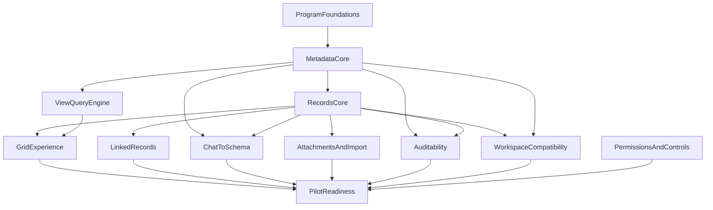

# Consultify Table Platform
## Epic Breakdown

This document decomposes the Airtable-like platform program into implementation epics.

The goal is to define a review-ready structure for future delivery planning, not to prescribe sprint sequencing in final form. Sequencing should be decided only after architecture and isolation constraints are approved.

## Epic 0: Program Foundations

### Goal
Create the minimum strategic and technical alignment required to start execution safely.

### Scope
- source-of-truth decision
- target domain model
- architecture decision records
- module ownership model
- success metrics
- release and isolation policy

### Output
- approved architecture baseline
- approved boundaries with current workspace
- approved definition of MVP

## Epic 1: Metadata Core

### Goal
Introduce first-class schema objects instead of relying on `extensions.table`.

### Scope
- `base`
- `table`
- `field`
- `view`
- stable identifiers
- schema versioning
- schema CRUD service

### Notes
This epic is the foundation of the entire program. Without it, no credible Airtable-like behavior exists.

## Epic 2: Records Core

### Goal
Introduce first-class record persistence independent from workspace graph nodes.

### Scope
- `record`
- record CRUD
- batch operations
- record versioning
- attachment metadata binding
- projection by fields

### Notes
This epic separates data semantics from visual workspace semantics.

## Epic 3: View Query Engine

### Goal
Move table filtering, sorting, grouping, and pagination to the backend.

### Scope
- saved views
- server-side filters
- multi-column sort
- pagination
- grouping metadata
- field visibility and projection

### Current gap
Today, table rows are still processed primarily in frontend memory via [src/components/MyWork/table/useTableRows.ts](src/components/MyWork/table/useTableRows.ts).

## Epic 4: Grid Experience Replatforming

### Goal
Rebind the current table UI to the new metadata and records platform.

### Scope
- grid rendering
- inline cell editing
- add/edit/delete row
- bulk operations
- column configuration
- row detail panel
- saved views UI

### Primary integration point
- [src/components/MyWork/table/useTablePersistence.ts](src/components/MyWork/table/useTablePersistence.ts)

## Epic 5: Linked Records and Derived Fields

### Goal
Add the first relational layer required for real business data workflows.

### Scope
- linked records
- reverse relations
- count
- lookup
- rollup v1
- recomputation jobs

### Notes
This epic should stop short of a full formula platform in its first implementation wave.

## Epic 6: Chat-to-Schema

### Goal
Turn natural-language requests into validated schema changes.

### Scope
- intent parsing
- schema grounding
- proposal generation
- approval flow
- mutation execution
- execution log

### Primary integration points
- [src/components/MyWork/table/AITableAssistant.tsx](src/components/MyWork/table/AITableAssistant.tsx)
- [src/components/AIChat/UnifiedChatPanel.tsx](src/components/AIChat/UnifiedChatPanel.tsx)

## Epic 7: Attachments and Import

### Goal
Support practical business use by enabling file-backed records and bulk entry.

### Scope
- attachment upload and metadata
- signed URLs
- preview metadata
- CSV import
- basic import mapping

## Epic 8: Auditability and Change History

### Goal
Ensure the platform is reviewable, debuggable, and safe to operate.

### Scope
- audit trail
- mutation history
- schema change history
- record change visibility
- admin diagnostics

## Epic 9: Workspace Compatibility Layer

### Goal
Allow the current workspace ecosystem to consume the new table platform without breaking existing tools.

### Scope
- graph projection adapter
- compatibility payloads
- workspace selection contract continuity
- transform mapping for existing tools

### Primary integration points
- [src/components/MyWork/IdeaMapWorkspace.tsx](src/components/MyWork/IdeaMapWorkspace.tsx)
- [src/components/MyWork/canvas/workspaceGraphRuntime.ts](src/components/MyWork/canvas/workspaceGraphRuntime.ts)
- [server/src/routes/my-work.routes.ts](server/src/routes/my-work.routes.ts)

## Epic 10: Permissions and Operational Controls

### Goal
Add minimum platform safety controls required for controlled rollout.

### Scope
- permissions v1
- internal feature flagging
- workspace/base/table visibility rules
- rollout controls
- observability and kill switches

## Epic 11: Pilot Readiness

### Goal
Prepare a release candidate that can be tested by selected users without risking unrelated delivery.

### Scope
- smoke tests
- support playbook
- known limitations
- go/no-go criteria
- pilot cohort definition

## Epic dependencies

## Epics that must not be forced into MVP

The following should remain explicitly outside the first implementation wave unless separately approved:

- extension runtime
- interface designer
- advanced automations builder
- sync ecosystem
- offline-first
- enterprise IAM parity

## Review questions

- Which epics are true MVP blockers?
- Which epics can remain parallel tracks?
- Which epics must be feature-flagged and invisible to existing users until pilot?
