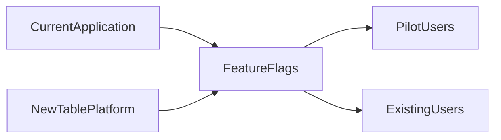

# Consultify Table Platform
## Migration and Delivery Isolation

This document defines how the future Airtable-like table platform should be introduced without disrupting ongoing delivery in other modules.

This is a critical constraint, not a nice-to-have.

## 1. Migration objective

The migration must achieve two things at the same time:

1. Build a new metadata-first table platform.
2. Avoid slowing or destabilizing unrelated module completion.

This means the rebuild cannot behave like a broad platform rewrite across the whole app.

## 2. Core migration rule

The new table platform must be introduced as an isolated vertical slice with controlled integration points.

It must not become a cross-repo "every team must stop and adapt now" effort.

## 3. What must remain stable during the rebuild

The following surfaces should remain stable for the rest of the product while the new platform is being built:

- [src/views/MyWorkView.tsx](src/views/MyWorkView.tsx)
- [src/components/MyWork/MyWorkHub.tsx](src/components/MyWork/MyWorkHub.tsx)
- [src/components/MyWork/IdeaMapWorkspace.tsx](src/components/MyWork/IdeaMapWorkspace.tsx)
- [server/src/routes/my-work.routes.ts](server/src/routes/my-work.routes.ts)

The rebuild should target narrow adapters first, not broad rewrites.

## 4. Adapter-first migration path

### Stage 1: backend-first

Build the metadata and records platform behind new APIs without changing existing table UI behavior.

### Stage 2: table adapter switch

Replace table persistence and reads through a narrow adapter layer:

- [src/components/MyWork/table/useTablePersistence.ts](src/components/MyWork/table/useTablePersistence.ts)

### Stage 3: chat adapter switch

Move AI table actions from UI-oriented commands to proposal-driven schema mutations through:

- [src/components/MyWork/table/AITableAssistant.tsx](src/components/MyWork/table/AITableAssistant.tsx)
- [src/components/AIChat/UnifiedChatPanel.tsx](src/components/AIChat/UnifiedChatPanel.tsx)

### Stage 4: workspace projection

Only after the new core works should graph projections be updated to consume canonical table data where needed.

## 5. Required isolation model

### 5.1 Team isolation

The platform work should run as a ring-fenced stream with:

- dedicated backend ownership
- dedicated frontend ownership
- no mandatory rework for unrelated module teams
- explicit integration requests instead of hidden shared changes

### 5.2 Branch and release isolation

Recommended execution model:

- feature-flagged development
- no default-user exposure during build
- pilot-only release path
- independent QA criteria for the platform stream

### 5.3 Runtime isolation

The new platform should be introduced behind:

- feature flags
- route or capability guards
- adapter boundaries
- opt-in pilot enablement

## 6. Rules that protect other modules

The program must follow these rules:

- no global refactor of shared UI primitives unless separately justified
- no forced migration of non-table modules during MVP
- no change to existing workspace contracts without compatibility layer
- no replacement of current persistence for all tools at once
- no cross-module dependency that blocks active delivery streams

## 7. Recommended rollout model

Behavior:

- existing users continue using the current system by default
- pilot users access the new table platform through flags
- no broad exposure until MVP criteria are met

## 8. Migration sequencing rules

The sequence should be:

1. build new backend
2. expose internal contracts
3. connect one new table flow
4. verify platform behavior
5. expose to pilot
6. only then expand integration

The sequence must not be:

1. refactor broad workspace shell
2. refactor shared modules
3. rebuild all tools together

## 9. Data migration stance

For the first wave, prefer:

- forward-compatible coexistence
- selective projection
- adapter translation

Avoid:

- big-bang migration of all existing idea maps
- forced conversion of all graph tables into the new platform on day one

## 10. Safe coexistence model

The recommended coexistence model is:

- new canonical table data in the new platform
- optional graph projection for workspace tools
- current graph model left intact for unaffected features

This gives the team a reversible path during pilot.

## 11. Operational checkpoints

Before each release stage, validate:

- no regression in current My Work flows
- no regression in unrelated modules
- no increase in shared-module failure rate
- no forced API change for consumers outside the table stream

## 12. Exit condition for full migration planning

The next planning step should only begin once the team agrees that:

- the new platform can be built behind isolated adapters
- delivery in other modules must continue without interruption
- migration of old workspace data will be incremental, not all-at-once
