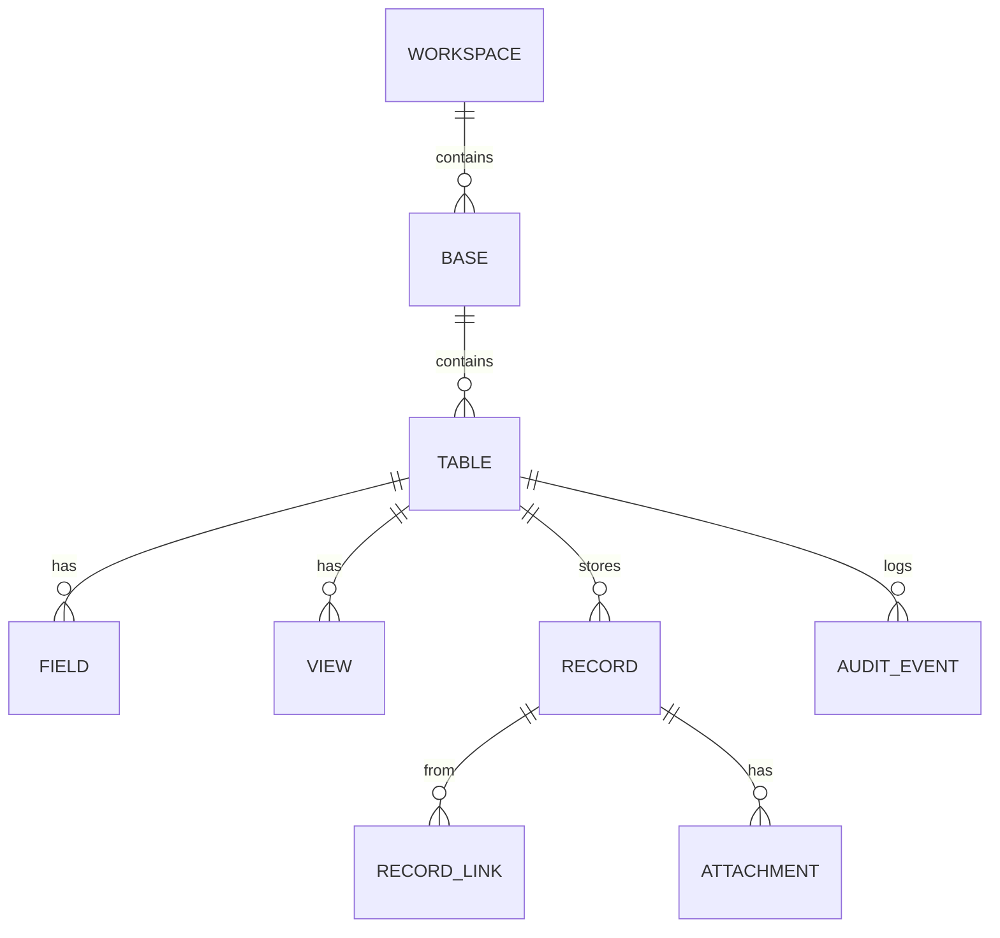
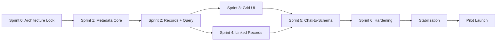

# Consultify Table Platform
## Master Execution Report

Generated: 2026-03-15  
Status: All workstream specifications complete  
Total specification volume: 6,995 lines across 7 documents

---

## 1. Executive Summary

The Consultify Table Platform program has completed its full specification phase. Seven detailed workstream documents have been produced, covering product definition, architecture, core technical model, AI-driven schema creation, data collection, migration communication, and artifact distribution.

The program is now ready for implementation review and Sprint 0 kickoff.

### Key numbers

| Metric | Value |
|--------|-------|
| Workstream documents | 7 |
| Total specification lines | 6,995 |
| TypeScript interfaces defined | ~80 |
| PostgreSQL DDL statements | ~15 |
| Mermaid diagrams | ~24 |
| API endpoints specified | ~20 |
| Field types fully specified | 22 |
| ADRs written | 6 |
| Use cases documented | 10 |
| Personas defined | 4 |
| P0 connectors specified | 5 |
| Business events cataloged | ~12 |

---

## 2. Workstream Delivery Status

| ID | Workstream | Status | Lines | Quality |
|----|-----------|--------|-------|---------|
| WS-A | Product Definition | COMPLETE | 669 | Vision, 4 personas, 10 use cases, MVP scope, 5 principles, metrics, positioning |
| WS-B | Architecture & Boundaries | COMPLETE | 1,042 | 6 ADRs, ER model, DDL, API contracts, service architecture, migration stages |
| WS-C | Table Platform Core | COMPLETE | 1,059 | 22 field types, JSONB storage, query engine, filter/sort/group, relations, audit |
| WS-D | Chat-to-Schema | COMPLETE | 1,156 | AI pipeline, 11 intents, proposal contract, prompt engineering, safety guardrails |
| WS-E | Data Collection | COMPLETE | 1,057 | 5 P0 connectors, mapping engine, refresh policies, provenance, governed models |
| WS-F | Migration Communication | COMPLETE | 849 | Airtable & Power BI playbooks, stakeholder plan, pilot design, training |
| WS-G | Distribution Separation | COMPLETE | 1,163 | Artifact contract, event catalog, policy engine, 5 channels, audit |

---

## 3. Architecture Decisions Locked

| ADR | Decision | Impact |
|-----|----------|--------|
| ADR-001 | Metadata-first source of truth | Schema objects (base, table, field, view) are first-class backend entities |
| ADR-002 | Graph becomes projection layer | Current workspace graph remains but stops being canonical for table data |
| ADR-003 | Server-side query engine mandatory | Filtering, sorting, grouping, pagination move to backend |
| ADR-004 | Separate domain services | New table platform gets dedicated routes, not expanding my-work.routes |
| ADR-005 | Feature-flagged rollout | Pilot-only access, no broad user exposure during build |
| ADR-006 | Adapter-first migration | Narrow integration points (useTablePersistence, AITableAssistant), not broad rewrite |

---

## 4. Domain Model Summary



### Canonical entities
- **workspace** — organizational container
- **base** — collection of related tables (like an Airtable base)
- **table** — structured data container with schema
- **field** — column definition with type, options, validation
- **view** — saved query configuration (filters, sorts, visible fields)
- **record** — data row with JSONB payload
- **record_link** — bidirectional relation between records
- **attachment** — file metadata with S3 storage
- **audit_event** — immutable log of schema and record mutations

---

## 5. Implementation Phases

### Phase 1: Core Platform (Day 1–90)

| Sprint | Duration | Deliverables | Workstreams |
|--------|----------|-------------|-------------|
| Sprint 0 | Week 1–2 | Architecture lock, ADRs approved, MVP boundary, sprint backlog | WS-A, WS-B |
| Sprint 1 | Week 3–4 | DB schema v1, metadata service, records service skeleton | WS-B, WS-C |
| Sprint 2 | Week 5–6 | Records API v1, View Query Engine v1, read-only grid prototype | WS-C |
| Sprint 3 | Week 7–8 | Grid UI v1, inline editing, saved views, audit trail v1 | WS-C |
| Sprint 4 | Week 9–10 | Linked records v1, count/lookup/rollup, relation picker | WS-C |
| Sprint 5 | Week 11–12 | Chat-to-Schema v1, proposal contract, approval flow | WS-D |
| Sprint 6 | Week 13 | Permissions v1, attachments v1, CSV import v1, hardening | WS-C |
| Stabilization | Week 14 | Bug triage, perf tuning, security review, go/no-go | All |

### Phase 2: Data Ecosystem (Day 91–150)

| Sprint | Deliverables | Workstream |
|--------|-------------|------------|
| Sprint 7–8 | Connector framework, CSV/XLSX import, schema mapping UI | WS-E |
| Sprint 9–10 | P0 connectors (Airtable, Google Sheets, Postgres, Jira) | WS-E |
| Sprint 11 | Refresh scheduling, run logs, provenance | WS-E |
| Sprint 12 | Governed model layer v1, KPI definitions, trust flags | WS-E |

### Phase 3: Adoption & Distribution (Day 91–180, parallel track)

| Sprint | Deliverables | Workstream |
|--------|-------------|------------|
| Sprint 7–8 | Artifact contracts, event catalog, manual send | WS-G |
| Sprint 9–10 | Approval-aware sending, recurring schedules, policy engine | WS-G |
| Sprint 11–12 | Migration communication assets, pilot program launch | WS-F |
| Sprint 13–14 | Pilot feedback, expansion decision, training rollout | WS-F |

---

## 6. Critical Path



**Blocking dependencies:**
1. Sprint 0 must complete before any implementation starts
2. Metadata Core (S1) blocks everything downstream
3. Records + Query (S2) blocks Grid UI (S3) and Linked Records (S4)
4. Chat-to-Schema (S5) requires both Grid UI and Linked Records
5. Pilot Launch requires Stabilization sign-off

---

## 7. Risk Summary

| Risk | Severity | Mitigation | Owner |
|------|----------|-----------|-------|
| Dual source of truth (graph vs records) | CRITICAL | ADR-002: graph becomes projection only | Architect |
| Scope explosion into Airtable parity | CRITICAL | Frozen MVP scope in WS-A Section 4 | Product |
| Client-side query logic remains | HIGH | ADR-003: server-side query mandatory | Backend Lead |
| AI mutation reliability | HIGH | Proposal contract + validation layer (WS-D) | AI Engineer |
| Impact on other modules | CRITICAL | ADR-005/006: feature flags + adapter migration | Tech Lead |
| Backend effort underestimated | HIGH | Sprint 0 sizing + buffer in Sprint 6 | Engineering |
| Communication outpaces product | MEDIUM | WS-F guardrails: don't promise what doesn't exist | Product |

---

## 8. Isolation Guarantees

The program will NOT:
- Refactor shared UI primitives
- Force migration of non-table modules
- Change existing workspace contracts without compatibility layer
- Replace current persistence for all tools at once
- Create cross-module dependencies that block active delivery

The program WILL:
- Run as a ring-fenced stream with dedicated ownership
- Use feature flags for all new capabilities
- Expose to pilot users only through controlled enablement
- Maintain backward compatibility via adapters
- Keep existing My Work, Finance, and Mindmap modules untouched

---

## 9. MVP Success Criteria

### Product metrics
- User creates table from chat in under 2 minutes
- User creates 5–10 fields without manual technical configuration
- User saves at least 3 views
- User creates relation between 2 tables

### Technical metrics
- p95 list records under 500ms for normal view queries
- p95 update record under 250ms
- No basic flow depends on full client-side table loading
- All schema mutations are logged

### Delivery metrics
- No critical source-of-truth conflict between graph and records
- No critical pilot blocker in chat-to-schema end-to-end flow
- No regression in existing My Work flows

---

## 10. Go/No-Go Criteria (Day 90)

### GO if ALL true:
- [ ] Metadata API works
- [ ] Records API works
- [ ] Grid runs on new backend
- [ ] Saved views work
- [ ] Linked records v1 work
- [ ] Chat creates tables through proposal → approval → execution
- [ ] Audit trail exists
- [ ] Critical failure modes documented

### NO-GO if ANY true:
- [ ] Schema mutations not reliably validated
- [ ] Record identity unstable
- [ ] Views still effectively local-only state
- [ ] Relation writes can corrupt data
- [ ] Graph vs records source-of-truth boundaries unclear

---

## 11. Team Shape Required

| Role | Count | Responsibility |
|------|-------|---------------|
| Tech Lead / Architect | 1 | Architecture decisions, cross-stream coordination |
| Backend Engineer | 2 | Metadata service, records service, query engine |
| Frontend Engineer | 2 | Grid UI, proposal renderer, adapter rewiring |
| AI / Application Engineer | 1 | Chat-to-Schema pipeline, prompt engineering |
| Product Designer | 1 | Grid UX, proposal UX, migration flows |
| Product Owner / PM | 1 | Scope control, priority, stakeholder communication |
| QA (shared/embedded) | 1 | API tests, e2e tests, regression |

---

## 12. File Inventory

### Strategy documents (parent)
```
docs/strategy/
├── README.md (updated with workstream references)
├── CONSULTIFY_AIRTABLE_90_DAY_PLAN.md
├── CONSULTIFY_TABLE_PLATFORM_ARCHITECTURE.md
├── CONSULTIFY_TABLE_PLATFORM_EPICS.md
├── CONSULTIFY_TABLE_PLATFORM_IMPLEMENTATION_REQUIREMENTS.md
├── CONSULTIFY_TABLE_PLATFORM_MIGRATION_AND_ISOLATION.md
├── CONSULTIFY_TABLE_PLATFORM_RISK_REGISTER.md
├── CONSULTIFY_DATA_COLLECTION_PLAN.md
├── CONSULTIFY_CENTRAL_DATA_MIGRATION_COMMUNICATION_PLAN.md
├── CONSULTIFY_ARTIFACT_DISTRIBUTION_AUTOMATION_PLAN.md
└── MASTER_EXECUTION_REPORT.md (this file)
```

### Workstream specifications
```
docs/strategy/workstreams/
├── README.md
├── WS_A_PRODUCT_DEFINITION.md          (669 lines)
├── WS_B_ARCHITECTURE_BOUNDARIES.md     (1,042 lines)
├── WS_C_TABLE_PLATFORM_CORE_SPEC.md    (1,059 lines)
├── WS_D_CHAT_TO_SCHEMA_SPEC.md         (1,156 lines)
├── WS_E_DATA_COLLECTION_SPEC.md        (1,057 lines)
├── WS_F_MIGRATION_COMMUNICATION.md     (849 lines)
└── WS_G_DISTRIBUTION_SEPARATION.md     (1,163 lines)
```

---

## 13. Recommended Next Steps

1. **Review all workstream specs** — Product + Engineering + AI leads read WS-A through WS-G
2. **Approve ADRs** — Formally ratify the 6 architecture decisions in WS-B
3. **Lock MVP scope** — Sign off on WS-A Section 4 (what's in, what's out)
4. **Answer blocking questions** from the Risk Register
5. **Start Sprint 0** — Architecture setup, domain model confirmation, sprint backlog creation
6. **Assign team** — Staff the roles from Section 11
7. **Set up feature flags** — Prepare infrastructure for isolated rollout

---

## 14. Final Assessment

The Consultify Table Platform specification is complete. The program has:

- A clear North Star: **support business decisions, not dominate workflow**
- A production-grade architecture with **6 locked ADRs**
- A complete technical model with **22 field types, JSONB storage, server-side query engine**
- An AI layer with **structured proposals, validation, and safety guardrails**
- A data ecosystem plan with **5 P0 connectors and governed models**
- A migration strategy based on **coexist → mirror → validate → switch**
- A distribution model that **separates artifact creation from delivery**
- **Zero impact on active Finance, Mindmap, and other module delivery**

The specification volume (6,995 lines) is sufficient for a team to begin Sprint 0 without ambiguity on scope, architecture, or boundaries.
