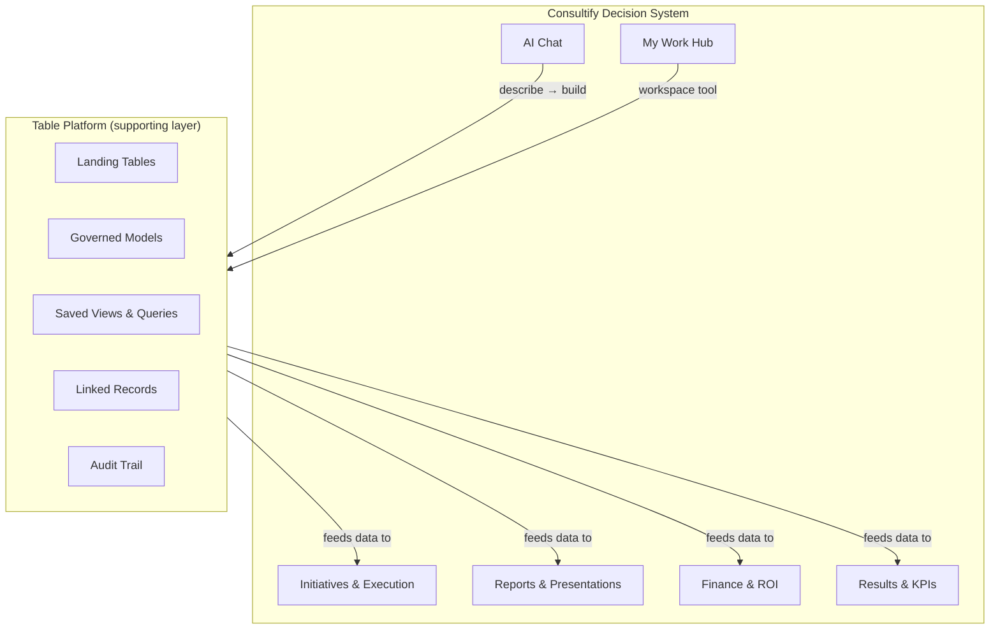
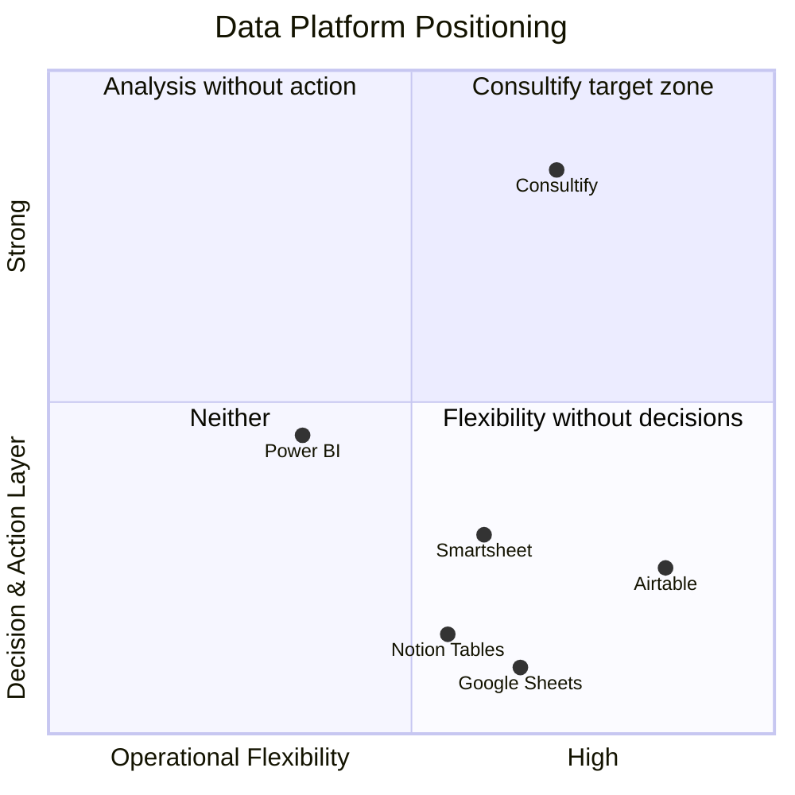
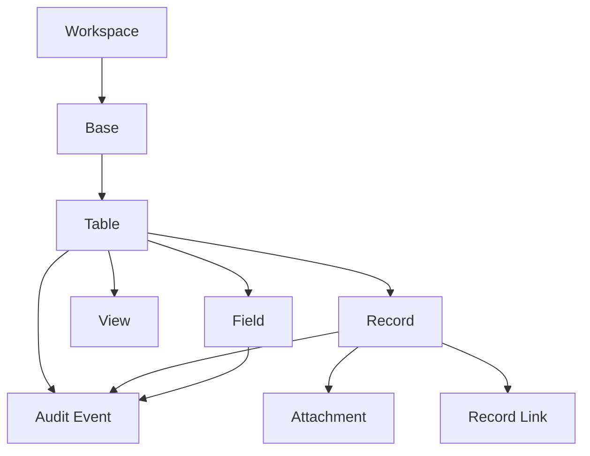
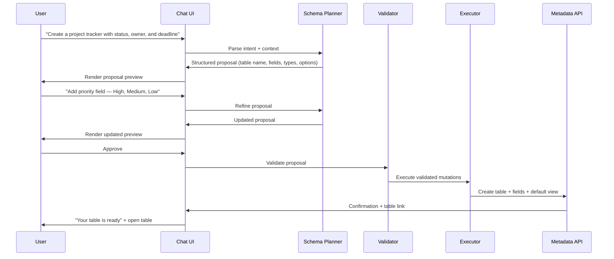

# WS-A: Consultify Table Platform — Product Definition

Version: 1.0  
Owner: Product  
Status: Draft  
Last updated: 2026-03-15  
Parent program: Consultify Table Platform 90-Day Delivery

---

## 1. Product Vision

### 1.1 What Consultify Table Platform is

Consultify Table Platform is the structured-data infrastructure layer inside Consultify — a decision-support system where executives, operators, and analysts make and execute business decisions.

The table platform exists to answer one question: **how do we get the right data in front of the right person at the moment they need to decide?**

It provides:

- **Metadata-first storage** — schema, records, relations, and views as canonical backend objects
- **AI-first creation** — users describe what they need; the system proposes, validates, and builds it
- **Governed provenance** — every data point traceable to its source, every mutation logged
- **Decision-linked output** — tables feed directly into initiatives, reports, finance models, and executive packs

### 1.2 What Consultify Table Platform is NOT

- **Not a database construction kit.** Users never see migration scripts, join syntax, or schema editors. The platform handles structural complexity invisibly.
- **Not a standalone spreadsheet product.** Tables are always embedded within workspace context — linked to initiatives, decisions, reports, and AI chat.
- **Not a BI dashboard tool.** It does not compete with Power BI on visualization. It competes on closing the gap between analysis and action.
- **Not the product itself.** Consultify is a decision-support system. The table platform is supporting infrastructure — powerful when needed, invisible when not.

### 1.3 Position within the Consultify ecosystem

### 1.4 The invisible infrastructure principle

The best table platform is the one users forget they're using. Success means:

- A CEO asks a question in chat and gets a table — without knowing a schema was created.
- A project manager imports a CSV and sees linked milestones — without configuring a relation.
- A finance analyst opens a governed P&L and trusts every number — without auditing ingestion logs manually.

The platform should feel like electricity: always available, never requiring expertise to consume.

---

## 2. Target Personas

### 2.1 Decision Maker

**Role:** Executive, VP, C-suite, Board member  
**Technical skill:** Low to none. Uses the product through AI chat and pre-built views.

| Dimension | Detail |
|---|---|
| **Primary goal** | Make faster, better-informed decisions with less preparation overhead |
| **Key workflows** | Ask chat for a comparison table; review KPI dashboard assembled from governed tables; approve an initiative based on structured data; request "executive monthly pack" |
| **Pain points** | Waiting for analysts to prepare data; receiving stale information; distrusting numbers because sources are unclear; being forced to learn tools to get answers |
| **What they never want to do** | Configure a field type, debug a formula, set up a sync connector, design a view layout |
| **Success criteria** | Question → trusted answer in < 2 minutes; all numbers link back to source; executive pack is auto-assembled, not hand-built |

**Core interaction pattern:** Describe need → receive structured output → decide → act.

### 2.2 Operator

**Role:** Team lead, Project manager, Operations manager, Program coordinator  
**Technical skill:** Moderate. Comfortable with spreadsheets and structured tools.

| Dimension | Detail |
|---|---|
| **Primary goal** | Track operational work reliably across teams, timelines, and deliverables |
| **Key workflows** | Import CSV of milestones and link to initiative; set up weekly tracker with Jira sync; manage multi-table project workspace; create views per team or phase; bulk-update status |
| **Pain points** | Data living in 5 different tools; manual copy-paste between Jira/Sheets/Airtable; no single view of progress; linked records breaking when data changes; refresh delays |
| **What they need** | Reliable imports, linked records across tables, saved views per audience, refresh that works, bulk operations that don't corrupt data |
| **Success criteria** | One operational source of truth per project; < 5 min to import and link new data; views update automatically when underlying records change |

**Core interaction pattern:** Import/sync → structure → link → monitor → report.

### 2.3 Analyst

**Role:** Finance analyst, Strategy analyst, Data analyst, Controller  
**Technical skill:** High. Expects precision, auditability, and governed semantics.

| Dimension | Detail |
|---|---|
| **Primary goal** | Build trusted analytical models that others can consume without re-derivation |
| **Key workflows** | Create governed P&L with canonical line mappings; build comparison matrix with provenance; define KPI metrics with source tracing; export to presentation or report; validate data freshness before sharing |
| **Pain points** | Numbers that can't be traced; models that break when someone edits a field; no version history; export losing structure; no distinction between "draft" and "governed" data |
| **What they need** | Provenance on every value, schema versioning, audit trail, locked/governed table modes, export that preserves semantics, approval gates for schema changes |
| **Success criteria** | Any stakeholder can trace a number back to its source in < 3 clicks; governed models are protected from casual edits; schema changes require explicit approval |

**Core interaction pattern:** Ingest → model → govern → publish → audit.

### 2.4 AI-First User

**Role:** Any user who prefers natural language over manual configuration  
**Technical skill:** Varies. Defines requirements verbally, not structurally.

| Dimension | Detail |
|---|---|
| **Primary goal** | Get a working table by describing what they need — zero manual setup |
| **Key workflows** | "Create a project tracker with status, owner, deadline, and priority"; "Build me a CRM with companies, contacts, and deals linked together"; "Show me a comparison of our three market options with scoring" |
| **Pain points** | Having to learn a tool before using it; making structural decisions they don't understand (field types, relations, view configs); error-prone manual setup for something AI could do |
| **What they need** | Describe → get proposal → approve → use; iterative refinement through conversation; safe execution that doesn't corrupt existing data |
| **Success criteria** | Working table from description in < 2 minutes; schema matches intent on first proposal ≥ 70% of the time; refinement converges in ≤ 2 rounds |

**Core interaction pattern:** Describe → review proposal → approve → use → refine.

---

## 3. Use Cases

### UC-01: Executive asks for sales pipeline by region

| Field | Detail |
|---|---|
| **ID** | UC-01 |
| **Title** | Chat-driven pipeline analysis |
| **Trigger** | CEO types in chat: "Show me sales pipeline by region for Q1" |
| **Actor** | Decision Maker |
| **Precondition** | CRM data has been synced into a landing table via scheduled connector |
| **Flow** | 1. Chat parses intent: table query with filter (Q1) and grouping (region) 2. System identifies existing CRM landing table with pipeline data 3. System creates a saved view with region grouping, Q1 filter, and value summation 4. View renders in workspace as a grouped grid with totals 5. CEO drills into a region by clicking the group header |
| **Expected outcome** | Grouped table view with deal count, total value, and win-rate per region. No schema created — existing data, new view. |
| **Decision connection** | CEO decides to reallocate sales resources from underperforming region based on visible pipeline gap. Links the decision to an Initiative. |

### UC-02: Project manager imports CSV of milestones

| Field | Detail |
|---|---|
| **ID** | UC-02 |
| **Title** | CSV import with initiative linking |
| **Trigger** | PM exports milestones from MS Project as CSV and drops it into Consultify |
| **Actor** | Operator |
| **Precondition** | An initiative exists in the Execution module |
| **Flow** | 1. PM selects "Import CSV" from workspace toolbar 2. System detects column headers, proposes field types 3. PM confirms mapping (date, status, owner, deliverable) 4. Records are created in a new table inside the workspace base 5. PM links the table to the parent initiative 6. PM creates a "By Phase" saved view with grouping on phase column |
| **Expected outcome** | 47 milestone records in a structured table, linked to the initiative, with a phase-grouped view ready for team review. |
| **Decision connection** | PM uses the table to run weekly check-ins. Delays visible in the view trigger escalation to the initiative owner. |

### UC-03: Finance user creates governed P&L model

| Field | Detail |
|---|---|
| **ID** | UC-03 |
| **Title** | Governed financial statement with provenance |
| **Trigger** | Controller needs a trusted P&L model for board review |
| **Actor** | Analyst |
| **Precondition** | Raw financial data has been imported from ERP into landing tables |
| **Flow** | 1. Analyst creates a new "governed" table in the Finance workspace 2. Maps canonical P&L line items (Revenue, COGS, Gross Margin, etc.) to source landing table fields 3. Defines period columns or rows with canonical period identifiers 4. Marks the model as "governed" — schema changes now require approval 5. Connects the model to the Finance module's statement view 6. Audit trail records every mapping decision and data source |
| **Expected outcome** | A governed P&L table where every number links to its source record, every mapping is logged, and the schema cannot be casually altered. |
| **Decision connection** | Board reviews the P&L in the executive pack. Every challenged number traces back to the ERP source record in ≤ 3 clicks. |

### UC-04: Team lead sets up operational tracker with Jira sync

| Field | Detail |
|---|---|
| **ID** | UC-04 |
| **Title** | Synced operational tracker |
| **Trigger** | Engineering lead needs a single view of sprint work linked to strategic initiatives |
| **Actor** | Operator |
| **Precondition** | Jira connector is configured (Phase 2 capability; in MVP this is simulated via periodic CSV re-import) |
| **Flow** | 1. Lead creates a tracker table in the team workspace 2. Configures sync source pointing to Jira project (or imports CSV in MVP) 3. Mapping: Jira key → ID, summary → title, status → status, assignee → owner, story points → effort 4. Sets refresh to daily (or manual re-import in MVP) 5. Creates views: "My Items" (filtered by owner), "Blocked" (filtered by status), "Sprint Overview" (grouped by sprint) 6. Links records to initiative milestones via linked-record field |
| **Expected outcome** | Operational tracker with 120+ records, refreshable, three saved views, and linked to strategic initiative milestones. |
| **Decision connection** | Initiative review surfaces blocked items from the tracker. Decision to de-scope or re-prioritize is made in context, not in a separate tool. |

### UC-05: Strategy analyst creates market comparison matrix

| Field | Detail |
|---|---|
| **ID** | UC-05 |
| **Title** | Structured comparison for strategic decision |
| **Trigger** | Strategy team needs to evaluate 4 market entry options across 12 criteria |
| **Actor** | Analyst |
| **Precondition** | Evaluation criteria have been agreed upon in the strategy workspace |
| **Flow** | 1. Analyst describes in chat: "Create a comparison matrix with 4 options as rows and 12 criteria as columns, each scored 1-5 with weighted totals" 2. Chat-to-Schema proposes: table with text field (option name), 12 number fields (criteria scores), 1 number field (weighted total), notes field 3. Analyst refines: "Add a single-select for recommendation status: Pursue, Hold, Reject" 4. Proposal is approved and table is created 5. Analyst fills in scores and writes assessment notes 6. Creates a view sorted by weighted total descending |
| **Expected outcome** | Decision matrix with scored options, ready to present. Weighted totals auto-calculated (v1: manually entered; v2: via formula/rollup). |
| **Decision connection** | Executive team reviews the matrix in a strategy session. Decision to pursue option B is recorded as a Decision artifact linked to this table. |

### UC-06: CEO requests monthly executive pack

| Field | Detail |
|---|---|
| **ID** | UC-06 |
| **Title** | Auto-assembled executive reporting pack |
| **Trigger** | CEO types: "Prepare monthly executive pack for March" |
| **Actor** | Decision Maker |
| **Precondition** | Governed models exist for P&L, pipeline, initiative status, and KPIs |
| **Flow** | 1. System identifies governed tables tagged as "executive-pack-source" 2. For each: creates or refreshes a summary view (P&L summary, pipeline by region, initiative status rollup, KPI scorecard) 3. Assembles views into a Report artifact with standard executive pack template 4. Surfaces the draft pack for CEO review 5. CEO requests one change: "Add headcount trend" 6. System finds HR landing table, creates summary view, inserts into pack |
| **Expected outcome** | 5-section executive pack assembled from governed tables, each section traceable to its source model, ready to share with the board. |
| **Decision connection** | The pack IS the decision-support artifact. Board decisions reference specific tables within it. |

### UC-07: Operator creates landing table from webhook events

| Field | Detail |
|---|---|
| **ID** | UC-07 |
| **Title** | Event-driven data capture |
| **Trigger** | Operations team needs to capture form submissions from the company website into a trackable table |
| **Actor** | Operator |
| **Precondition** | Webhook endpoint is configured (Phase 2 full automation; MVP uses manual import or API push) |
| **Flow** | 1. Operator creates a landing table: name, email, company, message, submitted_at, status 2. Configures webhook source (Phase 2) or sets up daily import (MVP) 3. Each event becomes a record with append-only ingestion policy 4. Operator creates views: "Unprocessed" (status = new), "This Week" (date filter), "By Company" (grouped) 5. Links high-priority leads to initiative records for follow-up |
| **Expected outcome** | Growing table of inbound events, no data lost, clear processing status, linked to follow-up workflows. |
| **Decision connection** | Weekly review of unprocessed leads informs business development prioritization decisions. |

### UC-08: User describes multi-table CRM in chat

| Field | Detail |
|---|---|
| **ID** | UC-08 |
| **Title** | AI-generated multi-table schema from description |
| **Trigger** | Sales director types: "I need a simple CRM — companies, contacts at each company, and deals linked to contacts. Track deal stage, value, and expected close date." |
| **Actor** | AI-First User |
| **Precondition** | User has a workspace with write permissions |
| **Flow** | 1. Chat-to-Schema parses intent: 3 tables with relations 2. System generates proposal: - Table "Companies": name, industry, size, website, notes - Table "Contacts": name, email, phone, role, linked_record→Companies - Table "Deals": title, value (currency), stage (single_select: Lead/Qualified/Proposal/Closed Won/Closed Lost), expected_close (date), linked_record→Contacts 3. Proposal is rendered as a structured preview with table outlines and relation arrows 4. User says: "Add a 'priority' field to Deals — High, Medium, Low" 5. Refined proposal is shown and approved 6. System creates 3 tables with linked records, default grid views, and sample empty records 7. User starts entering data immediately |
| **Expected outcome** | Three related tables with correct field types, linked records configured, default views created — from a 2-sentence description. Total time: < 3 minutes. |
| **Decision connection** | Sales director uses the CRM tables to track pipeline. Weekly pipeline review feeds into revenue forecasting and resource allocation decisions. |

### UC-09: Analyst validates data freshness before board meeting

| Field | Detail |
|---|---|
| **ID** | UC-09 |
| **Title** | Provenance and freshness audit |
| **Trigger** | CFO asks analyst: "Are the numbers in the executive pack current?" |
| **Actor** | Analyst |
| **Precondition** | Executive pack tables have provenance metadata from ingestion |
| **Flow** | 1. Analyst opens the governed P&L table 2. Checks provenance strip: last refresh timestamp, source system, connector run status 3. Sees that the revenue line was last refreshed 2 hours ago — acceptable 4. Checks the pipeline table: last refresh was 5 days ago — stale 5. Triggers manual re-import for the pipeline table 6. After refresh completes, confirms all pack sources are < 24 hours old 7. Reports to CFO: "All data is current as of this morning" |
| **Expected outcome** | Analyst can verify and certify data freshness across all governed tables feeding the executive pack in < 5 minutes. |
| **Decision connection** | Board makes investment decisions based on the pack, with explicit confidence that data is current. |

### UC-10: Team creates shared view for cross-functional review

| Field | Detail |
|---|---|
| **ID** | UC-10 |
| **Title** | Audience-specific saved views |
| **Trigger** | Product and Engineering need different views of the same feature backlog table |
| **Actor** | Operator |
| **Precondition** | Feature backlog table exists with fields: title, status, priority, team, effort, business_value, target_release |
| **Flow** | 1. Operator creates "Product View": sorted by business_value desc, grouped by target_release, hiding effort and team columns 2. Creates "Engineering View": sorted by priority, grouped by team, showing effort, hiding business_value 3. Creates "Leadership View": filtered to priority = High only, sorted by target_release 4. Each view is saved and named 5. Cross-functional review uses the Leadership View; daily standups use Engineering View |
| **Expected outcome** | One table, three perspectives. No data duplication. Each audience sees what matters to them. |
| **Decision connection** | Leadership uses their filtered view to make release scope decisions. Engineering uses their view for sprint planning. Same source of truth, different lenses. |

---

## 4. MVP Scope Definition

### 4.1 In scope — 90-day MVP

The MVP delivers the minimum platform required for a user to create, populate, query, relate, and govern structured data through AI and direct interaction.

| Capability | Description | Epic ref |
|---|---|---|
| **Metadata backend** | First-class base/table/field/view objects with stable IDs and schema versioning | Epic 1 |
| **Records CRUD** | Create, read, update, delete records with batch support | Epic 2 |
| **Server-side query engine** | Filter, sort, group, paginate on the backend — not in browser memory | Epic 3 |
| **Grid UI v1** | Inline editing, row operations, column config, backed by new APIs | Epic 4 |
| **Saved views** | Persistent view configurations per table with audience-specific filters | Epic 3–4 |
| **Linked records v1** | Cross-table relations with reverse links, count, lookup, rollup v1 | Epic 5 |
| **Chat-to-Schema v1** | Describe → propose → approve → execute for table creation and modification | Epic 6 |
| **Audit trail v1** | Schema and record mutation logging with queryable history | Epic 8 |
| **CSV import v1** | File upload with column detection, type inference, and mapping confirmation | Epic 7 |
| **File attachments v1** | Upload, metadata binding, signed URL retrieval per record | Epic 7 |
| **Permissions v1** | Base-level access control sufficient for pilot | Epic 10 |
| **Workspace compatibility** | Graph adapter ensuring existing workspace tools continue functioning | Epic 9 |

### 4.2 Supported field types in MVP

| Category | Types |
|---|---|
| Text | `text`, `long_text`, `url`, `email`, `phone` |
| Numeric | `number`, `currency`, `percent` |
| Selection | `single_select`, `multi_select` |
| Temporal | `date`, `created_time`, `last_modified_time` |
| Boolean | `checkbox` |
| System | `created_by`, `last_modified_by` |
| Relational | `linked_record` |
| Binary | `attachment` |

### 4.3 Explicitly out of scope

These are **intentionally excluded** from the 90-day MVP. Each exclusion is a deliberate product decision, not a deferral by neglect.

| Excluded capability | Rationale | Phase |
|---|---|---|
| **Full formula engine** | Requires expression parser, dependency graph, and recomputation infrastructure. Premature for MVP. | Phase 2 |
| **Advanced automations builder** | Trigger/action workflow builder is a separate product surface. MVP focuses on data, not orchestration. | Phase 2 |
| **Interface designer** | Custom form/page builder for records. Valuable but not required for core table utility. | Phase 2+ |
| **Extension runtime** | Third-party script execution environment. Enterprise feature, not MVP. | Phase 3 |
| **Sync/connectors ecosystem** | Scheduled sync from Jira, Salesforce, etc. MVP uses CSV import. Connectors are Phase 2 per the Data Collection Plan. | Phase 2 |
| **Enterprise SCIM/SSO** | Required for enterprise rollout, not for pilot validation. | Phase 2 |
| **Offline-first** | Conflict resolution and local-first sync add architectural complexity. Not justified for initial web-only deployment. | Phase 3 |
| **Communication automation** | Report distribution, notification workflows, scheduled sends. Covered by the separate Artifact Distribution strategy. | Separate module |
| **Full BI visualization layer** | Chart builder, dashboard composer. Consultify uses tables as data sources for existing Results and Reports modules. | Separate module |

### 4.4 MVP boundary diagram

```mermaid
flowchart LR
  subgraph MVP["90-Day MVP Boundary"]
    M[Metadata Core]
    R[Records CRUD]
    Q[Query Engine]
    G[Grid UI]
    V[Saved Views]
    L[Linked Records v1]
    C[Chat-to-Schema v1]
    A[Audit Trail v1]
    I[CSV Import v1]
    F[Attachments v1]
    P[Permissions v1]
    W[Workspace Compat]
  end

  subgraph Phase2["Phase 2"]
    FE[Formula Engine]
    AU[Automations]
    SY[Sync Connectors]
    GM[Governed Models v2]
    SS[SSO/SCIM]
  end

  subgraph Phase3["Phase 3+"]
    ID[Interface Designer]
    EX[Extension Runtime]
    OF[Offline-First]
    AD[Advanced BI]
  end

  MVP --> Phase2 --> Phase3
```

---

## 5. Product Principles

### Principle 1: "Describe, don't configure"

**Statement:** The default path to creating a table is natural language, not manual schema configuration.

**Implication:** Chat-to-Schema is not a power-user feature — it is the primary creation flow. Manual configuration exists as a fallback, not the starting point.

**Test:** Can a non-technical user create a useful 3-table workspace from a 2-sentence description in under 3 minutes?

### Principle 2: "Support decisions, don't dominate workflow"

**Statement:** The table platform is infrastructure, not the product. It serves workspaces, initiatives, reports, and finance — it does not demand its own dedicated navigation or product identity.

**Implication:** Tables appear where they're needed: inside workspaces, embedded in initiatives, feeding reports. There is no standalone "Tables" product. The table platform succeeds when users don't think about it as a separate system.

**Test:** Can a user complete a decision workflow (ask → analyze → decide → act) without ever navigating to a "tables section"?

### Principle 3: "Trust through provenance"

**Statement:** Every data point must be traceable to its source. Every mutation must be logged. Trust is not assumed — it is earned through transparency.

**Implication:** Provenance metadata is first-class — not an afterthought debug tool. Users should be able to answer "where did this number come from?" for any cell value. Governed models distinguish between synced, manual, and computed values.

**Test:** Can an analyst trace any value in a governed table back to its source record in ≤ 3 clicks?

### Principle 4: "Progressive complexity"

**Statement:** Simple by default, powerful when needed. A new table starts with the simplest possible configuration. Complexity is additive, not upfront.

**Implication:** Default field types are inferred. Default views are created automatically. Relations are suggested, not required. Advanced features (rollups, governed mode, audit queries) are available but never mandatory.

**Test:** Does a brand-new table require fewer than 3 manual decisions before it's usable?

### Principle 5: "Governed by design"

**Statement:** Audit trails, permission checks, and approval flows are built into the platform core — not bolted on after launch.

**Implication:** Every schema mutation is logged from day one. Chat-to-Schema always uses propose → approve → execute. Governed models have explicit lock states. This is not "enterprise overhead" — it is the trust foundation that makes AI-driven creation safe.

**Test:** Can an unauthorized schema change reach the database without going through the validation and approval layer? (Answer must be: no.)

---

## 6. Success Metrics

### 6.1 Product metrics

| Metric | Target | Measurement |
|---|---|---|
| Time to first useful table (from chat) | < 2 minutes | End-to-end from prompt to usable table with ≥ 3 fields |
| Chat-to-Schema first-proposal acceptance rate | ≥ 70% | Proposals approved without refinement / total proposals |
| Chat-to-Schema convergence | ≤ 2 refinement rounds | Average rounds before approval for proposals that needed refinement |
| Tables created per active workspace per month | ≥ 3 | Count of distinct tables created, excluding test/abandoned |
| Saved views per table (average) | ≥ 2 | Indicates users create audience-specific perspectives |
| Linked records adoption | ≥ 40% of tables with > 1 table in base | Percent of multi-table bases using at least one linked-record field |
| CSV import success rate | ≥ 90% | Imports completing without user-reported error or data loss |

### 6.2 Technical metrics

| Metric | Target | Measurement |
|---|---|---|
| List records p95 latency (standard view) | < 500 ms | Server-side measured, for views with < 10,000 records |
| Update record p95 latency | < 250 ms | Single-record update, server-side measured |
| Batch write throughput | ≥ 100 records/request | Batch create/update without timeout |
| Zero full-table client-side filtering | 100% of standard flows | No production flow loads all records into browser memory for filtering |
| Schema mutation audit coverage | 100% | Every schema mutation produces an audit event |
| Record mutation audit coverage | 100% | Every record write produces an audit event |
| API error rate | < 0.5% | 5xx errors / total API calls, measured weekly |

### 6.3 Adoption metrics

| Metric | Target | Measurement |
|---|---|---|
| Pilot user activation rate | ≥ 60% | Pilot users who create at least 1 table within first week |
| Weekly active table users | Growing week-over-week for 4 consecutive weeks | Users who read or write records in a table at least once per week |
| Tables linked to decision artifacts | ≥ 30% | Tables referenced by at least one Initiative, Report, or Decision |
| Cross-module data flow | ≥ 3 governed tables feeding Reports or Finance | Governed tables used as data sources outside the table module |
| User-reported trust score | ≥ 4.0 / 5.0 | Survey: "I trust the data in Consultify tables" measured at pilot end |

### 6.4 Anti-metrics (things we explicitly do NOT optimize for)

| Anti-metric | Reason |
|---|---|
| Total tables created (vanity) | Empty or abandoned tables indicate friction, not success |
| Feature count shipped | Shipping features is not the goal; supporting decisions is |
| Time spent in table UI | We want decisions made quickly, not users trapped in a grid |
| Airtable feature parity percentage | We are not building Airtable. Parity is the wrong frame. |

---

## 7. Competitive Positioning

### 7.1 Landscape summary

### 7.2 Competitive comparison

| Dimension | Airtable | Power BI | Notion | Consultify |
|---|---|---|---|---|
| **Core identity** | Operational database for teams | Enterprise analytics and dashboards | Collaborative workspace | Decision-support system |
| **Table model** | First-class, flexible, production-grade | Secondary (dataflows/datasets) | Lightweight, document-embedded | Metadata-first, AI-created, workspace-embedded |
| **AI role** | Field suggestions, formula help | Copilot for DAX/report building | AI writing, autofill | Primary creation path: describe → build → use |
| **Data provenance** | Partial (sync logs, revision history) | Strong (lineage, refresh history) | Minimal | Built-in: every value traceable to source |
| **Decision layer** | None — operational only | Dashboards inform but don't connect to action | Pages can reference decisions informally | Native: tables feed initiatives, reports, finance, executive packs |
| **Action loop** | External (needs Zapier/Make) | External (needs Power Automate) | Manual | Built-in: data → analysis → decision → execution in one system |
| **Governed models** | No (all tables are equal) | Yes (semantic models) | No | Yes: landing tables vs. governed models with approval gates |
| **Target user** | Ops teams, builders | Analysts, BI teams | Knowledge workers | Decision makers, operators, analysts — with AI bridging skill gaps |
| **Complexity model** | Progressive but defaults to manual | High — requires BI expertise | Low ceiling | Progressive: AI-first by default, manual when needed |

### 7.3 Positioning statement

> **Airtable** gives teams operational flexibility but no decision layer — data stays in tables, actions happen elsewhere.
>
> **Power BI** gives analysts governed models and rich visualization but no action layer — insights are consumed passively.
>
> **Consultify** closes the loop: structured data + governed analysis + AI-assisted creation + decisions + execution — in one system. The table platform is not the product; it is the data backbone that makes decisions faster, more informed, and more traceable.

### 7.4 Where Consultify wins

| Scenario | Why Consultify wins |
|---|---|
| CEO needs a quarterly review pack | Tables, finance models, KPIs, and initiative status assemble automatically — no analyst stitching data across 4 tools |
| PM needs operational tracker linked to strategy | Table is created in the workspace, linked to initiatives and milestones — no context-switching to Airtable |
| Finance needs a governed P&L | Provenance, audit trail, approval gates — built in, not bolted on from a separate BI governance layer |
| New user needs a table right now | Describes it in 2 sentences. AI builds it. No Airtable schema expertise, no Power BI data modeling knowledge required. |

### 7.5 Where Consultify does NOT compete (by design)

| Domain | Incumbent | Consultify position |
|---|---|---|
| Large-scale BI visualization | Power BI, Tableau, Looker | Consultify provides data and views, not a chart builder. Existing Results module covers KPI presentation. |
| No-code app builder | Airtable Interfaces, Retool | Consultify builds decision workflows, not custom applications. |
| Real-time database | Firebase, Supabase | Consultify is a decision platform, not an app backend. |
| Enterprise data warehouse | Snowflake, BigQuery | Consultify consumes warehouse data via connectors; it does not replace the warehouse. |

---

## 8. Information Architecture

### 8.1 Object hierarchy

### 8.2 Key relationships

| Relationship | Cardinality | Description |
|---|---|---|
| Workspace → Base | 1:N | A workspace contains one or more bases |
| Base → Table | 1:N | A base contains one or more tables |
| Table → Field | 1:N (ordered) | A table defines its schema through ordered fields |
| Table → View | 1:N | A table has one or more saved views |
| Table → Record | 1:N | A table contains records |
| Record → Attachment | 1:N | A record may have file attachments |
| Record ↔ Record | M:N (via RecordLink) | Records across tables are related through linked-record fields |
| Any mutation → AuditEvent | 1:1 | Every schema or record mutation produces an audit event |

---

## 9. Chat-to-Schema Interaction Model

The AI creation flow is the primary differentiator. It must be safe, predictable, and transparent.

### 9.1 Flow

### 9.2 Invariants

1. **AI never mutates schema without user approval.** Every schema change goes through propose → approve → execute.
2. **Proposals are structured, not free-text.** The planner outputs typed schema objects, not instructions.
3. **Validation runs before execution.** Field names, types, relation targets, and reserved identifiers are checked.
4. **Failures are atomic.** If execution fails partway, no partial schema is left behind.
5. **All mutations are logged.** The audit trail records the original prompt, the proposal, the approval, and the execution result.

---

## 10. Data Governance Model

### 10.1 Table classification

The platform supports two table modes that determine governance behavior:

| Mode | Description | Schema changes | Data edits | Use case |
|---|---|---|---|---|
| **Operational** | Default mode. Flexible, fast, lightweight. | Any user with write access | Direct editing | Trackers, backlogs, CRM, project tables |
| **Governed** | Locked-down mode for trusted models. | Requires explicit approval (chat or admin) | Controlled (source-linked values protected) | P&L models, KPI definitions, executive pack sources |

### 10.2 Provenance contract

Every record in a governed table carries:

| Field | Description |
|---|---|
| `source_type` | `manual`, `csv_import`, `connector_sync`, `ai_generated`, `computed` |
| `source_ref` | Identifier of the import run, connector, or computation that produced the value |
| `last_refreshed_at` | Timestamp of the most recent sync/refresh for this value |
| `manually_overridden` | Boolean flag indicating if a synced value was manually changed |

---

## 11. Risks Specific to Product Definition

| Risk | Impact | Mitigation |
|---|---|---|
| Users expect full Airtable parity | Disappointment, churn from power users | Explicit "known limitations" in pilot onboarding; position as decision tool, not table tool |
| Chat-to-Schema produces poor proposals | Users lose trust in AI-first flow, revert to manual | Invest in schema grounding; measure first-proposal acceptance rate; iterate on planner prompts |
| Table platform becomes the dominant UX | Violates "support decisions" principle; product loses identity | Design review gate: every table feature must justify connection to decision/action workflows |
| Provenance overhead slows performance | Record writes become expensive | Provenance writes are async and non-blocking; provenance is metadata, not inline computation |
| MVP scope creeps into formula engine | Delays delivery; team builds infrastructure instead of value | Explicit exclusion list in this document; scope review at each sprint boundary |
| Workspace compatibility breaks | Existing users blocked by table platform migration | Graph adapter is an explicit epic (Epic 9); compatibility tests run in CI; rollback path maintained |

---

## 12. Glossary

| Term | Definition |
|---|---|
| **Base** | A container within a workspace that holds one or more related tables. Analogous to an Airtable base or a database schema. |
| **Landing table** | An operational table that receives data from imports or connectors. Flexible, fast, lightly governed. |
| **Governed model** | A table marked as a trusted data source. Schema changes require approval. Values carry provenance. |
| **Chat-to-Schema** | The AI flow where a user describes a table in natural language and the system proposes, validates, and executes the schema. |
| **Schema proposal** | A structured, typed object representing a planned schema mutation. Always reviewed by the user before execution. |
| **Provenance** | Metadata tracking the origin, freshness, and modification history of a data value. |
| **View** | A saved configuration of filters, sorts, groupings, and visible fields applied to a table. Views do not copy data. |
| **Linked record** | A field type that creates a relation between records in two tables. Supports reverse links, count, lookup, and rollup. |
| **Graph adapter** | The compatibility layer that projects table platform data into the existing workspace graph format, ensuring non-table tools continue working. |
| **Executive pack** | An assembled set of views and summaries from governed tables, formatted for board or leadership review. |

---

## Appendix A: Document Relationships

This product definition connects to and is informed by:

| Document | Relationship |
|---|---|
| [CONSULTIFY_AIRTABLE_90_DAY_PLAN.md](../CONSULTIFY_AIRTABLE_90_DAY_PLAN.md) | Delivery plan and sprint structure. This document defines *what* we build; that document defines *when*. |
| [CONSULTIFY_TABLE_PLATFORM_ARCHITECTURE.md](../CONSULTIFY_TABLE_PLATFORM_ARCHITECTURE.md) | Technical architecture. This document defines product requirements; that document defines system design. |
| [CONSULTIFY_TABLE_PLATFORM_EPICS.md](../CONSULTIFY_TABLE_PLATFORM_EPICS.md) | Epic decomposition. Each capability in Section 4 maps to an epic. |
| [CONSULTIFY_TABLE_PLATFORM_IMPLEMENTATION_REQUIREMENTS.md](../CONSULTIFY_TABLE_PLATFORM_IMPLEMENTATION_REQUIREMENTS.md) | Technical requirements. Derived from the product requirements in this document. |
| [CONSULTIFY_DATA_COLLECTION_PLAN.md](../CONSULTIFY_DATA_COLLECTION_PLAN.md) | Ingestion strategy. Defines the landing table → governed model pipeline this product enables. |
| [CONSULTIFY_TABLE_PLATFORM_RISK_REGISTER.md](../CONSULTIFY_TABLE_PLATFORM_RISK_REGISTER.md) | Risk management. Section 11 risks are escalated there. |
| [CONSULTIFY_TABLE_PLATFORM_MIGRATION_AND_ISOLATION.md](../CONSULTIFY_TABLE_PLATFORM_MIGRATION_AND_ISOLATION.md) | Migration plan. Defines how the transition from graph-first to metadata-first is executed safely. |

---

*This document is the product north star for the Consultify Table Platform workstream. All implementation, design, and prioritization decisions should be traceable to the vision, principles, personas, and use cases defined here.*
