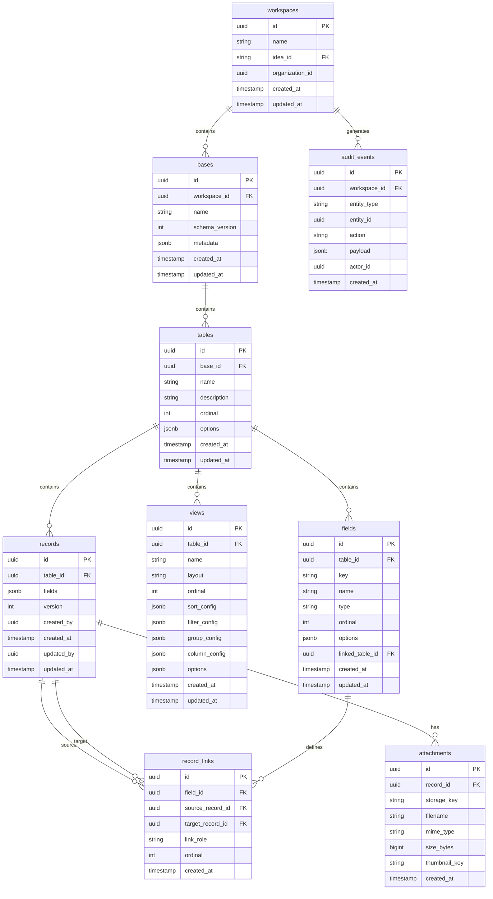
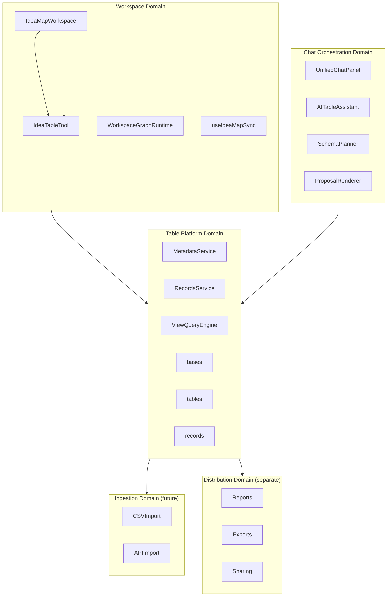
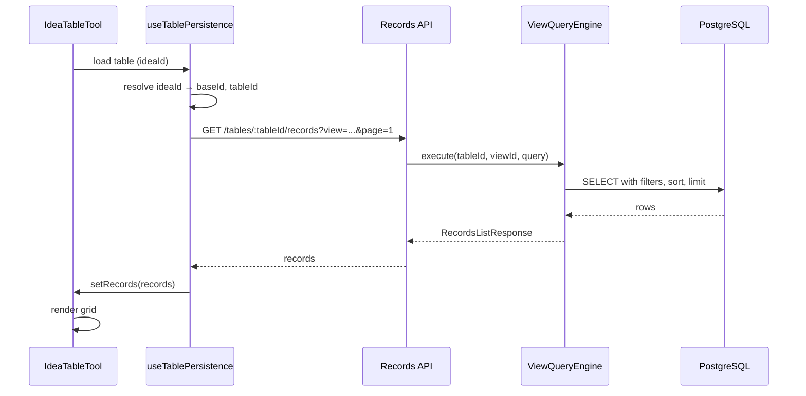
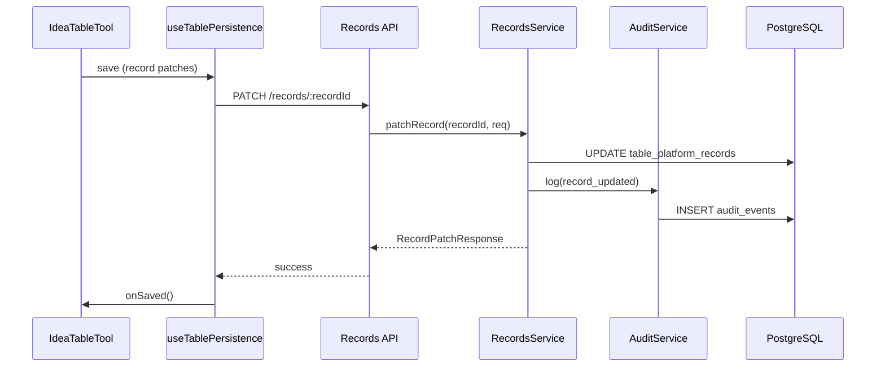
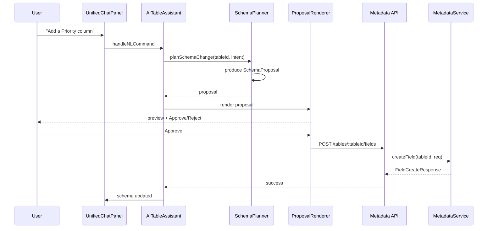
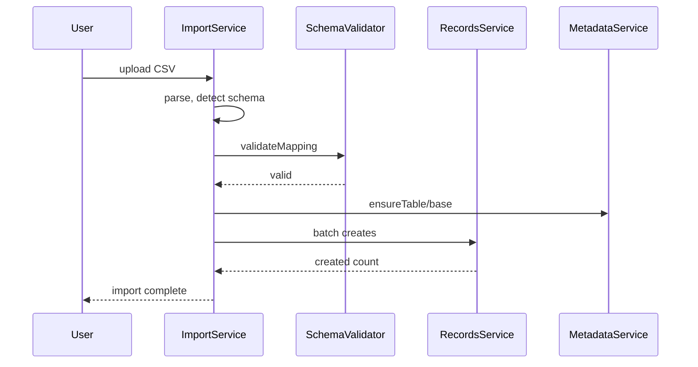
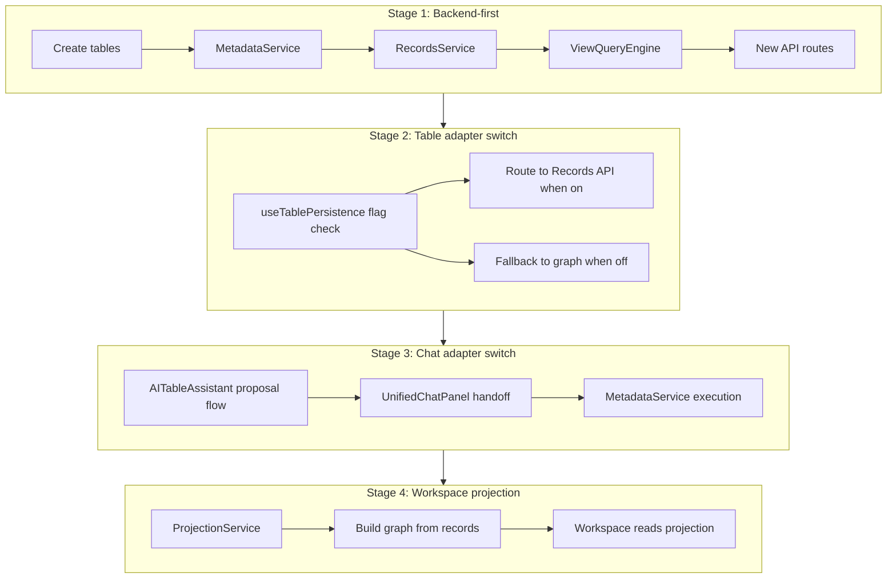
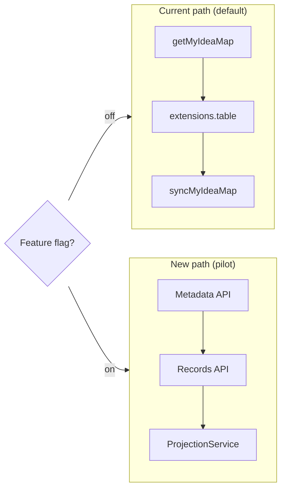

# WS-B: Consultify Table Platform — Architecture & Domain Boundaries

Version: 1.0  
Owner: Engineering  
Status: Draft  
Last updated: 2026-03-15  
Parent program: Consultify Table Platform 90-Day Delivery  
Companion: [WS-A Product Definition](WS_A_PRODUCT_DEFINITION.md)

---

## Executive Summary

This document defines the architecture, domain boundaries, API surface, and migration strategy for the Consultify table platform transition from a **graph-first** model (table data in workspace graph `nodes/edges/extensions.table`) to a **metadata-first** model with first-class backend domain objects.

---

## 1. Architecture Decision Records

### ADR-001: Metadata-first source of truth

| Attribute | Value |
|-----------|-------|
| **Context** | Current table data lives in `my_idea_maps.extensions_json` under `extensions.table` (columns, views, viewState). Rows are graph nodes. No canonical schema or record ownership outside the workspace document. |
| **Decision** | Schema, records, relations, and views become first-class domain objects stored in dedicated PostgreSQL tables. The workspace graph document ceases to be the source of truth for table semantics. |
| **Consequences** | (1) New tables and migrations required. (2) Existing `extensions.table` remains for backward compatibility until adapter switch. (3) Chat and UI must consume metadata API, not graph. (4) Enables server-side views, audit, and relations. |
| **Status** | Accepted (strategic). Implementation pending. |

---

### ADR-002: Graph becomes projection layer

| Attribute | Value |
|-----------|-------|
| **Context** | `IdeaMapWorkspace` and tools (mindmap, table, whiteboard, process_flow) share a unified graph. Table tool renders rows as nodes. Graph is today the durable storage. |
| **Decision** | The graph remains the orchestration surface and UX contract, but table *semantics* (schema, records, relations) are projected from canonical backend data. Graph is read-only for table data when metadata-first is active. |
| **Consequences** | (1) Workspace can still render table tool with nodes/edges for layout. (2) A projection service builds graph fragments from `records`/`record_links`. (3) Writes go to Records API, not graph sync. (4) Mindmap/whiteboard/flow remain graph-first. |
| **Status** | Accepted. Migration Stage 4. |

---

### ADR-003: Server-side query engine mandatory

| Attribute | Value |
|-----------|-------|
| **Context** | `useTableRows.ts` performs filtering, sorting, grouping in client memory. All rows loaded via `getMyIdeaMap` → nodes. Scales poorly beyond ~500 rows. |
| **Decision** | A ViewQueryEngine evaluates filters, sorts, grouping, and pagination on the server. Client requests `GET /tables/:tableId/records?view=...&page=...`. No bulk row load for large tables. |
| **Consequences** | (1) Filter/sort/view parameters in API. (2) Pagination required. (3) `useTableRows` becomes a thin adapter over Records API. (4) Performance and consistency improve. |
| **Status** | Accepted. Required for MVP. |

---

### ADR-004: Separate domain services (not expanding my-work.routes)

| Attribute | Value |
|-----------|-------|
| **Context** | `server/src/routes/my-work.routes.ts` is monolithic: ideas, maps, snapshots, AI actions, exports, presence, etc. Adding table platform here would further bloat it. |
| **Decision** | New table platform APIs live in dedicated route modules (`/api/v1/bases`, `/api/v1/tables`, `/api/v1/records`). Domain logic lives in services (MetadataService, RecordsService, ViewQueryEngine). `my-work.routes` remains a bridge to workspace-specific endpoints; it delegates to table services where appropriate. |
| **Consequences** | (1) Clear separation of concerns. (2) Table platform testable in isolation. (3) `my-work.routes` invokes services, does not embed table logic. (4) Easier to add future v2 APIs. |
| **Status** | Accepted. Implementation rule. |

---

### ADR-005: Feature-flagged rollout

| Attribute | Value |
|-----------|-------|
| **Context** | Switching all users to metadata-first at once risks regressions and blocks rollback. Current workspace flows must remain stable. |
| **Decision** | New table platform is behind feature flags: `table_platform_metadata_first`, `table_platform_records_api`. Pilot users only until MVP criteria met. Default path remains graph-backed. |
| **Consequences** | (1) Adapters check flags before routing. (2) Pilot isolation. (3) Gradual validation. (4) Operational safety. |
| **Status** | Accepted. Rollout constraint. |

---

### ADR-006: Adapter-first migration

| Attribute | Value |
|-----------|-------|
| **Context** | Big-bang replacement would require rewriting `IdeaMapWorkspace`, `IdeaTableTool`, `useTablePersistence`, and all consumers simultaneously. |
| **Decision** | Migration proceeds in four stages: (1) Backend-first — build services and APIs without changing UI. (2) Table adapter switch — `useTablePersistence` routes to Records API when flag on. (3) Chat adapter switch — `AITableAssistant` uses proposal flow. (4) Workspace projection — graph built from canonical data. Each stage is independently shippable. |
| **Consequences** | (1) Longer timeline but lower risk. (2) Reversible at each stage. (3) No forced migration of existing idea maps. (4) Coexistence during transition. |
| **Status** | Accepted. Migration strategy. |

---

## 2. Domain Model

### 2.1 Entity Relationship Diagram



### 2.2 PostgreSQL DDL

```sql
-- =============================================================================
-- Consultify Table Platform — Canonical Schema
-- Version: 1.0 | Target: PostgreSQL 14+
-- =============================================================================

-- Extensions
CREATE EXTENSION IF NOT EXISTS "uuid-ossp";
CREATE EXTENSION IF NOT EXISTS "pgcrypto";

-- -----------------------------------------------------------------------------
-- Workspaces (links to my_ideas / idea_id)
-- -----------------------------------------------------------------------------
CREATE TABLE IF NOT EXISTS table_platform_workspaces (
    id UUID PRIMARY KEY DEFAULT uuid_generate_v4(),
    idea_id TEXT NOT NULL,
    organization_id UUID NOT NULL,
    user_id TEXT NOT NULL,
    name TEXT NOT NULL DEFAULT 'Workspace',
    created_at TIMESTAMPTZ NOT NULL DEFAULT NOW(),
    updated_at TIMESTAMPTZ NOT NULL DEFAULT NOW()
);

CREATE UNIQUE INDEX IF NOT EXISTS ux_table_platform_workspaces_idea
    ON table_platform_workspaces(idea_id);
CREATE INDEX IF NOT EXISTS idx_table_platform_workspaces_org
    ON table_platform_workspaces(organization_id);
CREATE INDEX IF NOT EXISTS idx_table_platform_workspaces_user
    ON table_platform_workspaces(user_id);

-- -----------------------------------------------------------------------------
-- Bases (containers for tables; one per workspace for MVP)
-- -----------------------------------------------------------------------------
CREATE TABLE IF NOT EXISTS table_platform_bases (
    id UUID PRIMARY KEY DEFAULT uuid_generate_v4(),
    workspace_id UUID NOT NULL REFERENCES table_platform_workspaces(id) ON DELETE CASCADE,
    name TEXT NOT NULL DEFAULT 'Base',
    schema_version INTEGER NOT NULL DEFAULT 1,
    metadata JSONB DEFAULT '{}',
    created_at TIMESTAMPTZ NOT NULL DEFAULT NOW(),
    updated_at TIMESTAMPTZ NOT NULL DEFAULT NOW()
);

CREATE INDEX IF NOT EXISTS idx_table_platform_bases_workspace
    ON table_platform_bases(workspace_id);

-- -----------------------------------------------------------------------------
-- Tables
-- -----------------------------------------------------------------------------
CREATE TABLE IF NOT EXISTS table_platform_tables (
    id UUID PRIMARY KEY DEFAULT uuid_generate_v4(),
    base_id UUID NOT NULL REFERENCES table_platform_bases(id) ON DELETE CASCADE,
    name TEXT NOT NULL,
    description TEXT DEFAULT '',
    ordinal INTEGER NOT NULL DEFAULT 0,
    options JSONB DEFAULT '{}',
    created_at TIMESTAMPTZ NOT NULL DEFAULT NOW(),
    updated_at TIMESTAMPTZ NOT NULL DEFAULT NOW()
);

CREATE INDEX IF NOT EXISTS idx_table_platform_tables_base
    ON table_platform_tables(base_id);

-- -----------------------------------------------------------------------------
-- Fields (column definitions)
-- -----------------------------------------------------------------------------
CREATE TABLE IF NOT EXISTS table_platform_fields (
    id UUID PRIMARY KEY DEFAULT uuid_generate_v4(),
    table_id UUID NOT NULL REFERENCES table_platform_tables(id) ON DELETE CASCADE,
    key TEXT NOT NULL,
    name TEXT NOT NULL,
    type TEXT NOT NULL,
    ordinal INTEGER NOT NULL DEFAULT 0,
    options JSONB DEFAULT '{}',
    linked_table_id UUID REFERENCES table_platform_tables(id) ON DELETE SET NULL,
    created_at TIMESTAMPTZ NOT NULL DEFAULT NOW(),
    updated_at TIMESTAMPTZ NOT NULL DEFAULT NOW(),
    UNIQUE(table_id, key)
);

CREATE INDEX IF NOT EXISTS idx_table_platform_fields_table
    ON table_platform_fields(table_id);
CREATE INDEX IF NOT EXISTS idx_table_platform_fields_linked
    ON table_platform_fields(linked_table_id);

-- -----------------------------------------------------------------------------
-- Views (saved views with sort/filter/group/column config)
-- -----------------------------------------------------------------------------
CREATE TABLE IF NOT EXISTS table_platform_views (
    id UUID PRIMARY KEY DEFAULT uuid_generate_v4(),
    table_id UUID NOT NULL REFERENCES table_platform_tables(id) ON DELETE CASCADE,
    name TEXT NOT NULL,
    layout TEXT NOT NULL DEFAULT 'table',
    ordinal INTEGER NOT NULL DEFAULT 0,
    sort_config JSONB DEFAULT '[]',
    filter_config JSONB DEFAULT '{"logic":"and","rules":[]}',
    group_config JSONB DEFAULT '{}',
    column_config JSONB DEFAULT '[]',
    options JSONB DEFAULT '{}',
    created_at TIMESTAMPTZ NOT NULL DEFAULT NOW(),
    updated_at TIMESTAMPTZ NOT NULL DEFAULT NOW()
);

CREATE INDEX IF NOT EXISTS idx_table_platform_views_table
    ON table_platform_views(table_id);

-- -----------------------------------------------------------------------------
-- Records (row data; fields as JSONB for flexibility)
-- -----------------------------------------------------------------------------
CREATE TABLE IF NOT EXISTS table_platform_records (
    id UUID PRIMARY KEY DEFAULT uuid_generate_v4(),
    table_id UUID NOT NULL REFERENCES table_platform_tables(id) ON DELETE CASCADE,
    fields JSONB NOT NULL DEFAULT '{}',
    version INTEGER NOT NULL DEFAULT 1,
    created_by UUID,
    created_at TIMESTAMPTZ NOT NULL DEFAULT NOW(),
    updated_by UUID,
    updated_at TIMESTAMPTZ NOT NULL DEFAULT NOW()
);

CREATE INDEX IF NOT EXISTS idx_table_platform_records_table
    ON table_platform_records(table_id);
CREATE INDEX IF NOT EXISTS idx_table_platform_records_updated
    ON table_platform_records(table_id, updated_at DESC);
CREATE INDEX IF NOT EXISTS idx_table_platform_records_fields_gin
    ON table_platform_records USING GIN (fields);

-- -----------------------------------------------------------------------------
-- Attachments (file metadata; blob in S3 or similar)
-- -----------------------------------------------------------------------------
CREATE TABLE IF NOT EXISTS table_platform_attachments (
    id UUID PRIMARY KEY DEFAULT uuid_generate_v4(),
    record_id UUID NOT NULL REFERENCES table_platform_records(id) ON DELETE CASCADE,
    storage_key TEXT NOT NULL,
    filename TEXT NOT NULL,
    mime_type TEXT,
    size_bytes BIGINT,
    thumbnail_key TEXT,
    created_at TIMESTAMPTZ NOT NULL DEFAULT NOW()
);

CREATE INDEX IF NOT EXISTS idx_table_platform_attachments_record
    ON table_platform_attachments(record_id);

-- -----------------------------------------------------------------------------
-- Record Links (linked record relations)
-- -----------------------------------------------------------------------------
CREATE TABLE IF NOT EXISTS table_platform_record_links (
    id UUID PRIMARY KEY DEFAULT uuid_generate_v4(),
    field_id UUID NOT NULL REFERENCES table_platform_fields(id) ON DELETE CASCADE,
    source_record_id UUID NOT NULL REFERENCES table_platform_records(id) ON DELETE CASCADE,
    target_record_id UUID NOT NULL REFERENCES table_platform_records(id) ON DELETE CASCADE,
    link_role TEXT DEFAULT 'ref',
    ordinal INTEGER NOT NULL DEFAULT 0,
    created_at TIMESTAMPTZ NOT NULL DEFAULT NOW(),
    UNIQUE(field_id, source_record_id, target_record_id)
);

CREATE INDEX IF NOT EXISTS idx_table_platform_record_links_field
    ON table_platform_record_links(field_id);
CREATE INDEX IF NOT EXISTS idx_table_platform_record_links_source
    ON table_platform_record_links(source_record_id);
CREATE INDEX IF NOT EXISTS idx_table_platform_record_links_target
    ON table_platform_record_links(target_record_id);

-- -----------------------------------------------------------------------------
-- Audit Events (schema and record mutation log)
-- -----------------------------------------------------------------------------
CREATE TABLE IF NOT EXISTS table_platform_audit_events (
    id UUID PRIMARY KEY DEFAULT uuid_generate_v4(),
    workspace_id UUID REFERENCES table_platform_workspaces(id) ON DELETE SET NULL,
    entity_type TEXT NOT NULL,
    entity_id UUID NOT NULL,
    action TEXT NOT NULL,
    payload JSONB DEFAULT '{}',
    actor_id UUID,
    created_at TIMESTAMPTZ NOT NULL DEFAULT NOW()
);

CREATE INDEX IF NOT EXISTS idx_table_platform_audit_workspace
    ON table_platform_audit_events(workspace_id);
CREATE INDEX IF NOT EXISTS idx_table_platform_audit_entity
    ON table_platform_audit_events(entity_type, entity_id);
CREATE INDEX IF NOT EXISTS idx_table_platform_audit_created
    ON table_platform_audit_events(created_at DESC);
```

---

## 3. API Surface Design

### 3.1 Metadata API Endpoints

| Method | Path | Description |
|--------|------|-------------|
| POST | `/api/v1/bases` | Create base |
| GET | `/api/v1/bases/:baseId` | Get base |
| POST | `/api/v1/bases/:baseId/tables` | Create table |
| PATCH | `/api/v1/tables/:tableId` | Update table |
| POST | `/api/v1/tables/:tableId/fields` | Create field |
| PATCH | `/api/v1/fields/:fieldId` | Update field |
| POST | `/api/v1/tables/:tableId/views` | Create view |
| PATCH | `/api/v1/views/:viewId` | Update view |

### 3.2 Records API Endpoints

| Method | Path | Description |
|--------|------|-------------|
| GET | `/api/v1/tables/:tableId/records` | List records (filter/sort/pagination/view) |
| POST | `/api/v1/tables/:tableId/records` | Create record |
| PATCH | `/api/v1/records/:recordId` | Update record |
| DELETE | `/api/v1/records/:recordId` | Delete record |
| POST | `/api/v1/tables/:tableId/records/batch` | Batch create/update/delete |

### 3.3 TypeScript Request/Response Interfaces

```typescript
// -----------------------------------------------------------------------------
// Base
// -----------------------------------------------------------------------------
interface BaseCreateRequest {
  workspaceId: string;
  name?: string;
}

interface BaseCreateResponse {
  id: string;
  workspaceId: string;
  name: string;
  schemaVersion: number;
  metadata: Record<string, unknown>;
  createdAt: string;
  updatedAt: string;
}

interface BaseGetResponse extends BaseCreateResponse {}

// -----------------------------------------------------------------------------
// Table
// -----------------------------------------------------------------------------
interface TableCreateRequest {
  name: string;
  description?: string;
  ordinal?: number;
  options?: Record<string, unknown>;
}

interface TableCreateResponse {
  id: string;
  baseId: string;
  name: string;
  description: string;
  ordinal: number;
  options: Record<string, unknown>;
  createdAt: string;
  updatedAt: string;
}

interface TablePatchRequest {
  name?: string;
  description?: string;
  ordinal?: number;
  options?: Record<string, unknown>;
}

// -----------------------------------------------------------------------------
// Field
// -----------------------------------------------------------------------------
type FieldType =
  | 'text' | 'long_text' | 'number' | 'currency' | 'percent'
  | 'checkbox' | 'date' | 'single_select' | 'multi_select'
  | 'url' | 'email' | 'phone' | 'attachment' | 'linked_record'
  | 'created_time' | 'created_by' | 'last_modified_time' | 'last_modified_by';

interface FieldCreateRequest {
  key: string;
  name: string;
  type: FieldType;
  ordinal?: number;
  options?: Record<string, unknown>;
  linkedTableId?: string;
}

interface FieldCreateResponse {
  id: string;
  tableId: string;
  key: string;
  name: string;
  type: FieldType;
  ordinal: number;
  options: Record<string, unknown>;
  linkedTableId: string | null;
  createdAt: string;
  updatedAt: string;
}

interface FieldPatchRequest {
  name?: string;
  type?: FieldType;
  ordinal?: number;
  options?: Record<string, unknown>;
  linkedTableId?: string | null;
}

// -----------------------------------------------------------------------------
// View
// -----------------------------------------------------------------------------
interface SortConfigItem {
  fieldId: string;
  direction: 'asc' | 'desc';
}

interface FilterRule {
  id: string;
  fieldId: string;
  operator: string;
  value: unknown;
}

interface FilterGroup {
  logic: 'and' | 'or';
  rules: FilterRule[];
}

interface ViewCreateRequest {
  name: string;
  layout?: 'table' | 'kanban' | 'timeline' | 'calendar' | 'matrix' | 'grid';
  ordinal?: number;
  sortConfig?: SortConfigItem[];
  filterConfig?: FilterGroup;
  groupConfig?: Record<string, unknown>;
  columnConfig?: Array<{ fieldId: string; visible: boolean; width: number }>;
  options?: Record<string, unknown>;
}

interface ViewCreateResponse {
  id: string;
  tableId: string;
  name: string;
  layout: string;
  ordinal: number;
  sortConfig: SortConfigItem[];
  filterConfig: FilterGroup;
  groupConfig: Record<string, unknown>;
  columnConfig: Array<{ fieldId: string; visible: boolean; width: number }>;
  options: Record<string, unknown>;
  createdAt: string;
  updatedAt: string;
}

interface ViewPatchRequest {
  name?: string;
  layout?: string;
  ordinal?: number;
  sortConfig?: SortConfigItem[];
  filterConfig?: FilterGroup;
  groupConfig?: Record<string, unknown>;
  columnConfig?: Array<{ fieldId: string; visible: boolean; width: number }>;
  options?: Record<string, unknown>;
}

// -----------------------------------------------------------------------------
// Records
// -----------------------------------------------------------------------------
interface RecordsListQuery {
  viewId?: string;
  filter?: FilterGroup;
  sort?: SortConfigItem[];
  fields?: string[];
  page?: number;
  pageSize?: number;
}

interface RecordsListResponse {
  records: Array<{
    id: string;
    tableId: string;
    fields: Record<string, unknown>;
    version: number;
    createdBy: string | null;
    createdAt: string;
    updatedBy: string | null;
    updatedAt: string;
  }>;
  total: number;
  page: number;
  pageSize: number;
}

interface RecordCreateRequest {
  fields: Record<string, unknown>;
}

interface RecordCreateResponse {
  id: string;
  tableId: string;
  fields: Record<string, unknown>;
  version: number;
  createdBy: string | null;
  createdAt: string;
  updatedBy: string | null;
  updatedAt: string;
}

interface RecordPatchRequest {
  fields: Record<string, unknown>;
}

interface RecordPatchResponse extends RecordCreateResponse {}

interface BatchRecordsRequest {
  creates?: Array<{ fields: Record<string, unknown> }>;
  updates?: Array<{ id: string; fields: Record<string, unknown> }>;
  deletes?: string[];
}

interface BatchRecordsResponse {
  created: RecordCreateResponse[];
  updated: RecordPatchResponse[];
  deleted: string[];
  errors: Array<{ index: number; code: string; message: string }>;
}
```

---

## 4. Service Architecture

### 4.1 Service Responsibilities

| Service | Responsibility | Dependencies |
|---------|----------------|--------------|
| **MetadataService** | CRUD for bases, tables, fields, views. Schema validation. | Database, SchemaValidationService |
| **RecordsService** | CRUD for records. Batch operations. Field validation. | Database, SchemaValidationService, AuditService |
| **ViewQueryEngine** | Evaluate view filters, sorts, grouping. Pagination. | Database, MetadataService |
| **AuditService** | Log schema and record mutations. Query audit trail. | Database |
| **AttachmentService** | Upload, store, serve file metadata. Presigned URLs for S3. | Database, S3 |
| **RelationService** | Manage record_links. Resolve linked records, counts, lookups. | Database, RecordsService |
| **SchemaValidationService** | Validate field types, options, reserved keys. Validate proposals. | — |

### 4.2 Service Interfaces

```typescript
interface IMetadataService {
  createBase(req: BaseCreateRequest): Promise<BaseCreateResponse>;
  getBase(baseId: string): Promise<BaseGetResponse>;
  createTable(baseId: string, req: TableCreateRequest): Promise<TableCreateResponse>;
  patchTable(tableId: string, req: TablePatchRequest): Promise<TableCreateResponse>;
  createField(tableId: string, req: FieldCreateRequest): Promise<FieldCreateResponse>;
  patchField(fieldId: string, req: FieldPatchRequest): Promise<FieldCreateResponse>;
  createView(tableId: string, req: ViewCreateRequest): Promise<ViewCreateResponse>;
  patchView(viewId: string, req: ViewPatchRequest): Promise<ViewCreateResponse>;
}

interface IRecordsService {
  listRecords(tableId: string, query: RecordsListQuery): Promise<RecordsListResponse>;
  createRecord(tableId: string, req: RecordCreateRequest): Promise<RecordCreateResponse>;
  getRecord(recordId: string): Promise<RecordCreateResponse>;
  patchRecord(recordId: string, req: RecordPatchRequest): Promise<RecordPatchResponse>;
  deleteRecord(recordId: string): Promise<void>;
  batch(tableId: string, req: BatchRecordsRequest): Promise<BatchRecordsResponse>;
}

interface IViewQueryEngine {
  execute(
    tableId: string,
    viewId: string | null,
    query: RecordsListQuery
  ): Promise<RecordsListResponse>;
}

interface IAuditService {
  log(evt: AuditEvent): Promise<void>;
  query(workspaceId: string, opts?: AuditQueryOpts): Promise<AuditEvent[]>;
}

interface IAttachmentService {
  create(recordId: string, file: UploadedFile): Promise<Attachment>;
  list(recordId: string): Promise<Attachment[]>;
  getPresignedUrl(attachmentId: string): Promise<string>;
  delete(attachmentId: string): Promise<void>;
}

interface IRelationService {
  addLink(fieldId: string, sourceRecordId: string, targetRecordId: string): Promise<void>;
  removeLink(fieldId: string, sourceRecordId: string, targetRecordId: string): Promise<void>;
  getLinkedRecords(fieldId: string, sourceRecordId: string): Promise<Record[]>;
  getLinkedCount(fieldId: string, sourceRecordId: string): Promise<number>;
}
```

---

## 5. Domain Boundaries

### 5.1 Boundary Map



### 5.2 Domain Contracts

| Domain | Owns | Depends On | Boundary Rule |
|--------|------|------------|----------------|
| **Workspace Domain** | Tool orchestration, panel state, selection, graph layout | Table Platform (reads), Chat (launch) | Does not own table schema or records. Renders what Table Platform returns. |
| **Table Platform Domain** | Schema, records, views, relations, audit | Workspace (idea_id context) | Does not know about mindmap/whiteboard. Receives workspace/idea context for auth. |
| **Chat Orchestration Domain** | Intent, proposals, approval UX | Table Platform (mutations) | Never mutates schema without proposal + approval. Uses MetadataService for execution. |
| **Ingestion Domain** | CSV/API import, mapping | Table Platform (records) | Writes to RecordsService. Future scope. |
| **Distribution Domain** | Reports, exports, sharing | Table Platform (reads) | Read-only consumption. Separate module. |

---

## 6. Integration Points and Adapters

### 6.1 Current File → New Architecture Mapping

| Current File | Role | Adapter Behavior |
|--------------|------|------------------|
| `useTablePersistence.ts` | Serializes table into `extensions.table`; loads via `getMyIdeaMap` | **Adapter:** When `table_platform_metadata_first` on: (1) Load via `GET /tables/:tableId/records` + Metadata API. (2) Save via `RecordsService` + MetadataService. (3) Build `extensions.table` for projection mode. When off: current behavior. |
| `useTableRows.ts` | Client-side filter/sort/group on `nodes` | **Adapter:** When metadata-first: receives `records` from API; filtering/sorting done server-side. Local state for selection, templates, reorder only. |
| `my-work.routes.ts` | Monolithic workspace routes | **Adapter:** New `/api/v1/bases`, `/api/v1/tables`, `/api/v1/records` live in separate route files. `my-work.routes` keeps `getMyIdeaMap`/`syncMyIdeaMap` for graph. Optional: resolve `idea_id` → `base_id` and delegate to table services for table-specific endpoints. |
| `IdeaMapWorkspace.tsx` | Workspace orchestrator | **Adapter:** No change to orchestration. `IdeaTableTool` is the integration point. Workspace continues to pass `ideaId`, `refreshToken`, `onSelectionChange`. Table tool internally switches persistence based on feature flag. |
| `IdeaTableTool` | Table UI container | **Adapter:** Uses `useTablePersistence` (which switches implementation). Renders rows from either nodes (graph) or records (API). Same UI contract. |
| `AITableAssistant.tsx` | NL table commands | **Adapter:** Evolves to produce `SchemaProposal` objects. On approval, calls MetadataService/RecordsService. Replaces direct graph patches. |
| `workspaceGraphRuntime.ts` | Graph sync | **Adapter:** For table tool in metadata-first mode: projection service builds graph fragment from records. `captureToolGraph` can no-op for table data (writes go to Records API). |
| `ideaWorkspaceGraph.validators.ts` | Graph schema validation | **Adapter:** Continues validating graph shape. When projection active, projected table nodes still conform to graph schema. Table schema validated by SchemaValidationService. |

---

## 7. Data Flow Diagrams

### 7.1 Read Flow (metadata-first)



### 7.2 Write Flow (metadata-first)



### 7.3 Chat Flow (proposal → execution)



### 7.4 Import Flow (future)



---

## 8. Technology Decisions

| Decision | Choice | Rationale |
|----------|--------|-----------|
| **Primary database** | PostgreSQL 14+ | Already used. JSONB for flexible `fields`. GIN indexes for field searches. ACID. |
| **JSON column strategy** | `records.fields` as JSONB | Schema evolution without ALTER. Field types validated in app layer. GIN for ad-hoc filter. |
| **Caching** | Redis (optional) | View query result cache, session, rate limiting. Not required for MVP. |
| **File storage** | S3-compatible (e.g. Cloudflare R2, MinIO) | Presigned URLs. `attachments.storage_key` references object. |
| **Feature flags** | Environment-based or LaunchDarkly-style | `TABLE_PLATFORM_METADATA_FIRST`, `TABLE_PLATFORM_RECORDS_API`. Per-org or per-user overrides for pilot. |
| **Observability** | OpenTelemetry | Spans for service calls, DB queries. Traces across read/write flows. |
| **API versioning** | `/api/v1/` prefix | Allows v2 without breaking v1 consumers. |

---

## 9. Security Architecture

### 9.1 Authentication

- All `/api/v1/` endpoints require authenticated session (existing Consultify auth).
- JWT or session cookie. User identity from `currentUser.id`.

### 9.2 Authorization

| Resource | Rule |
|----------|------|
| Workspace | User must have access to `idea_id` (via `my_ideas` / org membership). |
| Base | Resolved from workspace. Same check. |
| Table, Field, View | Inherit from base. |
| Record | User must have access to table's base. |
| Attachment | User must have access to record. |

Authorization service: `canAccessWorkspace(userId, ideaId)`, `canAccessBase(userId, baseId)`, etc. Reuse existing Consultify org/workspace checks.

### 9.3 API Tokens

- MVP: session-based only. No long-lived API tokens.
- Future: service accounts / API keys for integrations. Stored hashed. Scoped to workspace or org.

### 9.4 Audit

- Every schema mutation (create/update field, table, view) logged to `table_platform_audit_events`.
- Every record create/update/delete logged.
- Payload includes: entity type, entity id, action, actor, before/after for sensitive changes.
- Retention policy: configurable (e.g. 90 days for record events, indefinite for schema).

### 9.5 Data Isolation

- `organization_id` on workspace. All downstream resources filter by org.
- Row-level: no cross-org data leakage. Queries always scoped by `organization_id` or `workspace_id`.

---

## 10. Migration Architecture

### 10.1 Four-Stage Adapter Migration



### 10.2 Stage Details

| Stage | Deliverables | Gate |
|-------|--------------|------|
| **1. Backend-first** | DDL applied, MetadataService, RecordsService, ViewQueryEngine, AuditService, `/api/v1/*` routes, integration tests | APIs return correct data for manual calls |
| **2. Table adapter switch** | Feature flag, `useTablePersistence` branch to Records API when on, IdeaTableTool renders API records | Table tool works with metadata-first for pilot users |
| **3. Chat adapter switch** | AITableAssistant produces proposals, approval UX, MetadataService execution | Chat can add column via proposal flow |
| **4. Workspace projection** | ProjectionService builds graph from records for mindmap/context, optional graph sync for backward compat | Workspace sees table data as graph when needed |

### 10.3 Coexistence Model



- **No big-bang migration.** Existing `my_idea_maps` untouched. New workspaces or pilot-opted ideas use metadata-first.
- **Selective projection.** When workspace needs graph for table tool (e.g. kanban layout), ProjectionService builds it from records.
- **Reversibility.** Flag off → back to graph. Data in new tables remains for future migration.

---

## Appendix A: Field Type Reference

MVP field types aligned with `tableTypes.ts`:

| Type | Storage | Validation |
|------|---------|------------|
| text | string | max length |
| long_text | string | max length |
| number | number | numeric |
| currency | number | + currency code |
| percent | number | 0-100 |
| checkbox | boolean | — |
| date | ISO string | date parse |
| single_select | string | in options |
| multi_select | string[] | in options |
| url | string | URL format |
| email | string | email format |
| phone | string | — |
| attachment | ref to attachments | — |
| linked_record | ref to record_links | valid target |
| created_time | auto | — |
| created_by | auto | — |
| last_modified_time | auto | — |
| last_modified_by | auto | — |

---

## Appendix B: Document History

| Version | Date | Author | Changes |
|---------|------|--------|---------|
| 1.0 | 2026-03-15 | Engineering | Initial architecture and domain boundaries specification |
