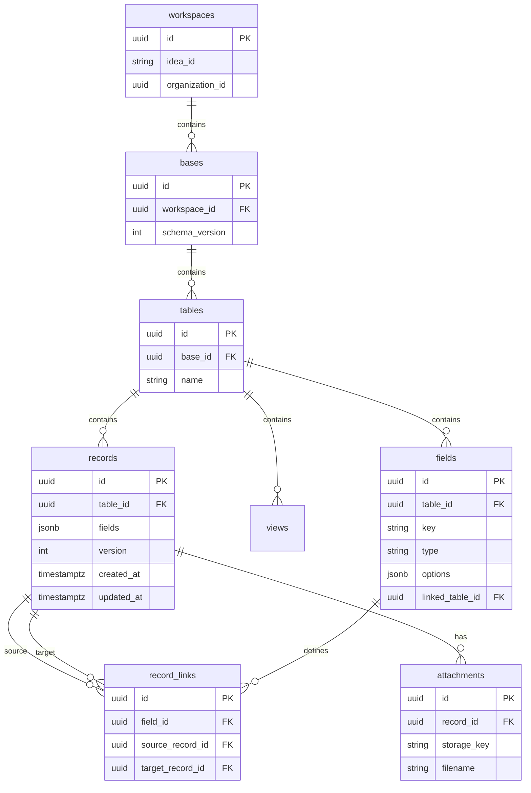

# WS-C: Consultify Table Platform Core — Technical Specification

Version: 1.0  
Owner: Engineering  
Status: Draft  
Last updated: 2026-03-15  
Parent program: Consultify Table Platform 90-Day Delivery  
Companion: [WS-B Architecture & Boundaries](WS_B_ARCHITECTURE_BOUNDARIES.md), [WS-A Product Definition](WS_A_PRODUCT_DEFINITION.md)

---

## Executive Summary

This document defines the complete technical specification for the Table Platform Core — the metadata-first backend with PostgreSQL and JSONB record storage. It covers the field type system, record storage model, view query engine, relations, attachments, audit trail, batch operations, schema versioning, import/export, and performance requirements.

**Target:** Production-grade implementation. No placeholders.

---

## Table of Contents

1. [Field Type System](#1-field-type-system)
2. [Record Storage Model](#2-record-storage-model)
3. [View Query Engine](#3-view-query-engine)
4. [Relation Model](#4-relation-model)
5. [Attachment Model](#5-attachment-model)
6. [Audit Trail Model](#6-audit-trail-model)
7. [Batch Operations](#7-batch-operations)
8. [Schema Versioning](#8-schema-versioning)
9. [Import/Export](#9-importexport)
10. [Performance Requirements](#10-performance-requirements)

---

## 1. Field Type System

### 1.1 Type Overview

| # | Type Identifier | Category | Storage | Editable |
|---|-----------------|----------|---------|----------|
| 1 | `singleLineText` | Primitive | string | Yes |
| 2 | `longText` | Primitive | string | Yes |
| 3 | `number` | Primitive | number | Yes |
| 4 | `currency` | Primitive | number | Yes |
| 5 | `percent` | Primitive | number | Yes |
| 6 | `checkbox` | Primitive | boolean | Yes |
| 7 | `date` | Primitive | string (ISO) | Yes |
| 8 | `singleSelect` | Primitive | string | Yes |
| 9 | `multiSelect` | Primitive | string[] | Yes |
| 10 | `url` | Primitive | string | Yes |
| 11 | `email` | Primitive | string | Yes |
| 12 | `phone` | Primitive | string | Yes |
| 13 | `attachment` | Primitive | string[] | Yes |
| 14 | `linkedRecord` | Relation | string[] (record IDs) | Yes |
| 15 | `count` | Computed | number | No |
| 16 | `lookup` | Computed | varies | No |
| 17 | `rollup` | Computed | number/string | No |
| 18 | `createdTime` | Auto | string (ISO) | No |
| 19 | `createdBy` | Auto | string (user ID) | No |
| 20 | `lastModifiedTime` | Auto | string (ISO) | No |
| 21 | `lastModifiedBy` | Auto | string (user ID) | No |
| 22 | `autoNumber` | Auto | number | No |

### 1.2 Complete Field Type Specifications

#### 1.2.1 singleLineText

| Attribute | Value |
|-----------|-------|
| **Type identifier** | `singleLineText` |
| **JSONB storage** | `string` |
| **Options schema** | `SingleLineTextOptions` |
| **Validation rules** | `length <= 10000`, `typeof value === 'string'` |
| **Display hints** | `maxLength`, `placeholder` |
| **Sort behavior** | Lexicographic, collation `und` (Unicode default) |
| **Filter operators** | `contains`, `doesNotContain`, `equals`, `notEquals`, `isEmpty`, `isNotEmpty`, `startsWith`, `endsWith` |
| **Empty value** | `null` or `""` (both treated as empty) |

```typescript
interface SingleLineTextOptions {
  maxLength?: number;       // default 10000, max 10000
  placeholder?: string;     // UI hint, max 200 chars
}
```

#### 1.2.2 longText

| Attribute | Value |
|-----------|-------|
| **Type identifier** | `longText` |
| **JSONB storage** | `string` (supports markdown) |
| **Options schema** | `LongTextOptions` |
| **Validation rules** | `length <= 100000`, `typeof value === 'string'` |
| **Display hints** | `format: 'plain' | 'markdown'`, `placeholder` |
| **Sort behavior** | Lexicographic; sorts by first 500 chars for performance |
| **Filter operators** | `contains`, `doesNotContain`, `equals`, `isEmpty`, `isNotEmpty` |
| **Empty value** | `null` or `""` |

```typescript
interface LongTextOptions {
  maxLength?: number;       // default 100000, max 100000
  format?: 'plain' | 'markdown';
  placeholder?: string;
}
```

#### 1.2.3 number

| Attribute | Value |
|-----------|-------|
| **Type identifier** | `number` |
| **JSONB storage** | `number` (integer or float) |
| **Options schema** | `NumberOptions` |
| **Validation rules** | `!Number.isNaN(value)`, precision constraints |
| **Display hints** | `precision`, `thousandSeparator`, `decimalSeparator` |
| **Sort behavior** | Numeric |
| **Filter operators** | `equals`, `notEquals`, `gt`, `gte`, `lt`, `lte`, `isEmpty`, `isNotEmpty` |
| **Empty value** | `null` |

```typescript
interface NumberOptions {
  precision?: number;       // decimal places, 0-10
  format?: 'integer' | 'decimal' | 'scientific';
  min?: number;
  max?: number;
  thousandSeparator?: string;  // default ','
  decimalSeparator?: string;   // default '.'
}
```

#### 1.2.4 currency

| Attribute | Value |
|-----------|-------|
| **Type identifier** | `currency` |
| **JSONB storage** | `number` (amount in base unit, e.g. cents) |
| **Options schema** | `CurrencyOptions` |
| **Validation rules** | `!Number.isNaN(value)`, valid ISO 4217 code |
| **Display hints** | `currency`, `locale`, `symbolPosition` |
| **Sort behavior** | Numeric |
| **Filter operators** | `equals`, `notEquals`, `gt`, `gte`, `lt`, `lte`, `isEmpty`, `isNotEmpty` |
| **Empty value** | `null` |

```typescript
interface CurrencyOptions {
  currency: string;         // ISO 4217, e.g. 'USD', 'PLN', 'EUR'
  locale?: string;          // BCP 47, e.g. 'en-US', 'pl-PL'
  precision?: number;       // 0-4
  symbolPosition?: 'prefix' | 'suffix';
}
```

#### 1.2.5 percent

| Attribute | Value |
|-----------|-------|
| **Type identifier** | `percent` |
| **JSONB storage** | `number` (0-100 or 0-1 depending on options) |
| **Options schema** | `PercentOptions` |
| **Validation rules** | `!Number.isNaN(value)`, `0 <= value <= 100` (if `format === 'percent')` |
| **Display hints** | `format`, `precision` |
| **Sort behavior** | Numeric |
| **Filter operators** | `equals`, `notEquals`, `gt`, `gte`, `lt`, `lte`, `isEmpty`, `isNotEmpty` |
| **Empty value** | `null` |

```typescript
interface PercentOptions {
  format?: 'percent' | 'decimal';  // percent: 0-100, decimal: 0-1
  precision?: number;               // 0-4
}
```

#### 1.2.6 checkbox

| Attribute | Value |
|-----------|-------|
| **Type identifier** | `checkbox` |
| **JSONB storage** | `boolean` |
| **Options schema** | `CheckboxOptions` |
| **Validation rules** | `typeof value === 'boolean'` |
| **Display hints** | `trueLabel`, `falseLabel` |
| **Sort behavior** | `false < true` |
| **Filter operators** | `is` (value: true/false) |
| **Empty value** | `false` treated as "unchecked"; `null` as empty |

```typescript
interface CheckboxOptions {
  trueLabel?: string;       // max 50 chars
  falseLabel?: string;      // max 50 chars
}
```

#### 1.2.7 date

| Attribute | Value |
|-----------|-------|
| **Type identifier** | `date` |
| **JSONB storage** | `string` (ISO 8601: `YYYY-MM-DD` or `YYYY-MM-DDTHH:mm:ss.sssZ`) |
| **Options schema** | `DateOptions` |
| **Validation rules** | Valid ISO date/datetime parse |
| **Display hints** | `includeTime`, `timezone`, `format` |
| **Sort behavior** | Chronological |
| **Filter operators** | `is`, `isBefore`, `isAfter`, `isOnOrBefore`, `isOnOrAfter`, `isWithin`, `isEmpty`, `isNotEmpty` |
| **Empty value** | `null` |

```typescript
interface DateOptions {
  includeTime?: boolean;    // default false → date only
  timezone?: string;       // IANA, e.g. 'Europe/Warsaw', default UTC
  format?: string;         // display format, e.g. 'DD/MM/YYYY'
}
```

#### 1.2.8 singleSelect

| Attribute | Value |
|-----------|-------|
| **Type identifier** | `singleSelect` |
| **JSONB storage** | `string` (option value) |
| **Options schema** | `SingleSelectOptions` |
| **Validation rules** | `value in options` or `null` |
| **Display hints** | `options`, `optionColors`, `allowCustom` |
| **Sort behavior** | By option ordinal, then lexicographic |
| **Filter operators** | `is`, `isNot`, `isAnyOf`, `isNoneOf`, `isEmpty`, `isNotEmpty` |
| **Empty value** | `null` |

```typescript
interface SingleSelectOptions {
  options: Array<{ id: string; value: string; color?: string }>;
  allowCustom?: boolean;    // allow values not in predefined list
  optionColors?: Record<string, string>;  // value → hex color
}
```

#### 1.2.9 multiSelect

| Attribute | Value |
|-----------|-------|
| **Type identifier** | `multiSelect` |
| **JSONB storage** | `string[]` |
| **Options schema** | `MultiSelectOptions` |
| **Validation rules** | `Array.isArray(value)`, `every(v => options.includes(v))` if !allowCustom |
| **Display hints** | `options`, `optionColors`, `allowCustom`, `maxSelections` |
| **Sort behavior** | By first selected value ordinal; nulls last |
| **Filter operators** | `contains`, `doesNotContain`, `isAnyOf`, `isEmpty`, `isNotEmpty` |
| **Empty value** | `null` or `[]` |

```typescript
interface MultiSelectOptions {
  options: Array<{ id: string; value: string; color?: string }>;
  allowCustom?: boolean;
  optionColors?: Record<string, string>;
  maxSelections?: number;   // default 50
}
```

#### 1.2.10 url

| Attribute | Value |
|-----------|-------|
| **Type identifier** | `url` |
| **JSONB storage** | `string` |
| **Options schema** | `UrlOptions` |
| **Validation rules** | Valid URL per `URL` constructor (http/https/mailto) |
| **Display hints** | `displayAsLink` |
| **Sort behavior** | Lexicographic |
| **Filter operators** | `equals`, `notEquals`, `contains`, `isEmpty`, `isNotEmpty` |
| **Empty value** | `null` or `""` |

```typescript
interface UrlOptions {
  displayAsLink?: boolean;  // default true
  allowedSchemes?: string[];  // default ['http','https','mailto']
}
```

#### 1.2.11 email

| Attribute | Value |
|-----------|-------|
| **Type identifier** | `email` |
| **JSONB storage** | `string` |
| **Options schema** | `EmailOptions` |
| **Validation rules** | RFC 5322 basic validation (regex + length) |
| **Display hints** | `displayAsLink` (mailto:) |
| **Sort behavior** | Lexicographic |
| **Filter operators** | `equals`, `notEquals`, `contains`, `isEmpty`, `isNotEmpty` |
| **Empty value** | `null` or `""` |

```typescript
interface EmailOptions {
  displayAsLink?: boolean;  // default true
}
```

#### 1.2.12 phone

| Attribute | Value |
|-----------|-------|
| **Type identifier** | `phone` |
| **JSONB storage** | `string` |
| **Options schema** | `PhoneOptions` |
| **Validation rules** | E.164 optional; max 30 chars |
| **Display hints** | `format`, `countryCode` |
| **Sort behavior** | Lexicographic |
| **Filter operators** | `contains`, `equals`, `isEmpty`, `isNotEmpty` |
| **Empty value** | `null` or `""` |

```typescript
interface PhoneOptions {
  format?: 'e164' | 'national' | 'international';
  countryCode?: string;     // default region, e.g. 'PL'
}
```

#### 1.2.13 attachment

| Attribute | Value |
|-----------|-------|
| **Type identifier** | `attachment` |
| **JSONB storage** | `string[]` (attachment IDs) |
| **Options schema** | `AttachmentOptions` |
| **Validation rules** | `Array.isArray(value)`, `every(id => isValidAttachmentId)` |
| **Display hints** | `acceptMimeTypes`, `maxFiles`, `showThumbnails` |
| **Sort behavior** | By first attachment created_at; nulls last |
| **Filter operators** | `isEmpty`, `isNotEmpty` |
| **Empty value** | `null` or `[]` |

```typescript
interface AttachmentOptions {
  acceptMimeTypes?: string[];  // e.g. ['image/*','application/pdf']
  maxFiles?: number;           // default 20
  maxFileSizeBytes?: number;   // per file, default 25MB
  showThumbnails?: boolean;    // default true
}
```

#### 1.2.14 linkedRecord

| Attribute | Value |
|-----------|-------|
| **Type identifier** | `linkedRecord` |
| **JSONB storage** | `string[]` (target record IDs) — denormalized for display; canonical in `record_links` |
| **Options schema** | `LinkedRecordOptions` |
| **Validation rules** | Target records exist in `linkedTableId`, max links per field |
| **Display hints** | `linkedTableId`, `multiple`, `displayFieldId` |
| **Sort behavior** | By primary display field of first linked record |
| **Filter operators** | `contains`, `doesNotContain`, `isEmpty`, `isNotEmpty` |
| **Empty value** | `null` or `[]` |

```typescript
interface LinkedRecordOptions {
  linkedTableId: string;      // required
  multiple?: boolean;         // default true
  maxLinks?: number;          // default 5000
  displayFieldId?: string;    // field to show in UI
}
```

#### 1.2.15 count (computed)

| Attribute | Value |
|-----------|-------|
| **Type identifier** | `count` |
| **JSONB storage** | Not stored in `fields`; computed on read |
| **Options schema** | `CountOptions` |
| **Validation rules** | N/A (read-only) |
| **Display hints** | From linked field |
| **Sort behavior** | Numeric |
| **Filter operators** | `equals`, `notEquals`, `gt`, `gte`, `lt`, `lte`, `isEmpty`, `isNotEmpty` |
| **Empty value** | `0` |

```typescript
interface CountOptions {
  linkedFieldId: string;      // references linkedRecord field
}
```

#### 1.2.16 lookup (computed)

| Attribute | Value |
|-----------|-------|
| **Type identifier** | `lookup` |
| **JSONB storage** | Not stored; computed on read |
| **Options schema** | `LookupOptions` |
| **Validation rules** | N/A (read-only) |
| **Display hints** | From source field type |
| **Sort behavior** | Same as source field; for multi-value, first non-null |
| **Filter operators** | Inherit from source field type |
| **Empty value** | `null` if all linked records have null |

```typescript
interface LookupOptions {
  linkedFieldId: string;
  lookupFieldId: string;      // field in linked table to pull
}
```

#### 1.2.17 rollup (computed)

| Attribute | Value |
|-----------|-------|
| **Type identifier** | `rollup` |
| **JSONB storage** | Not stored; computed on read |
| **Options schema** | `RollupOptions` |
| **Validation rules** | N/A (read-only) |
| **Display hints** | Same as number/currency depending on aggregate |
| **Sort behavior** | Numeric |
| **Filter operators** | `equals`, `notEquals`, `gt`, `gte`, `lt`, `lte`, `isEmpty`, `isNotEmpty` |
| **Empty value** | `null` (no linked records) |

```typescript
interface RollupOptions {
  linkedFieldId: string;
  rollupFieldId: string;     // numeric/currency field in linked table
  function: 'sum' | 'avg' | 'min' | 'max' | 'count';
}
```

#### 1.2.18–21 createdTime, createdBy, lastModifiedTime, lastModifiedBy

| Attribute | Value |
|-----------|-------|
| **Type identifiers** | `createdTime`, `createdBy`, `lastModifiedTime`, `lastModifiedBy` |
| **JSONB storage** | `createdTime`/`lastModifiedTime`: ISO string; `createdBy`/`lastModifiedBy`: string (user ID) |
| **Options schema** | `AutoFieldOptions` (empty or display-only) |
| **Validation rules** | System-set; immutable for created* |
| **Display hints** | `format` for dates |
| **Sort behavior** | Chronological / by user display name |
| **Filter operators** | Same as date (for time) or select (for by) |
| **Empty value** | `null` only before first save |

```typescript
interface AutoFieldOptions {
  format?: string;  // date format for time fields
}
```

#### 1.2.22 autoNumber

| Attribute | Value |
|-----------|-------|
| **Type identifier** | `autoNumber` |
| **JSONB storage** | `number` (assigned by system) |
| **Options schema** | `AutoNumberOptions` |
| **Validation rules** | System-assigned; immutable |
| **Display hints** | `prefix`, `suffix` |
| **Sort behavior** | Numeric |
| **Filter operators** | `equals`, `notEquals`, `gt`, `gte`, `lt`, `lte` |
| **Empty value** | N/A (always assigned) |

```typescript
interface AutoNumberOptions {
  prefix?: string;   // e.g. 'TASK-'
  suffix?: string;
  start?: number;    // default 1
  padTo?: number;    // zero-pad, e.g. 5 → 00001
}
```

---

## 2. Record Storage Model

### 2.1 JSONB Record Structure

```typescript
interface RecordPayload {
  record_id: string;       // UUID, part of row identity
  table_id: string;       // UUID
  created_at: string;      // ISO 8601
  updated_at: string;      // ISO 8601
  data: {
    [field_id: string]: FieldValue;  // field key or ID → value
  };
}

type FieldValue =
  | string
  | number
  | boolean
  | string[]
  | null;
```

**Storage convention:** `table_platform_records` stores `fields` (JSONB) as the `data` object. `record_id` = `id`, `table_id` = `table_id`, timestamps = `created_at`/`updated_at`.

### 2.2 PostgreSQL DDL

```sql
-- Records table (from WS-B, extended)
CREATE TABLE table_platform_records (
    id UUID PRIMARY KEY DEFAULT uuid_generate_v4(),
    table_id UUID NOT NULL REFERENCES table_platform_tables(id) ON DELETE CASCADE,
    fields JSONB NOT NULL DEFAULT '{}',
    version INTEGER NOT NULL DEFAULT 1,
    created_by UUID,
    created_at TIMESTAMPTZ NOT NULL DEFAULT NOW(),
    updated_by UUID,
    updated_at TIMESTAMPTZ NOT NULL DEFAULT NOW(),
    CONSTRAINT chk_fields_object CHECK (jsonb_typeof(fields) = 'object')
);

-- Indexes
CREATE INDEX idx_records_table ON table_platform_records(table_id);
CREATE INDEX idx_records_table_updated ON table_platform_records(table_id, updated_at DESC);
CREATE INDEX idx_records_table_created ON table_platform_records(table_id, created_at DESC);
CREATE INDEX idx_records_fields_gin ON table_platform_records USING GIN (fields);

-- Functional indexes for hot fields (example: status field fld_abc123)
-- CREATE INDEX idx_records_status ON table_platform_records((fields->>'fld_abc123')) WHERE table_id = '...';
```

### 2.3 GIN Index Strategy

- **Generic GIN:** `USING GIN (fields)` — supports `@>`, `?`, `?|`, `?&` for ad-hoc filters.
- **Expression GIN:** For frequently filtered fields, create `CREATE INDEX ... ON ... USING GIN ((fields->'fieldKey'))` — enables `fields->'fieldKey' ? 'value'` for containment.

### 2.4 Functional Indexes for Hot Fields

For tables with >10k records and a field filtered in >50% of queries:

```sql
CREATE INDEX idx_records_tbl_fld_xyz
ON table_platform_records ((fields->>'fld_xyz'))
WHERE table_id = 'tbl_uuid';
```

### 2.5 Partitioning Strategy

For tables exceeding ~500k records, partition by `table_id` or by `created_at` range:

```sql
-- Range partition by created_at (monthly)
CREATE TABLE table_platform_records_partitioned (
    LIKE table_platform_records INCLUDING ALL
) PARTITION BY RANGE (created_at);

CREATE TABLE records_2026_03 PARTITION OF table_platform_records_partitioned
    FOR VALUES FROM ('2026-03-01') TO ('2026-04-01');
```

### 2.6 Record Size Limits

| Limit | Value | Enforcement |
|-------|-------|-------------|
| Max `fields` JSONB size | 1 MB | CHECK or application |
| Max fields per record | 500 | Schema validation |
| Max string field length | Per type (10k/100k) | Application |
| Max array length (multiSelect, linkedRecord) | 5000 | Application |

```sql
ALTER TABLE table_platform_records
ADD CONSTRAINT chk_fields_size CHECK (octet_length(fields::text) <= 1048576);
```

---

## 3. View Query Engine

### 3.1 Filter System

#### Filter Structure

```typescript
interface FilterRule {
  id: string;
  fieldId: string;
  operator: FilterOperator;
  value: unknown;  // type depends on operator and field type
}

interface FilterGroup {
  logic: 'and' | 'or';
  rules: FilterRule[];
}
```

#### Operator Matrix by Field Type

| Field Type | Operators |
|------------|-----------|
| **singleLineText, longText, url, email, phone** | `contains`, `doesNotContain`, `equals`, `notEquals`, `isEmpty`, `isNotEmpty`, `startsWith`, `endsWith` |
| **number, currency, percent, count, rollup, autoNumber** | `equals`, `notEquals`, `gt`, `gte`, `lt`, `lte`, `isEmpty`, `isNotEmpty` |
| **singleSelect** | `is`, `isNot`, `isAnyOf`, `isNoneOf`, `isEmpty`, `isNotEmpty` |
| **multiSelect** | `contains`, `doesNotContain`, `isAnyOf`, `isEmpty`, `isNotEmpty` |
| **date, createdTime, lastModifiedTime** | `is`, `isBefore`, `isAfter`, `isOnOrBefore`, `isOnOrAfter`, `isWithin`, `isEmpty`, `isNotEmpty` |
| **checkbox** | `is` (value: true/false) |
| **linkedRecord, attachment** | `contains`, `doesNotContain`, `isEmpty`, `isNotEmpty` |

#### SQL Generation from Filters

```sql
-- Example: filter (status = 'done' AND priority > 2) OR created_at IS NOT NULL
-- Assuming field keys: status = 'fld_status', priority = 'fld_prio'

SELECT * FROM table_platform_records r
WHERE r.table_id = $1
  AND (
    (
      (r.fields->>'fld_status') = 'done'
      AND (r.fields->>'fld_prio')::numeric > 2
    )
    OR (r.created_at IS NOT NULL)
  );
```

```sql
-- isEmpty for JSONB: field is null or empty string or empty array
(fields->'fld_xyz' IS NULL OR fields->'fld_xyz' = '""' OR fields->'fld_xyz' = '[]')

-- contains for text
(fields->>'fld_xyz') ILIKE '%' || $param || '%'

-- isWithin for date (last 7 days)
(fields->>'fld_date')::timestamp >= NOW() - INTERVAL '7 days'
```

### 3.2 Sort System

```typescript
interface SortConfigItem {
  fieldId: string;
  direction: 'asc' | 'desc';
}

interface SortConfig extends Array<SortConfigItem> {}
```

**Null handling:** `NULLS LAST` for ASC, `NULLS FIRST` for DESC (configurable via view options).

**Collation:** Text fields use `COLLATE "und"` for Unicode default; configurable per field.

```sql
ORDER BY
  (fields->>'fld_name') COLLATE "und" ASC NULLS LAST,
  (fields->>'fld_priority')::numeric DESC NULLS LAST
```

### 3.3 Grouping

```typescript
interface GroupConfig {
  fieldId: string;           // group by this field
  collapses?: string[];      // collapsed group keys
  aggregates?: Array<{
    fieldId: string;
    function: 'sum' | 'avg' | 'count' | 'min' | 'max';
  }>;
}
```

**SQL approach:** `GROUP BY (fields->>'fieldId')` with aggregates; or application-layer grouping over paginated results for complex cases.

### 3.4 Pagination

**Cursor-based pagination** (preferred for large tables):

```typescript
interface CursorPageRequest {
  pageSize: number;    // 1–100, default 50
  cursor?: string;    // base64-encoded last (sort_key, record_id)
}

interface CursorPageResponse {
  records: RecordPayload[];
  nextCursor?: string;
  hasMore: boolean;
}
```

**Offset pagination** (for UI "page 1, 2, 3"):

```typescript
interface OffsetPageRequest {
  page: number;       // 1-based
  pageSize: number;   // 1–100
}

interface OffsetPageResponse {
  records: RecordPayload[];
  total: number;
  page: number;
  pageSize: number;
}
```

**Total count:** Optional `includeTotal: boolean`; for large tables, count is expensive — use `EXPLAIN`-based estimate or cap at 10k.

---

## 4. Relation Model

### 4.1 record_links Table DDL

```sql
CREATE TABLE table_platform_record_links (
    id UUID PRIMARY KEY DEFAULT uuid_generate_v4(),
    field_id UUID NOT NULL REFERENCES table_platform_fields(id) ON DELETE CASCADE,
    source_record_id UUID NOT NULL REFERENCES table_platform_records(id) ON DELETE CASCADE,
    target_record_id UUID NOT NULL REFERENCES table_platform_records(id) ON DELETE CASCADE,
    link_role TEXT DEFAULT 'ref',
    ordinal INTEGER NOT NULL DEFAULT 0,
    created_at TIMESTAMPTZ NOT NULL DEFAULT NOW(),
    UNIQUE(field_id, source_record_id, target_record_id)
);

CREATE INDEX idx_record_links_field ON table_platform_record_links(field_id);
CREATE INDEX idx_record_links_source ON table_platform_record_links(source_record_id);
CREATE INDEX idx_record_links_target ON table_platform_record_links(target_record_id);
```

### 4.2 Bidirectional Semantics

- **Primary field:** The `linkedRecord` field that "owns" the relation. `source_record_id` = record containing the field; `target_record_id` = linked record.
- **Reverse field:** Optional second `linkedRecord` in the target table pointing back. Same physical row in `record_links`; both directions inferred from `field_id` (which table the field belongs to).
- **Symmetric links:** When adding a link from A→B, if B has a reverse field, B's `fields` JSONB is updated to include A's ID (denormalized).

### 4.3 Count/Lookup/Rollup Computation

| Type | Strategy |
|------|----------|
| **Count** | `SELECT COUNT(*) FROM record_links WHERE field_id = $1 AND source_record_id = $2` |
| **Lookup** | JOIN to target table, read `lookupFieldId`; for multiple links, array of values |
| **Rollup** | JOIN to target table, apply aggregate (SUM/AVG/MIN/MAX) on `rollupFieldId` |

**Recomputation:** Eager on link add/remove; lazy on record read for lookups/rollups (cached per request).

### 4.4 Cascade on Deletion

| Action | Behavior |
|--------|----------|
| Delete record | Remove all `record_links` where source or target = deleted record |
| Delete linkedRecord field | Remove all links for that `field_id` |
| Delete target table | SET NULL or CASCADE depending on config; linked fields in source table invalidated |

---

## 5. Attachment Model

### 5.1 Metadata Schema

```typescript
interface AttachmentMetadata {
  id: string;
  recordId: string;
  storageKey: string;       // S3/R2 object key
  filename: string;
  mimeType?: string;
  sizeBytes?: number;
  thumbnailKey?: string;
  createdAt: string;
}
```

### 5.2 PostgreSQL DDL

```sql
CREATE TABLE table_platform_attachments (
    id UUID PRIMARY KEY DEFAULT uuid_generate_v4(),
    record_id UUID NOT NULL REFERENCES table_platform_records(id) ON DELETE CASCADE,
    storage_key TEXT NOT NULL,
    filename TEXT NOT NULL,
    mime_type TEXT,
    size_bytes BIGINT,
    thumbnail_key TEXT,
    created_at TIMESTAMPTZ NOT NULL DEFAULT NOW()
);

CREATE INDEX idx_attachments_record ON table_platform_attachments(record_id);
```

### 5.3 Upload Flow

1. Client requests `POST /records/:recordId/attachments/upload-url` with `filename`, `mimeType`, `sizeBytes`.
2. Server generates presigned PUT URL (S3/R2), stores placeholder in DB with `storage_key`, returns URL + `attachmentId`.
3. Client uploads file to presigned URL.
4. Client calls `POST /records/:recordId/attachments/:attachmentId/confirm` to finalize.
5. Server updates record `fields` to include `attachmentId` in attachment field array.

### 5.4 Download Flow

1. Client requests `GET /attachments/:attachmentId/download-url`.
2. Server verifies access, returns presigned GET URL.
3. Client fetches file from URL.

### 5.5 Size Limits

| Limit | Value |
|-------|-------|
| Per file | 25 MB |
| Per record (sum) | 100 MB |
| Thumbnail | 512×512 max |

---

## 6. Audit Trail Model

### 6.1 Event Types

| Event Type | entity_type | action |
|------------|-------------|--------|
| Record created | `record` | `create` |
| Record updated | `record` | `update` |
| Record deleted | `record` | `delete` |
| Field created | `field` | `create` |
| Field updated | `field` | `update` |
| Table created | `table` | `create` |
| View created | `view` | `create` |

### 6.2 Event Schema

```typescript
interface AuditEvent {
  id: string;
  workspaceId: string | null;
  entityType: 'record' | 'field' | 'table' | 'view' | 'base';
  entityId: string;
  action: 'create' | 'update' | 'delete';
  payload: {
    before?: Record<string, unknown>;
    after?: Record<string, unknown>;
    changedFields?: string[];
    actorId?: string;
    ip?: string;
  };
  actorId: string | null;
  createdAt: string;
}
```

### 6.3 Retention

- **Schema events:** Retained indefinitely.
- **Record events:** Configurable; default 90 days. Archive to cold storage beyond that.

### 6.4 Query API

```
GET /api/v1/workspaces/:workspaceId/audit?entityType=record&entityId=...&from=...&to=...
```

---

## 7. Batch Operations

### 7.1 Request Structure

```typescript
interface BatchRecordsRequest {
  creates?: Array<{ fields: Record<string, unknown> }>;
  updates?: Array<{ id: string; fields: Record<string, unknown> }>;
  deletes?: string[];
}
```

**Limits:** Max 10 per request (creates + updates + deletes combined).

### 7.2 Transaction Semantics

- Single transaction for the batch.
- On first error: rollback entire batch (default).
- Option: `continueOnError: boolean` — process all, report errors per record.

### 7.3 Response Structure

```typescript
interface BatchRecordsResponse {
  created: Array<{ id: string; fields: Record<string, unknown>; /* ... */ }>;
  updated: Array<{ id: string; fields: Record<string, unknown>; /* ... */ }>;
  deleted: string[];
  errors: Array<{
    index: number;
    operation: 'create' | 'update' | 'delete';
    recordId?: string;
    code: string;
    message: string;
  }>;
}
```

---

## 8. Schema Versioning

### 8.1 Version Tracking

- `schema_version` on `table_platform_bases` (integer).
- Incremented on any schema change (add/remove/update field, table, view).
- Each migration has a forward and optional backward script.

### 8.2 Migration Paths

| Change Type | Safe | Breaking |
|-------------|------|----------|
| Add field | Yes | No |
| Add table | Yes | No |
| Add view | Yes | No |
| Rename field | No | Yes (key change) |
| Change field type | No | Yes |
| Remove field | No | Yes |
| Change linkedTableId | No | Yes |

**Safe changes:** Applied immediately; no client coordination.  
**Breaking changes:** Require deprecation window, dual-write, or explicit migration run.

### 8.3 Version History Table

```sql
CREATE TABLE table_platform_schema_versions (
    id UUID PRIMARY KEY DEFAULT uuid_generate_v4(),
    base_id UUID NOT NULL REFERENCES table_platform_bases(id) ON DELETE CASCADE,
    version INTEGER NOT NULL,
    applied_at TIMESTAMPTZ NOT NULL DEFAULT NOW(),
    change_summary JSONB
);
```

---

## 9. Import/Export

### 9.1 CSV Import

#### Column Mapping

```typescript
interface ImportColumnMapping {
  csvColumn: string;      // header
  fieldId: string;
  inferredType?: FieldType;
}
```

#### Type Inference

- Sample first 100 rows.
- Heuristics: all numeric → number; all dates → date; all booleans → checkbox; options < 20 unique → singleSelect; else singleLineText.

#### Error Handling

- Per-row validation; invalid rows reported with line number and error.
- Option: `skipInvalidRows: boolean` (default false).
- Response includes `imported`, `skipped`, `errors: Array<{ row: number; message: string }>`.

### 9.2 CSV Export

- Columns = visible fields in view or all fields.
- Date format from field options.
- Multi-select/attachment: joined by comma or placeholder.
- Streaming for large tables (>10k rows).

---

## 10. Performance Requirements

### 10.1 Latency Targets (p95)

| Operation | Target |
|-----------|--------|
| List records (50 rows, simple filter) | < 200 ms |
| Get single record | < 50 ms |
| Create/update record | < 150 ms |
| Batch (10 ops) | < 500 ms |

### 10.2 Indexing Checklist

- GIN on `records.fields`.
- B-tree on `(table_id, updated_at DESC)`.
- B-tree on `record_links(field_id, source_record_id)`.
- Functional indexes for top 3 filtered fields per table.

### 10.3 Connection Pooling

- PgBouncer or application pool (max 20 connections per instance).
- Statement timeout: 30s.

### 10.4 Scaling Targets

| Metric | Target |
|--------|--------|
| Records per table | 50k–500k |
| Tables per base | 50 |
| Concurrent users per workspace | 50 |

---

## Appendix A: Entity Relationship Diagram



---

## Appendix B: Document History

| Version | Date | Author | Changes |
|---------|------|--------|---------|
| 1.0 | 2026-03-15 | Engineering | Initial technical specification |
