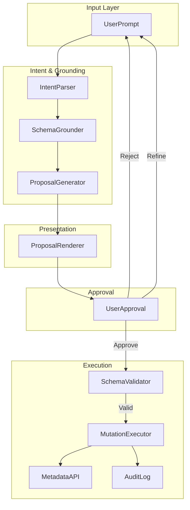
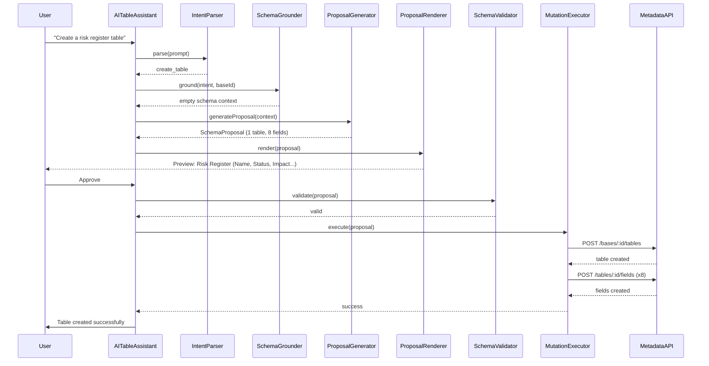
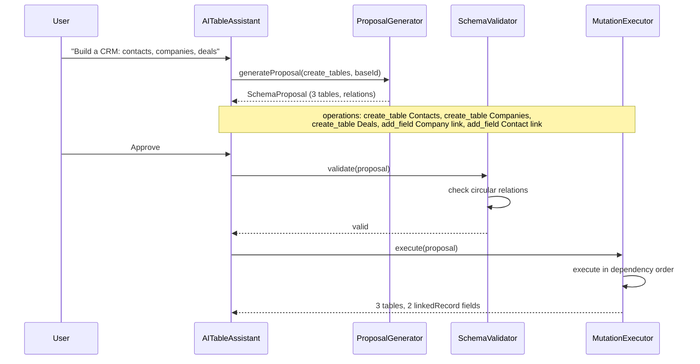
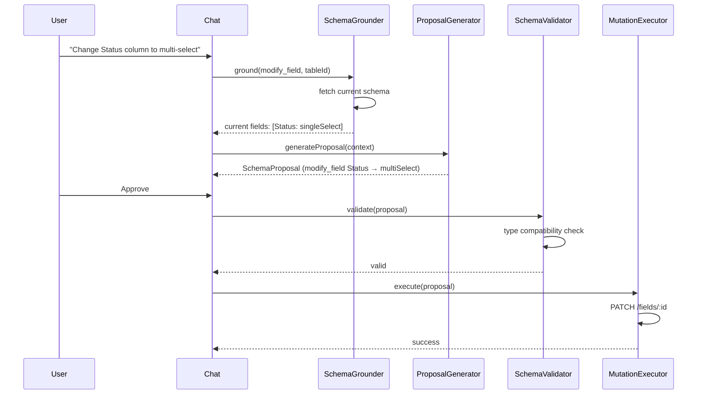
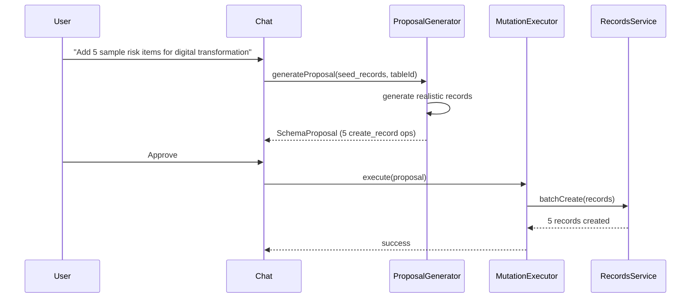

# WS-D: Consultify Chat-to-Schema — Technical Specification

Version: 1.0  
Owner: Engineering  
Status: Draft  
Last updated: 2026-03-15  
Parent program: Consultify Table Platform 90-Day Delivery  
Companion: [WS-B Architecture & Boundaries](WS_B_ARCHITECTURE_BOUNDARIES.md), [WS-C Table Platform Core Spec](WS_C_TABLE_PLATFORM_CORE_SPEC.md), [WS-A Product Definition](WS_A_PRODUCT_DEFINITION.md)

---

## Executive Summary

This document defines the complete technical specification for the **Chat-to-Schema** flow: users describe what they need in natural language, and the system proposes structured schema changes for approval before execution. Core principle: **"Describe, don't configure."**

**Current state:** `AITableAssistant.tsx` sends NL command + lightweight schema to `POST /api/my-work/my-ideas/:id/ai-table-action`. The backend `ideaAISuggestionsService.generateTableAction` returns a single action (sort, filter, add_column, add_rows, generate_table, summarize). Immediate execution without proposal layer.

**Target state:** `UserPrompt → IntentParser → SchemaGrounder → ProposalGenerator → ProposalRenderer → UserApproval → SchemaValidator → MutationExecutor → MetadataAPI → AuditLog`. Full proposal-driven flow with validation and atomic execution.

---

## Table of Contents

1. [System Architecture](#1-system-architecture)
2. [Intent Classification](#2-intent-classification)
3. [Schema Proposal Contract (CORE)](#3-schema-proposal-contract-core)
4. [Schema Grounding](#4-schema-grounding)
5. [Proposal Rendering (Frontend UX)](#5-proposal-rendering-frontend-ux)
6. [Approval Flow](#6-approval-flow)
7. [Validation Layer](#7-validation-layer)
8. [Mutation Execution](#8-mutation-execution)
9. [Prompt Engineering](#9-prompt-engineering)
10. [AI Safety and Guardrails](#10-ai-safety-and-guardrails)
11. [Seed Data Generation](#11-seed-data-generation)
12. [Integration with Existing Chat](#12-integration-with-existing-chat)
13. [Error Handling](#13-error-handling)
14. [Metrics and Observability](#14-metrics-and-observability)

---

## 1. System Architecture

### 1.1 Pipeline Overview



### 1.2 Component Responsibilities

| Component | Responsibility | Input | Output |
|-----------|----------------|-------|--------|
| **IntentParser** | Classify user intent from NL | UserPrompt, workspace context | ParsedIntent |
| **SchemaGrounder** | Inject current schema into context | ParsedIntent, base/table IDs | GroundedContext |
| **ProposalGenerator** | LLM-driven schema proposal | GroundedContext, prompt template | SchemaProposal |
| **ProposalRenderer** | Frontend preview of proposal | SchemaProposal | ProposalCard UI |
| **UserApproval** | User accepts/rejects/refines | ProposalCard | ApprovalResult |
| **SchemaValidator** | Pre-execution validation | SchemaProposal, current schema | ProposalValidationResult |
| **MutationExecutor** | Execute approved operations | SchemaProposal, operations[] | MutationExecutionResult |
| **MetadataAPI** | Backend CRUD for schema | Mutations | Persisted schema |
| **AuditLog** | Log all schema changes | Mutation details | Audit event |

### 1.3 Sequence Diagram: Simple Table Creation



### 1.4 Sequence Diagram: Multi-Table CRM Creation



### 1.5 Sequence Diagram: Field Modification



### 1.6 Sequence Diagram: Sample Data Seeding



---

## 2. Intent Classification

### 2.1 Taxonomy

| Intent | Description | Schema Mutating | Immediate Execution |
|--------|-------------|-----------------|----------------------|
| `create_base` | Create a new base (container) | Yes | No (proposal) |
| `create_table` | Create a single table | Yes | No (proposal) |
| `create_tables` | Create multiple related tables | Yes | No (proposal) |
| `add_field` | Add column to existing table | Yes | No (proposal) |
| `modify_field` | Change field type/options | Yes | No (proposal) |
| `remove_field` | Delete column | Yes | No (proposal) |
| `create_view` | Add saved view | Yes | No (proposal) |
| `modify_view` | Update view config | Yes | No (proposal) |
| `seed_records` | Add sample rows | Yes | No (proposal) |
| `describe_schema` | Explain current schema | No | Yes (read-only) |
| `suggest_improvement` | Propose optional changes | No | No (proposal) |

### 2.2 Detection Signals per Intent

#### create_base

| Signal | Example |
|--------|---------|
| "create base", "new base", "new workspace" | "Create a new base for Q2 projects" |
| "setup", "start from scratch" | "Setup a fresh base for customer feedback" |

#### create_table

| Signal | Example |
|--------|---------|
| "create table", "add table", "new table", "build table" | "Create a risk assessment table" |
| Single entity noun | "I need a contacts table" |
| "table for", "table to track" | "Table for tracking milestones" |

#### create_tables

| Signal | Example |
|--------|---------|
| Multiple entity nouns | "Contacts, companies, and deals" |
| "CRM", "project tracker", "multi-table" | "Build a CRM with contacts and companies" |
| Comma-separated list | "Tables: leads, opportunities, products" |

#### add_field

| Signal | Example |
|--------|---------|
| "add column", "add field", "add a" | "Add a Deadline column" |
| "new column", "new field" | "New column for Priority" |
| "include", "need a" (with column context) | "Include status and due date" |

#### modify_field

| Signal | Example |
|--------|---------|
| "change", "modify", "convert", "switch" | "Change Status to multi-select" |
| "rename" (field name change) | "Rename Name to Title" |
| "make it", "turn into" | "Make Priority a number" |

#### remove_field

| Signal | Example |
|--------|---------|
| "remove", "delete", "drop column" | "Remove the Notes column" |
| "get rid of", "strip" | "Get rid of obsolete fields" |

#### seed_records

| Signal | Example |
|--------|---------|
| "add rows", "add records", "seed", "sample" | "Add 5 sample rows" |
| "populate", "fill with" | "Populate with demo data" |
| N + entity | "10 risk items about cybersecurity" |

#### describe_schema

| Signal | Example |
|--------|---------|
| "what columns", "describe", "explain", "show schema" | "What columns does this table have?" |
| "how is it structured" | "How is this table structured?" |

### 2.3 Required Context per Intent

| Intent | Required Context |
|--------|------------------|
| create_base | workspace_id, organization_id |
| create_table | base_id, (optional) workspace_id |
| create_tables | base_id |
| add_field | table_id, current fields[] |
| modify_field | table_id, field_id, current field def |
| remove_field | table_id, field_id |
| create_view | table_id, current views[] |
| seed_records | table_id, current fields[] |
| describe_schema | table_id or base_id |

### 2.4 Example Prompts (English + Polish)

#### create_table

| EN | PL |
|----|-----|
| Create a risk assessment table for digital transformation | Stwórz tabelę oceny ryzyka dla transformacji cyfrowej |
| I need a table to track project milestones | Potrzebuję tabeli do śledzenia kamieni milowych projektu |
| Build a simple contacts table with name and email | Zbuduj prostą tabelę kontaktów z imieniem i emailem |

#### add_field

| EN | PL |
|----|-----|
| Add a Priority column with High/Medium/Low | Dodaj kolumnę Priorytet z wartościami Wysoki/Średni/Niski |
| Add a Deadline date column | Dodaj kolumnę daty Termin |
| Include a currency field for budget | Uwzględnij pole waluty dla budżetu |

#### modify_field

| EN | PL |
|----|-----|
| Change Status to multi-select | Zmień Status na wielokrotny wybór |
| Rename "Assigned to" to "Owner" | Przemianuj "Przypisany do" na "Właściciel" |
| Make the Budget column use PLN | Ustaw kolumnę Budżet na PLN |

#### seed_records

| EN | PL |
|----|-----|
| Add 5 sample risk items about cybersecurity | Dodaj 5 przykładowych elementów ryzyka o cyberbezpieczeństwie |
| Populate with 10 Polish company names | Wypełnij 10 polskimi nazwami firm |
| Seed 3 demo projects for Q2 | Zasil 3 demo projektami na Q2 |

---

## 3. Schema Proposal Contract (CORE)

### 3.1 Core Interfaces

```typescript
// ═══════════════════════════════════════════════════════════════════════════
// Schema Proposal Contract — Complete TypeScript Definitions
// ═══════════════════════════════════════════════════════════════════════════

/** Unique proposal identifier. UUID v4. */
type ProposalId = string;

/** Intent from classification. */
type ProposalIntent =
  | 'create_base'
  | 'create_table'
  | 'create_tables'
  | 'add_field'
  | 'modify_field'
  | 'remove_field'
  | 'create_view'
  | 'modify_view'
  | 'seed_records'
  | 'describe_schema'
  | 'suggest_improvement';

/** Root proposal object returned by ProposalGenerator. */
interface SchemaProposal {
  proposal_id: ProposalId;
  created_at: string; // ISO 8601
  intent: ProposalIntent;
  confidence: number; // 0–1
  summary: string; // Human-readable one-liner
  operations: SchemaOperation[];
  warnings: ProposalWarning[];
  estimated_impact: ImpactEstimate;
  /** For describe_schema: no operations, just explanation. */
  explanation?: string;
}

/** Single schema mutation operation. */
interface SchemaOperation {
  operation_type: SchemaOperationType;
  target: OperationTarget;
  payload: OperationPayload;
  dependencies?: string[]; // operation_ids that must execute first
  reversible: boolean;
}

type SchemaOperationType =
  | 'create_base'
  | 'create_table'
  | 'add_field'
  | 'modify_field'
  | 'remove_field'
  | 'create_view'
  | 'modify_view'
  | 'create_record'
  | 'batch_create_records';

/** Target of the operation. */
interface OperationTarget {
  type: 'base' | 'table' | 'field' | 'view' | 'record';
  base_id?: string;
  table_id?: string;
  field_id?: string;
  view_id?: string;
  record_id?: string;
  /** For create operations: proposed key/name. */
  proposed_key?: string;
  proposed_name?: string;
}

/** Payload varies by operation type. */
type OperationPayload =
  | CreateBasePayload
  | CreateTablePayload
  | AddFieldPayload
  | ModifyFieldPayload
  | RemoveFieldPayload
  | CreateViewPayload
  | ModifyViewPayload
  | CreateRecordPayload
  | BatchCreateRecordsPayload;

interface CreateBasePayload {
  name: string;
  description?: string;
}

interface CreateTablePayload {
  name: string;
  description?: string;
  fields: Array<{ key: string; name: string; type: string; options?: Record<string, unknown> }>;
}

interface AddFieldPayload {
  key: string;
  name: string;
  type: string;
  options?: Record<string, unknown>;
  ordinal?: number;
}

interface ModifyFieldPayload {
  name?: string;
  type?: string;
  options?: Record<string, unknown>;
}

interface RemoveFieldPayload {
  /** Reserved for audit. */
  field_key?: string;
}

interface CreateViewPayload {
  name: string;
  layout: 'table' | 'kanban' | 'timeline' | 'calendar' | 'grid';
  sort_config?: Array<{ field_id: string; direction: 'asc' | 'desc' }>;
  filter_config?: { logic: 'and' | 'or'; rules: unknown[] };
  group_config?: { field_id: string };
}

interface ModifyViewPayload {
  name?: string;
  layout?: string;
  sort_config?: unknown;
  filter_config?: unknown;
  group_config?: unknown;
}

interface CreateRecordPayload {
  fields: Record<string, string | number | boolean | string[] | null>;
}

interface BatchCreateRecordsPayload {
  records: CreateRecordPayload['fields'][];
}

/** Non-blocking warning. */
interface ProposalWarning {
  code: string;
  message: string;
  severity: 'info' | 'warn';
  affected_operation_id?: string;
}

/** Estimated impact for user awareness. */
interface ImpactEstimate {
  tables_created?: number;
  tables_modified?: number;
  fields_added?: number;
  fields_modified?: number;
  fields_removed?: number;
  records_added?: number;
  views_created?: number;
  /** Data loss risk indicator. */
  data_loss_risk?: boolean;
}

/** Result of pre-execution validation. */
interface ProposalValidationResult {
  valid: boolean;
  errors: Array<{
    code: string;
    message: string;
    operation_id?: string;
  }>;
  warnings: ProposalWarning[];
}

/** Result of mutation execution. */
interface MutationExecutionResult {
  success: boolean;
  proposal_id: ProposalId;
  executed_operations: number;
  created_ids: Record<string, string>; // operation_id → created entity id
  errors: Array<{
    operation_id: string;
    code: string;
    message: string;
  }>;
  rolled_back: boolean;
}
```

### 3.2 Example JSON Payloads

#### Example: Add Field Proposal

```json
{
  "proposal_id": "a1b2c3d4-e5f6-7890-abcd-ef1234567890",
  "created_at": "2026-03-15T14:30:00.000Z",
  "intent": "add_field",
  "confidence": 0.95,
  "summary": "Add Priority column with High/Medium/Low options",
  "operations": [
    {
      "operation_type": "add_field",
      "target": {
        "type": "field",
        "table_id": "tbl_abc123",
        "proposed_key": "priority",
        "proposed_name": "Priority"
      },
      "payload": {
        "key": "priority",
        "name": "Priority",
        "type": "singleSelect",
        "options": {
          "options": [
            { "id": "opt1", "value": "High", "color": "#ef4444" },
            { "id": "opt2", "value": "Medium", "color": "#f59e0b" },
            { "id": "opt3", "value": "Low", "color": "#10b981" }
          ]
        },
        "ordinal": 3
      },
      "dependencies": [],
      "reversible": true
    }
  ],
  "warnings": [],
  "estimated_impact": {
    "fields_added": 1,
    "data_loss_risk": false
  }
}
```

#### Example: Multi-Table CRM Proposal

```json
{
  "proposal_id": "b2c3d4e5-f6a7-8901-bcde-f23456789012",
  "created_at": "2026-03-15T15:00:00.000Z",
  "intent": "create_tables",
  "confidence": 0.88,
  "summary": "Create CRM with Contacts, Companies, and Deals tables",
  "operations": [
    {
      "operation_type": "create_table",
      "target": { "type": "table", "base_id": "base_xyz", "proposed_name": "Contacts" },
      "payload": {
        "name": "Contacts",
        "description": "Contact persons",
        "fields": [
          { "key": "name", "name": "Name", "type": "singleLineText" },
          { "key": "email", "name": "Email", "type": "email" },
          { "key": "phone", "name": "Phone", "type": "phone" },
          { "key": "company", "name": "Company", "type": "linkedRecord", "options": { "linkedTableId": "@ref:Companies" } }
        ]
      },
      "dependencies": [],
      "reversible": true
    },
    {
      "operation_type": "create_table",
      "target": { "type": "table", "base_id": "base_xyz", "proposed_name": "Companies" },
      "payload": {
        "name": "Companies",
        "fields": [
          { "key": "name", "name": "Company Name", "type": "singleLineText" },
          { "key": "industry", "name": "Industry", "type": "singleSelect", "options": { "options": [] } }
        ]
      },
      "dependencies": [],
      "reversible": true
    },
    {
      "operation_type": "create_table",
      "target": { "type": "table", "base_id": "base_xyz", "proposed_name": "Deals" },
      "payload": {
        "name": "Deals",
        "fields": [
          { "key": "name", "name": "Deal Name", "type": "singleLineText" },
          { "key": "value", "name": "Value", "type": "currency", "options": { "currency": "PLN" } },
          { "key": "contact", "name": "Contact", "type": "linkedRecord", "options": { "linkedTableId": "@ref:Contacts" } }
        ]
      },
      "dependencies": [],
      "reversible": true
    }
  ],
  "warnings": [
    {
      "code": "LINK_RESOLUTION",
      "message": "LinkedRecord fields will be resolved after table creation",
      "severity": "info"
    }
  ],
  "estimated_impact": {
    "tables_created": 3,
    "fields_added": 9,
    "data_loss_risk": false
  }
}
```

---

## 4. Schema Grounding

### 4.1 Current Schema Injection into Prompt

The SchemaGrounder fetches the current base/table schema and injects it into the prompt in a structured format:

```
Current schema for base "Q2 Projects" (base_id: xxx):
- Table: Risks (table_id: yyy)
  - name (singleLineText)
  - status (singleSelect: To Do, In Progress, Done)
  - impact (number)
  - due_date (date)
- Table: Milestones (table_id: zzz)
  - title (singleLineText)
  - status (singleSelect)
  - project (linkedRecord → Risks)
```

### 4.2 NL-to-Field-Type Mapping Rules

| NL Pattern | Inferred Type | Options Hint |
|------------|---------------|--------------|
| "amount", "price", "cost", "budget", "revenue", "PLN", "EUR", "USD" | currency | currency from context or locale |
| "date", "deadline", "term", "when", "data" | date | includeTime from context |
| "yes/no", "true/false", "checkbox", "tak/nie" | checkbox | — |
| "status", "stage", "phase", "priority", "category" | singleSelect | infer options from prompt |
| "list of", "multiple", "tags", "many" | multiSelect | infer options |
| "email", "e-mail" | email | — |
| "phone", "telefon" | phone | countryCode from locale |
| "url", "link", "website" | url | — |
| "description", "notes", "long", "opis" | longText | format: markdown if "markdown" |
| "number", "quantity", "count", "liczba" | number | precision from context |
| "percent", "procent" | percent | format: percent |
| "person", "owner", "assigned", "właściciel" | linkedRecord (future: person table) | — |
| Default | singleLineText | — |

### 4.3 Relation Detection Heuristics

- **Explicit:** "link to X", "relation to X", "references X", "powiązanie z X"
- **Implicit:** "company" in Contacts table → link to Companies
- **Naming:** `contact_id`, `company_id`, `project_id` → infer linkedRecord
- **Plural/singular:** "Projects" table + "project" field → linkedRecord to Projects

### 4.4 Type Inference Rules

| Rule | Condition | Result |
|------|-----------|--------|
| Amount words + currency | "budget", "cost" + "PLN"/"EUR" | currency, options.currency |
| Date words | "deadline", "due date", "data" | date |
| Boolean phrases | "yes/no", "tak/nie", "optional" | checkbox |
| Enum-like | 3–10 distinct quoted values | singleSelect |
| Long text | "description", "notes", "opis" | longText |
| Numeric | "quantity", "count", "liczba" | number |
| Percent | "percent", "procent", "%" | percent |

### 4.5 Option Inference for Selects

- Explicit list in prompt: "High, Medium, Low" → options array
- Status-like: To Do, In Progress, Done, Blocked (with default colors)
- Priority-like: High, Medium, Low
- Locale: Polish vs English option labels
- Color: assign from palette if not specified

### 4.6 Primary Field Selection Heuristic

- First `singleLineText` or `longText` field in definition
- Or field named "name", "title", "title_pl", "Name"
- Used as display field for linked records

### 4.7 Default View Suggestion Logic

- New table → create default "All" table view
- Kanban if status-like singleSelect present
- Timeline if date field present
- Group by first singleSelect if ≤5 options

---

## 5. Proposal Rendering (Frontend UX)

### 5.1 Proposal Preview Card Layout

```
┌─────────────────────────────────────────────────────────────────┐
│ [Sparkles icon] Schema Proposal                    [X Close]   │
├─────────────────────────────────────────────────────────────────┤
│ Summary: Add Priority column with High/Medium/Low                │
│ Confidence: 95%  │  Impact: 1 field added                       │
├─────────────────────────────────────────────────────────────────┤
│ OPERATIONS                                         [Expand All]  │
│ ▼ Add field "Priority" (singleSelect)          [CREATE - green] │
│     • High, Medium, Low with colors                             │
├─────────────────────────────────────────────────────────────────┤
│ WARNINGS (if any)                                                │
│ ℹ LinkedRecord targets will be resolved after creation           │
├─────────────────────────────────────────────────────────────────┤
│ [Refine]                    [Reject]  [Approve All]              │
└─────────────────────────────────────────────────────────────────┘
```

### 5.2 Operation Color Coding

| Operation Type | Color Token | Hex | Usage |
|----------------|-------------|-----|-------|
| create_base, create_table, add_field, create_view, create_record | `emerald-500` | #10b981 | Green border/icon |
| modify_field, modify_view | `amber-500` | #f59e0b | Yellow/amber border/icon |
| remove_field | `red-500` | #ef4444 | Red border/icon |

### 5.3 Controls

| Control | Placement | Action |
|---------|-----------|--------|
| **Approve All** | Primary, bottom-right | Submit full proposal for validation and execution |
| **Reject** | Secondary, bottom | Dismiss proposal, optionally return to chat |
| **Refine** | Tertiary, bottom-left | Open refinement input, send follow-up to ProposalGenerator |
| **Approve Selected** | When granular selection enabled | Approve only checked operations |

### 5.4 Progress Indicator

- During proposal generation: Spinner + "Generating proposal..."
- During validation: "Validating..."
- During execution: Progress bar (1/5, 2/5...) + "Creating table...", "Adding fields..."
- Success: Checkmark + "Schema updated successfully"
- Failure: Error icon + message + "Retry" button

### 5.5 Wireframe: Layout Specs

- Card: `rounded-2xl`, `border`, `shadow-2xl`, `max-h-[70vh]`, `flex flex-col`
- Header: `px-4 py-3`, `bg-violet-500/5`, `border-b`
- Summary: `text-sm`, `font-medium`
- Operations list: `overflow-y-auto`, each operation as `flex items-start gap-3 py-2`
- Operation icon: 16x16, color per operation type
- Footer: `flex justify-between items-center`, `px-4 py-3`, `border-t`

---

## 6. Approval Flow

### 6.1 Single vs Operation-Level Approval

| Proposal Complexity | Approval Mode | Behavior |
|---------------------|---------------|----------|
| Single operation | Single approval | One "Approve" applies all |
| 2–5 operations | Single approval default | Can expand to per-operation checkboxes |
| 6+ operations | Operation-level default | User checks which to apply |
| create_tables with relations | Single approval | Relations require all-or-nothing |

### 6.2 Refinement Loop Mechanics

1. User clicks "Refine"
2. Inline input appears: "What would you like to change?"
3. User types: "Add a Notes column too" or "Use PLN for the budget"
4. Refinement prompt sent to ProposalGenerator with original proposal + refinement
5. New SchemaProposal returned, replaces current
6. User can refine again or approve

### 6.3 Max Iterations, Timeout, Concurrent Handling

| Constraint | Value | Behavior |
|------------|-------|----------|
| Max refinement iterations | 3 | After 3, "Refine" disabled; user must approve or reject |
| Proposal generation timeout | 30s | Return error, suggest retry |
| Concurrent proposals | 1 per table/workspace | New proposal cancels previous if same scope |
| Stale proposal | 5 min | "Proposal may be outdated" warning; re-fetch schema on approve |

---

## 7. Validation Layer

### 7.1 Pre-Execution Rules

| Rule | Check | Error Code | Message Template |
|------|-------|------------|-------------------|
| Field name uniqueness | No duplicate keys in table | `FIELD_KEY_DUPLICATE` | "Field key '{key}' already exists" |
| Reserved IDs | No `id`, `created_at`, etc. as user keys | `RESERVED_FIELD_KEY` | "Field key '{key}' is reserved" |
| Type compatibility | Modify: new type supports existing values | `TYPE_INCOMPATIBLE` | "Cannot change {old} to {new}; data loss risk" |
| Relation targets | linkedRecord.linkedTableId exists | `RELATION_TARGET_INVALID` | "Table '{id}' not found" |
| Circular relations | No A→B→A | `CIRCULAR_RELATION` | "Circular relation detected" |
| Schema limits | Max 100 fields/table, 50 tables/base | `SCHEMA_LIMIT_EXCEEDED` | "Limit exceeded: {limit}" |
| Concurrent conflicts | Optimistic lock on schema version | `CONCURRENT_MODIFICATION` | "Schema was modified by another user" |
| Invalid options | Options match type schema | `INVALID_OPTIONS` | "Invalid options for {type}" |
| Empty required | Create table requires ≥1 field | `EMPTY_TABLE` | "Table must have at least one field" |

### 7.2 Validation Order

1. Structural (keys, types, options)
2. Cross-operation (dependencies, relations)
3. Concurrency (schema version)
4. Limits

---

## 8. Mutation Execution

### 8.1 Transaction Semantics

- All operations in a proposal execute in a **single database transaction**
- On any failure: **rollback entire proposal**
- Partial execution is not permitted

### 8.2 Execution Order

1. Resolve dependencies (topological sort of operations)
2. create_base → create_table → add_field (ordered by ordinal)
3. linkedRecord fields: create after linked table exists; resolve @ref:TableName to table_id
4. create_record / batch_create_records last

### 8.3 Rollback on Partial Failure

- Use database transaction (BEGIN ... COMMIT / ROLLBACK)
- Audit log: record attempted operations before commit; on rollback, log rollback event
- Return MutationExecutionResult with `rolled_back: true` and `errors`

### 8.4 Audit Logging

Every mutation logs to `table_platform_audit_events`:

```json
{
  "entity_type": "field",
  "entity_id": "fld_xxx",
  "action": "create",
  "payload": { "table_id": "tbl_yyy", "key": "priority", "type": "singleSelect" },
  "actor_id": "user_zzz",
  "proposal_id": "a1b2c3d4-..."
}
```

### 8.5 Graph Adapter Notification

After successful execution, notify WorkspaceGraphAdapter (when projection mode active) to refresh graph from canonical data. Event: `schema_mutated` with `base_id`, `table_ids[]`.

### 8.6 Real-Time UI Update

- WebSocket or polling: table tool subscribes to `schema_mutated` for current base
- On event: refetch schema, re-render columns
- Optimistic UI: show new column immediately on Approve, revert on error

---

## 9. Prompt Engineering

### 9.1 System Prompt Template for Schema Planning

```
You are a schema design assistant for Consultify. The user describes what they need in natural language. You produce a structured SchemaProposal (JSON) with operations to create or modify tables, fields, and views.

RULES:
- Output ONLY valid JSON matching the SchemaProposal interface. No markdown, no explanation outside JSON.
- Use field types from the allowed set: singleLineText, longText, number, currency, percent, checkbox, date, singleSelect, multiSelect, url, email, phone, linkedRecord.
- Infer types from context: amounts → currency, dates → date, yes/no → checkbox, status-like → singleSelect.
- For linkedRecord, use "@ref:TableName" in options.linkedTableId when the table is created in the same proposal.
- Keep proposal minimal: only what the user asked for.
- Confidence 0–1: high when unambiguous, lower when inferring.

Current schema context:
{{SCHEMA_CONTEXT}}

Respond with a single JSON object.
```

### 9.2 Schema Context Injection Format

```
Base: {{base_name}} (id: {{base_id}})
Tables:
{{#each tables}}
- {{name}} (id: {{table_id}})
  {{#each fields}}
  - {{key}} ({{type}}){{#if options}} options: {{options}}{{/if}}
  {{/each}}
{{/each}}
```

### 9.3 Few-Shot Examples

```json
// User: "Add a Priority column"
{"proposal_id":"...","intent":"add_field","confidence":0.95,"summary":"Add Priority column","operations":[{"operation_type":"add_field","target":{"type":"field","table_id":"..."},"payload":{"key":"priority","name":"Priority","type":"singleSelect","options":{"options":[{"id":"h","value":"High"},{"id":"m","value":"Medium"},{"id":"l","value":"Low"}]}},"reversible":true}],"warnings":[],"estimated_impact":{"fields_added":1}}
```

### 9.4 Error Recovery Prompts

- **Parse failure:** "The previous response was not valid JSON. Return ONLY a SchemaProposal JSON object, no other text."
- **Validation failure:** "Validation failed: {errors}. Adjust the proposal to fix these issues and return a new SchemaProposal."

### 9.5 Language Handling (PL + EN)

- System prompt: "Respond in the same language as the user's prompt. For schema keys use snake_case English. For display names (field name, option values) use the user's language."
- Detection: `language` from request header or conversation metadata
- Option values: "High/Medium/Low" vs "Wysoki/Średni/Niski"

### 9.6 Token Budget Management

- Schema context: truncate to last 50 fields if exceeds 2000 tokens
- Few-shot: 1 example only in budget mode
- Max output tokens: 4096
- If schema too large: "Schema is large. Propose changes for the most relevant table only."

---

## 10. AI Safety and Guardrails

### 10.1 Max Schema Size per Proposal

| Limit | Value |
|-------|-------|
| Tables per proposal | 5 |
| Fields per table (create) | 25 |
| Fields added (add_field) | 10 per proposal |
| Records seeded | 50 |
| Views per proposal | 5 |
| Operations total | 30 |

### 10.2 Prohibited Operations

- Drop table (explicit out-of-scope for MVP)
- Drop base
- Bulk delete records (separate flow)
- Schema export/import
- Cross-base relations
- Custom extensions

### 10.3 Confidence Thresholds

| Threshold | Action |
|-----------|--------|
| ≥ 0.9 | Auto-show proposal, no extra warning |
| 0.7–0.9 | Show proposal with "AI inferred some details" |
| 0.5–0.7 | Show proposal with "Please verify carefully" |
| < 0.5 | Show low-confidence message, suggest refinement |
| < 0.3 | Do not propose; ask user to clarify |

### 10.4 Fallback Behavior

- Intent unparseable → "Could not understand. Try: 'Add a Priority column' or 'Create a contacts table'"
- Proposal generation timeout → Retry once; then show error
- LLM returns invalid JSON → Retry with error recovery prompt; max 2 retries

### 10.5 Rate Limiting and Cost Tracking

| Resource | Limit |
|----------|-------|
| Proposals per user per hour | 30 |
| Proposals per workspace per hour | 60 |
| Cost tracking | Log tokens per proposal to ai_usage; alert on budget threshold |

---

## 11. Seed Data Generation

### 11.1 Realistic Sample Record Generation

- Use LLM with schema context to generate records
- Prompt: "Generate {n} realistic sample records for this schema. Match field types. Use varied, plausible data."
- For select fields: use only values from options
- For dates: spread over reasonable range (e.g. next 3 months)
- For currency: sensible amounts (100–100000)

### 11.2 Record Count Limits

- Default: 10
- Max: 50
- User can say "5 rows" or "20 sample records" — respect if ≤ 50

### 11.3 Domain-Appropriate Data

- Table name "Contacts" → names, emails, phones
- Table name "Risks" → risk titles, statuses, impacts
- Table name "Projects" → project names, statuses, dates
- General: generic labels, no real PII

### 11.4 Locale-Aware Generation

| Locale | Names | Currency | Date Format |
|--------|-------|----------|-------------|
| pl | Polish names (Kowalski, Anna), Polish companies | PLN | DD.MM.YYYY |
| en | English names, international | USD or locale | MM/DD/YYYY or locale |
| Default | Mixed, generic | USD | ISO 8601 |

---

## 12. Integration with Existing Chat

### 12.1 UnifiedChatPanel Integration

- Chat can surface a "Table" quick action: opens table tool with AI command bar
- Handoff: `UnifiedChatPanel` passes `workspaceId`, `ideaId`, `baseId` to table context
- Message type: `table_proposal` — render inline SchemaProposal card when AI returns proposal
- Action: "Build a table" chip → open AITableAssistant with pre-filled "Create a table for..."

### 12.2 AITableAssistant Backward Compatibility

- **Legacy mode (flag off):** Current behavior — immediate execution of sort/filter/group/add_column/add_rows/summarize
- **Proposal mode (flag on):** All schema-mutating intents go through proposal flow
- **Hybrid:** sort/filter/group/summarize remain immediate; add_field/create_table/seed go through proposal
- API: New endpoint `POST /api/v1/schema/proposals` for proposal generation; keep `ai-table-action` for legacy

### 12.3 Workspace Context Awareness

- AITableAssistant receives: `ideaId`, `baseId`, `tableId`, `columns`, `artifactContext`
- ProposalGenerator receives workspace name, base name, table names for grounding
- "Add column" without table context → ask "Which table?" or use current table

### 12.4 Multi-Turn Conversation

- Conversation ID or session ID passed to proposal flow
- Refinement uses prior proposal + new message
- "And add a Notes column" — appends to previous add_field proposal
- Max 3 refinements per proposal chain

---

## 13. Error Handling

### 13.1 Error Taxonomy

| Category | Error Code | Message Template | Recovery Action |
|----------|------------|------------------|-----------------|
| **AI parsing** | `AI_PARSE_FAILED` | "Could not parse AI response" | Retry; show "Try again" |
| | `AI_INVALID_JSON` | "Invalid JSON from AI" | Retry with recovery prompt |
| | `AI_EMPTY_RESPONSE` | "AI returned no proposal" | Retry |
| **Validation** | `VALIDATION_FAILED` | "{errors}" | Show errors; suggest refinement |
| | `FIELD_KEY_DUPLICATE` | "Field '{key}' already exists" | Refine with new key |
| | `TYPE_INCOMPATIBLE` | "Cannot change type; data loss" | Abort or refine |
| | `CIRCULAR_RELATION` | "Circular relation detected" | Refine schema |
| **Execution** | `EXECUTION_FAILED` | "{operation} failed: {reason}" | Rollback; show error; retry |
| | `CONCURRENT_MODIFICATION` | "Schema was modified elsewhere" | Re-fetch schema; retry |
| | `PERMISSION_DENIED` | "You don't have permission" | Show message; no retry |
| **Timeout** | `PROPOSAL_TIMEOUT` | "Proposal generation timed out" | Retry |
| | `EXECUTION_TIMEOUT` | "Execution timed out" | Rollback; retry |
| **Concurrent** | `PROPOSAL_SUPERSEDED` | "New proposal replaced this one" | Discard; show new proposal |

### 13.2 Error Response Schema

```typescript
interface ChatToSchemaError {
  code: string;
  message: string;
  recoverable: boolean;
  details?: Record<string, unknown>;
}
```

---

## 14. Metrics and Observability

### 14.1 Target SLAs

| Metric | Target |
|--------|--------|
| Proposal latency (p95) | < 3s |
| Validation latency | < 500ms |
| Execution latency (single op) | < 1s |
| Execution latency (5 ops) | < 3s |
| End-to-end (prompt → executed) | < 8s |

### 14.2 Metrics to Track

| Metric | Type | Labels |
|--------|------|--------|
| `chat_to_schema_proposal_latency_seconds` | Histogram | intent |
| `chat_to_schema_proposal_acceptance_rate` | Gauge | — |
| `chat_to_schema_refinement_count` | Counter | — |
| `chat_to_schema_execution_success_rate` | Gauge | intent |
| `chat_to_schema_execution_latency_seconds` | Histogram | operation_count |
| `chat_to_schema_cost_per_proposal_usd` | Histogram | — |
| `chat_to_schema_validation_errors_total` | Counter | code |
| `chat_to_schema_execution_errors_total` | Counter | code |

### 14.3 Dashboards

- **Proposal funnel:** prompts → proposals generated → approved → executed
- **Latency:** p50, p95, p99 for proposal, validation, execution
- **Error budget:** validation errors, execution failures, timeout rate
- **Cost:** tokens per proposal, cost per org

### 14.4 Alerts

| Alert | Condition | Severity |
|-------|-----------|----------|
| Proposal latency high | p95 > 5s for 5 min | Warning |
| Execution failure rate | > 5% for 10 min | Critical |
| Validation error spike | 2x baseline for 5 min | Warning |
| Cost anomaly | 2x daily avg per org | Warning |

---

## Appendix A: API Contract Summary

| Endpoint | Method | Purpose |
|----------|--------|---------|
| `POST /api/v1/schema/proposals` | POST | Generate SchemaProposal from prompt |
| `POST /api/v1/schema/proposals/:id/validate` | POST | Validate proposal |
| `POST /api/v1/schema/proposals/:id/execute` | POST | Execute approved proposal |
| `POST /api/v1/schema/proposals/:id/refine` | POST | Refine with follow-up prompt |

**Legacy (unchanged):** `POST /api/my-work/my-ideas/:id/ai-table-action` — immediate actions when proposal flow disabled.

---

## Appendix B: File Mapping

| Component | Target File |
|-----------|-------------|
| IntentParser | `server/src/services/chatToSchema/intentParser.ts` |
| SchemaGrounder | `server/src/services/chatToSchema/schemaGrounder.ts` |
| ProposalGenerator | `server/src/services/chatToSchema/proposalGenerator.ts` |
| SchemaValidator | `server/src/services/chatToSchema/schemaValidator.ts` |
| MutationExecutor | `server/src/services/chatToSchema/mutationExecutor.ts` |
| ProposalRenderer | `src/components/MyWork/table/SchemaProposalCard.tsx` |
| AITableAssistant (evolved) | `src/components/MyWork/table/AITableAssistant.tsx` |

---

*End of WS-D Chat-to-Schema Specification*
