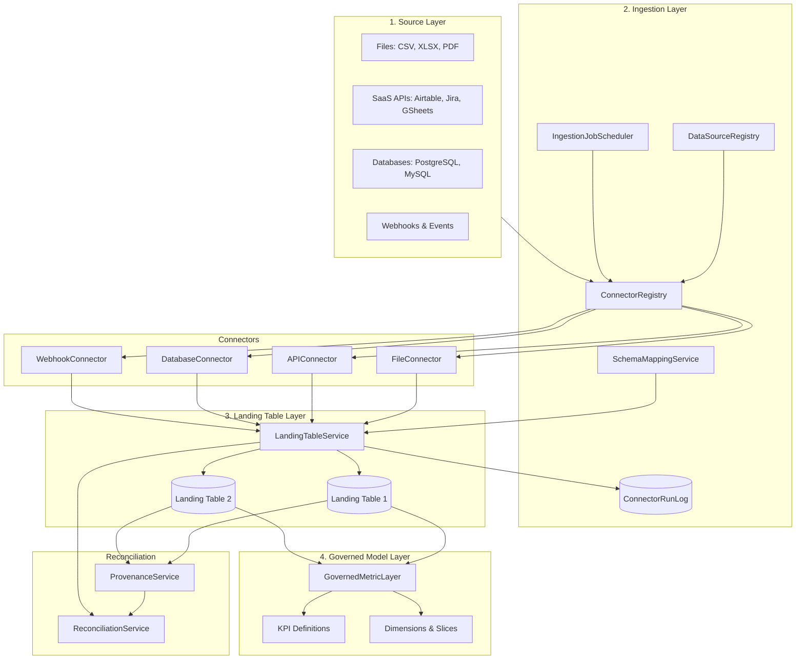
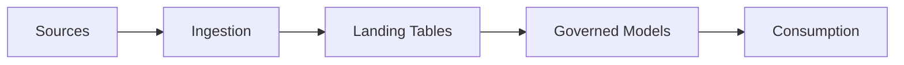
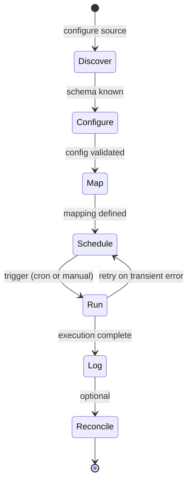

# WS-E: Consultify Data Collection and Ingestion Specification

Version: 1.0  
Owner: Data Platform + Engineering  
Status: Draft  
Last updated: 2026-03-15  
Parent program: Consultify Table Platform — Phase 2 Capability  
Companion: [WS-C Table Platform Core Spec](WS_C_TABLE_PLATFORM_CORE_SPEC.md), [CONSULTIFY_DATA_COLLECTION_PLAN](../CONSULTIFY_DATA_COLLECTION_PLAN.md)

---

## Executive Summary

This document defines the complete technical specification for Consultify's **Data Collection and Ingestion** layer. It covers ingestion architecture, connector framework, P0 connector specifications, schema mapping engine, refresh and scheduling, provenance model, governed model layer, reconciliation engine, and migration paths. This is a **Phase 2** capability built after the core table platform MVP.

**Four ingestion modes:** File Import | Scheduled Sync | Live Query/Federated Read | Push/Event-Driven  
**Four layers:** Sources → Ingestion → Landing Tables → Governed Models → Consumption

---

## Table of Contents

1. [Ingestion Architecture](#1-ingestion-architecture)
2. [Connector Framework](#2-connector-framework)
3. [P0 Connector Specifications](#3-p0-connector-specifications)
4. [Schema Mapping Engine](#4-schema-mapping-engine)
5. [Refresh and Scheduling](#5-refresh-and-scheduling)
6. [Provenance Model](#6-provenance-model)
7. [Governed Model Layer](#7-governed-model-layer)
8. [Reconciliation Engine](#8-reconciliation-engine)
9. [Landing Table vs Governed Model](#9-landing-table-vs-governed-model)
10. [Migration Paths](#10-migration-paths)
11. [Connector Run Log Contract](#11-connector-run-log-contract)
12. [Performance and Limits](#12-performance-and-limits)
13. [Security](#13-security)
14. [Phased Rollout](#14-phased-rollout)

---

## 1. Ingestion Architecture

### 1.1 Complete Architecture Diagram



### 1.2 Layer Data Flow



### 1.3 Component Specifications

#### DataSourceRegistry

**Responsibility:** Canonical catalog of configured data sources. Stores source metadata, connection parameters (referenced by ID, not raw credentials), and source-to-connector binding.

```typescript
interface DataSource {
  id: string;
  name: string;
  sourceType: 'file' | 'airtable' | 'google_sheets' | 'postgresql' | 'mysql' | 'jira' | 'webhook';
  connectorType: 'FileConnector' | 'APIConnector' | 'DatabaseConnector' | 'WebhookConnector';
  baseId: string;
  workspaceId: string;
  configRef: string;         // reference to encrypted config store
  createdAt: string;
  updatedAt: string;
}

interface DataSourceRegistry {
  register(source: Omit<DataSource, 'id'>): Promise<DataSource>;
  get(id: string): Promise<DataSource | null>;
  listByBase(baseId: string): Promise<DataSource[]>;
  update(id: string, patch: Partial<DataSource>): Promise<DataSource>;
  delete(id: string): Promise<void>;
}
```

**Dependencies:** Credential store, workspace/base resolution.

---

#### ConnectorRegistry

**Responsibility:** Factory and registry of connector implementations. Maps connector type to executable connector instance. Manages connector lifecycle discovery.

```typescript
interface ConnectorRegistry {
  getConnector(type: ConnectorType, config: ConnectorConfig): Promise<IConnector>;
  listConnectorTypes(): ConnectorType[];
  getConnectorCapabilities(type: ConnectorType): ConnectorCapabilities;
}

type ConnectorType = 'FileConnector' | 'APIConnector' | 'DatabaseConnector' | 'WebhookConnector';
```

**Dependencies:** Individual connector modules, credential resolution.

---

#### IngestionJobScheduler

**Responsibility:** Schedules and orchestrates ingestion runs. Manages cron-like schedules, chained triggers, and concurrency limits. Enqueues jobs; actual execution delegated to connectors.

```typescript
interface IngestionJobScheduler {
  schedule(config: ScheduleConfig): Promise<string>;   // returns job_id
  triggerNow(sourceId: string): Promise<string>;      // manual trigger
  cancel(jobId: string): Promise<void>;
  getNextRun(sourceId: string): Promise<string | null>;
}
```

**Dependencies:** Job queue (Bull/BullMQ or equivalent), ConnectorRegistry, ConnectorRunLog.

---

#### ConnectorRunLog

**Responsibility:** Persistent audit log of every connector execution. Stores run metadata, counts, errors, and schema change flags. Read-only after creation.

**Storage:** PostgreSQL table `connector_run_log`. See Section 11 for full contract.

**Dependencies:** None (leaf component).

---

#### LandingTableService

**Responsibility:** Writes ingested records into landing tables. Applies schema mapping, type conversion, deduplication, and provenance injection. Handles refresh policies (full replace, incremental upsert, append-only).

```typescript
interface LandingTableService {
  upsertRecords(params: UpsertRecordsParams): Promise<UpsertRecordsResult>;
  replaceAllRecords(params: ReplaceAllParams): Promise<ReplaceAllResult>;
  appendRecords(params: AppendRecordsParams): Promise<AppendRecordsResult>;
}
```

**Dependencies:** SchemaMappingService, ProvenanceService, Records API, ConnectorRunLog.

---

#### SchemaMappingService

**Responsibility:** Source-to-destination field mapping, type conversion, default values, and deduplication key resolution. Validates mapping config against source and destination schemas.

```typescript
interface SchemaMappingService {
  validateMapping(config: MappingConfig, sourceSchema: SourceSchema, destSchema: TableSchema): MappingValidationResult;
  applyMapping(records: RawRecord[], config: MappingConfig): MappedRecord[];
  inferMapping(sourceSchema: SourceSchema, destSchema: TableSchema): MappingConfig;
}
```

**Dependencies:** Type conversion matrix (Section 4).

---

#### ProvenanceService

**Responsibility:** Attaches and queries record-level provenance metadata. Tracks source_type, source_ref, connector_run_id, imported_at, last_refreshed_at, manually_edited.

```typescript
interface ProvenanceService {
  attachProvenance(recordId: string, meta: ProvenanceMetadata): Promise<void>;
  getProvenance(recordId: string): Promise<ProvenanceMetadata | null>;
  markManuallyEdited(recordId: string, fieldIds: string[]): Promise<void>;
}
```

**Dependencies:** Record storage (JSONB metadata or separate table).

---

#### GovernedMetricLayer

**Responsibility:** KPI definitions, dimensions, slices, canonical line mappings (finance), and model versioning. Consumed by Results, Reports, Finance, Execution modules.

```typescript
interface GovernedMetricLayer {
  defineKpi(kpi: KpiDefinition): Promise<void>;
  getKpis(modelId: string): Promise<KpiDefinition[]>;
  computeMetric(modelId: string, kpiId: string, context: SliceContext): Promise<number>;
  getCanonicalMappings(statementType: string): Promise<CanonicalLineDefinition[]>;
}
```

**Dependencies:** Table Platform metadata, canonical registry (finance), view query engine.

---

#### ReconciliationService

**Responsibility:** Detects conflicts between synced and manual values, applies resolution strategies, surfaces stale data, and handles failed refresh visibility.

```typescript
interface ReconciliationService {
  detectConflicts(tableId: string): Promise<ConflictReport>;
  resolveConflict(recordId: string, strategy: ConflictResolutionStrategy): Promise<void>;
  getStaleRecords(tableId: string, maxAgeHours: number): Promise<string[]>;
  getFailedRefreshSummary(tableId: string): Promise<FailedRefreshSummary | null>;
}
```

**Dependencies:** ProvenanceService, LandingTableService, ConnectorRunLog.

---

## 2. Connector Framework

### 2.1 Connector Interface Specification

```typescript
interface IConnector {
  readonly type: ConnectorType;
  readonly capabilities: ConnectorCapabilities;

  discover(config: ConnectorConfig): Promise<SourceSchema>;
  configure(config: ConnectorConfig): Promise<ConnectorConfig>;
  map(config: ConnectorConfig, mapping: MappingConfig): Promise<void>;
  run(params: RunParams): Promise<RunResult>;
}

interface ConnectorCapabilities {
  supportsIncremental: boolean;
  supportsSchemaDiscovery: boolean;
  maxRecordsPerRun: number;
  authTypes: AuthType[];
}

type AuthType = 'none' | 'api_key' | 'oauth2' | 'basic' | 'connection_string';

interface RunParams {
  sourceId: string;
  runId: string;
  destinationTableId: string;
  refreshPolicy: RefreshPolicy;
  mappingConfig: MappingConfig;
}

interface RunResult {
  runId: string;
  status: RunStatus;
  recordsSeen: number;
  recordsInserted: number;
  recordsUpdated: number;
  recordsRejected: number;
  schemaChangesDetected: boolean;
  errors: RunError[];
  completedAt: string;
}
```

### 2.2 Connector Lifecycle



| Phase | Description | Output |
|-------|--------------|--------|
| **Discover** | Connector connects to source, inspects schema, returns field list + types | `SourceSchema` |
| **Configure** | User or system sets connection params, auth, filters | `ConnectorConfig` |
| **Map** | User maps source fields to destination fields | `MappingConfig` |
| **Schedule** | User sets refresh cadence (or manual only) | `ScheduleConfig` |
| **Run** | Connector executes extraction, maps, writes via LandingTableService | `RunResult` |
| **Log** | RunResult persisted to ConnectorRunLog | `ConnectorRun` |
| **Reconcile** | ReconciliationService evaluates conflicts, stale data | `ConflictReport` |

### 2.3 Connector Types

| Type | Description | Auth | Incremental |
|------|-------------|------|-------------|
| **FileConnector** | CSV, XLSX file import; one-off or re-upload | None (file provided) | No |
| **APIConnector** | REST APIs (Airtable, Jira, Google Sheets) | OAuth2, API key | Yes (where supported) |
| **DatabaseConnector** | PostgreSQL, MySQL read | Connection string, TLS | Yes (query-based) |
| **WebhookConnector** | Push/event ingestion | Secret token, signature | Append-only |

### 2.4 Authentication Model per Connector Type

| Connector | Auth Type | Storage | Notes |
|-----------|-----------|---------|-------|
| FileConnector | none | — | File uploaded per run |
| APIConnector (Airtable) | API key | Encrypted vault | Personal access token |
| APIConnector (Google Sheets) | OAuth2 | Encrypted vault | Refresh token stored |
| APIConnector (Jira) | API token or OAuth | Encrypted vault | Atlassian token |
| DatabaseConnector | Connection string | Encrypted vault | URL with credentials |
| WebhookConnector | Secret token | Encrypted vault | HMAC verification |

### 2.5 Schema Discovery Protocol

```typescript
interface SourceSchema {
  fields: SourceField[];
  primaryKey?: string;       // source field for dedup
  sampleRowCount?: number;
}

interface SourceField {
  id: string;
  name: string;
  type: SourceFieldType;
  nullable: boolean;
}

type SourceFieldType =
  | 'string' | 'number' | 'boolean' | 'date' | 'datetime'
  | 'json' | 'array' | 'url' | 'email' | 'attachment';
```

Connectors implement `discover()` to return `SourceSchema`. SchemaMappingService uses this for mapping validation and type conversion.

### 2.6 Error Classification

| Classification | Retryable | Example | Handling |
|----------------|-----------|---------|----------|
| **transient** | Yes | Network timeout, 503 | Exponential backoff, max 3 retries |
| **permanent** | No | Invalid credentials, 404 | Fail run, alert user |
| **configuration** | No | Invalid mapping, missing field | Fail before run, surface in UI |
| **auth** | Partial | Token expired | Refresh token if OAuth; else fail |

```typescript
interface RunError {
  code: string;
  classification: 'transient' | 'permanent' | 'configuration' | 'auth';
  message: string;
  recordIndex?: number;
  fieldId?: string;
}
```

---

## 3. P0 Connector Specifications

### 3.1 CSV/XLSX File Import

| Attribute | Specification |
|-----------|---------------|
| **Parsing** | CSV: RFC 4180; delimiter auto-detect (comma, semicolon, tab); quote handling. XLSX: SheetJS/xlsx; first sheet or configurable. |
| **Encoding** | UTF-8 (default), UTF-16, Latin-1; BOM detection. |
| **Type inference** | Sample first 100 rows; heuristics: all numeric → number, all dates → date, all boolean-like → checkbox, <20 unique strings → singleSelect, else singleLineText. |
| **Large file** | Streaming parse; max 100 MB (configurable). Chunked insert (500 rows/batch). |
| **Limits** | 100 MB file, 100k rows per import. |

**Config schema:**
```typescript
interface FileConnectorConfig {
  fileName?: string;        // for display
  encoding?: 'utf-8' | 'utf-16' | 'latin-1' | 'auto';
  delimiter?: ',' | ';' | '\t' | 'auto';
  headerRow?: number;       // default 1
  skipRows?: number;
}
```

**Auth:** None. File provided per run (upload or URL for scheduled re-fetch).

**Error handling:** Invalid rows logged with line number; option `skipInvalidRows: boolean` (default false).

---

### 3.2 Airtable Import

| Attribute | Specification |
|-----------|---------------|
| **API** | Airtable REST API v0. API base URL: `https://api.airtable.com/v0/{baseId}/{tableId}`. Pagination: 100 records/page. |
| **Field mapping** | Airtable types → Consultify: Single line text → singleLineText; Long text → longText; Number → number; Currency → currency; Percent → percent; Multiple select → multiSelect; Single select → singleSelect; Checkbox → checkbox; Date → date; Date time → date (includeTime); Attachment → attachment (URLs); Link to another record → linkedRecord (post-import link resolution). |
| **Attachments** | Store Airtable attachment URLs; optional download to Consultify storage. |
| **Rate limits** | 5 req/sec (Airtable limit). Throttle connector accordingly. |

**Config schema:**
```typescript
interface AirtableConnectorConfig {
  baseId: string;
  tableId: string;
  viewId?: string;          // optional filter by view
  personalAccessToken: string;  // stored encrypted
}
```

**Auth:** Personal Access Token (scoped to base).

**Mapping:** Source field ID (Airtable field names) → destination field ID. Primary key: Airtable record ID.

---

### 3.3 Google Sheets Sync

| Attribute | Specification |
|-----------|---------------|
| **API** | Google Sheets API v4. OAuth2 for auth. |
| **Change detection** | Compare sheet hash or last modified time; optional row-level change detection via revision history (expensive). |
| **Bidirectional** | Optional; Phase 3. Phase 1–2: read-only. |
| **Range** | Configurable: `Sheet1!A1:Z1000` or named range. |

**Config schema:**
```typescript
interface GoogleSheetsConnectorConfig {
  spreadsheetId: string;
  range: string;            // e.g. 'Sheet1!A:Z'
  oauth2RefreshToken: string;  // stored encrypted
}
```

**Auth:** OAuth2; refresh token stored; access token refreshed automatically.

**Mapping:** Column letter/header → destination field. Primary key: row number or designated column.

---

### 3.4 PostgreSQL/MySQL Database Connector

| Attribute | Specification |
|-----------|---------------|
| **Connection** | Connection pool (min 1, max 5 per connector). Connection string in config. |
| **Extraction** | Query-based: user provides SELECT query or table name. For table name, generates `SELECT * FROM table`. |
| **Incremental** | Supported via `WHERE updated_at > :last_run` or similar. User configures incremental column and comparison. |
| **Limits** | 50k rows per run (configurable). Query timeout 5 min. |

**Config schema:**
```typescript
interface DatabaseConnectorConfig {
  connectionString: string;  // stored encrypted
  query?: string;           // custom SELECT
  table?: string;           // or table name
  incrementalColumn?: string;
  incrementalType?: 'timestamp' | 'integer';
}
```

**Auth:** Connection string with username/password. TLS required for cloud DBs.

---

### 3.5 Jira Sync

| Attribute | Specification |
|-----------|---------------|
| **API** | Jira REST API (Cloud). JQL for filtering. |
| **Issue mapping** | key → singleLineText; summary → singleLineText; description → longText; status → singleSelect; assignee → singleLineText; created → date; updated → date; custom fields mapped by ID. |
| **Status mapping** | Jira status names → Consultify singleSelect options; configurable. |
| **Field mapping** | Standard + custom fields. Custom field schema discovered at setup. |
| **Rate limits** | Atlassian cloud: 10 req/sec. |

**Config schema:**
```typescript
interface JiraConnectorConfig {
  baseUrl: string;          // e.g. https://company.atlassian.net
  jql?: string;             // e.g. "project = ABC"
  apiToken: string;        // stored encrypted
  email?: string;          // for basic auth
}
```

**Auth:** API token (Atlassian) or OAuth2.

---

## 4. Schema Mapping Engine

### 4.1 Field Mapping Specification

```typescript
interface MappingConfig {
  sourceId: string;
  destinationTableId: string;
  rules: FieldMappingRule[];
  deduplicationKey: DeduplicationKeyConfig;
  deleteBehavior: DeleteBehavior;
  missingFieldBehavior: MissingFieldBehavior;
}

interface FieldMappingRule {
  sourceFieldId: string;
  destinationFieldId: string;
  transform?: TransformType;
  defaultValue?: unknown;
}

type TransformType =
  | 'none'
  | 'uppercase' | 'lowercase' | 'trim'
  | 'parse_number' | 'parse_date' | 'parse_boolean'
  | 'concat' | 'split';

interface DeduplicationKeyConfig {
  sourceFieldIds: string[];
  destinationFieldId?: string;  // if composite, map to single field
}

type DeleteBehavior = 'soft_delete' | 'hard_delete' | 'mark_stale';
type MissingFieldBehavior = 'skip' | 'use_default' | 'fail';
```

### 4.2 Type Conversion Matrix

| Source Type | Consultify singleLineText | longText | number | currency | percent | checkbox | date | singleSelect | multiSelect |
|-------------|---------------------------|----------|--------|----------|---------|----------|------|--------------|-------------|
| string | Direct | Direct | Parse | Parse | Parse | Parse bool | Parse ISO | Match option | Split by delim |
| number | Stringify | Stringify | Direct | Direct | ×100 if 0-1 | != 0 | — | — | — |
| boolean | "true"/"false" | Same | 1/0 | — | — | Direct | — | — | — |
| date/datetime | ISO string | Same | — | — | — | — | Direct | — | — |
| array | Join | Join | First numeric | First | — | length>0 | — | First | Direct |
| null/empty | default | default | default | default | default | false | default | default | [] |

### 4.3 Default Value Handling

- `use_default`: Apply `defaultValue` from FieldMappingRule when source is null/empty.
- `skip`: Omit field from destination record.
- `fail`: Abort record; increment recordsRejected.

### 4.4 Schema Drift Detection and Handling

- On each run, compare current source schema to last known schema (stored with connector config).
- If drift detected: set `schemaChangesDetected: true` on run; optionally pause mapping until user revalidates.
- New source fields: can be added to mapping or ignored.
- Removed source fields: missingFieldBehavior applies.

```typescript
interface SchemaDriftEvent {
  type: 'field_added' | 'field_removed' | 'field_type_changed';
  sourceFieldId: string;
  previousType?: string;
  newType?: string;
}
```

---

## 5. Refresh and Scheduling

### 5.1 Refresh Policies

| Policy | Description | Use Case |
|--------|-------------|----------|
| **Full Replace** | Delete all records in destination, insert fresh. | Mirror tables; source is authoritative. |
| **Incremental Upsert** | Match by dedup key; update existing, insert new. | SaaS sync; stable external IDs. |
| **Append-Only** | Insert new rows only; no update/delete. | Event log, audit trail. |

### 5.2 Schedule Configuration

```typescript
interface ScheduleConfig {
  sourceId: string;
  cronExpression: string;    // e.g. "0 */6 * * *" (every 6h)
  timezone: string;          // IANA
  enabled: boolean;
}
```

Cron format: minute hour day-of-month month day-of-week (standard 5-field).

### 5.3 Chained Refresh

```typescript
interface ChainedRefreshConfig {
  triggerTableId: string;
  targetTableId: string;
  delayMinutes?: number;
}
```

When `triggerTableId` completes a successful run, enqueue `targetTableId` after delay.

### 5.4 Manual Refresh

`POST /api/v1/ingestion/sources/:sourceId/trigger` — enqueues run immediately. Returns `runId`. Idempotent within 60s (dedup duplicate manual triggers).

### 5.5 Refresh Lock

- Per-source lock: only one run per source at a time. Concurrent trigger enqueued as pending.
- Lock acquired at run start; released on completion/failure.

### 5.6 Run History and Status

- ConnectorRunLog stores all runs. Status: pending, running, completed, failed, partial.
- UI: list last 50 runs with status, counts, errors, link to details.

### 5.7 Retry Strategy

- Transient errors: exponential backoff. Delays: 1min, 2min, 4min. Max 3 retries.
- After max retries: mark run failed; do not retry automatically.

---

## 6. Provenance Model

### 6.1 Record-Level Provenance Metadata

```typescript
interface ProvenanceMetadata {
  source_type: string;           // 'airtable' | 'csv' | 'jira' | ...
  source_ref: string;             // external record ID or identifier
  connector_run_id: string;
  imported_at: string;            // ISO 8601
  last_refreshed_at: string;      // ISO 8601
  manually_edited: boolean;      // true if user edited after import
  manually_edited_fields?: string[];
}
```

### 6.2 Storage Integration

- Option A: JSONB column `provenance` on `table_platform_records`.
- Option B: Separate `record_provenance` table keyed by record_id.

Preferred: JSONB on records for query efficiency.

```sql
ALTER TABLE table_platform_records
ADD COLUMN provenance JSONB;

-- Index for "records from run X"
CREATE INDEX idx_records_provenance_run ON table_platform_records
  ((provenance->>'connector_run_id'));
```

### 6.3 UI Visibility

- **Badge:** "Synced" (green) / "Edited" (amber) / "Stale" (gray if last_refreshed_at > threshold).
- **Tooltip:** "From Airtable • Last synced 2h ago • Run #123"
- **Column:** Optional provenance column in table view showing source + run ID.

---

## 7. Governed Model Layer

### 7.1 KPI Definitions Schema

```typescript
interface KpiDefinition {
  id: string;
  modelId: string;
  code: string;
  labelEn: string;
  labelPl: string;
  formula: KpiFormula;
  unit?: string;
  format?: 'number' | 'currency' | 'percent';
}

type KpiFormula =
  | { type: 'field_sum'; tableId: string; fieldId: string }
  | { type: 'field_avg'; tableId: string; fieldId: string }
  | { type: 'expression'; expr: string; inputs: string[] }
  | { type: 'canonical_line'; lineId: string; statementType: string };
```

### 7.2 Dimension and Slice Definitions

```typescript
interface DimensionDefinition {
  id: string;
  modelId: string;
  name: string;
  sourceTableId: string;
  sourceFieldId: string;
}

interface SliceDefinition {
  id: string;
  modelId: string;
  dimensionId: string;
  filterValue: unknown;
}
```

### 7.3 Canonical Line Mappings (Finance)

- Reuses `CanonicalLineDefinition` from `financeCanonicalRegistry`.
- Governed model maps landing table fields to canonical lines (e.g. P&L Revenue, COGS).
- Enables Reports, Finance module to consume standardized financial structure.

### 7.4 Model Versioning

- Governed models have `schema_version`. Changes to KPI/dimension definitions increment version.
- Consumers can pin to a version for reproducibility.

### 7.5 Trust Flags

```typescript
interface GovernedModelSourceConfig {
  tableId: string;
  trusted: boolean;           // only records from trusted sources used in KPI
  requiredProvenance?: string[];  // e.g. ['airtable', 'finance_import']
}
```

Records without matching provenance are excluded from trusted metric computation. UI can show "partial" or "untrusted" when mix exists.

---

## 8. Reconciliation Engine

### 8.1 Conflict Detection

- Compare `fields` (current) vs `provenance.last_synced_values` (stored snapshot at last run).
- If user edited a field and next sync brings different value → conflict.

```typescript
interface ConflictRecord {
  recordId: string;
  fieldId: string;
  syncedValue: unknown;
  manualValue: unknown;
  detectedAt: string;
}
```

### 8.2 Resolution Strategies

| Strategy | Description |
|----------|-------------|
| **source_wins** | Overwrite manual with synced value. |
| **user_wins** | Keep manual; do not overwrite from sync. |
| **flag_for_review** | Mark conflict; user resolves in UI. |

Configurable per field or globally per table.

### 8.3 Stale Data Visibility

- Records where `last_refreshed_at` > `maxStaleHours` (configurable, default 24).
- UI: badge "Stale" or filter to show only stale records.

### 8.4 Failed Refresh Handling

- No silent failures. Run status = failed or partial.
- UI: banner "Last sync failed at X. Errors: ..."
- Option: "Pause sync until resolved" to prevent overwriting with bad data.

### 8.5 Reconciliation Dashboard Specification

- **Overview:** Per-table sync status, last success, last failure, conflict count.
- **Conflicts tab:** List conflicts with resolution actions.
- **Stale tab:** List stale records, option to trigger refresh.
- **Run history:** Table of runs with status, counts, errors.

---

## 9. Landing Table vs Governed Model

### 9.1 Comparison Matrix

| Aspect | Landing Table | Governed Model |
|--------|---------------|----------------|
| **Purpose** | Operational intake, raw/mapped data | Semantic analytics, KPIs, finance |
| **Schema** | Flexible, matches source | Structured, canonical fields |
| **Refresh** | Per-connector, per-source | Derived from landing; can chain |
| **Provenance** | Per-record | Aggregates trusted landing data |
| **User edits** | Allowed | Typically read-only (computed) |
| **Relations** | Can have links | Dimensions, slices |
| **Consumption** | Views, filters, exports | Reports, dashboards, initiatives |
| **Trust** | Mixed (synced + manual) | Trust-filtered |

### 9.2 When to Use Which

- **Landing:** "I need to bring in data from X quickly." "I'm migrating from Airtable."
- **Governed:** "I need reliable metrics for reporting." "I need finance P&L structure." "I need KPIs for initiatives."

### 9.3 Data Flow: Landing → Governed

1. Connector writes to Landing Table (with mapping).
2. Governed Model defines which landing tables (and fields) feed it.
3. KPI formulas reference governed dimensions/fields.
4. Trust flags filter which records contribute.

### 9.4 Governance Rules for Promotion

- Landing → Governed: explicit "promotion" or "binding" — governed model declares source table + field mapping.
- No automatic promotion. User configures which landing data is used.

---

## 10. Migration Paths

### 10.1 From Airtable

| Step | Action |
|------|--------|
| 1 | Create base in Consultify. |
| 2 | Create table(s) with similar structure (or use schema inference from Airtable). |
| 3 | Add Airtable connector; configure base + table; discover schema. |
| 4 | Map Airtable fields to Consultify fields. |
| 5 | Run initial full sync. |
| 6 | Set schedule (e.g. hourly). |
| 7 | (Optional) Create governed models from landing tables. |

**Transfers:** Records, field values, attachments (URLs).  
**Does not transfer:** Automations, interfaces, extensions, complex formula results (formulas not re-executed).

### 10.2 From Power BI

| Step | Action |
|------|--------|
| 1 | Identify datasets/reports to replicate. |
| 2 | Identify source systems (SQL, Excel, APIs). |
| 3 | Create landing tables; add connectors for each source. |
| 4 | Map sources to landing tables. |
| 5 | Create governed models; define KPIs and dimensions. |
| 6 | Map landing fields to canonical lines (finance) or KPI formulas. |
| 7 | Build views/reports in Consultify. |

**Transfers:** Conceptual structure, KPIs, dimensions (manual definition).  
**Does not transfer:** DAX, Power Query M, visual layouts, drill-through config.

### 10.3 From Spreadsheets

| Step | Action |
|------|--------|
| 1 | Export to CSV or connect Google Sheets. |
| 2 | Create landing table. |
| 3 | Use File connector or Google Sheets connector. |
| 4 | Map columns to fields; run import. |
| 5 | Set schedule if sheet is live (Google Sheets). |
| 6 | (Optional) Promote to governed model. |

**Transfers:** Data, column headers as field names.  
**Does not transfer:** Formulas (only values), formatting, multiple sheets as separate tables.

---

## 11. Connector Run Log Contract

### 11.1 ConnectorRun TypeScript Interface

```typescript
interface ConnectorRun {
  id: string;
  sourceId: string;
  destinationTableId: string;
  status: 'pending' | 'running' | 'completed' | 'failed' | 'partial';
  startedAt: string;
  completedAt: string | null;
  recordsSeen: number;
  recordsInserted: number;
  recordsUpdated: number;
  recordsRejected: number;
  schemaChangesDetected: boolean;
  errorSummary: string | null;
  errors: RunError[];
  triggeredBy: 'schedule' | 'manual' | 'chained';
  previousRunId: string | null;
}
```

### 11.2 Run Statuses

| Status | Meaning |
|--------|---------|
| pending | Enqueued, not yet started |
| running | Execution in progress |
| completed | Success; all records processed |
| failed | Fatal error; no records written |
| partial | Some records written; some rejected or errored |

### 11.3 Counts

- **recordsSeen:** Total rows read from source.
- **recordsInserted:** New records created.
- **recordsUpdated:** Existing records updated.
- **recordsRejected:** Rows skipped due to validation/transformation errors.

### 11.4 Schema Changes Detected

- Boolean. True if source schema differed from last run.

### 11.5 Error Summary

- Short human-readable string, e.g. "3 rows rejected: invalid date format".

---

## 12. Performance and Limits

| Limit | Value | Notes |
|-------|-------|-------|
| Max file size (CSV/XLSX) | 100 MB | Configurable per org |
| Max records per sync run | 100,000 | Configurable; chunked processing |
| Rate limit (Airtable) | 5 req/sec | Connector throttling |
| Rate limit (Jira) | 10 req/sec | Connector throttling |
| Concurrent jobs (global) | 5 | Queue concurrency |
| Concurrent jobs (per source) | 1 | Per-source lock |
| Query timeout (database) | 5 min | Abort and fail run |
| Batch insert size | 500 rows | Per LandingTableService batch |

### Timeout Handling

- Connector runs have overall timeout: 30 min (configurable).
- On timeout: mark run failed; release lock; log timeout error.

---

## 13. Security

### 13.1 Credential Storage

- All credentials stored in encrypted vault (e.g. HashiCorp Vault, AWS Secrets Manager, or app-level encryption).
- Connection strings, API tokens, OAuth refresh tokens: never in logs or responses.
- Encryption at rest; keys in separate secret store.

### 13.2 OAuth Token Refresh

- Refresh tokens stored encrypted.
- Background job refreshes access tokens before expiry.
- On refresh failure: mark connector auth error; notify user.

### 13.3 Connector-Level Permissions

- Only users with `ingestion:manage` (or equivalent) can create/edit connectors.
- Workspace membership required to attach connector to base.
- Credentials never exposed to frontend; only `configRef` and masked display.

### 13.4 Data Classification Awareness

- Future: support data classification tags (public, internal, confidential).
- Connectors can restrict which classification levels they can write to.
- Phase 1–2: single default classification.

---

## 14. Phased Rollout

### Phase 1: File Imports + Basic Sync + Mapping UI + Run Logs

**Scope:**
- FileConnector: CSV, XLSX.
- APIConnector: Airtable (read-only).
- LandingTableService: full replace, incremental upsert.
- Schema mapping UI: field mapping, type conversion, dedup key.
- ConnectorRunLog: full contract.
- Basic provenance on records.
- Manual refresh only (no schedule).

**Timeline:** 4–6 weeks post table platform MVP.

### Phase 2: Governed Models + KPI Layer + Trust Flags

**Scope:**
- GovernedMetricLayer: KPI definitions, dimensions, slices.
- Canonical line mappings (finance).
- Trust flags: filter by provenance.
- Model versioning.
- Integration with Results, Reports, Finance, Execution modules.
- Scheduled refresh (cron).
- Chained refresh.

**Timeline:** 6–8 weeks after Phase 1.

### Phase 3: Advanced Connectors + Live Query + Conflict Workflows

**Scope:**
- Google Sheets connector.
- Jira connector.
- Database connector (PostgreSQL, MySQL).
- WebhookConnector (push ingestion).
- Live query mode (federated read) for selected sources.
- ReconciliationService: conflict detection, resolution UI.
- Reconciliation dashboard.

**Timeline:** 8–10 weeks after Phase 2.

---

## Appendix A: Document History

| Version | Date | Author | Changes |
|---------|------|--------|---------|
| 1.0 | 2026-03-15 | Engineering | Initial data collection specification |

---

## Appendix B: Related Documents

- [WS-C: Table Platform Core Spec](WS_C_TABLE_PLATFORM_CORE_SPEC.md) — Field types, record storage
- [WS-D: Chat-to-Schema Spec](WS_D_CHAT_TO_SCHEMA_SPEC.md) — Schema mutation flow
- [CONSULTIFY_DATA_COLLECTION_PLAN](../CONSULTIFY_DATA_COLLECTION_PLAN.md) — Strategic context
- [CONSULTIFY_TABLE_PLATFORM_ARCHITECTURE](../CONSULTIFY_TABLE_PLATFORM_ARCHITECTURE.md) — Overall architecture
