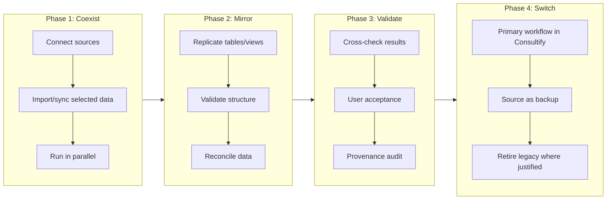
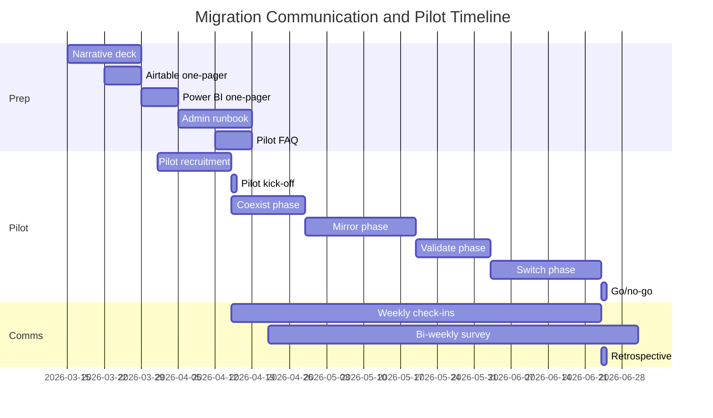

# WS-F: Migration Communication and Adoption Specification

Version: 1.0  
Owner: Product + GTM + Engineering  
Status: Draft  
Last updated: 2026-03-15  
Parent program: Consultify Table Platform 90-Day Delivery  
Related: [CONSULTIFY_CENTRAL_DATA_MIGRATION_COMMUNICATION_PLAN.md](../CONSULTIFY_CENTRAL_DATA_MIGRATION_COMMUNICATION_PLAN.md), [WS_A_PRODUCT_DEFINITION.md](WS_A_PRODUCT_DEFINITION.md)

---

## Strategic Context

Consultify positions as the **central decision-support and data operating layer**. Users currently use Airtable (operational tables) and Power BI (analytics dashboards). Migration must be staged: **coexist → mirror → validate → switch**. NOT a rip-and-replace.

**Core message:** *"Keep your current sources. Move your control, modeling, analysis, and decision flow into Consultify."*

---

## Table of Contents

1. [Migration Strategy Framework](#1-migration-strategy-framework)
2. [Stakeholder Communication Plan](#2-stakeholder-communication-plan)
3. [Airtable Migration Playbook](#3-airtable-migration-playbook)
4. [Power BI Migration Playbook](#4-power-bi-migration-playbook)
5. [Communication Assets Required](#5-communication-assets-required)
6. [Pilot Program Design](#6-pilot-program-design)
7. [Adoption Metrics Dashboard](#7-adoption-metrics-dashboard)
8. [Risk Mitigation](#8-risk-mitigation)
9. [Training and Enablement Plan](#9-training-and-enablement-plan)
10. [Competitive Positioning Guide](#10-competitive-positioning-guide)
11. [Timeline and Milestones](#11-timeline-and-milestones)

---

## 1. Migration Strategy Framework

### 1.1 The Four-Phase Model

The migration follows a proven staged approach. Each phase builds on the previous; no phase is skipped.



| Phase | Objective | Duration (typical) | Exit criteria |
|-------|-----------|--------------------|---------------|
| **Coexist** | Sources run in parallel; no forced migration | 2–4 weeks | ≥1 table/base connected; data visible in Consultify |
| **Mirror** | Structure and data replicated; dual workflow | 3–6 weeks | Schema mapped; records importable; views created |
| **Validate** | Data correctness confirmed; user acceptance | 1–2 weeks | Reconciliation pass; UAT sign-off; provenance verified |
| **Switch** | Consultify becomes primary; legacy as backup | Ongoing | Daily use; no critical workflows blocked; rollback path documented |

### 1.2 Decision Gates Between Phases

| Gate | Location | Criteria | Approver |
|------|----------|----------|----------|
| **G1** | Coexist → Mirror | At least one base/table successfully imported; no blocking data loss; admin runbook executed | Product + IT |
| **G2** | Mirror → Validate | All selected tables migrated; field mapping complete; views reproducible | Pilot lead + Analyst |
| **G3** | Validate → Switch | Reconciliation delta &lt; 0.1%; UAT passed; rollback plan approved | Sponsor + IT |
| **G4** | Switch → Retire | 4+ weeks stable primary use; no rollback needed; ROI documented | Executive sponsor |

### 1.3 Timeline Expectations per Phase

| Phase | Minimum | Typical | Maximum |
|-------|---------|---------|---------|
| Coexist | 1 week | 2–3 weeks | 6 weeks |
| Mirror | 2 weeks | 4 weeks | 8 weeks |
| Validate | 1 week | 2 weeks | 3 weeks |
| Switch | 2 weeks | 4 weeks | 12 weeks |

*Timelines scale with complexity: 5-table base vs. 50-table ecosystem, single team vs. enterprise.*

### 1.4 Rollback Plan at Each Stage

| Phase | Rollback trigger | Rollback action | Recovery time |
|-------|------------------|-----------------|---------------|
| **Coexist** | Connector failure; data corruption in import | Disable sync; continue in source; re-import from export | 24–48 hours |
| **Mirror** | Schema drift; reconciliation failure | Revert to source as primary; fix mapping; retry mirror | 1–3 days |
| **Validate** | UAT failure; critical data discrepancy | Pause switch; fix issues; re-run validation | 3–5 days |
| **Switch** | Workflow interruption; critical bug | Immediate revert to legacy; Consultify read-only; post-incident review | 4–24 hours |

**Rollback rule:** Source systems remain authoritative until switch is formally signed off. Never delete source data during migration.

---

## 2. Stakeholder Communication Plan

### 2.1 Executives and Sponsors

| Dimension | Detail |
|-----------|--------|
| **What they care about** | Governance, auditability, one source of truth, reporting consistency, lower tool fragmentation, board-ready visibility |
| **Primary message** | "Consultify becomes the operating system around data, analysis, decisions, and execution. One place to trust." |
| **Secondary messages** | Provenance on every number; executive packs auto-assembled; decisions traceable to data; no more analyst stitching across tools |
| **Concerns** | "Another tool"; "migration risk"; "cost"; "change fatigue" |
| **Objection responses** | Coexist first—no forced cutover. Migration is staged. ROI from reduced duplicate work and faster decisions. |
| **Channels** | Executive briefings (monthly); steering committee updates (bi-weekly); one-pager; narrative deck |
| **Cadence** | Monthly progress; escalation within 24 hours |
| **Success indicators** | Sponsor signs off gates; executive pack uses Consultify data; no escalations to board |

### 2.2 Operators and Team Leads

| Dimension | Detail |
|-----------|--------|
| **What they care about** | Simple tables, fewer copy-paste updates, reliable imports, clear ownership, less manual reporting, familiar workflows |
| **Primary message** | "Consultify reduces copy-paste work. Operate on live, connected data—linked to initiatives and decisions." |
| **Secondary messages** | Same table workflows you know; AI creates tables from descriptions; linked records, views, bulk edits; workspace context |
| **Concerns** | "Learning curve"; "another place to update"; "my Airtable automations will break" |
| **Objection responses** | Coexist—keep Airtable until you're ready. Import, don't rebuild. Automations: Phase 2; for now, manual/scheduled sync. |
| **Channels** | Team meetings; Slack/Teams; video tutorials; migration one-pagers; pilot FAQ |
| **Cadence** | Weekly during pilot; bi-weekly afterward |
| **Success indicators** | Import success; daily active use; positive NPS; champions emerge |

### 2.3 Analysts and Finance Users

| Dimension | Detail |
|-----------|--------|
| **What they care about** | Trustworthy data models, refresh behavior, traceability, KPI provenance, stable exports, audit trails |
| **Primary message** | "Consultify adds governed modeling and actionability on top of analytics. Every number traces back to its source." |
| **Secondary messages** | Governed vs. landing tables; provenance metadata; audit-ready exports; Finance module integration; P&L mapping |
| **Concerns** | "Power BI does this better"; "DAX formulas lost"; "no custom visuals"; "data freshness" |
| **Objection responses** | We're not replacing Power BI for viz. We're the layer that connects analytics to decisions and execution. Keep Power BI for charts; move KPI ownership and context to Consultify. |
| **Channels** | Analyst working sessions; documentation; admin runbook; technical FAQ |
| **Cadence** | Bi-weekly deep dives; ad-hoc for schema/questions |
| **Success indicators** | Governed tables in use; provenance queries; export to Reports; analyst trust score ≥4.0/5.0 |

### 2.4 IT and Admins

| Dimension | Detail |
|-----------|--------|
| **What they care about** | Access control, rollout risk, connector governance, audit, reversible migration, security, compliance |
| **Primary message** | "Consultify supports controlled enablement, source coexistence, and policy-based rollout. Migration is reversible." |
| **Secondary messages** | Feature flags; pilot-only access; audit trail on all mutations; connector run logs; rollback runbook |
| **Concerns** | "Another system to secure"; "data residency"; "SSO"; "connector maintenance" |
| **Objection responses** | Pilot scope is bounded. SSO/SCIM in Phase 2. Connectors: MVP uses CSV/API; governed sync in roadmap. Data stays in your tenant. |
| **Channels** | Admin runbook; architecture review; security questionnaire; escalation path |
| **Cadence** | Pre-pilot setup; weekly during pilot; monthly thereafter |
| **Success indicators** | No security incidents; rollback tested; connector logs reviewed; access model documented |

---

## 3. Airtable Migration Playbook

### 3.1 Step-by-Step Migration Guide

| Step | Action | Owner | Duration |
|------|--------|-------|----------|
| 1 | Inventory: list bases, tables, fields, record counts, views, relations | Team lead | 1–2 days |
| 2 | Prioritize: select 1–2 bases for pilot; avoid automations-heavy bases | Product | 1 day |
| 3 | Export: CSV or Airtable API export per table | Operator | 0.5–1 day |
| 4 | Map fields: use field type mapping table (Section 3.4) | Analyst | 1–2 days |
| 5 | Create base in Consultify: create workspace base; create tables with mapped schema | Operator | 1 day |
| 6 | Import data: CSV import per table; validate row counts | Operator | 0.5–1 day |
| 7 | Recreate linked records: map Airtable record IDs to Consultify IDs; populate linked_record fields | Operator | 1–2 days |
| 8 | Recreate views: filters, sorts, groupings, visible fields | Operator | 1 day |
| 9 | Validate: spot-check records; run reconciliation | Analyst | 1–2 days |
| 10 | UAT: pilot users confirm workflow | Team | 2–3 days |

### 3.2 What Transfers

| Asset | Transfers? | Notes |
|-------|------------|-------|
| Bases | Yes | As Consultify workspace bases |
| Tables | Yes | 1:1 mapping |
| Fields | Yes | With type mapping (see 3.4) |
| Records | Yes | Via CSV or API |
| Views | Yes | Filters, sorts, groupings, visible columns—recreated manually |
| Relations (linked records) | Yes | After import; links must be re-established using ID mapping |
| Attachments | Partial | URLs/file references; files may need re-upload |
| Comments | No | MVP: not migrated |
| Revision history | No | Consultify has audit trail from import onward |

### 3.3 What Does NOT Transfer

| Asset | Reason |
|------|--------|
| Automations | Trigger/action builder; Phase 2 in Consultify |
| Interfaces | Custom forms, pages; separate product surface |
| Extensions | Third-party scripts; not in MVP |
| Collaborator permissions | Consultify uses workspace/base-level RBAC; mapping may differ |
| Sync connections | Airtable Sync; use Consultify connectors or manual sync |
| Formula expressions | Full formula engine in Phase 2; numeric results can be imported as static values |
| Conditional formatting | View-level; recreate in Consultify views where supported |

### 3.4 Field Type Mapping Table

| Airtable type | Consultify type | Notes |
|---------------|-----------------|-------|
| Single line text | `singleLineText` | Direct |
| Long text | `longText` | Direct |
| Number | `number` | Direct |
| Currency | `currency` | Map currency code to options |
| Percent | `percent` | Direct |
| Single select | `singleSelect` | Map options; create same options in Consultify |
| Multiple select | `multiSelect` | Map options |
| Date | `date` | ISO format |
| Checkbox | `checkbox` | Direct |
| URL | `url` | Direct |
| Email | `email` | Direct |
| Phone | `phone` | Direct |
| Attachment | `attachment` | URLs; files may need re-upload |
| Link to another record | `linkedRecord` | Re-establish after import via ID mapping |
| Lookup | `lookup` (or store as `number`/`text`) | Lookup logic may need recreation; or import as static value |
| Rollup | `rollup` (or `number`) | Rollup logic in Phase 2; or import result |
| Formula | `number` / `text` | Import formula result; formula not migrated |
| Created time | `createdTime` | Preserve if export includes it |
| Last modified time | `lastModifiedTime` | Preserve if export includes it |
| Created by | `createdBy` | Map user IDs |
| Last modified by | `lastModifiedBy` | Map user IDs |
| Auto number | `autoNumber` or `number` | Import as number; autoNumber for new records |

### 3.5 Data Migration Approach

| Method | When to use | Pros | Cons |
|--------|-------------|------|------|
| **CSV import** | MVP; &lt;50k rows per table | Simple; no API dependency | Manual; no incremental sync |
| **API export + import** | Larger tables; automated script | Programmability; batch control | Development effort; rate limits |
| **Sync connector** | Phase 2; ongoing sync | Near real-time; less manual | Requires connector build |
| **Manual entry** | Very small tables (&lt;50 rows) | Full control | Error-prone; slow |

### 3.6 Validation Checklist

- [ ] Row counts match (source vs. Consultify)
- [ ] No duplicate records introduced
- [ ] Linked records resolve correctly
- [ ] Single/multi-select options preserved
- [ ] Dates in correct format and timezone
- [ ] Currency values accurate
- [ ] Attachments accessible (or documented as manual re-upload)
- [ ] Views produce expected filtered/sorted results
- [ ] At least 3 pilot users have validated key workflows

### 3.7 Common Problems and Solutions

| Problem | Solution |
|---------|----------|
| Lookup/rollup formulas lost | Import computed values as static; document for Phase 2 formula engine |
| Linked record IDs don't match | Build ID mapping table during export; apply during import |
| Attachments as URLs only | Export file URLs; users re-upload critical files if needed |
| Large tables timeout | Chunk import (e.g., 5k rows per batch); use API if available |
| Select options differ | Create identical options in Consultify before import; validate casing |
| Date timezone drift | Ensure export in UTC or consistent TZ; document |

### 3.8 Timeline: Typical 5-Table Base

| Activity | Duration |
|----------|----------|
| Inventory + prioritization | 1 day |
| Export (5 tables) | 0.5 day |
| Field mapping | 1 day |
| Create schema in Consultify | 1 day |
| Import + link records | 2 days |
| Recreate views | 1 day |
| Validation + UAT | 2 days |
| **Total** | **~8–9 days** |

---

## 4. Power BI Migration Playbook

### 4.1 Step-by-Step Migration Guide

| Step | Action | Owner | Duration |
|------|--------|-------|----------|
| 1 | Inventory: list datasets, data sources, KPIs, report dependencies | Analyst | 2–3 days |
| 2 | Map semantic model: tables, columns, measures, relationships | Analyst | 2–3 days |
| 3 | Extract KPI definitions: document metrics, formulas, filters | Analyst | 1–2 days |
| 4 | Create governed tables in Consultify: map dataset tables to Consultify schema | Analyst | 2–3 days |
| 5 | Establish data flow: connect sources to Consultify landing tables (or import) | IT + Analyst | 2–5 days |
| 6 | Define KPIs in Consultify: recreate metric logic where supported | Analyst | 1–2 days |
| 7 | Recreate dashboards: use Consultify views, Reports module, Results module | Analyst | 3–5 days |
| 8 | Validate: compare Power BI vs. Consultify numbers | Analyst | 2–3 days |
| 9 | UAT: key stakeholders review | Sponsor | 1–2 days |

### 4.2 What Transfers

| Asset | Transfers? | Notes |
|-------|------------|-------|
| Datasets | Partial | Schema and data; not DAX measures |
| Tables/columns | Yes | As governed tables |
| Data sources | Yes | Connection config; refresh schedule |
| KPI definitions | Partial | Logic in Consultify terms; DAX not portable |
| Refresh schedules | Partial | Consultify connector/import schedule |
| Filters/slicers | Partial | As view filters |
| Basic visuals | Partial | Tables, simple charts via Results; custom visuals no |

### 4.3 What Does NOT Transfer

| Asset | Reason |
|------|--------|
| Custom visuals | Consultify uses built-in components |
| Paginated reports | Different product (SSRS-style) |
| DAX formulas | No DAX engine; logic must be re-expressed |
| Report canvas layout | Redesign in Consultify |
| R/Python visuals | Not supported |
| Incremental refresh logic | Manual or connector-based |
| Row-level security (RLS) | Map to Consultify permissions model |

### 4.4 Concept Mapping Table

| Power BI concept | Consultify equivalent | Migration approach |
|------------------|------------------------|--------------------|
| Dataset | Base + governed tables | Create base; create tables; map columns |
| Dataflow | Connector / import pipeline | Use Consultify connectors or scheduled CSV |
| Semantic model | Governed tables + field metadata | Table schema + provenance |
| Measure | Computed field / KPI definition | Recreate logic; Phase 2 formula/rollup |
| Calculated column | Formula field | Import result as static; or Phase 2 |
| Relationship | `linkedRecord` | Foreign-key style linking |
| Report | Report artifact + views | Assemble from views; link to Reports |
| Dashboard | Results module + embedded views | Recreate layout; link to governed tables |
| Filter | View filter | View filter configuration |
| Slicer | View filter (single/multi-select) | Filter on select field |
| Refresh | Connector run / import | Scheduled import or API-triggered |

### 4.5 Semantic Model Migration Approach

1. Document Power BI dataset schema (tables, columns, data types).
2. Map each table to a Consultify governed table.
3. Import or sync data into landing tables; then map to governed models.
4. Document measures and calculated columns; implement as static imports or Phase 2 logic.
5. Establish provenance: source system, refresh timestamp, connector run ID.

### 4.6 Dashboard Recreation Approach

1. Identify core visuals: tables, key charts, KPIs.
2. For tables: use Consultify grid views with filters/sorts.
3. For KPIs: use Results module or summary views with rollups.
4. For charts: use Results module chart types; custom visuals require redesign or stay in Power BI.
5. Link dashboard to governed tables; ensure refresh cadence matches decision needs.

### 4.7 Validation Checklist

- [ ] All source tables represented in Consultify
- [ ] Column types mapped correctly
- [ ] KPI values match within acceptable delta (document threshold)
- [ ] Refresh mechanism established
- [ ] Provenance visible on key metrics
- [ ] At least one report/dashboard recreated and approved
- [ ] Stakeholders can trace numbers to source

### 4.8 Common Problems and Solutions

| Problem | Solution |
|---------|----------|
| DAX measures too complex | Import pre-aggregated values; or keep Power BI for that report initially |
| Custom visual has no equivalent | Keep Power BI for that visual; or redesign with Consultify components |
| Refresh dependency chain | Document; use Consultify connector order or manual sequence |
| Large dataset size | Chunk import; incremental sync; archive old periods |
| RLS complexity | Map to Consultify base/workspace permissions; may require simplification |

---

## 5. Communication Assets Required

### 5.1 Migration Narrative Deck (12–15 Slides)

| # | Slide | Content |
|---|-------|---------|
| 1 | Title | "Consultify: Your Central Data and Decision Layer" |
| 2 | The problem | Fragmented tools: Airtable + Power BI + spreadsheets; no single place for decisions |
| 3 | The vision | One system: data, analysis, decisions, execution |
| 4 | Core message | "Keep your sources. Move control and flow into Consultify." |
| 5 | Migration model | Coexist → Mirror → Validate → Switch (Mermaid diagram) |
| 6 | What we're not doing | No rip-and-replace; no forced cutover; no day-one parity promise |
| 7 | Airtable path | Import, link, govern; what transfers, what doesn't |
| 8 | Power BI path | Semantic model → governed tables; KPI ownership; dashboard approach |
| 9 | Pilot plan | Who, when, scope, success criteria |
| 10 | Timeline | Phases and milestones |
| 11 | Rollback | Reversibility at each stage |
| 12 | Next steps | Pilot selection; kick-off date; FAQ link |
| 13–15 | Appendix | Objection handling; contact; resources |

### 5.2 Airtable Migration One-Pager (Content Outline)

- **Headline:** Bring your Airtable data into Consultify
- **What transfers:** Bases, tables, fields, records, views, relations
- **What doesn't:** Automations, interfaces, extensions, formulas
- **How:** Export → map fields → import → recreate views → validate
- **Timeline:** ~8–9 days for 5-table base
- **Support:** Pilot FAQ; admin runbook; [link]

### 5.3 Power BI Migration One-Pager (Content Outline)

- **Headline:** Move KPI ownership and context to Consultify
- **What transfers:** Datasets, tables, sources, KPI definitions (logic re-expressed)
- **What doesn't:** DAX, custom visuals, paginated reports
- **How:** Map semantic model → create governed tables → connect sources → recreate dashboards
- **Timeline:** 2–4 weeks for typical dataset
- **Support:** Admin runbook; analyst deep-dive; [link]

### 5.4 Admin Runbook for Source Connection (ToC)

1. **Overview**
2. **Prerequisites** (accounts, permissions, network)
3. **Connector types**
   - CSV import
   - API-based sync (when available)
   - File-based (Excel, JSON)
4. **Step-by-step: CSV import**
   - Prepare file
   - Create table
   - Map columns
   - Validate
5. **Step-by-step: API connection** (Phase 2 placeholder)
6. **Refresh configuration**
7. **Error handling and retry**
8. **Audit and logging**
9. **Rollback procedure**
10. **Troubleshooting** (common errors, support path)

### 5.5 Pilot FAQ (25+ Questions)

| # | Question | Answer (summary) |
|---|----------|-----------------|
| 1 | What is Consultify? | Decision-support system: data, analysis, decisions, execution in one place |
| 2 | Do I have to leave Airtable/Power BI? | No. Coexist first. Migrate when ready |
| 3 | What happens to my data? | Imported into Consultify; source remains until you switch |
| 4 | Can I roll back? | Yes. Rollback plan at each phase |
| 5 | What if I use Airtable automations? | Phase 2. For now: manual or scheduled sync |
| 6 | What about my Power BI DAX? | Re-expressed in Consultify or kept in Power BI for now |
| 7 | How long does migration take? | 5-table base: ~8–9 days. Complex: 3–6 weeks |
| 8 | Will my views be recreated? | Yes, manually; we provide mapping guidance |
| 9 | What about attachments? | URLs transfer; files may need re-upload |
| 10 | Who has access? | Workspace/base permissions; pilot scope defined |
| 11 | Is my data secure? | Tenant isolation; audit trail; [security doc link] |
| 12 | What if I find a bug? | Escalation path; support channel; severity SLAs |
| 13 | Can I import from Google Sheets? | Yes, via CSV export |
| 14 | What field types are supported? | See field mapping table; most common types yes |
| 15 | How do linked records work? | Same concept; re-established after import |
| 16 | What's a governed table? | Locked-down model; provenance; approval for changes |
| 17 | Can I use AI to create tables? | Yes; describe in chat; approve proposal |
| 18 | How do I get help? | FAQ, video tutorials, champion, support |
| 19 | What's the pilot duration? | 4–6 weeks |
| 20 | What happens after pilot? | Go/no-go; expansion or iteration |
| 21 | Will I get training? | Yes; videos, live sessions, documentation |
| 22 | What if I'm not technical? | AI-first flow; champions; simplified workflows |
| 23 | Can I export my data? | Yes; CSV, API (per roadmap) |
| 24 | What about formulas? | Phase 2; for now, import results |
| 25 | How do I report issues? | [Escalation path]; [link] |

### 5.6 Objection-Handling Script (10+ Objections)

| Objection | Response |
|-----------|----------|
| "We already have Airtable" | Airtable is great for ops. Consultify connects that data to initiatives, governance, reports, execution. Coexist first. |
| "We already have Power BI" | Power BI excels at viz. Consultify is the layer for KPI ownership, context, decisions, action. Keep both; unify the flow. |
| "Migration will be painful" | Staged path. Start with 1–2 tables. No big-bang. Rollback at every stage. |
| "Another tool to learn" | AI creates tables from descriptions. Familiar grid UX. Focus on decisions, not configuration. |
| "We don't want another silo" | Consultify is the central layer—connectors, lineage, outputs. Designed to reduce silos. |
| "Feature gaps will block us" | Known limitations documented. Pilot scope avoids automations/DAX-heavy use. Phase 2 roadmap. |
| "Our data is too sensitive" | Tenant isolation. Audit trail. Pilot scope. Security review available. |
| "IT won't support it" | Reversible. Pilot-only. Admin runbook. We'll work with IT. |
| "No time for migration" | Coexist = no immediate cutover. Mirror when ready. Phased over months. |
| "What if it doesn't work?" | Rollback plan. Source remains primary. No deletion until switch signed off. |

---

## 6. Pilot Program Design

### 6.1 Pilot Cohort Selection Criteria

| Criterion | Requirement |
|-----------|--------------|
| **Willingness** | Volunteers or strongly motivated teams |
| **Scope** | 1–2 bases or 1–2 Power BI datasets max |
| **Complexity** | Avoid automations-heavy, DAX-heavy, 50+ table bases |
| **Representation** | Mix of operators, analysts; at least 1 champion |
| **Availability** | Can commit 2–4 hrs/week during pilot |
| **Sponsor** | Executive or senior sponsor for the area |

### 6.2 Pilot Scope Definition

- **In scope:** 1–2 Airtable bases (or 1–2 Power BI datasets); CSV import; core views; linked records where feasible
- **Out of scope:** Automations; Interfaces; full formula engine; custom Power BI visuals; enterprise SSO

### 6.3 Success Metrics for Pilot

| Metric | Target |
|--------|--------|
| Import success rate | ≥90% |
| User activation (create/use table in week 1) | ≥60% |
| Weekly active users (4 consecutive weeks) | Growth |
| Trust score (survey) | ≥4.0/5.0 |
| Critical blockers | 0 |
| Rollback invoked | 0 |

### 6.4 Pilot Timeline (4–6 Weeks)

| Week | Focus |
|------|-------|
| 1 | Kick-off; access; training; first import |
| 2 | Full mirror; view recreation; UAT start |
| 3 | Validation; reconciliation; feedback |
| 4 | Switch (or extend); daily use; feedback |
| 5–6 | Extension if needed; go/no-go prep |

### 6.5 Feedback Collection Mechanism

- **Weekly check-in:** 30 min with pilot lead
- **Async survey:** Bi-weekly (5–7 questions)
- **Slack/Teams channel:** Ongoing Q&A
- **Issue tracker:** Bugs and feature requests
- **Retrospective:** End of pilot (what worked, what didn't)

### 6.6 Go/No-Go Criteria for Expansion

| Go | No-Go |
|----|-------|
| Success metrics met | Critical blockers unresolved |
| Trust score ≥4.0 | Trust score &lt;3.5 |
| No rollback needed | Rollback invoked |
| Sponsor recommends | Sponsor hesitates |
| Documentation complete | Gaps in runbooks |

### 6.7 Escalation Paths During Pilot

| Severity | Response |
|----------|----------|
| P1 (blocker) | Product/Eng within 4 hours; fix or rollback within 24h |
| P2 (major) | Within 24 hours; fix within 1 week |
| P3 (minor) | Logged; prioritized in backlog |
| Process | Pilot lead → Product → Engineering → Sponsor |

---

## 7. Adoption Metrics Dashboard

### 7.1 Metrics to Track

| Metric | Description | Source |
|--------|-------------|--------|
| Active users (DAU/WAU) | Users who read or write in tables | Analytics |
| Tables created | New tables per workspace | Metadata API |
| Data imported | Rows imported (CSV, API) | Audit/import logs |
| Queries run | View loads, filter changes | Analytics |
| Reports generated | Reports using table data | Reports module |
| Migration completion % | Bases/tables migrated / total planned | Manual + metadata |
| Linked records adoption | % tables with ≥1 linked_record | Metadata |
| Chat-to-Schema usage | Proposals created, approved | Chat analytics |
| Governed tables | Count of governed tables | Metadata |
| Pilot NPS | Net Promoter Score | Survey |

### 7.2 Leading vs. Lagging Indicators

| Leading | Lagging |
|---------|---------|
| Import attempts | Migration completion % |
| Tables created | Active users (WAU) |
| Chat-to-Schema proposals | Reports using Consultify data |
| First-view creation | Full workflow switch |
| Weekly check-in sentiment | Pilot success sign-off |

### 7.3 Dashboard Wireframe Specification

**Layout:**
- **Row 1:** KPI cards: WAU, tables created, migration %, NPS
- **Row 2:** Time-series: active users, imports, queries (weekly)
- **Row 3:** Breakdown: by workspace, by user role, by table type
- **Row 4:** Alerts: thresholds breached; pilot milestones

**Filters:** Date range, workspace, pilot cohort

**Refresh:** Daily (batch); real-time for alerts

### 7.4 Alerting Thresholds

| Condition | Action |
|-----------|--------|
| WAU drop &gt;20% week-over-week | Investigate; comms check |
| Import failure rate &gt;10% | P2 escalation; fix or document |
| Pilot NPS &lt;0 | Immediate review; sponsor call |
| Zero migration progress 2 weeks | Pilot lead check-in |
| P1 bug open &gt;24h | Escalate to Eng/Product |

---

## 8. Risk Mitigation

### 8.1 Risk: Users Resist Change

| Mitigation | Actions |
|------------|---------|
| **Coexist message** | Emphasize no forced cutover; source stays primary |
| **Champion program** | Identify and empower power users |
| **Quick wins** | Show value in first 2 weeks (e.g., one auto-assembled view) |
| **Training** | Videos, live sessions, FAQ |
| **Executive sponsorship** | Visible sponsor support |

### 8.2 Risk: Data Loss During Migration

| Mitigation | Actions |
|------------|---------|
| **Source remains authoritative** | Never delete source until switch signed off |
| **Validation checklist** | Row counts, reconciliation, spot checks |
| **Audit trail** | All imports logged; provenance on records |
| **Rollback plan** | Documented; tested |
| **Backup before import** | Export source before any bulk operation |

### 8.3 Risk: Performance Issues with Imported Data

| Mitigation | Actions |
|------------|---------|
| **Server-side query** | No client-side full-table filtering |
| **Chunked import** | Batch large tables (e.g., 5k rows) |
| **Indexing** | Ensure indexes on filter/sort columns |
| **View limits** | Pagination; avoid loading 100k+ rows in UI |
| **Performance budget** | p95 &lt;500ms for list; monitor |

### 8.4 Risk: Feature Gaps Cause Workflow Interruption

| Mitigation | Actions |
|------------|---------|
| **Scope pilot carefully** | Avoid automations-heavy, formula-heavy bases |
| **Known limitations doc** | Publish what's not supported |
| **Phase 2 roadmap** | Show when gaps will close |
| **Keep legacy for gap areas** | e.g., Power BI for custom visuals |
| **Workarounds** | Document manual alternatives |

### 8.5 Risk: Communication Outpaces Product Readiness

| Mitigation | Actions |
|------------|---------|
| **Product guardrails** | Don't promise features not in MVP |
| **Pilot gating** | Only expand when pilot criteria met |
| **Staged comms** | Coexist → Mirror → Validate → Switch (no skip) |
| **Check before launch** | Verify connectors, import, views work before broad comms |
| **Transparent roadmap** | Clear Phase 2 vs. now |

---

## 9. Training and Enablement Plan

### 9.1 Self-Service Documentation Structure

```
/docs
  /migration
    overview.md
    airtable-playbook.md
    powerbi-playbook.md
    field-mapping.md
  /admin
    runbook-source-connection.md
    runbook-rollback.md
  /user
    getting-started.md
    creating-tables-with-ai.md
    views-and-filters.md
  /faq
    pilot-faq.md
```

### 9.2 Video Tutorial Series

| # | Topic | Duration | Audience |
|---|-------|----------|----------|
| 1 | Consultify overview: data, decisions, execution | 5 min | All |
| 2 | Creating your first table with AI | 7 min | Operators |
| 3 | Importing from CSV | 6 min | Operators |
| 4 | Views, filters, and sorting | 5 min | Operators |
| 5 | Linked records | 6 min | Operators |
| 6 | Governed tables and provenance | 7 min | Analysts |
| 7 | Airtable migration walkthrough | 10 min | Migrators |
| 8 | Power BI migration walkthrough | 10 min | Analysts |
| 9 | Admin: connector setup | 8 min | IT/Admin |

### 9.3 Live Training Sessions Plan

| Session | When | Topic | Duration |
|---------|------|-------|----------|
| Pilot kick-off | Week 1 | Overview, hands-on: first import | 90 min |
| Deep dive: views | Week 2 | Views, filters, linked records | 60 min |
| Analyst session | Week 3 | Governed tables, provenance, exports | 60 min |
| Office hours | Weekly | Q&A; screen-share support | 30 min |
| Retrospective | Pilot end | What worked; next steps | 60 min |

### 9.4 Champion Program

| Element | Detail |
|---------|--------|
| **Role** | Power users who help others; early adopters |
| **Selection** | Volunteers from pilot; 1–2 per team |
| **Responsibilities** | Answer questions; demo; collect feedback; flag issues |
| **Recognition** | Badge; early access; influence on roadmap |
| **Support** | Dedicated channel; monthly champion call |

### 9.5 Support Escalation Model

| Tier | Handler | SLA | Escalation to |
|------|---------|-----|---------------|
| T1 | Support / Champion | 24h response | T2 |
| T2 | Product / Customer success | 24h response; 1 week resolve | T3 |
| T3 | Engineering | P1: 4h; P2: 1 week | - |

---

## 10. Competitive Positioning Guide

### 10.1 Consultify vs. Airtable

| Where we win | Where we don't compete yet |
|--------------|----------------------------|
| Decision layer (initiatives, reports, finance) | Interfaces, automations builder |
| AI-first table creation | Extensions, scripting |
| Governed models, provenance | Real-time collaboration scale |
| Workspace-embedded tables | Standalone app builder |
| Central hub for data + execution | Airtable-native sync ecosystem |

**Talk track:** "Airtable is excellent for flexible tables. Consultify connects that operational data to strategic initiatives, governance, reports, and execution—in one system. Start by importing; keep Airtable until you're ready."

### 10.2 Consultify vs. Power BI

| Where we win | Where we don't compete yet |
|--------------|----------------------------|
| Action loop (data → decision → execution) | Rich visualization, custom visuals |
| KPI ownership and context | DAX, complex modeling |
| Governed operational layer | Paginated reports, R/Python |
| Workspace-embedded analysis | Enterprise BI at scale |
| Provenance and audit | Power BI Premium features |

**Talk track:** "Power BI is strong for dashboards and semantic analytics. Consultify is the layer that turns insights into governed workflows, decisions, and execution. Keep Power BI for viz; move KPI ownership and action to Consultify."

### 10.3 Consultify vs. Notion

| Differentiation | Consultify | Notion |
|-----------------|------------|--------|
| Core identity | Decision-support | Knowledge base |
| Tables | First-class, governed, provenance | Document-embedded, lightweight |
| AI | Schema creation, proposals | Writing, summarization |
| Action loop | Native: initiatives, reports | Manual; external |
| Data modeling | Metadata-first, query engine | Simpler, document-centric |

**Talk track:** "Notion excels at docs and wikis. Consultify is built for decisions: structured data, governed models, traceability, and execution—not just knowledge capture."

### 10.4 When to Recommend Keeping External Tool vs. Migrating

| Scenario | Recommendation |
|----------|----------------|
| Heavy automations, Interfaces | Keep Airtable for now; migrate data only |
| Custom Power BI visuals, complex DAX | Keep Power BI for those reports; migrate KPIs and context |
| Small, simple base | Migrate; quick win |
| Governance, audit, executive pack | Migrate; core value |
| Real-time multi-user editing at scale | Evaluate; may keep incumbent |
| Pilot scope | Migrate only in-scope bases |

### 10.5 Talk Tracks by Scenario

| Scenario | Talk track |
|----------|------------|
| **Airtable power user** | "Bring your data in. Keep the workflows you love. Gain governance and decision linkage." |
| **Power BI analyst** | "Keep your dashboards. Add Consultify for KPI ownership, provenance, and action." |
| **Executive** | "One place for trusted data, decisions, and execution. No more stitching across tools." |
| **IT/Admin** | "Controlled rollout. Reversible. Audit trail. We'll work with you." |
| **Skeptic** | "Coexist first. No cutover until you're ready. Rollback at every stage." |

---

## 11. Timeline and Milestones

### 11.1 Communication Milestones Aligned with Product Sprints

| Sprint | Product milestone | Communication milestone |
|--------|-------------------|-------------------------|
| S1 | Metadata core; CSV import v1 | Internal: migration framework doc; narrative deck draft |
| S2 | Records CRUD; grid UI v1 | Pilot recruitment; Airtable one-pager |
| S3 | Views; linked records v1 | Power BI one-pager; admin runbook v1 |
| S4 | Chat-to-Schema v1; pilot prep | Pilot kick-off; FAQ published |
| S5 | Pilot run | Weekly check-ins; feedback loop |
| S6 | Pilot iteration; go/no-go | Retrospective; expansion comms (if go) |

### 11.2 Pre-Launch, Launch, Post-Launch Communication Cadence

| Phase | Cadence | Content |
|-------|---------|---------|
| **Pre-launch** | Bi-weekly | Narrative deck; pilot criteria; FAQ drafts; objection script |
| **Launch (pilot)** | Weekly | Kick-off; progress updates; office hours; survey |
| **Post-launch** | Bi-weekly → monthly | Expansion comms; case study; roadmap update; champion recognition |

### 11.3 Gantt-Like Timeline (Mermaid)



---

## Appendix: Document Relationships

| Document | Relationship |
|----------|--------------|
| [CONSULTIFY_CENTRAL_DATA_MIGRATION_COMMUNICATION_PLAN.md](../CONSULTIFY_CENTRAL_DATA_MIGRATION_COMMUNICATION_PLAN.md) | Parent strategy; this spec operationalizes it |
| [WS_A_PRODUCT_DEFINITION.md](WS_A_PRODUCT_DEFINITION.md) | Product vision, personas, competitive positioning |
| [WS_B_ARCHITECTURE_BOUNDARIES.md](WS_B_ARCHITECTURE_BOUNDARIES.md) | Technical boundaries; integration points |
| [WS_C_TABLE_PLATFORM_CORE_SPEC.md](WS_C_TABLE_PLATFORM_CORE_SPEC.md) | Field types; schema; implementation reference |
| [CONSULTIFY_TABLE_PLATFORM_MIGRATION_AND_ISOLATION.md](../CONSULTIFY_TABLE_PLATFORM_MIGRATION_AND_ISOLATION.md) | Technical migration path; adapter model |
| [CONSULTIFY_TABLE_PLATFORM_RISK_REGISTER.md](../CONSULTIFY_TABLE_PLATFORM_RISK_REGISTER.md) | Risk escalation; assumptions |

---

*This document is the operational specification for migration communication and adoption. All pilots, comms assets, and training should align with this spec.*
