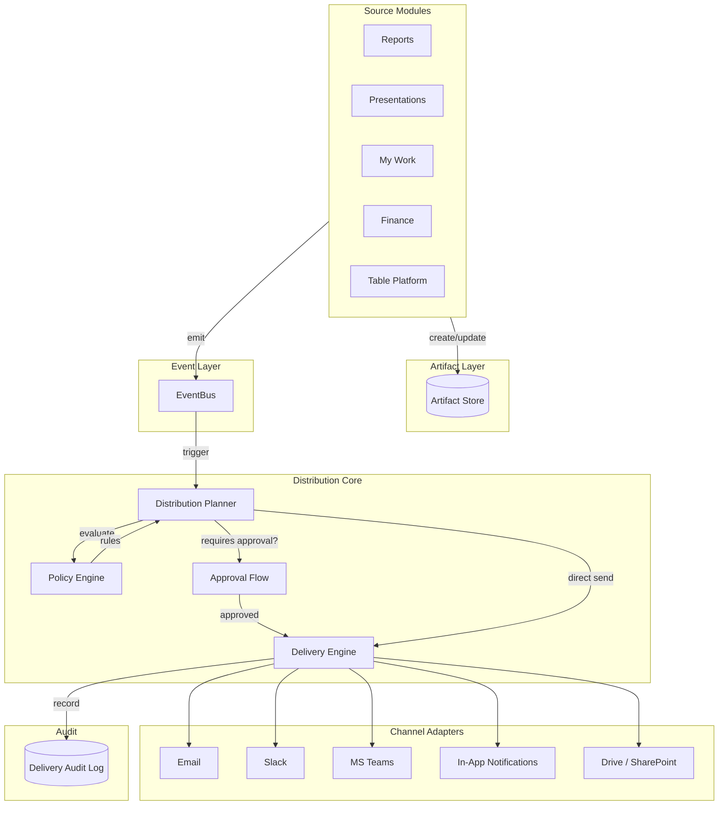
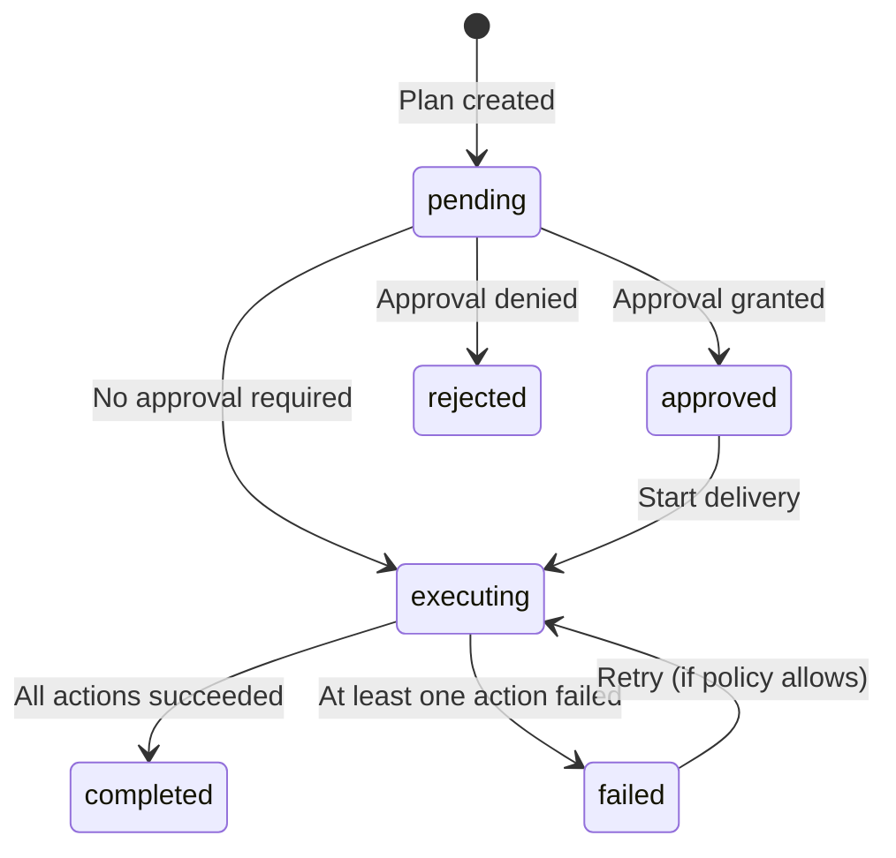

# WS-G: Artifact Distribution Separation — Technical Specification

Version: 1.0  
Owner: Product + Engineering  
Status: Draft  
Last updated: 2026-03-15  
Parent: [CONSULTIFY_ARTIFACT_DISTRIBUTION_AUTOMATION_PLAN](../CONSULTIFY_ARTIFACT_DISTRIBUTION_AUTOMATION_PLAN.md)  
Related: [WS-B Architecture & Boundaries](WS_B_ARCHITECTURE_BOUNDARIES.md), [WS-C Table Platform Core Spec](WS_C_TABLE_PLATFORM_CORE_SPEC.md), [CONSULTIFY_TABLE_PLATFORM_ARCHITECTURE](../CONSULTIFY_TABLE_PLATFORM_ARCHITECTURE.md)

---

## Executive Summary

Consultify creates multiple artifact types: **reports**, **presentations**, **idea maps**, **notes**, and **tables**. Distribution and communication automation must be a **separate cross-module capability**, not logic embedded in each module. This prevents duplicated send logic, schedule engines, retry queues, and channel adapters across Finance, Results, Reports, Presentations, and My Work.

**Core principle:** Source modules **CREATE** artifacts. A shared Distribution module **DELIVERS** them.

---

## Table of Contents

1. [Architecture Overview](#1-architecture-overview)
2. [Canonical Artifact Contract](#2-canonical-artifact-contract)
3. [Business Event Catalog](#3-business-event-catalog)
4. [Distribution Planner](#4-distribution-planner)
5. [Policy Engine](#5-policy-engine)
6. [Approval Flow](#6-approval-flow)
7. [Delivery Engine](#7-delivery-engine)
8. [Audit and Tracking](#8-audit-and-tracking)
9. [Recipient Model](#9-recipient-model)
10. [Scheduling](#10-scheduling)
11. [Template System](#11-template-system)
12. [What Source Modules Must NOT Do](#12-what-source-modules-must-not-do)
13. [Integration with Table Platform](#13-integration-with-table-platform)
14. [Phased Rollout](#14-phased-rollout)
15. [Domain Boundaries](#15-domain-boundaries)

---

## 1. Architecture Overview

### 1.1 Separation of Concerns

| Layer | Responsibility | Owner |
|-------|----------------|-------|
| **Creation** | Produce artifact content (report, deck, map, note, table view) | Source module (Reports, Presentations, My Work, etc.) |
| **Publishing** | Mark artifact as ready, finalize version, expose for distribution | Source module |
| **Distribution** | Decide when/how to send, route to channels, track delivery, enforce policy | Distribution module |

Source modules emit **events** and expose **artifact contracts**. The Distribution module consumes events, enforces policy, executes plans, and delivers via channel adapters.

### 1.2 Architecture Diagram



### 1.3 Component Responsibilities

| Component | Responsibility |
|-----------|----------------|
| **Source Module** | Create artifact, update status, emit business events, expose artifact contract via lookup API |
| **Artifact Store** | Persist artifact metadata; Distribution reads via contract, never writes |
| **EventBus** | Deliver typed business events to Distribution Planner; at-least-once delivery |
| **Distribution Planner** | Match events to policies, build distribution plans, invoke Approval when needed |
| **Policy Engine** | Evaluate policies (artifact type, channel, approval, retention); return applicable rules |
| **Approval Flow** | Route approval requests, track decisions, escalate on timeout, support bulk approval |
| **Delivery Engine** | Execute plans, invoke channel adapters, retry on failure, record audit entries |
| **Channel Adapters** | Render message, send via external API; each adapter is stateless |
| **Audit Log** | Immutable delivery records; supports compliance queries and retention |

---

## 2. Canonical Artifact Contract

Every artifact participating in distribution must implement the following contract.

### 2.1 TypeScript Interface

```typescript
/** Artifact types supported by the Distribution module */
export type ArtifactType =
  | 'report'
  | 'presentation'
  | 'idea_map'
  | 'note'
  | 'table_view'
  | 'finance_statement';

/** Lifecycle statuses for distribution eligibility */
export type ArtifactStatus =
  | 'draft'
  | 'ready_for_review'
  | 'approved'
  | 'published'
  | 'archived';

/** Export formats the artifact can produce */
export type ExportCapability = 'pdf' | 'csv' | 'xlsx' | 'png' | 'docx' | 'pptx' | 'link';

/** Scope of who can access the artifact */
export type AccessScope =
  | 'private'
  | 'workspace'
  | 'organization'
  | 'public_shared';

/** Source module identifier */
export type SourceModule =
  | 'reports'
  | 'presentations'
  | 'my_work'
  | 'finance'
  | 'results'
  | 'table_platform'
  | 'interview';

export interface CanonicalArtifactContract {
  /** Unique artifact identifier (UUID) */
  artifact_id: string;
  /** Discriminator for policy and export selection */
  artifact_type: ArtifactType;
  /** Organization owning the artifact */
  organization_id: string;
  /** User who owns or created the artifact */
  owner_id: string;
  /** Human-readable title */
  title: string;
  /** Lifecycle status; distribution typically requires approved or published */
  status: ArtifactStatus;
  /** Semantic version for change tracking */
  version: string;
  /** Whether artifact content is fully rendered and exportable */
  render_state: 'pending' | 'rendering' | 'ready' | 'failed';
  /** Supported export formats */
  export_capabilities: ExportCapability[];
  /** Access scope */
  access_scope: AccessScope;
  /** Module that owns this artifact */
  source_module: SourceModule;
  /** Optional workspace or project context */
  workspace_id?: string;
  /** Optional initiative or assessment context */
  initiative_id?: string;
  /** Creation timestamp (ISO 8601) */
  created_at: string;
  /** Last update timestamp (ISO 8601) */
  updated_at: string;
  /** Optional metadata for templates and policy */
  metadata?: Record<string, unknown>;
}
```

### 2.2 Artifact Statuses and Distribution Eligibility

| Status | Distribution Allowed | Typical Use |
|--------|----------------------|--------------|
| `draft` | Only if policy explicitly allows | Internal preview |
| `ready_for_review` | Only if policy allows | Review workflow |
| `approved` | Yes (primary) | Post-approval distribution |
| `published` | Yes (primary) | Public / stakeholder delivery |
| `archived` | No | Historical record only |

### 2.3 Export Capabilities by Artifact Type

| Artifact Type | PDF | DOCX | PPTX | CSV | XLSX | PNG | Link |
|---------------|-----|------|------|-----|------|-----|------|
| report | ✓ | ✓ | ✓ | — | — | — | ✓ |
| presentation | ✓ | — | ✓ | — | — | ✓ | ✓ |
| idea_map | — | — | — | — | — | ✓ | ✓ |
| note | ✓ | ✓ | — | — | — | — | ✓ |
| table_view | — | — | — | ✓ | ✓ | — | ✓ |
| finance_statement | ✓ | — | — | ✓ | ✓ | — | ✓ |

### 2.4 Registration API

Source modules **do not** register artifacts with Distribution. Instead, Distribution **looks up** artifacts via a standardized API when processing events.

```typescript
/** API contract: Distribution calls this to resolve artifact metadata */
interface ArtifactResolutionRequest {
  artifact_id: string;
  artifact_type: ArtifactType;
  organization_id: string;
}

interface ArtifactResolutionResponse {
  artifact: CanonicalArtifactContract;
  /** URL or path to fetch rendered export (if ready) */
  export_url?: string;
  /** Pre-computed secure link for sharing (if applicable) */
  secure_link?: string;
}
```

**Endpoint (conceptual):**
- `GET /api/distribution/artifacts/:type/:id` — returns `CanonicalArtifactContract` if artifact exists and caller has access.

Source modules expose this via an internal service or adapter; Distribution never stores artifact content itself.

---

## 3. Business Event Catalog

### 3.1 Event Interface

```typescript
/** Base envelope for all distribution-relevant events */
export interface DistributionEventEnvelope<T = unknown> {
  event_id: string;
  event_type: string;
  timestamp: string; // ISO 8601
  organization_id: string;
  source_module: SourceModule;
  actor_id?: string;
  correlation_id?: string;
  payload: T;
}
```

### 3.2 Complete Event Catalog

| Event Type | Payload Interface | When It Fires | Who Fires |
|------------|-------------------|---------------|-----------|
| `report.generated` | `ReportGeneratedPayload` | Report generation completes | Reports module |
| `report.approved` | `ReportApprovedPayload` | Approval workflow completes | Reports module |
| `report.published` | `ReportPublishedPayload` | Report marked published | Reports module |
| `presentation.published` | `PresentationPublishedPayload` | Deck finalized and published | Presentations module |
| `presentation.shared` | `PresentationSharedPayload` | User explicitly shares deck | Presentations module |
| `idea_map.snapshot_ready` | `IdeaMapSnapshotPayload` | Snapshot/export ready | My Work module |
| `note.approved` | `NoteApprovedPayload` | Note approved for distribution | Notes/My Work |
| `note.published` | `NotePublishedPayload` | Note published | Notes/My Work |
| `table.view_published` | `TableViewPublishedPayload` | Table view published | Table Platform |
| `table.export_ready` | `TableExportReadyPayload` | Export (CSV/XLSX) ready | Table Platform |
| `finance_statement.imported` | `FinanceStatementPayload` | Statement import completes | Finance module |

### 3.3 Payload Interfaces

```typescript
interface ReportGeneratedPayload {
  artifact_id: string;
  report_type: string;
  template_id?: string;
  scope: 'project' | 'portfolio' | 'initiative';
  scope_id?: string;
}

interface ReportApprovedPayload {
  artifact_id: string;
  approver_id: string;
  approval_notes?: string;
}

interface ReportPublishedPayload {
  artifact_id: string;
  published_by: string;
  share_url?: string;
}

interface PresentationPublishedPayload {
  artifact_id: string;
  presentation_type: string;
  slide_count?: number;
  published_by: string;
}

interface PresentationSharedPayload {
  artifact_id: string;
  shared_by: string;
  recipient_ids?: string[];
  channel?: 'email' | 'slack' | 'teams' | 'link';
}

interface IdeaMapSnapshotPayload {
  artifact_id: string;
  workspace_id: string;
  snapshot_type: 'png' | 'pdf' | 'link';
  snapshot_url?: string;
}

interface NoteApprovedPayload {
  artifact_id: string;
  approver_id: string;
  workspace_id?: string;
}

interface NotePublishedPayload {
  artifact_id: string;
  published_by: string;
}

interface TableViewPublishedPayload {
  artifact_id: string;
  base_id: string;
  view_id: string;
  view_name: string;
  published_by: string;
}

interface TableExportReadyPayload {
  artifact_id: string;
  base_id: string;
  view_id: string;
  export_format: 'csv' | 'xlsx';
  export_url: string;
}

interface FinanceStatementPayload {
  artifact_id: string;
  statement_type: 'balance_sheet' | 'pl' | 'cash_flow';
  period: string;
  source_document_id?: string;
}
```

### 3.4 Event Subscription Model

Distribution Planner subscribes to event types via EventBus. No module-specific logic—all events flow through the same pipeline.

```typescript
const DISTRIBUTION_SUBSCRIBED_EVENTS = [
  'report.generated',
  'report.approved',
  'report.published',
  'presentation.published',
  'presentation.shared',
  'idea_map.snapshot_ready',
  'note.approved',
  'note.published',
  'table.view_published',
  'table.export_ready',
  'finance_statement.imported',
] as const;
```

---

## 4. Distribution Planner

### 4.1 Event-to-Plan Flow

1. **Receive event** from EventBus
2. **Resolve artifact** via Artifact Resolution API
3. **Evaluate policies** (Policy Engine): event type + artifact type + context
4. **Build distribution plan** if policies match
5. **Check approval requirement** → route to Approval Flow or proceed
6. **Execute plan** via Delivery Engine

### 4.2 Distribution Plan Structure

```typescript
export interface DistributionPlan {
  plan_id: string;
  event_id: string;
  event_type: string;
  artifact_id: string;
  artifact_type: ArtifactType;
  organization_id: string;
  triggered_at: string;
  /** Actions to execute (one per channel/recipient group) */
  actions: DistributionAction[];
  /** Policies that produced this plan */
  policy_ids: string[];
  requires_approval: boolean;
  approval_request_id?: string;
  status: 'pending' | 'approved' | 'rejected' | 'executing' | 'completed' | 'failed';
  created_at: string;
  updated_at: string;
}

export interface DistributionAction {
  action_id: string;
  channel: DeliveryChannel;
  /** Resolved recipients (after recipient resolution) */
  recipients: ResolvedRecipient[];
  /** Template key + variables */
  template_key: string;
  template_vars: Record<string, unknown>;
  /** Attachment strategy */
  attachment_strategy: 'none' | 'inline' | 'secure_link' | 'file_upload';
  /** Export format for attachment */
  export_format?: ExportCapability;
  /** Schedule: immediate or deferred */
  scheduled_for?: string;
  priority: number;
}
```

### 4.3 Rule Matching

```
event_type + artifact_type + (workspace_id?) + (initiative_id?)
    → PolicyEngine.evaluate()
    → List<PolicyRule>
    → Each rule produces zero or more DistributionAction
```

Policy rules are matched in order; first match wins unless rule specifies `continue_matching: true`.

### 4.4 Plan Execution Lifecycle



---

## 5. Policy Engine

### 5.1 Policy Model

```typescript
export interface DistributionPolicy {
  id: string;
  organization_id: string;
  name: string;
  description?: string;
  /** Inheritance: org → workspace → initiative (optional) */
  scope: 'organization' | 'workspace' | 'initiative';
  scope_id?: string; // workspace_id or initiative_id
  /** Priority: lower = higher precedence */
  priority: number;
  is_active: boolean;
  created_at: string;
  updated_at: string;
  rules: PolicyRule[];
}

export interface PolicyRule {
  id: string;
  /** Event types this rule applies to (or ['*'] for all) */
  event_types: string[];
  /** Artifact types (or ['*']) */
  artifact_types: ArtifactType[];
  /** Allowed channels */
  channels: DeliveryChannel[];
  /** Whether approval is required before send */
  approval_required: boolean;
  /** Who must approve: owner, workspace_admin, org_admin, specific_role */
  approval_role?: string;
  /** Recipient restrictions */
  recipient_restrictions?: {
    allowed_types: ('user' | 'group' | 'role' | 'external_email' | 'stakeholder_list')[];
    max_external?: number;
    require_internal_first?: boolean;
  };
  /** Attachment rules */
  attachment_rules?: {
    allowed_formats: ExportCapability[];
    max_size_mb?: number;
    secure_link_only?: boolean;
  };
  /** Retention: days to keep audit records */
  retention_days?: number;
  /** Continue evaluating lower-priority rules after match */
  continue_matching?: boolean;
}

export type DeliveryChannel = 'email' | 'slack' | 'teams' | 'in_app' | 'drive' | 'sharepoint';
```

### 5.2 Policy Dimensions Summary

| Dimension | Options | Purpose |
|-----------|---------|---------|
| Event types | Specific or `*` | When rule applies |
| Artifact types | Specific or `*` | What can be sent |
| Channels | email, slack, teams, in_app, drive, sharepoint | Where to send |
| Approval | required / not required | Governance gate |
| Recipient restrictions | types, max external, internal-first | Data protection |
| Attachment rules | formats, max size, secure-link-only | Export governance |
| Retention | days | Audit compliance |

### 5.3 Default Policies per Artifact Type

| Artifact Type | Default Channels | Default Approval | Notes |
|---------------|------------------|------------------|-------|
| report | email, in_app, link | Yes (if external) | PDF/DOCX/PPTX attachment |
| presentation | email, in_app, link | Yes (if external) | PPTX or PNG |
| idea_map | in_app, link | No | Snapshot or link |
| note | email, in_app, link | Configurable | Often internal |
| table_view | email, in_app, drive | Yes (if external) | CSV/XLSX or link |
| finance_statement | email, drive | Yes (always) | Highly governed |

### 5.4 Policy Inheritance

```
Organization policy (scope=organization)
    ↓ overridden by
Workspace policy (scope=workspace, scope_id=workspace_id)
    ↓ overridden by
Initiative policy (scope=initiative, scope_id=initiative_id)
```

Evaluation order: initiative → workspace → organization. First matching rule wins (by priority, then creation order).

### 5.5 Policy CRUD API

| Method | Endpoint | Purpose |
|--------|----------|---------|
| GET | `/api/distribution/policies` | List policies (filter by org, scope) |
| GET | `/api/distribution/policies/:id` | Get single policy |
| POST | `/api/distribution/policies` | Create policy |
| PATCH | `/api/distribution/policies/:id` | Update policy |
| DELETE | `/api/distribution/policies/:id` | Soft-delete policy |

---

## 6. Approval Flow

### 6.1 When Approval Is Required

- Policy rule has `approval_required: true`
- Recipient list includes external emails (configurable)
- Attachment exceeds certain size (configurable)
- Artifact type is in high-governance set (e.g. finance_statement)

### 6.2 Approval Request Structure

```typescript
export interface ApprovalRequest {
  id: string;
  distribution_plan_id: string;
  organization_id: string;
  /** Who requested the send */
  requested_by: string;
  /** Who must approve (resolved from policy) */
  approvers: ApprovalTarget[];
  /** Current status */
  status: 'pending' | 'approved' | 'rejected' | 'expired';
  /** Timeout: ISO timestamp; after this, escalate or auto-reject */
  expires_at: string;
  /** Optional comment from requester */
  request_comment?: string;
  /** Approver comments (when decided) */
  decision_comment?: string;
  decided_by?: string;
  decided_at?: string;
  created_at: string;
  updated_at: string;
}

export interface ApprovalTarget {
  user_id: string;
  role?: string;
  /** For round-robin or first-available */
  order?: number;
}
```

### 6.3 Approval Routing

| Policy `approval_role` | Resolved Approver |
|-----------------------|-------------------|
| `owner` | Artifact owner_id |
| `workspace_admin` | Workspace admins |
| `org_admin` | Organization admins |
| `specific_role:consultant` | Users with role `consultant` in scope |
| `any_one` | First user in recipient list with approval permission |

### 6.4 Timeout and Escalation

- **Timeout**: Policy defines `approval_timeout_hours`. After expiry:
  - Option A: Auto-reject
  - Option B: Escalate to next approver tier
- **Escalation chain**: e.g. owner → workspace_admin → org_admin

### 6.5 Bulk Approval

For recurring digests or batch sends, a single approval can cover multiple artifacts if:
- Same artifact type
- Same channel
- Same recipient group
- Policy allows `bulk_approval: true`

---

## 7. Delivery Engine

### 7.1 Channel Adapter Interface

```typescript
export interface ChannelAdapter {
  readonly channel: DeliveryChannel;
  /** Send one delivery; returns outcome */
  send(params: ChannelSendParams): Promise<ChannelSendResult>;
  /** Validate config (API keys, webhook URLs) */
  validateConfig(config: Record<string, unknown>): Promise<ValidationResult>;
}

export interface ChannelSendParams {
  artifact: CanonicalArtifactContract;
  recipients: ResolvedRecipient[];
  template_rendered: RenderedMessage;
  attachment?: {
    type: ExportCapability;
    url: string;
    filename: string;
  };
  options?: Record<string, unknown>;
}

export interface ChannelSendResult {
  success: boolean;
  external_id?: string; // e.g. email message ID, Slack ts
  error?: string;
  retryable: boolean;
}
```

### 7.2 Channel Implementations

| Channel | Message Format | Attachments | Special Notes |
|---------|----------------|-------------|---------------|
| **Email** | HTML + plain text fallback | Inline or link | Template rendering; BCC for audit |
| **Slack** | Blocks (Blocks Kit) | File upload or link | Channel targeting; thread support |
| **MS Teams** | Adaptive Cards | File upload or link | Channel posting; actionable cards |
| **In-app** | Notification model (title, body, action_url) | Link to artifact | Read/unread, filtering by type |
| **Drive/SharePoint** | File metadata + link | File publication | Folder targeting; permission setup |

### 7.3 Email Adapter Details

- **Template rendering**: Handlebars or similar; variables from artifact metadata
- **Attachments**: Max size from policy; optionally secure link instead of binary
- **Secure links**: Time-limited, scoped URL to artifact preview

### 7.4 Slack Adapter Details

- **Message format**: Block Kit JSON; optional interactive elements (buttons, links)
- **Channel targeting**: Direct message or channel; policy defines allowed channels
- **File upload**: Via Slack Files API; link alternative for large files

### 7.5 MS Teams Adapter Details

- **Adaptive Cards**: JSON schema; supports text, images, action buttons
- **Channel posting**: Requires Teams app/bot registration
- **File upload**: OneDrive/SharePoint integration

### 7.6 In-App Notification Model

```typescript
export interface InAppNotification {
  id: string;
  user_id: string;
  organization_id: string;
  type: 'artifact_shared' | 'digest' | 'approval_request' | 'delivery_status';
  title: string;
  body?: string;
  action_url?: string;
  artifact_id?: string;
  artifact_type?: ArtifactType;
  read_at?: string;
  created_at: string;
}
```

### 7.7 Retry Strategy per Channel

| Channel | Retry Count | Backoff | Dead Letter |
|---------|-------------|---------|-------------|
| Email | 3 | 1m, 5m, 15m | Yes |
| Slack | 2 | 30s, 2m | Yes |
| Teams | 2 | 30s, 2m | Yes |
| In-app | 1 | None | No (best-effort) |
| Drive | 3 | 1m, 5m, 15m | Yes |

### 7.8 Delivery Status Tracking

Each delivery action produces a `DeliveryRecord` (see §8). Status values: `pending`, `sent`, `delivered`, `opened`, `failed`, `skipped`.

---

## 8. Audit and Tracking

### 8.1 Delivery Audit Log Schema

```typescript
export interface DeliveryAuditRecord {
  id: string;
  organization_id: string;
  plan_id: string;
  action_id: string;
  artifact_id: string;
  artifact_type: ArtifactType;
  channel: DeliveryChannel;
  /** Who was targeted (user_id or external identifier) */
  recipient_id: string;
  recipient_type: 'user' | 'group' | 'external_email';
  /** Who triggered (if manual) or system */
  triggered_by: string;
  /** Approval request ID if applicable */
  approval_request_id?: string;
  status: DeliveryStatus;
  external_id?: string;
  sent_at?: string;
  /** Acknowledgement: opened, viewed, downloaded */
  acknowledged_at?: string;
  acknowledgement_type?: 'opened' | 'viewed' | 'downloaded';
  error_message?: string;
  created_at: string;
  updated_at: string;
}

export type DeliveryStatus =
  | 'pending'
  | 'sent'
  | 'delivered'
  | 'opened'
  | 'viewed'
  | 'downloaded'
  | 'failed'
  | 'skipped';
```

### 8.2 What Is Tracked

| Field | Purpose |
|-------|---------|
| who (recipient_id, recipient_type) | Compliance: who received what |
| what (artifact_id, artifact_type) | Traceability |
| when (sent_at, acknowledged_at) | Timestamps for SLA and retention |
| where (channel) | Channel usage analytics |
| status | Delivery success/failure |
| acknowledgement | Engagement (opened, viewed, downloaded) |

### 8.3 Acknowledgement Tracking

- **Opened**: Email open pixel or in-app view
- **Viewed**: Artifact preview loaded (if trackable)
- **Downloaded**: Export or attachment download

Not all channels support all acknowledgement types. In-app and secure links enable the most accurate tracking.

### 8.4 Audit Query API

- `GET /api/distribution/audit?artifact_id=&channel=&from=&to=&status=` — Filter by artifact, channel, time range, status
- `GET /api/distribution/audit/artifact/:id` — All deliveries for one artifact
- `GET /api/distribution/audit/recipient/:id` — All deliveries to one recipient

### 8.5 Retention Policy

- Default: 90 days for successful deliveries; 365 days for failed (investigation)
- Configurable per organization via Policy Engine `retention_days`
- Hard delete or anonymize after retention; audit archive for compliance

---

## 9. Recipient Model

### 9.1 Recipient Types

```typescript
export type RecipientType =
  | 'user'          // Internal user by ID
  | 'group'         // Internal group (e.g. project team)
  | 'role'          // Users with role in scope
  | 'external_email'// Email address not in system
  | 'stakeholder_list'; // Named list (initiative stakeholders, etc.)

export interface RecipientSpec {
  type: RecipientType;
  user_id?: string;
  group_id?: string;
  role?: string;
  scope_id?: string; // workspace or initiative for role resolution
  email?: string;   // For external_email
  stakeholder_list_id?: string;
}
```

### 9.2 Recipient Resolution Logic

1. **user**: Resolve to user's preferred email (or in-app); validate access
2. **group**: Expand to member user IDs; resolve each
3. **role**: Query users with role in scope; deduplicate
4. **external_email**: Use as-is; apply external recipient policy
5. **stakeholder_list**: Load list; resolve each entry (may mix user, role, external)

### 9.3 Opt-Out and Preferences

- User preferences: `email_opt_out`, `slack_opt_out`, `digest_preference`
- Distribution checks preferences before adding to resolved list
- External recipients: no preference store; honor bounce/complaint signals

### 9.4 External Recipient Handling

- Policy may limit `max_external` per send
- External emails may require approval always
- Secure link preferred over attachment for external (configurable)

---

## 10. Scheduling

### 10.1 Schedule Types

| Type | Description | Example |
|------|--------------|---------|
| **One-off** | Single send at specified time | Send report tomorrow 9:00 |
| **Recurring** | Cron-like recurrence | Every Monday 8:00 |
| **Digest** | Batch multiple artifacts | Weekly digest of new reports |
| **Milestone-based** | Triggered by project/initiative milestone | When phase "Gate 2" completes |

### 10.2 Schedule Structure

```typescript
export interface DistributionSchedule {
  id: string;
  organization_id: string;
  name: string;
  type: 'one_off' | 'recurring' | 'digest' | 'milestone';
  /** For recurring: cron expression or preset (weekly, daily) */
  cron_expression?: string;
  /** For one-off: ISO timestamp */
  scheduled_at?: string;
  /** For digest: artifact types to include */
  digest_artifact_types?: ArtifactType[];
  /** For milestone: milestone_id or event pattern */
  milestone_trigger?: {
    initiative_id: string;
    milestone_event: string;
  };
  /** Recipients and channel */
  recipient_spec: RecipientSpec[];
  channel: DeliveryChannel;
  /** Template key */
  template_key: string;
  /** Policy override (optional) */
  policy_id?: string;
  is_active: boolean;
  last_run_at?: string;
  next_run_at?: string;
  created_at: string;
  updated_at: string;
}
```

### 10.3 Schedule Management API

| Method | Endpoint | Purpose |
|--------|----------|---------|
| GET | `/api/distribution/schedules` | List schedules |
| GET | `/api/distribution/schedules/:id` | Get schedule |
| POST | `/api/distribution/schedules` | Create schedule |
| PATCH | `/api/distribution/schedules/:id` | Update schedule |
| DELETE | `/api/distribution/schedules/:id` | Deactivate schedule |
| POST | `/api/distribution/schedules/:id/run` | Trigger immediate run (if allowed) |

---

## 11. Template System

### 11.1 Template Structure

```typescript
export interface MessageTemplate {
  id: string;
  organization_id: string;
  key: string; // e.g. 'report.approved.email'
  channel: DeliveryChannel;
  artifact_type: ArtifactType;
  /** Template body (Handlebars or similar) */
  subject?: string;   // For email
  body: string;
  /** Variable schema for validation */
  variables: string[]; // e.g. ['artifact.title', 'artifact.owner', 'recipient.name']
  version: number;
  is_default: boolean;
  created_at: string;
  updated_at: string;
}
```

### 11.2 Template Variables from Artifact Metadata

| Variable | Source | Example |
|----------|--------|---------|
| `artifact.title` | artifact.title | "Q1 Portfolio Report" |
| `artifact.owner` | Resolved from owner_id | "Jane Smith" |
| `artifact.type` | artifact_type | "report" |
| `artifact.link` | Secure link or in-app URL | "https://..." |
| `recipient.name` | Resolved recipient | "John Doe" |
| `organization.name` | Org profile | "Acme Corp" |

### 11.3 Per-Channel Template Variants

Same logical template (e.g. `report.approved`) can have variants:
- `report.approved.email` — HTML body, subject
- `report.approved.slack` — Block Kit JSON
- `report.approved.teams` — Adaptive Card JSON
- `report.approved.in_app` — Short title + body

### 11.4 Template Versioning

- Templates have `version`; Distribution uses latest unless plan specifies version
- Old deliveries retain reference to template version for audit

### 11.5 Default Templates per Artifact Type

| Artifact Type | Email Default | Slack Default | In-App Default |
|---------------|---------------|---------------|----------------|
| report | "Report {{artifact.title}} is ready" | Compact card with link | "{{artifact.title}} shared with you" |
| presentation | "Presentation {{artifact.title}}" | Same pattern | Same pattern |
| idea_map | "Idea map snapshot" | Link + thumbnail | "Snapshot shared" |
| table_view | "Table export ready" | File or link | "View {{view_name}} shared" |

---

## 12. What Source Modules Must NOT Do

### 12.1 Explicit Prohibition List

| Prohibited | Reason |
|------------|--------|
| **Local message routing** | Duplicates Distribution logic; use events |
| **Local schedule engines** | One scheduler in Distribution only |
| **Module-specific retry queues** | One retry layer in Delivery Engine |
| **Channel-specific secrets** | All channel config in Distribution |
| **Duplicated approval logic** | Single Approval Flow |
| **Direct SMTP/Slack/Teams API calls** | All via Channel Adapters |
| **Embedded template rendering for send** | Use Template System |
| **Custom audit tables per module** | Single Delivery Audit Log |

### 12.2 What Source Modules CAN Do

- Emit business events to EventBus
- Expose artifact contract via Resolution API
- Provide "Share" or "Request send" UI entry point that calls Distribution API
- Render artifact for export (PDF, XLSX, etc.) when Distribution requests it
- Expose artifact metadata for templates

### 12.3 Entry Point Contract

When user clicks "Share" in a source module:

```typescript
// Frontend calls:
POST /api/distribution/send-requests
{
  artifact_id: string;
  artifact_type: ArtifactType;
  channel: DeliveryChannel;
  recipients: RecipientSpec[];
  template_key?: string;
  message?: string; // Optional custom message
}

// Response: plan created or approval requested
```

The source module does NOT perform the send; it delegates to Distribution.

---

## 13. Integration with Table Platform

### 13.1 Table Artifacts in Distribution

The Table Platform (see [WS-C](WS_C_TABLE_PLATFORM_CORE_SPEC.md)) produces distributable artifacts:

1. **Published view** — A table view marked "published" is a distributable artifact
2. **Table export** — CSV or XLSX export is an artifact
3. **Governed model summary** — Aggregate/summary view can be distributed
4. **Refresh-triggered distribution** — When data refreshes, re-send to subscribers

### 13.2 Published View as Artifact

```typescript
// Table Platform emits:
event_type: 'table.view_published'
payload: {
  artifact_id: string;      // view_publication_id
  base_id: string;
  view_id: string;
  view_name: string;
  published_by: string;
  export_capabilities: ['csv', 'xlsx', 'link'];
}
```

Distribution treats it as `artifact_type: 'table_view'`; policy engine applies table-specific rules.

### 13.3 Table Export as Attachment

- Export (CSV/XLSX) generated by Table Platform
- Distribution requests export via Artifact Resolution API
- Table Platform returns `export_url` with pre-signed URL
- Delivery Engine attaches or uses secure link per policy

### 13.4 Governed Model Summary

- Summary artifacts (e.g. KPI rollup, risk count) produced by Table Platform
- Emit `table.export_ready` or custom `table.summary_ready`
- Distribution delivers as report-like artifact (PDF or in-app)

### 13.5 Refresh-Triggered Distribution

- Table Platform emits `table.view_refreshed` when materialized view updates
- Distribution evaluates schedule: "When this view refreshes, send to X"
- Combines scheduling and event triggers

---

## 14. Phased Rollout

### 14.1 Phase 1: Foundation (Weeks 1–4)

| Deliverable | Description |
|-------------|-------------|
| Artifact contracts | `CanonicalArtifactContract` defined; Reports module implements |
| Event catalog | Event types and payloads documented; EventBus wiring |
| Manual send service | `POST /api/distribution/send-requests` for reports only |
| Single channel | Email only; no Slack/Teams |
| Audit model | Delivery audit table + basic logging |
| No approval | Direct send; approval in Phase 2 |
| No scheduling | One-off only |

### 14.2 Phase 2: Governance & Automation (Weeks 5–10)

| Deliverable | Description |
|-------------|-------------|
| Approval flow | Policy-driven approval; routing and timeout |
| Recurring schedules | Cron-like; weekly digest for reports |
| Policy enforcement | Policy Engine; default policies per artifact type |
| Presentations + Notes | Extend to presentation and note artifacts |
| Slack + in-app | Additional channels |
| Retry strategy | Per-channel retry with dead letter |

### 14.3 Phase 3: Full Coverage (Weeks 11–16)

| Deliverable | Description |
|-------------|-------------|
| All artifact families | Idea maps, tables, finance statements |
| Stakeholder routing | Role/group/stakeholder list resolution |
| MS Teams + Drive | Enterprise channels |
| Delivery analytics | Dashboard; open/view/download tracking |
| Template library | Default templates; org overrides |
| Milestone triggers | Initiative milestone-based distribution |

---

## 15. Domain Boundaries

### 15.1 Ownership Matrix

| Capability | Owner | Notes |
|------------|-------|-------|
| Artifact creation & storage | Source module | Reports, Presentations, etc. |
| Artifact export generation | Source module | PDF, XLSX, etc. on demand |
| Business events | Source module | Emit; no consumption logic |
| Event transport | Platform / EventBus | At-least-once delivery |
| Policy definition | Distribution | Stored and evaluated by Policy Engine |
| Approval workflow | Distribution | Single Approval Flow |
| Distribution plans | Distribution | Created and executed by Planner |
| Channel adapters | Distribution | Email, Slack, Teams, etc. |
| Delivery audit | Distribution | Immutable log |
| Recipient resolution | Distribution | Uses org/workspace/initiative data |
| Scheduling | Distribution | Single scheduler |

### 15.2 API Contracts Between Domains

| From | To | Contract |
|------|-----|----------|
| Source module | EventBus | `DistributionEventEnvelope` |
| Source module | Distribution | Artifact Resolution API (read-only) |
| Distribution | Source module | Export request (URL or binary); no write |
| Distribution | Approval Flow | Internal (same module) |
| Distribution | Channel adapters | `ChannelSendParams` → `ChannelSendResult` |

### 15.3 Anti-Corruption Layers

- **Source → Distribution**: Source modules never import Distribution code. They emit events and expose HTTP/API for artifact lookup. Distribution treats source modules as black boxes.
- **Distribution → Channels**: Channel adapters are behind an interface; external APIs (SendGrid, Slack, etc.) are isolated. Failures in one channel do not block others.
- **Policy Engine**: Policies are stored in Distribution's schema. Source modules have no knowledge of policies; they only emit events.

---

## Appendix A: Comparison — Before vs After

| Aspect | Before (Embedded) | After (Separated) |
|--------|-------------------|-------------------|
| Send logic | N copies (one per module) | 1 shared |
| Schedule engine | Per module or ad hoc | 1 scheduler |
| Retry logic | Per module or none | 1 retry layer |
| Approval | Varies by module | 1 Approval Flow |
| Channel config | Scattered | Centralized |
| Audit | Per module or none | Unified audit log |
| Policy | Hardcoded or absent | Declarative Policy Engine |
| Template | Per module | Shared template system |

---

## Appendix B: Glossary

| Term | Definition |
|------|------------|
| **Artifact** | A distributable output: report, presentation, idea map, note, table view, finance statement |
| **Distribution** | The act of delivering an artifact to recipients via one or more channels |
| **Channel** | Delivery mechanism: email, Slack, Teams, in-app, Drive |
| **Policy** | Rule governing when, how, and to whom artifacts may be distributed |
| **Plan** | Executable set of delivery actions produced from an event and policies |
| **Source module** | Consultify module that creates artifacts (Reports, Presentations, My Work, etc.) |

---

*End of specification.*
