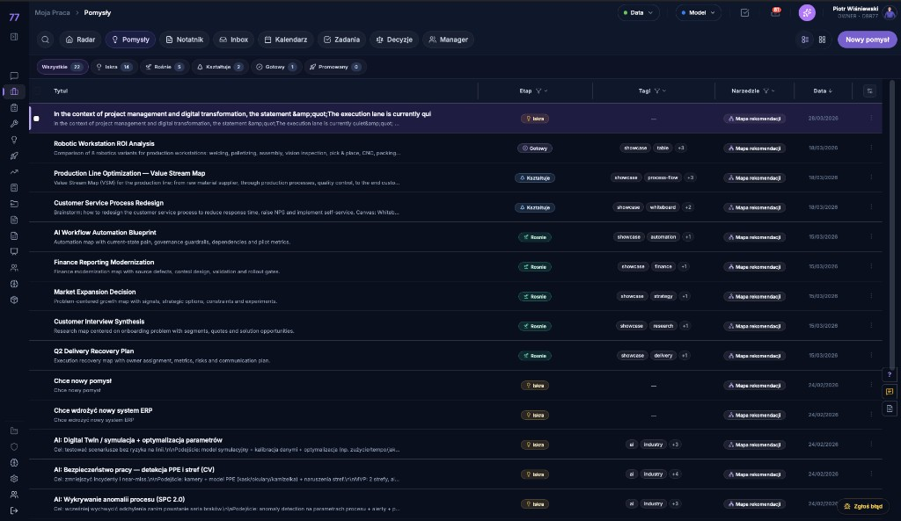
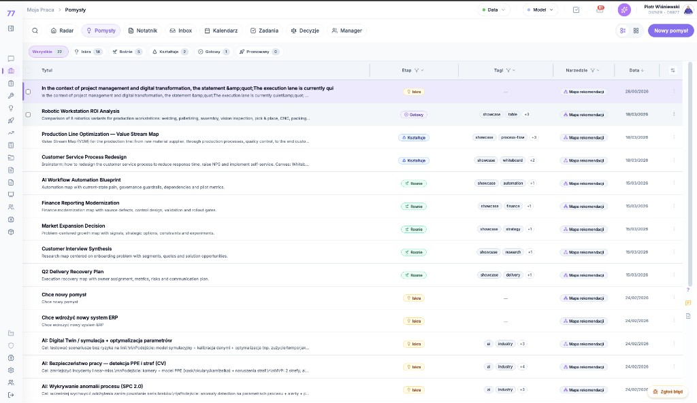

# App Table Standard (Golden Standard)

Ten dokument opisuje **standard tabel aplikacji** (UI/UX), który utrzymujemy konsekwentnie w kolejnych modułach.

## Referencyjny wzór (SSOT)

- **Wzór UI/UX**: tabela “Decisions” (My Work)
- **Pierwsza pełna adopcja tego standardu**: `Admin Panel > Report Templates`
- **Zatwierdzony wzorzec operacyjny 2026-05-02**: `My Work > Pomysły` po hardeningu tabeli.

Reference screenshots:

Ten wzorzec jest obowiązkowy dla wszystkich nowych i migrowanych App Tables. Nie kopiujemy lokalnych zachowań tabel z legacy ekranów, jeśli są sprzeczne z poniższym standardem.

Nowe ekrany operacyjne, które pokazują listę rekordów do skanowania, sortowania, filtrowania albo otwierania (`My Work`, `Wywiad`, assessment/manager queues, inboxy, sesje, szablony, wnioski, inicjatywy) startują od tego standardu. Nie wolno tworzyć nowego card-list albo ad hoc table tylko dlatego, że ekran powstał lokalnie w module. Karty są dopuszczalne jako osobny view mode tylko po tym, jak table view spełnia App Table canon.

## Zasady (muszą być spełnione)

### 1) Breadcrumbs – tylko raz

- **Breadcrumbs są w globalnym headerze** (MainLayout).
- **Nie dodajemy drugiego breadcrumb / tytułu w obszarze roboczym** (żadnych dodatkowych nagłówków “Admin > …” nad tabelą).

### 2) Szerokość obszaru roboczego

- Tabela ma wykorzystywać **prawie całą szerokość** obszaru roboczego.
- Zostawiamy **małą granicę** (mały padding) między sidebarem a tabelą.
- **Nie ograniczamy** widoku przez `max-w-*` w wrapperach admin/settings dla widoków tabelarycznych.

### 3) Tła i “ramka” (dark UI)

- **Tło poza ramką**: ciemniejsze (`bg-navy-950`)
- **Wewnątrz ramki / panelu**: jaśniejsze (`bg-navy-900`)
- Delikatne obramowania: `border-navy-700/50` oraz separatory `border-b border-navy-700/50`

### 4) Top bar / Module Topbar - identyczna wysokość kontrolek

Wszystkie kontrolki w top barze mają być **tej samej wysokości**: **`h-9`**.

- **Search toggle**: kwadrat `h-9 w-9`
- **Taby (All/App/Org)**: `h-9` + badge z liczbą
- **Selecty filtrów** (np. Module / Format): `h-9`
- **Primary action** (np. `Dodaj`, `New ...`): `h-9`, bez ikony `+` w Module Topbar, bez gradientu w operational chrome; chevron jest dozwolony, jeśli akcja otwiera warianty tworzenia

Wynik: więcej miejsca na akcje po prawej i czytelne wyrównanie.

**MUST (zgodność z Golden Standard):**

- View mode jest widocznym segmented icon control, nie dropdownem `Table/Grid`.
- `Help` nie występuje w prawym klastrze Module Topbar.
- `Dodaj` / `New ...` nie używa leading plus icon w Module Topbar.
- Akcje AI zależne od zaznaczenia trafiają do prawej strony `Menu 3`, nie do dodatkowego paska nad tabelą.

**MUST (brak duplikacji kontrolek):**

- Jeśli moduł ma **Module Topbar** (view modes + filters), to tabela nie może dokładać dodatkowych “mini‑toolbarów” typu: `Smart sort`, `Columns`, `Views` pod wyszukiwarką.
- Zasada: **jedno miejsce** do zmiany widoku/filtrów/kolumn = Module Topbar + header filters w tabeli.
  - “Columns” = konfiguracja kolumn (R1+) w menu/panelu, nie jako stały pasek pod search.
  - “Views” = saved filters/scopes w `Filters…`, nie jako osobny rząd przycisków.

### 5) Wyszukiwarka – wzór “toggle → expandable”

- W top barze jest **ikona lupy** (toggle).
- Po kliknięciu, pod top barem pojawia się **expandable search bar**:
  - `autoFocus`
  - przycisk `X` czyści i zamyka

### 6) Kolumny, szerokości i filtry (Decisions-style)

- Kolumny zarządzane jako definicje (np. `TEMPLATE_COLUMNS`)
- **Resizable columns**: `ColumnResizer`
- **Header filters**: `FilterDropdown` (multiselect z checkboxami)
- Nowe kolumny pod filtrowanie (np. **Audience**, **User**) muszą mieć:
  - spójne szerokości
  - bezpieczny rendering (patrz niżej)
  - filtr w headerze, jeśli mają służyć do filtrowania

**MUST (resizer UI):**

- Chwytaki/linie resizerów nie mogą wyglądać jak “podwójne grube separatory”.
- Standard: **pojedynczy, widoczny grip** ustawiony dokładnie na granicy dwóch kolumn, z małym hit area po obu stronach separatora.
- Drag musi być excelowy: przesunięcie separatora w prawo przesuwa tę granicę w prawo, przesunięcie w lewo przesuwa tę granicę w lewo. Nie akceptujemy efektu “ciągnę w przeciwną stronę”.
- Resize granicy działa parowo: jedna z sąsiednich kolumn rośnie dokładnie o tyle, o ile druga maleje, żeby cała tabela nie zmieniała szerokości.
- Hover resizera wzmacnia tylko grip/kolor, bez tworzenia ciężkiej ramki.
- Hit area jest mały i przewidywalny (`~12px` jako baseline), wycentrowany na separatorze. Nie może nachodzić tak daleko na sąsiednią kolumnę, żeby użytkownik nie wiedział, którą granicę łapie.
- Granica `Title -> pierwsza metadata column` też musi być sterowalna. `Title` nie może być “bezbarierową” elastyczną resztą bez własnego resizera.
- Ostatnia widoczna kolumna metadata może mieć resizer tylko wtedy, gdy ma sąsiada, któremu oddaje/przejmuje szerokość. Nie zwiększamy sumy szerokości tabeli przez samotne rozszerzanie ostatniej kolumny.
- Minimalne i maksymalne szerokości są jawne per kolumna. Jeśli separator dobija do limitu jednej kolumny, ruch stopuje; nie zaczynamy przeliczać całej tabeli.

**MUST (auto-fit / no unnecessary wrapping):**

- Kolumny metadata (`Status`, `Etap`, `Tagi`, `Narzędzie`, `Data`, `Owner`, `Priority`) mają startować z szerokościami dopasowanymi do realnej zawartości, nie do minimalnego nagłówka.
- App Table używa stabilnego layoutu (`table-fixed`/fixed column contracts) i zawsze wypełnia dostępną szerokość ekranu. Resize kolumny nie może zwężać całej tabeli.
- Primary/title column ma własną szerokość i resizer na prawej krawędzi, czyli granica `Title → pierwsza metadata column` jest normalnie sterowalna.
- Nagłówki metadata są optycznie centrowane w swoich kolumnach; `Title` zostaje wyrównany do lewej.
- Tabela może mieć poziomy scroll, jeśli to pozwala zachować jednowierszowe skanowanie. Lepiej pokazać elegancki scroll niż łamać chipy i daty w dwie linie.
- Chipy/pills w kolumnach metadata są domyślnie `whitespace-nowrap`. Overflow obsługujemy przez truncate, `+N` counter albo view settings, nie przez zawijanie całej komórki.
- Primary/title column jest elastyczna, ale nie może zabierać miejsca kosztem czytelności metadata.
- Suma widocznych szerokości kolumn ma być stabilna. Zmiana jednej granicy nie może powodować “oddychania” całej tabeli ani przesuwania wszystkich dalszych krawędzi.
- Jeśli widok ma zapisane stare szerokości w `localStorage`, migracja musi je znormalizować do aktualnej wersji standardu, żeby użytkownik nie został na legacy layout.

**MUST (table view settings):**

- Każda App Table z konfigurowalnymi/ukrywalnymi kolumnami ma stały przycisk `Ustawienia widoku tabeli` w prawym rogu headera, przy kolumnie `Actions`.
- Ikona ustawień widoku to `Settings2` / sliders-style control, `h-7` albo `h-8`, neutralny surface, mocniejszy dopiero na hover/open.
- Domyślny pattern to małe anchored menu/popover pod ikoną, analogicznie do `RowActionsMenu`, nie modal blokujący ekran.
- Menu ustawień pokazuje listę kolumn z checkboxami. Kolumny wymagane (`Title`, `Actions`, ewentualnie primary object) są disabled i oznaczone jako wymagane.
- Menu ustawień zawiera też przełącznik `Pokaż opis / uzasadnienie` jako ostatni element pod separatorem; zastępuje on prosty przycisk `Reset` w lekkich App Tables.
- `Pokaż opis / uzasadnienie` jest domyślnie włączone i zapisywane per tabela; wyłączenie usuwa drugą linię z wiersza bez hoverowego rozwijania i bez zmiany danych.
- Modal jest dopuszczalny tylko dla ciężkich ustawień widoku (saved views, zaawansowane grupowanie, wiele sekcji), nie dla prostego wyboru kilku kolumn.
- Ustawienia widoku tabeli są per table i mogą być zapisywane w local storage.

**MUST (Actions column):**

- Ostatnia kolumna to **Actions** i zawiera **jedno** wejście do menu akcji: ikonę **kebab (⋮)**.
- Header ostatniej kolumny nie pokazuje tekstu `Actions/Akcje`, jeśli w tym miejscu jest już ikona ustawień widoku kolumn. Sama ikona wystarcza jako control.
- **Zawsze pionowe 3 kropki (⋮)**, nigdy poziome (⋯).
- Menu akcji używa kanonicznego `RowActionsMenu` i sekcji opisanych niżej.
- W całej aplikacji Actions column działa identycznie (miejsce, zachowanie, ikonografia).

#### 6.0) App Table Golden Acceptance Checklist

Tabela może zostać uznana za zgodną ze standardem dopiero gdy spełnia wszystko poniżej:

- Dark i light mode są czytelne i zgodne z referencyjnymi screenami z tego dokumentu.
- Tabela wypełnia dostępny ekran; nie ma przypadkowego zwężenia całego gridu po resize.
- Każda widoczna granica między kolumnami, którą użytkownik może logicznie chcieć przesunąć, ma uchwyt.
- Resize działa jak Excel: separator przesuwa się dokładnie z kursorem, a sąsiednie kolumny kompensują szerokość.
- `Title`/primary object jest lewostronny, wyraźny i ma własną szerokość.
- Metadata headers i metadata cells są optycznie centrowane.
- Chipy nie zawijają tabeli w dwie linie bez realnej potrzeby.
- `Actions` header nie konkuruje tekstem; prawy róg służy ustawieniom widoku kolumn i row actions.
- Ustawienia widoku są małym popoverem pod ikoną, nie modalem.
- Checkboxy są quiet i reveal-on-hover, a scroll chrome nie przykrywa floating controls.

#### 6.1) Row Action Menu - sekcje kanoniczne

`RowActionsMenu` jest routerem akcji dla jednego rekordu. Nie jest miejscem na wszystkie możliwe funkcje ekranu.

Kolejność sekcji od góry do dołu:

| Sekcja            | Status               | Zastosowanie                                                                                                                                                          |
| ----------------- | -------------------- | --------------------------------------------------------------------------------------------------------------------------------------------------------------------- |
| `Open`            | Stała                | Pierwszy blok menu. Pierwsza akcja to zawsze pełne otwarcie rekordu/artefaktu.                                                                                        |
| `Tool Shortcut`   | Opcjonalna           | Druga akcja w tym samym bloku co `Open`, bez separatora. Bezpośrednie wejście do narzędzia rekordu, np. `Process Flow`, `Mapa rekomendacji`, `Definition`, `Lineage`. |
| `Context Actions` | Zmienna              | Najważniejsze akcje zależne od tabeli, roli i statusu rekordu.                                                                                                        |
| `AI`              | Stała, jeśli ma sens | `AI Chat` i `AI Insights`.                                                                                                                                            |
| `Convert To`      | Stała, jeśli ma sens | Konwersja do obiektu operacyjnego: inicjatywa, zadanie, decyzja, Team Chat.                                                                                           |
| `Create Output`   | Stała, jeśli ma sens | Prezentacja, raport, tabela. Disabled/coming soon, jeśli runtime nie jest gotowy.                                                                                     |
| `Manage`          | Stała, jeśli ma sens | Edycja i zarządzanie: edytuj, duplikuj, taguj, archiwizuj, zmień status.                                                                                              |
| `Danger`          | Stała dla destrukcji | Destrukcyjne akcje. `Usuń` zawsze ostatnie i po separatorze.                                                                                                          |

Reguła pierwszego bloku:

- Pierwszy przycisk od góry to zawsze `Otwórz`.
- Każdy item w menu ma ikonę po lewej, również `Otwórz`, żeby menu miało równy rytm wizualny.
- Jeśli tabela ma specyficzną możliwość przejścia bezpośrednio do narzędzia, drugi przycisk to skrót do tego narzędzia, np. `Process Flow`.
- `Otwórz` i skrót narzędziowy są w jednym bloku, bez oddzielającej linii.
- Skrót narzędziowy nie zastępuje `Otwórz`; jest szybszą ścieżką do konkretnego trybu pracy.

Przykłady kontekstu:

- `Ideas`: pierwszy blok `Otwórz`, `Process Flow`; kontekstowo można dodać `Mapa rekomendacji`, jeśli jest osobnym narzędziem i ma sens dla rekordu.
- `Tasks`: `Oznacz jako wykonane`, `Telefonowanie`, `Snooze`, `Zmień status`.
- `Decisions`: `Akceptuj`, `Odmów`, `Przypomnij`, `Eskaluj`.
- `Inbox`: `Focus`, `Today`, `This week`, `Later`, `Done`, `Save`, `Dismiss`, `Reject`, `Snooze`.
- `Interview`: `Start/Continue`, `Approve`, `Send back`, `Generate AI insights`.
- `Results/KPI`: `Record data`, `Definition`, `Lineage`, `Targets`, `History`.

Zasady ograniczania złożoności:

- Główne menu powinno mieć zwykle 5-7 bezpośrednich pozycji.
- Jeśli `Convert To` lub `Create Output` ma więcej niż 3-4 opcje, pokazujemy jeden wpis `Konwertuj do...` albo `Utwórz output...`, który otwiera mały picker/modal.
- `AI Chat` wrzuca rekord do czata jako kontekst rozmowy.
- `AI Insights` robi krótki przegląd i wrzuca wnioski do czata.
- Nie tworzymy custom dropdownów w tabelach, jeśli `RowActionsMenu` obsługuje wymagany przypadek.
- Destructive action wymaga confirm/read-back zgodnie z Honest UI.

**MUST (wiersz = jedna linia “primary” + reszta w kolumnach):**

- Nie duplikujemy informacji w “drugiej linii” pod tytułem (np. nazwa szablonu/kategorii powtórzona pod nazwą).
- Jeśli potrzebujesz pokazać typ/kategorię/slug — to jest **osobna kolumna** (i wtedy może być filtrowalna).
- Domyślny rytm listy ma być stabilny (wysokość wiersza), żeby oko mogło skanować tabelę bez “falowania”.
- Wiersz referencyjny nie może być zbyt ciasny: primary title ma mieć wyraźniejszy weight/leading, secondary text ma być spokojny, ale czytelny na hover.
- Hover/selected state ma działać jak subtelne podświetlenie powierzchni, nie jak kolorowy pasek.
- Reference App Table ma mieć odważny, czytelny kontrast jak narzędzia typu ClickUp/Linear: light mode nie może być wyprany, a dark mode musi mieć realne separatory wierszy.
- Selected/focused row nie może być szarą belką. Używamy kontrolowanego tintu plus cienkiego lewego akcentu, żeby stan był widoczny i elegancki.
- Selected/focused row używa brand-aligned `primary/violet-blue`, nie losowych kolorów technicznych. Focus może być odrobinę chłodniejszy, ale musi należeć do tej samej rodziny wizualnej.
- Light mode selected/focused state musi być tak samo jednoznaczny jak dark mode: tint + lewy akcent + subtelny inset/ring, bez ciężkiej belki.
- Dla ekranów referencyjnych przyjmujemy kierunek ClickUp High Contrast: selected/focused row ma być widoczny natychmiast. Baseline: mocniejszy tint, `4px` brand accent po lewej i inset border/ring całego wiersza.
- Nie akceptujemy stanów zaznaczenia, które są „technicznie obecne”, ale wizualnie prawie niewidoczne na screenie.
- Kolory, bordery, tinty, chipy i tekst tabeli muszą używać zaakceptowanej siatki `Accepted App Table Color Grid` z `00-foundation/color-system.md`.
- Nie tworzymy lokalnej siatki kolorów dla App Table. Różnice modułowe mogą dotyczyć danych/statusów, ale nie powierzchni tabeli, selected/focus/checked state, separatorów ani bazowej czytelności.
- Wiersz App Table ma wyglądać jak kompaktowy rekord operacyjny, nie jak Excel/grid. Primary title jest obiektem, secondary text jest kontekstem, chipy są sygnałami skanowania, a checkbox/actions są utility chrome.
- Secondary text / opis / uzasadnienie jest standardowo widoczne pod tytułem. Ma używać tego samego neutralnego kierunku kolorystycznego co title, ale lżejszej typografii (`~11px`, normal weight, opacity), a nie lokalnych akcentów kolorystycznych.
- Nie pokazujemy opisu dopiero na hoverze i nie rozwijamy go po najechaniu. Hover nie może powodować skakania wysokości wiersza.
- Jeśli użytkownik wyłączy `Pokaż opis / uzasadnienie`, wiersz nadal zachowuje spokojny oddech/padding; nie ściskamy tabeli do agresywnej spreadsheet density.
- Metadata columns (status/tag/tool/date/actions) są optycznie centrowane w pionie względem rekordu, nie przyklejone do górnej krawędzi opisu.
- Overflow count (`+N`) jest małym pill/counterem, nie luźnym tekstem.
- Row actions/kebab są quiet w spoczynku i wzmacniają się na hover/active. Nie mogą konkurować z tytułem ani chipami.
- Hover może dostać subtelny inset border, żeby wiersz czuł się jak interactive record, ale bez tworzenia kart w każdej linii.

#### 6.0a) Selection And Scrollbar Polish

Checkboxy i scrollbary są utility chrome. Nie mogą konkurować z treścią tabeli.

MUST:

- Row checkbox w gęstej tabeli ma być mały i cichy: zwykle `h-3.5 w-3.5`, neutralny border, bez białej pełnej plamy w dark mode.
- Header select-all może być minimalnie większy, ale nie powinien przekraczać `h-4 w-4` w standardowej tabeli.
- Checkbox ma być widoczny, ale nie dominujący; aktywny/checked stan może używać `primary`, spoczynkowy jest neutralny.
- Dla premium App Tables obowiązuje ClickUp-style hover reveal: unchecked row checkbox jest niewidoczny albo prawie niewidoczny w spoczynku i pojawia się na row hover/focus. Checked, selected i focused rows pokazują checkbox stale.
- Header select-all też jest quiet w spoczynku i wzmacnia się na hover albo gdy istnieje aktywna selekcja.
- Obszar tabeli musi mieć prawy gutter, jeśli na ekranie są fixed/floating przyciski (`Help`, `Zgłoś błąd`, panele boczne), żeby scrollbar nie przykrywał interakcji.
- Scrollbar w tabeli ma być traktowany jak element systemowy: subtelny, zarezerwowany w layoucie, nie nachodzący na akcje wiersza ani floating controls.
- Dark mode wymaga widocznych, ale cienkich separatorów (`white/[0.08-0.10]` jako praktyczny baseline dla referencyjnych tabel).
- Light mode wymaga mocniejszego baseline kontrastu: nagłówki i secondary text nie mogą wyglądać jak disabled.

SHOULD:

- Preferuj `scrollbar-gutter: stable` albo lokalny padding/gutter po prawej stronie scrollowanego obszaru.
- W dark mode unikaj dużych jasnych prostokątów przy checkboxach i scrollbarach; oko ma czytać dane, nie controls.
- Dla premium tables checkbox w spoczynku może mieć obniżoną opacity i wzmacniać się dopiero na hover, focus albo checked.
- Globalne floating controls w pobliżu tabel powinny być glass/outline/subtle. Pełne, jaskrawe tła są dopuszczalne dopiero na hover albo w stanie wymagającym pilnej reakcji.

#### 6.2) Table Chips And Badges

Chipy w tabeli muszą być czytelne, skanowalne i zgodne z DBR77 Tech Sexy 2027. Przyjmujemy kierunek ClickUp: spokojne, małe pills; kolor jako sygnał, nie dekoracja.

Typy:

| Typ                   | Zastosowanie                       | Kolor                                                                       |
| --------------------- | ---------------------------------- | --------------------------------------------------------------------------- |
| `StatusChip`          | Status, etap, workflow state       | Kolor dozwolony jako subtelny sygnał; ikona/dot + kontrastowy tekst.        |
| `PriorityChip`        | Priorytet                          | Jeden wzorzec per moduł: dot/ikona + label.                                 |
| `MetaChip`            | Tagi, typ, źródło, owner shorthand | Zawsze neutralny `slate/navy`.                                              |
| `ToolChip`            | Narzędzie, artefakt, tryb pracy    | Prawie neutralny; delikatnie kolorowa ikona jest OK, fioletowe tło CTA nie. |
| `SlaChip` / `DueChip` | SLA, termin, overdue               | Kolor tylko dla ryzyka/przekroczenia. Normalne daty neutralne.              |

MUST:

- Tekst chipa musi być czytelny w light i dark mode (`text-slate-700/800` light, `text-slate-200/300` dark jako praktyczny baseline).
- Nie używamy “jasne tło + jasny tekst tego samego koloru”.
- Metadata nie używa `primary`, `success`, `warning` ani `danger`.
- `primary/violet` nie może stale dominować w kolumnie tabeli; jest zarezerwowany dla CTA, aktywnego stanu, focusu lub linku.
- Chipy tego samego typu muszą mieć ten sam radius, padding, font-size i weight w całym module.

SHOULD:

- `rounded-full`, `text-[10px]` albo `text-[11px]`, `font-medium`/`font-semibold` zależnie od ważności.
- Subtelny border jest dozwolony, gdy poprawia czytelność w light mode.
- Jeśli chip ma ikonę, ikona może być nośnikiem koloru, a tło pozostaje neutralne.

**MUST (zero ad-hoc pasów między topbarem a tabelą):**

- Nie dodajemy dodatkowych, niestandardowych “help stripów”, bannerów i opisów workflow **pomiędzy** Module Topbar a tabelą.
- Jeśli trzeba pokazać liczniki typu “3 spóźnione / 5 do zatwierdzenia” — używamy **Command Row (Context counters)** zgodnie z `module-hub-standard.md`.

### 7) Stabilność danych (ważne)

Nie zakładaj, że backend zawsze zwróci kompletne pola.

- Każde pole używane w `.toLowerCase()` / `.toUpperCase()` musi być zabezpieczone:
  - np. `(t.sourceType || '').toLowerCase()`
- W UI pokazujemy placeholder `—` zamiast crasha.

## Checklist (Do/Don’t)

- **Do**: breadcrumbs tylko w `MainLayout`
- **Do**: pełna szerokość contentu (bez `max-w-*`)
- **Do**: `h-9` dla wszystkich kontrolek top bara
- **Do**: toggle search + expandable search bar
- **Do**: resizable columns + header filters (multiselect)
- **Don’t**: dodatkowe tytuły i breadcrumb w widoku admin/settings (duplikacja)
- **Don’t**: brak guardów na pola z API (crashe typu `undefined.toLowerCase()`)

## Referencje w kodzie (kopiuj styl z tych plików)

- **Decisions – wzór**:
  - `src/components/MyWork/MyWorkHub.tsx` (top bar, search toggle)
  - `src/components/MyWork/DecisionsPanelContent.tsx` (tabela, kolumny, filtry, resizery)
- **Report Templates – adopcja standardu**:
  - `src/components/ReportBuilder/TemplatesManager.tsx`
- **Szerokość obszaru roboczego (Admin)**:
  - `src/views/admin/AdminSettingsModule.tsx` (padding, brak `max-w-*`)
- **Breadcrumbs dla Admin tabów**:
  - `src/hooks/useBreadcrumbs.ts` (odczyt `?tab=` → nazwa sekcji)
