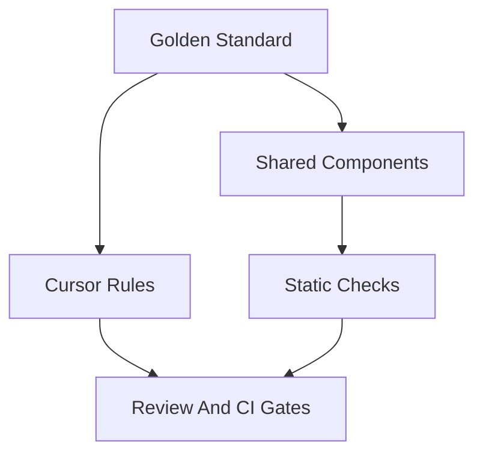

# UI/UX Enforcement Plan

Status: `PLAN / REQUIRED BEFORE READY_TO_ENFORCE`
Date: 2026-05-01
Parent audit: `UI_UX_DOCUMENTATION_COMPLETENESS_AUDIT.md`
Parent standard: `CONSULTIFY_UI_UX_GOLDEN_STANDARD.md`

## 1. Goal

This plan turns the Consultify UI/UX standard from documentation into an enforceable working system.

Target state:

`UI_UX_CANON_ENFORCED`

That means new UI code cannot accidentally create another local visual language, and Cursor/developers have hard enough gates to follow the Golden Standard.

## 2. Current Enforcement Status

| Area | Current status | Risk |
|---|---|---|
| Golden Standard | exists | low |
| Operating Standard | exists | low |
| `.cursorrules` | points to Golden + Operating | low |
| `.cursor/rules/*.mdc` | missing from repo | high |
| Main CI | lint/type/test exists | medium |
| UI compliance smoke | exists as `smoke:a03-ui-compliance` | medium |
| UI compliance in primary PR workflow | not guaranteed | high |
| ESLint UI policy | absent | medium |
| Visual regression | exists but weak/broad | medium |
| PR review checklist | not formalized as a gate | medium |

## 3. Enforcement Layers

Use five layers. Documentation alone is not enough.

## 4. Cursor Enforcement

### 4.1 Required tracked rules

Create or restore:

- `.cursor/rules/consultify-ui-ux-canon.mdc`
- `.cursor/rules/ui-standards-documentation.mdc`
- `.cursor/rules/nmode-shared-components.mdc`

Minimum content:

- read `CONSULTIFY_UI_UX_GOLDEN_STANDARD.md` before UI work,
- use `CONSULTIFY_UI_UX_OPERATING_STANDARD.md` for implementation gates,
- no new UI pattern without docs,
- no local buttons/cards/tables/toolbars when shared pattern exists,
- enforce `Menu 2`, `Menu 3`, N-mode, App Table and Preview rules,
- if the request conflicts with Golden Standard, explain and ask before changing the standard.

### 4.2 Current gap

`.cursorrules` references `.cursor/rules/*.mdc`, but no `.cursor/rules/*.mdc` files were found in the repo.

Decision needed:

- preferred: track those rules in repo,
- fallback: remove references and make `.cursorrules` the only Cursor rules source.

Recommendation:

Track the `.cursor/rules/*.mdc` files. This is the stronger model.

## 5. CI Enforcement

### 5.1 Existing useful script

Existing script:

`server/scripts/smoke-a03-ui-hub-compliance.ts`

Existing npm script:

`smoke:a03-ui-compliance`

Current checks include:

- canonical view-mode order in `ModuleNavBar`,
- selected hubs using `ModuleHub`,
- subset order checks for several hubs.

### 5.2 Required expansion

Create a successor or expand the existing script to check:

- no dropdown view switcher for `Table/Grid`,
- no `Help` in Module Topbar right cluster,
- primary CTA in Module Topbar has no leading `+`,
- no extra row between `Menu 3` and table for selection/AI/help,
- functional AI actions use right slot of `Menu 3`,
- status chips do not force second row or push right actions out,
- new `*Hub.tsx` files use `ModuleHub` or have an explicit waiver.

### 5.3 Workflow gate

Current `domain-closure-smoke.yml` runs the A03 pack only manually via `workflow_dispatch`.

Required:

- run UI compliance on PRs touching:
  - `src/components/**`,
  - `src/routes/**`,
  - `docs/ui-standards/**`,
  - `.cursorrules`,
  - `.cursor/rules/**`.

Recommended implementation:

- add a lightweight job to `test-suite.yml`, or
- add a new `ui-ux-compliance.yml` workflow with path filters.

## 6. Static Checks

ESLint currently enforces code quality but not UI canon.

Recommended static gates:

1. Forbidden raw colors in UI code:
   - `#000000`,
   - `#ffffff` as dark-mode text,
   - arbitrary hardcoded colors outside tokens.
2. Forbidden local toolbar patterns:
   - repeated `Toolbar`/`ActionBar` components inside feature folders without approved standard.
3. Forbidden view dropdown pattern:
   - `Table`/`Grid` view mode hidden under select/dropdown.
4. Forbidden topbar `Help`:
   - `Help` button near Module Topbar CTA/view switcher.
5. Required import preference:
   - feature hubs should use `@/components/shared/ModuleHub`,
   - artifact details should use `@/components/shared/NModeLayout`,
   - preview should use approved preview shell.

Implementation options:

- custom eslint rule later,
- interim `tsx` smoke script scanning changed files,
- dependency-cruiser/import boundary rules.

## 7. PR Review Checklist

Every PR touching UI should include:

- Which screen type is this: `ModuleHub`, `App Table`, `N-mode`, `Workspace`, `ToolWizard`, `Other`.
- Which standard was used.
- Which shared components were used.
- Whether any new UI pattern was introduced.
- Evidence that `Menu 2` and `Menu 3` rules are respected.
- Evidence that there is no extra toolbar row.
- Dark/light readability check.
- Loading/empty/error/degraded states check.
- AI actions placement check.
- If there is preview: anatomy and quick actions parity check.
- If there is N-mode: left rail, Card View Settings, properties workflow and related-context duplication check.

PR cannot be approved if it introduces a new visual pattern without updating `docs/ui-standards/`.

## 8. Visual Regression

Current visual tests exist but are too broad and permissive:

- hardcoded `localhost:3000`,
- threshold `0.2`,
- generic dashboard/login/settings routes.

Recommended golden routes:

1. `Implementation > Zestawienie`
2. `Implementation > Timeline`
3. `Initiatives > Portfolio`
4. `Interview > Szablony`
5. One N-mode detail view

Target:

- run only on reference routes,
- lower threshold after snapshots stabilize,
- capture both dark and light mode where feasible,
- optionally use Percy because `test:visual:percy` already exists.

## 9. Documentation Gate

Before a new component/pattern is implemented:

1. Search `docs/ui-standards/`.
2. If pattern exists, use it.
3. If pattern needs extension, update or propose extension to the relevant doc.
4. If pattern is new, create standard first.
5. Add it to `README.md`.
6. Add enforcement path if it is a repeated pattern.

## 10. Minimal Execution Order

### Phase 1 - Rule Lock

- Create `.cursor/rules/consultify-ui-ux-canon.mdc`.
- Create `.cursor/rules/ui-standards-documentation.mdc`.
- Create `.cursor/rules/nmode-shared-components.mdc`.
- Confirm `.cursorrules` and `.cursor/rules` are consistent.

Exit:

- Cursor has tracked UI/UX rules in repo.

### Phase 2 - Compliance Smoke

- Expand `smoke-a03-ui-hub-compliance.ts` or create successor script.
- Add checks for `Menu 2`, `Menu 3`, view switcher, Help, plus icon and extra row.
- Add npm script if needed.

Exit:

- local command can fail on basic UI canon violations.

### Phase 3 - CI Gate

- Add PR workflow/path filter for UI compliance smoke.
- Run on docs and frontend layout changes.

Exit:

- PRs touching UI cannot bypass basic UI canon checks.

### Phase 4 - Review Gate

- Add PR checklist template or internal review checklist.
- Make UI steward approval required for new shell/component/pattern.

Exit:

- new UI patterns cannot merge without documented approval.

### Phase 5 - Visual Reference

- Define 3-5 reference routes.
- Stabilize screenshot tests or Percy runs.

Exit:

- major visual drift is caught before release.

## 11. Ready-To-Enforce Criteria

Consultify can be marked `READY_TO_ENFORCE` when:

- Golden Standard is the highest referenced UI/UX document.
- `.cursor/rules/*.mdc` exist and point to the Golden Standard.
- UI compliance smoke runs in a PR-relevant workflow.
- New feature hubs/details must use shared shells or document an exception.
- PR checklist exists for UI changes.
- Reference screens are named and checked.
- Every new pattern requires docs before implementation.

Current recommendation:

`NOT_READY_FOR_HARD_ENFORCEMENT_YET`

Next target after Phase 1-3:

`READY_TO_ENFORCE`
