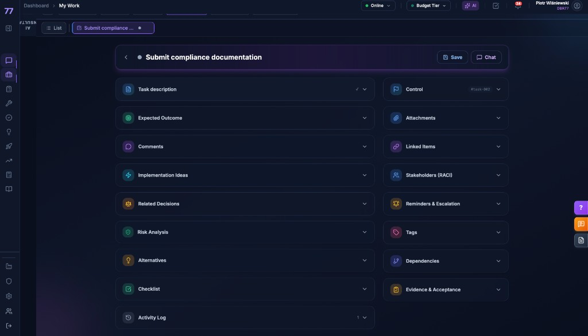

# Task Detail View - UI Standard

> **Status:** OBOWIĄZUJĄCY od 2026-01-29  
> **Ostatnia aktualizacja:** 2026-01-29  
> **Plik źródłowy:** `src/components/MyWork/TaskDetailView.tsx`

---

## Screenshot referencyjny



---

## Główne zasady

### 1. Header (pasek tytułu)

- **Wyróżniony wizualnie** — delikatny gradient fioletowy + fioletowa ramka + cień
- **Zawiera tylko 2 przyciski akcji:**
  - **Save** (niebieski) — zapisuje task + lokalny draft do localStorage
  - **Chat** (fioletowy) — zapisuje draft offline i otwiera panel czatu z kontekstem taska
- **Brak przycisków statusowych** (Start/Complete/Block/Delegate/Delete) — usunięte celowo

### 2. Sekcja Control (prawa kolumna)

- **Badge `#task-XXX`** — wyświetlany po prawej stronie, obok strzałki rozwijania
- **Zawiera:** Initiative, Status, Priority, Owner, Assignee, Due Date, Start Date

### 3. Przyciski Save i Chat

| Przycisk | Kolor ramki | Kolor tekstu | Rozmiar |
|----------|-------------|--------------|---------|
| Save     | `border-blue-500/40` | `text-blue-700` | `px-4 py-2 text-sm` |
| Chat     | `border-purple-500/40` | `text-purple-700` | `px-4 py-2 text-sm` |

### 4. Zachowanie offline

- **Save** i **Chat** zawsze najpierw zapisują draft do `localStorage` pod kluczem:
  ```
  consultinity-task-draft:{taskId}
  ```
- Draft zawiera pełny stan formularza + timestamp
- Dzięki temu dane nie giną nawet przy problemach z siecią

### 5. Integracja z czatem

- Przycisk **Chat** wywołuje `updateWorkspaceFromView(AppView.MY_WORK, taskId, {...taskData})`
- Kontekst taska trafia do `workspaceContext` w `useConversationStore`
- AI w czacie ma dostęp do pełnych danych taska

---

## Klasy CSS headera (reference)

```tsx
className="lg:col-span-3 bg-gradient-to-r from-white/80 via-purple-50/30 to-white/80 
           dark:from-navy-900/80 dark:via-purple-900/20 dark:to-navy-900/80 
           backdrop-blur-xl rounded-2xl 
           border border-purple-200/40 dark:border-purple-500/20 
           shadow-lg shadow-purple-500/10 dark:shadow-purple-500/20 
           overflow-hidden ring-1 ring-purple-500/10 dark:ring-purple-400/10"
```

---

## Historia zmian

| Data | Zmiana |
|------|--------|
| 2026-01-29 | Usunięto przyciski statusowe (Start/Complete/Block/Delegate/Delete) |
| 2026-01-29 | Dodano tylko Save + Chat w headerze |
| 2026-01-29 | Przeniesiono badge `#task-XXX` do sekcji Control |
| 2026-01-29 | Dodano fioletowe podświetlenie headera |
| 2026-01-29 | Implementacja offline draft (localStorage) |

---

## Uwagi

Ten standard obowiązuje do czasu oficjalnej decyzji o zmianie. Wszelkie modyfikacje wymagają aktualizacji tego dokumentu.
