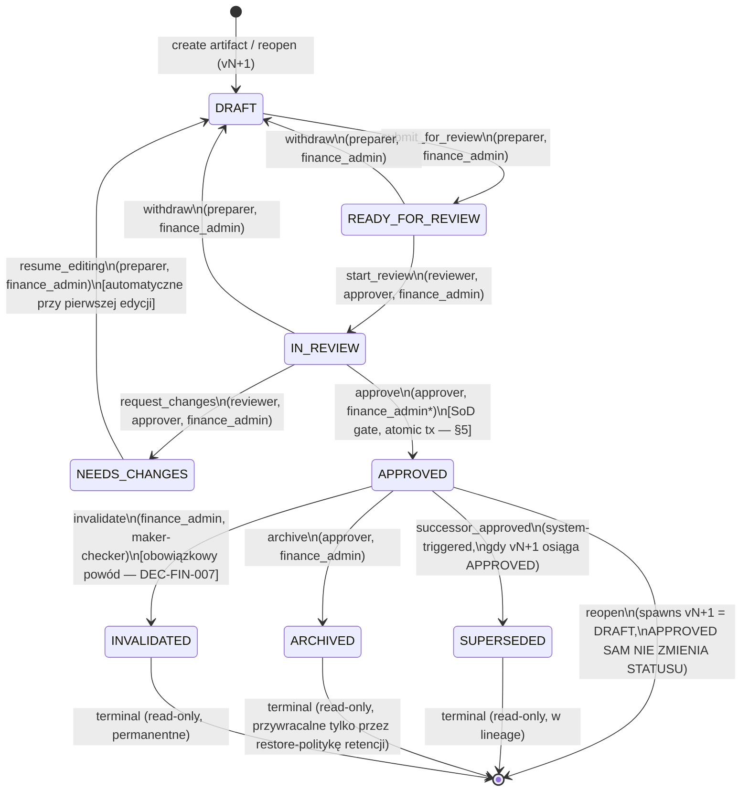
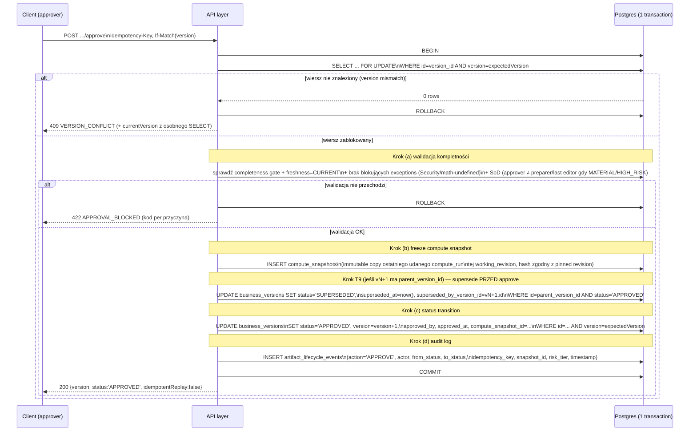

# ADR WP-B02 — Wspólny kontrakt Lifecycle / Concurrency / SoD dla Finance

**Status:** PROPOSED (do zatwierdzenia na Exit Gate B)
**Data:** 2026-08-09
**Program:** `docs/validation/finance-v3/FINANCE_IMPLEMENTATION_MASTER_PLAN_2026-08-09.md`, sekcja 2.1 + Gate B / WP-B02 (linie 128–130)
**Owner (wg master planu):** Domain/Platform Security
**Worktree:** `/private/tmp/finance-v3-gate-a-20260809`, branch `codex/finance-v3-gate-a-20260809`
**Rodzaj dokumentu:** ADR (Architecture Decision Record) — decyzja i kontrakt. **Brak żywego kodu, brak migracji, zero połączeń z bazą** — zgodnie z twardym zakazem w briefie. Implementacja wchodzi w Gate C (WP-C02 `compatibility services`) i Gate D/E.

## 0. Wejścia i status dokumentów wejściowych

Przeczytane w całości przed napisaniem tego ADR:

- `FINANCE_IMPLEMENTATION_MASTER_PLAN_2026-08-09.md` — sekcja 2.1 (artefakty/wersje, business lifecycle, freshness), sekcja 2.3 (compute jobs), Gate B / WP-B01…WP-B07.
- `FINANCE_CRITICAL_REVIEW_ADDENDUM_2026-08-09.md` — `DEC-FIN-001` (model zatwierdzania/maker-checker), `DEC-FIN-007` (usuwanie zatwierdzonych), `DEC-FIN-009` (tolerancje/wyjątki), `DEC-FIN-010` (working revisions vs business versions), `DEC-FIN-011` (lineage DAG), `DEC-FIN-012` (kto decyduje dalej).
- `OWNER_REVIEW_REGISTER_2026-08-09.md` — `OWN-FIN-012` (Analysis workspace bez sterowania lifecycle), `OWN-FIN-013` (Approved bez ścieżki dalszej).
- Gate A: `generated/gate-a/WP-A01_inventory_manifest.md` (sekcja 2 i 6 — reopen mutuje `financial_models` w miejscu zamiast wersjonować) oraz `generated/gate-a/WP-A02_api_freeze.md` (kontrakt istniejących endpointów `approve`/CAS/idempotency w `v8/finance.routes.ts`).
- Kod źródłowy (tylko odczyt, zero zapisu/uruchomienia): `server/src/services/financialModelingService.ts` (linie ok. 1567–1780 — istniejący wzorzec `expectedVersion`/`VERSION_CONFLICT`; linie 2001, 2047, 2059 — trzy miejsca `UPDATE financial_models SET status = 'draft' ... WHERE status = 'approved'`, dowód buga „reopen mutuje Approved w miejscu”), `server/src/routes/v8/finance.routes.ts` (linie ok. 764–830 — istniejący kontrakt `Idempotency-Key` + `expectedVersion`/`X-Model-Version` + `409 VERSION_CONFLICT` na `POST /models/:modelId/approve`), `server/src/routes/v8/finance-value.routes.ts` (`POST /post-investment-reviews` — wzorzec `400 IDEMPOTENCY_KEY_REQUIRED`, uznany w WP-A01 za „najlepszy wzorzec w całym inwentarzu”).

**Ważne zastrzeżenie zakresu:** ten ADR definiuje kontrakt *domenowo-agnostyczny* (ten sam dla Statement Pack, Analysis, Baseline Model, Prediction/Scenario, Valuation), zgodnie z żądaniem briefu „wspólny lifecycle/concurrency/SoD contract”. Zakłada jako fundament schemat z **WP-B01** (`artifacts` / `business_versions` / `working_revisions` / `aliases` / `engine_manifests`), który jest równoległym pakietem P0 tej samej Fali 1. Tam, gdzie WP-B02 wymaga konkretnych kolumn na tych tabelach, są one tu wyspecyfikowane jako **wymaganie wejściowe do WP-B01**, nie duplikat jego zakresu.

---

## 1. Kontekst i problem

Trzy niezależne dowody z Gate A/Owner Review pokazują ten sam brak — Finance nie ma dziś jednego, egzekwowalnego cyklu życia artefaktu:

1. **OWN-FIN-012** (potwierdzone wizualnie): status `DRAFT` w Analysis workspace jest samą etykietą — brak widocznych przejść, zatwierdzania, kierowania do review.
2. **OWN-FIN-013** (potwierdzone wizualnie): przy `APPROVED` nie ma żadnej dalszej ścieżki — ani korekty, ani nowej wersji.
3. **WP-A01, sekcja 2 i 6**: `financialModelingService.ts` ma **trzy** miejsca, które przy „reopen” wykonują `UPDATE financial_models SET status = 'draft' ... WHERE status = 'approved'` — czyli **mutują ten sam wiersz Approved z powrotem na Draft**, zamiast tworzyć nową wersję. To jest silniejsze naruszenie zasady „Approved jest immutable” (master plan, zasada wykonania #6) niż sugerował sam rejestr właścicielski — nie brakuje tylko UI, brakuje też poprawnej semantyki w warstwie danych.

Jednocześnie kod **już ma częściowo poprawny wzorzec** do rozszerzenia, nie wymyślania od zera:

- `financialModelingService.ts` (`updateModel`, `approveModel`) implementuje CAS przez `opts.expectedVersion`, `WHERE id = ? AND version = ?`, zwraca `{ success:false, code:'VERSION_CONFLICT', serverVersion }`.
- `v8/finance.routes.ts` `POST /models/:modelId/approve` łączy to z `Idempotency-Key` (nagłówek lub pole body), locking przez `withFinancialModelIdempotencyLock`, i mapuje `VERSION_CONFLICT` na HTTP `409`.
- `finance_post_investment_reviews` (FIN-007, WP-A01 §6 „najlepszy wzorzec”) pokazuje wzorzec zamrożonego baseline + `idempotency_key` + `request_hash` + jednorazowo policzone `realized_value`.

Ten ADR **uogólnia i domyka** ten wzorzec do wspólnego kontraktu dla wszystkich typów artefaktów Finance, i **naprawia** błąd mutacji w miejscu przy reopen.

---

## 2. Decyzja — skrót

1. Jeden state machine na poziomie **wersji biznesowej** (`business_version`), identyczny dla Statement Pack, Analysis, Baseline Model, Prediction/Scenario, Valuation.
2. Każda mutująca operacja na wersji wymaga `Idempotency-Key` (nagłówek, obowiązkowy) **i** optymistycznej blokady (`If-Match`/ETag lub `expectedVersion` w body — patrz §4) — bez wyjątków.
3. Approval jest **jedną transakcją atomową** o ustalonej kolejności czterech kroków (walidacja → freeze snapshot → przejście stanu → audit) — patrz §5.
4. Reopen **nigdy nie mutuje** wiersza Approved. Tworzy nową, niezależną wersję `vN+1` w statusie `DRAFT`, powiązaną `parent_version_id`. Approved staje się `SUPERSEDED` dopiero gdy `vN+1` sama zostanie zatwierdzona — i to jest jedyna dozwolona zmiana `status` na starym wierszu (nigdy zmiana treści/compute snapshotu). Patrz §6.
5. Pięć ról (`preparer`, `reviewer`, `approver`, `finance_admin`, `viewer`) z macierzą uprawnień per przejście; self-approval zakazany dla `MATERIAL`/`HIGH_RISK` (`DEC-FIN-001`) — mechanizm rozpoznawania materialności/ryzyka w §7.2.
6. Jawna tabela reguł wyścigu (race rules) dla par operacji edit/compute/approve/archive/reopen/invalidate — §8.

---

## 3. State machine

### 3.1 Diagram (Mermaid)

Stan jest własnością **wersji biznesowej** (`business_versions.status`), nie artefaktu jako całości — artefakt może mieć jednocześnie historyczne wersje `APPROVED`/`SUPERSEDED`/`ARCHIVED` i co najwyżej jedną aktywną wersję nieterminalną (`DRAFT`/`READY_FOR_REVIEW`/`IN_REVIEW`/`NEEDS_CHANGES`) — reguła egzekwowana w §6.3 i §8.



*`approver` = `finance_admin` tylko w trybie awaryjnym (`emergency mode`), wymaga osobnego uprawnienia, uzasadnienia, expiry/review i pełnego audytu — `DEC-FIN-001`. Reopen nie jest krawędzią state machine wersji Approved (Approved nigdy nie przechodzi do żadnego innego stanu przez reopen) — to operacja na poziomie *artefaktu*, która **tworzy nowy węzeł** `vN+1`. Narysowany jako `APPROVED --> [*]: reopen` żeby zaznaczyć „wyjście” w nową gałąź, nie przejście stanu tego samego rekordu.

### 3.2 Tabela przejść — pełna specyfikacja

| # | Z stanu | Do stanu | Trigger (nazwa akcji API) | Kto wyzwala | Warunek wstępny | Efekt uboczny |
|---|---|---|---|---|---|---|
| T1 | *(brak)* | `DRAFT` | `create_artifact` | `preparer`, `finance_admin` | — | Nowy `artifact_id` + `business_version_id` v1 + `working_revision_id` |
| T2 | `DRAFT` | `READY_FOR_REVIEW` | `submit_for_review` | `preparer` (autor working revision), `finance_admin` | Completeness gate przechodzi LUB jawny override z uzasadnieniem (patrz §7.2 — freeze `risk_tier`/`materiality` w tym kroku) | `submitted_by`, `submitted_at` zapisane; working revision "soft-locked" dla edycji treści (§8, wiersz „Submit vs Edit”) |
| T3 | `READY_FOR_REVIEW` | `DRAFT` | `withdraw` | `preparer`, `finance_admin` | — | Odblokowanie edycji, `risk_tier` traci zamrożenie |
| T4 | `READY_FOR_REVIEW` | `IN_REVIEW` | `start_review` | `reviewer`, `approver`, `finance_admin` | Reviewer ≠ `submitted_by` gdy `risk_tier ∈ {MATERIAL, HIGH_RISK}` (miękkie ostrzeżenie SoD na etapie review; twarda blokada dopiero na `approve`) | `review_started_by`, `review_started_at` |
| T5 | `IN_REVIEW` | `DRAFT` | `withdraw` | `preparer`, `finance_admin` | — | Reset `review_started_*` |
| T6 | `IN_REVIEW` | `NEEDS_CHANGES` | `request_changes` | `reviewer`, `approver`, `finance_admin` | Obowiązkowy komentarz/powód | `changes_requested_by`, `changes_requested_at`, `changes_reason` |
| T7 | `NEEDS_CHANGES` | `DRAFT` | `resume_editing` | `preparer`, `finance_admin` | — | Automatyczne przy pierwszej mutującej edycji working revision **lub** jawny klik „Wróć do edycji” — oba dozwolone, oba logowane |
| T8 | `IN_REVIEW` | `APPROVED` | `approve` | `approver`; `finance_admin` tylko emergency mode | Zobacz atomową transakcję §5 + SoD gate §7.2 | Patrz §5 (4 kroki w jednej transakcji) |
| T9 | `APPROVED` | `SUPERSEDED` | *(system, wewnętrzny efekt uboczny `approve` na vN+1)* | system | Tylko gdy `vN+1.parent_version_id = ten_id` i `vN+1` właśnie osiąga `APPROVED` | `superseded_at`, `superseded_by_version_id` — **jedyne pola wolno zmienić na starym Approved**; treść/compute snapshot nietykalne |
| T10 | `APPROVED` | `ARCHIVED` | `archive` | `approver`, `finance_admin` | Brak otwartego (nieterminalnego) potomka `vN+1` — jeśli jest, najpierw trzeba go zamknąć/odrzucić | `archived_by`, `archived_at`, opcjonalny powód |
| T11 | `APPROVED` | `INVALIDATED` | `invalidate` | `finance_admin` (maker-checker: wymaga drugiego `finance_admin`/`approver` do potwierdzenia) | **Obowiązkowy** powód (min. długość, wolny tekst) — `DEC-FIN-007` | `invalidated_by`, `invalidated_at`, `invalidation_reason`, wpis do exception ledger (WP-B05) jako `Material exception` klasy „retrospektywny błąd” |
| T12 | `APPROVED` | *(nowy węzeł)* `DRAFT` vN+1 | `reopen` | `approver`, `finance_admin`; delegowalne do `preparer` politką organizacji | Brak już istniejącego otwartego potomka (unikalność egzekwowana transakcyjnie, §6.3); obowiązkowy powód | Patrz pełny algorytm §6 |
| — | `SUPERSEDED` / `ARCHIVED` / `INVALIDATED` | *(nowy węzeł)* `DRAFT` vN+1 | `branch_new_version` | jak T12 | **Poza zakresem MVP tego ADR** — patrz Otwarte pytania §10.1 | — |

Przejścia niewymienione w tabeli są **zabronione** i muszą zwracać `409 STATE_PRECONDITION_FAILED` (§4.3), nigdy ciche no-op.

---

## 4. Optimistic concurrency — kontrakt API-level

### 4.1 Wymagania na schemat (wejście do WP-B01)

Każdy wiersz `business_versions` (i odpowiednio `working_revisions` dla mutacji treści roboczej) musi mieć:

- `version` — `INTEGER NOT NULL DEFAULT 1`, monotonicznie rosnący przy **każdej** udanej mutacji tego wiersza (status transition LUB zmiana treści working revision — do decyzji WP-B01, czy to jeden wspólny licznik, czy osobny na `working_revisions`; rekomendacja: osobny licznik per tabela, klient zawsze wysyła oba tam, gdzie dotyczy).
- `updated_at` — do diagnostyki, nie do CAS (zegar niewiarygodny przy równoległych requestach).

### 4.2 Request contract

Każda mutująca operacja (`PATCH` working revision, `POST` przejścia stanu z tabeli §3.2) wymaga:

```
Idempotency-Key: <opaque string, wymagany, brak = 400>
If-Match: W/"<version>"          (kanoniczny sposób od Gate C / /api/v8/finance-v2/*)
```

Body (kompatybilność wsteczna z istniejącym wzorcem `expectedVersion`/`X-Model-Version` w `v8/finance.routes.ts` — utrzymana przez cały okres adapterów Gate C, żeby nie łamać zamrożonych fixture'ów z WP-A02):

```json
{
  "expectedVersion": 7,
  "reason": "opcjonalne dla PATCH, OBOWIĄZKOWE dla reopen/request_changes/invalidate"
}
```

Jeśli oba (`If-Match` i `expectedVersion`) są obecne i się różnią → `400 AMBIGUOUS_VERSION_HINT`. Jeśli żaden nie jest obecny → `400 EXPECTED_VERSION_REQUIRED` (żadna mutacja nie ma trybu „bezwarunkowego nadpisania” — to była luka, którą ten ADR świadomie zamyka nawet tam, gdzie dziś jej nie ma).

### 4.3 Response contract

**Sukces (200):**

```
ETag: W/"8"
```
```json
{
  "data": {
    "artifactId": "...",
    "businessVersionId": "...",
    "version": 8,
    "status": "APPROVED",
    "idempotentReplay": false
  }
}
```

**Konflikt wersji (409) — ktoś inny zmienił stan między odczytem klienta a jego zapisem:**

```
ETag: W/"9"
```
```json
{
  "error": "Version conflict",
  "code": "VERSION_CONFLICT",
  "currentVersion": 9,
  "currentStatus": "IN_REVIEW"
}
```
Klient MUSI odświeżyć stan przed retry — nigdy ślepy retry z tym samym `expectedVersion`. Serwer zwraca `currentStatus`/`currentVersion` w tym samym body, żeby uniknąć drugiego round-tripu.

**Nielegalne przejście stanu (409) — np. `approve` gdy status ≠ `IN_REVIEW`:**

```json
{
  "error": "Cannot approve: version is in status DRAFT, not IN_REVIEW",
  "code": "STATE_PRECONDITION_FAILED",
  "currentStatus": "DRAFT",
  "allowedActionsFromCurrentStatus": ["submit_for_review", "edit"]
}
```

**Naruszenie SoD (403) — self-approval na materiale/high-risk:**

```json
{
  "error": "Approver must differ from preparer and last editor for MATERIAL/HIGH_RISK artifacts",
  "code": "SELF_APPROVAL_FORBIDDEN",
  "riskTier": "HIGH_RISK",
  "conflictingRole": "preparer"
}
```

**Brak `Idempotency-Key` (400)** — wzorowane 1:1 na istniejącym `IDEMPOTENCY_KEY_REQUIRED` z `finance-value.routes.ts` `POST /post-investment-reviews`, uogólnione na wszystkie mutujące endpointy lifecycle:

```json
{ "error": "Idempotency-Key header is required for this operation", "code": "IDEMPOTENCY_KEY_REQUIRED" }
```

**Replay tego samego `Idempotency-Key`** (retry po timeout/double-click) → `200`, `idempotentReplay: true`, ten sam `businessVersionId`/`version`, ZERO efektów ubocznych po raz drugi — wzorzec już istnieje w `withFinancialModelIdempotencyLock`, ten ADR go tylko uogólnia na wszystkie 12 przejść z §3.2, nie tylko `approve`.

---

## 5. Atomowy approval — dokładna kolejność w jednej transakcji

`approve` (T8, `IN_REVIEW → APPROVED`) to najbardziej wrażliwa operacja — musi być **jedną** transakcją bazodanową obejmującą cztery kroki w ustalonej kolejności. Kolejność ma znaczenie: każdy krok może unieważnić wynik poprzedniego, więc walidacja musi być ostatnia rzecz przed nieodwracalnym zapisem, a audit log musi być w tej samej transakcji co status (nigdy „best-effort” po commicie).



### 5.1 Kolejność i uzasadnienie

1. **(a) Walidacja kompletności** — wykonana **wewnątrz** transakcji, po `SELECT ... FOR UPDATE` (nie przed) — żeby uniknąć TOCTOU: gdyby walidacja czytała stan przed zablokowaniem wiersza, równoległa edycja mogłaby wśliznąć się między walidację a zapis. Sprawdza: (i) `freshness = CURRENT` (nie `STALE_SOURCE`/`STALE_ASSUMPTIONS`/`NEVER_COMPUTED` — zatwierdzenie nieaktualnego compute jest zabronione, musi być ponowny compute), (ii) brak blokujących exceptions z ledgera (`Security/tenant breach` lub matematycznie nieokreślona operacja — `DEC-FIN-009` — twarda blokada; `Critical data exception` NIE blokuje, ale wymusza `resultStatus='Provisional'` w kroku (c)), (iii) SoD gate (§7.2).
2. **(b) Freeze compute snapshot** — `INSERT` (nigdy `UPDATE`) niezmiennej kopii ostatniego udanego `compute_run` powiązanego z aktualnym `working_revision` hash. To jest fizyczny dowód „co dokładnie zostało zatwierdzone” — niezależny od tego, że working revision może dalej ewoluować po approval (dla kolejnej wersji).
3. **(T9, jeśli dotyczy) Supersede rodzica PRZED zatwierdzeniem dziecka** — gdy zatwierdzana wersja ma `parent_version_id` (czyli jest to `vN+1` powstałe przez `reopen`, zwykły lub restatement), `UPDATE business_versions SET status='SUPERSEDED', superseded_at=now(), superseded_by_version_id=<id dziecka> WHERE id=parent_version_id AND status='APPROVED'` musi wykonać się **PRZED** krokiem (c), w tej samej transakcji. **Poprawka 2026-08-09 (BUG-GOLDCO-03):** wcześniejsza wersja tego ADR-u (i odpowiadająca jej implementacja) umieszczała ten krok PO kroku (c), a nawet sugerowała wykonanie go „poza transakcją, best-effort” po `COMMIT` — to jest błędne w obu wariantach. `uq_finance_bv_one_approved` to częściowy (`WHERE status='APPROVED'`) `UNIQUE INDEX`, nie `CONSTRAINT` — Postgres nie pozwala `DEFERRABLE` na indeksie z klauzulą `WHERE`, więc jego unikalność sprawdzana jest na końcu KAŻDEGO stwierdzenia `UPDATE`, nie przy `COMMIT`. Ponieważ `reopen` (T12, §6) wymaga, żeby rodzic był `APPROVED` w momencie reopenowania, rodzic jest *zawsze* nadal `APPROVED` w chwili, gdy dziecko próbuje przejść na `APPROVED` — jeśli krok (c) wykona się pierwszy, `UNIQUE INDEX` natychmiast odrzuci go z `23505`, zanim krok T9 w ogóle zdąży się wykonać (niezależnie od tego, czy T9 jest w tej samej transakcji po (c), czy w osobnej transakcji po commicie — to dziecko jeszcze nie istnieje jako `APPROVED` w żadnym z tych scenariuszy w momencie, gdy jego własny `UPDATE` koliduje z wciąż-`APPROVED` rodzicem). Wykonanie T9 PRZED krokiem (c) usuwa rodzica z częściowego indeksu, zanim dziecko w ogóle spróbuje go zająć — zwykły, niedeferowalny `UNIQUE INDEX` wystarcza, żadna zmiana schematu nie jest potrzebna. Potwierdzone żywo: `docs/validation/finance-v3/generated/gate-d/GOLDCO_STATEMENTS_VERTICAL_SLICE_REPORT.md` sekcja 6, BUG-GOLDCO-03.
4. **(c) Status transition** — `UPDATE ... WHERE id=? AND version=expectedVersion` (ten sam wzorzec CAS co dziś w `approveModel`), ale teraz zapisuje też `compute_snapshot_id` z kroku (b) w tym samym stwierdzeniu transakcyjnym — snapshot i status nie mogą się rozjechać.
5. **(d) Audit log** — `INSERT` do `artifact_lifecycle_events` (append-only, nigdy `UPDATE`/`DELETE`) w tej samej transakcji. Audit log, który mógłby się nie zapisać przy sukcesie statusu (np. osobna transakcja/`fire-and-forget`), jest bezwartościowy do celów audytowych — stąd wymóg jednej transakcji.

### 5.2 Awaria w trakcie

| Moment awarii | Zachowanie |
|---|---|
| Przed `BEGIN` / przed `SELECT FOR UPDATE` | Nic się nie stało, klient dostaje standardowy błąd sieci/5xx, bezpieczny retry z tym samym `Idempotency-Key`. |
| Po `SELECT FOR UPDATE`, w trakcie kroku (a)/(b)/T9/(c)/(d), przed `COMMIT` | Cała transakcja **rollback automatyczny** (crash procesu = zerwane połączenie DB = serwer robi ROLLBACK; timeout = jawny ROLLBACK). Wersja zostaje w `IN_REVIEW`, rodzic (jeśli T9 zdążył wykonać `UPDATE` ale transakcja nie doszła do `COMMIT`) **też** wraca do `APPROVED` — rollback jest atomowy na całą transakcję, **żaden** artefakt (snapshot, T9, status, audit log) nie powstaje częściowo. Idempotency lock zwolniony (albo wygasa przez TTL), klient może bezpiecznie retry. |
| `COMMIT` wykonany, ale odpowiedź nie dotarła do klienta (sieć padła po stronie serwer→klient) | Stan w bazie jest kompletny i poprawny (wszystkie kroki, w tym T9, zapisane atomowo). Klient retry z tym samym `Idempotency-Key` → serwer rozpoznaje istniejący `idempotent_resources` wpis, **nie powtarza** transakcji, zwraca `200 idempotentReplay:true` z już zapisanym stanem. |
| Krok (b) freeze snapshot nie powiedzie się (np. serializacja zbyt dużego payloadu, constraint violation) | Cała transakcja rollback (patrz wiersz 2) — status wraca/zostaje `IN_REVIEW`, błąd `500`/`422` z jawnym kodem (`SNAPSHOT_FREEZE_FAILED`), NIE `200` z częściowym zatwierdzeniem. |
| **(Poprawka 2026-08-09, BUG-GOLDCO-03 — zastępuje poprzedni wiersz o „osobnej małej transakcji T9”.)** T9 jest teraz krokiem **wewnątrz** tej samej transakcji, wykonywanym PRZED krokiem (c) — patrz §5.1 punkt 3 i §6.4. Nie ma już osobnej post-commit transakcji do opisania: T9 albo wykona się razem z całą transakcją (i skutkuje atomowym `COMMIT` obejmującym parent+child), albo cała transakcja robi rollback (wiersz 2 tej tabeli) i rodzic zostaje `APPROVED` bez żadnej częściowej mutacji. Poprzednia wersja tego ADR-u zakładała, że T9 może bezpiecznie zawieść *po* commicie głównej transakcji jako "rzadki przypadek" naprawiany przez reconciliation job (WP-B07) — to założenie okazało się błędne przy realnym częściowym unikalnym indeksie: gdyby T9 rzeczywiście uruchamiał się po (c)/po commicie (w dowolnej z dwóch form), krok (c) sam odrzuciłby zatwierdzenie dziecka z `23505`, zanim T9 w ogóle miałby szansę zadziałać — patrz `GOLDCO_STATEMENTS_VERTICAL_SLICE_REPORT.md` §6 BUG-GOLDCO-03 dla żywej reprodukcji. Reconciliation job z WP-B07 zostaje jako second-line defense dla ewentualnych przyszłych trybów awarii (np. ręczna manipulacja danymi), nie jako oczekiwana ścieżka w normalnym działaniu. |

---

## 6. Reopen / nowa wersja — naprawa buga „mutacja w miejscu”

### 6.1 Diagnoza (dowód z Gate A)

`financialModelingService.ts` linie 2001, 2047, 2059:

```
UPDATE financial_models SET status = 'draft', updated_at = CURRENT_TIMESTAMP WHERE id = ? AND status = 'approved'
```

Trzy niezależne miejsca robią dokładnie to samo: biorą wiersz `Approved` i **nadpisują go** na `draft`. To narusza zasadę wykonania #6 z master planu („Approved jest immutable”) i jest źródłem `OWN-FIN-013` (brak ścieżki dalszej — bo z perspektywy użytkownika „reopen” niszczy jedyny zapis tego, co było kiedyś zatwierdzone; nie ma dwóch wierszy, jest jeden, który zmienia tożsamość).

### 6.2 Docelowy algorytm (transakcja, artefakt-agnostyczna)

Precondition: aktualna wersja ma `status = APPROVED` i jest **najnowszą** wersją artefaktu (brak istniejącego nieterminalnego potomka — patrz §6.3).

1. `BEGIN`.
2. `SELECT ... FOR UPDATE` na wierszu `business_versions` starej wersji (`vN`), po `id` i `expectedVersion` (CAS jak wszędzie indziej — reopen to też mutująca operacja i wymaga `Idempotency-Key`/`If-Match`).
3. Walidacja: `vN.status = 'APPROVED'`; brak istniejącego child z `parent_version_id = vN.id AND status NOT IN ('SUPERSEDED','ARCHIVED','INVALIDATED')`; rola wywołującego ma prawo `reopen` (§7); `reason` obecny i niepusty.
4. **`INSERT`** nowego wiersza `business_versions` (`vN+1`): nowy `business_version_id`, `artifact_id` = ten sam, `version = vN.version + 1` **(monotoniczny licznik na poziomie artefaktu, nie tej samej wersji)**, `status = 'DRAFT'`, `parent_version_id = vN.id`, `reopen_reason`, `reopened_by`, `reopened_at`.
5. **`INSERT`** nowego `working_revision` dla `vN+1`: kopia-przy-zapisie (copy-on-write) danych wejściowych z `vN` (statement values / assumptions / model structure — **nie** compute output, ten trzeba przeliczyć na nowo) — `working_revisions.source_business_version_id = vN.id` do lineage. Freshness startuje jako `CURRENT` (dane niezmienione), ale pierwsza edycja użytkownika ją unieważni normalnie.
6. **Wiersz `vN` (stary Approved) NIE jest modyfikowany żadnym `UPDATE` w tym kroku.** Zero zapisu do jego kolumn treści, snapshotu, a nawet statusu — status pozostaje `APPROVED` aż do T9 (§6.4). „Czy istnieje otwarty draft-potomek” jest **wyprowadzane zapytaniem** (`EXISTS (... parent_version_id = vN.id AND status NOT IN terminal)`), nigdy przechowywane jako pole do ręcznej synchronizacji na `vN`.
7. `INSERT artifact_lifecycle_events` (`action='REOPEN'`, `from_version=vN.id`, `to_version=vN+1.id`, `reason`, `actor`, `timestamp`) — ta sama transakcja.
8. `COMMIT`.

Wynik: `GET` starej wersji `vN` zwraca dokładnie to, co było zatwierdzone (bez zmian) — **`OWN-FIN-013` "Stary Approved zachowuje snapshot i nadal da się go otworzyć/porównać"** jest spełnione strukturalnie, nie tylko w UI.

### 6.3 Unikalność „jednego otwartego potomka”

Żeby dwa równoległe kliknięcia „Reopen” nie stworzyły dwóch równoległych `vN+1` dla tego samego `vN`, wymagany jest **jeden z dwóch** mechanizmów (decyzja implementacyjna należy do WP-B01, ten ADR wymaga tylko, żeby któryś istniał):

- (preferowane) `UNIQUE` częściowy indeks na `business_versions(parent_version_id) WHERE status NOT IN ('SUPERSEDED','ARCHIVED','INVALIDATED')` — baza sama odrzuci drugi `INSERT` z `23505 unique_violation`, mapowany na `409 DRAFT_ALREADY_EXISTS` ze wskazaniem istniejącego `vN+1.id`.
- (fallback) `SELECT ... FOR UPDATE` na `vN` serializuje oba requesty, drugi widzi już istniejącego potomka po walidacji z kroku 3 i dostaje ten sam `409 DRAFT_ALREADY_EXISTS`.

### 6.4 T9 — `vN` → `SUPERSEDED`, jedyna dozwolona mutacja Approved

Gdy `vN+1` sama przechodzi `IN_REVIEW → APPROVED` (§5), **ta sama transakcja**, w kroku wykonywanym **PRZED** krokiem (c) tej transakcji (poprawka 2026-08-09, BUG-GOLDCO-03 — patrz §5.1 punkt 3 i §5.2 dla uzasadnienia, dlaczego "po (c)" lub "po commicie" nie działa z niedeferowalnym częściowym unikalnym indeksem), wykonuje:

```
UPDATE business_versions
SET status = 'SUPERSEDED', superseded_at = now(), superseded_by_version_id = vN+1.id
WHERE id = vN.id AND status = 'APPROVED' AND version = <ostatnia znana wersja vN>
```

To jest **zmiana statusu i dwóch metadanych pól**, nigdy zmiana `working_revision`, `compute_snapshot_id` ani żadnej wartości liczbowej/tekstowej z oryginalnego zatwierdzenia. Rozróżnienie „mutacja statusu w ramach zdefiniowanego state machine” vs „mutacja treści” jest tym, co koncyliuje pozorną sprzeczność między diagramem w §3.1 (który POKAZUJE `APPROVED → SUPERSEDED`) a zasadą „Approved immutable” — immutable dotyczy **treści i snapshotu**, nie pola `status`, które z definicji musi móc się zmienić, żeby oznaczyć artefakt jako zastąpiony.

---

## 7. Role i macierz uprawnień

### 7.1 Pięć ról

| Rola | Opis | Relacja do dzisiejszych ról org (`owner/admin/editor/finance_admin/finance_editor` — patrz `v8/finance.routes.ts:3087`) |
|---|---|---|
| `viewer` | Odczyt każdego stanu, zero mutacji. | Każdy zalogowany użytkownik organizacji z dostępem do modułu Finance. |
| `preparer` | Tworzy/edytuje Draft, kieruje do review, wycofuje. | Domyślnie = `editor`/`finance_editor` dzisiejszego modelu. |
| `reviewer` | Przegląda `IN_REVIEW`, komentuje, żąda zmian. Nie zatwierdza. | Nowa rola — dziś nie istnieje jako odrębna; do czasu wprowadzenia formalnego przypisania może być pełniona przez `finance_admin`/`admin` per-artefakt. |
| `approver` | Zatwierdza, archiwizuje, reopenuje, inicjuje invalidate (jako drugi podpis maker-checker). | Domyślnie = `finance_admin`, konfigurowalnie delegowalne do wyznaczonych `admin`. |
| `finance_admin` | Superset `approver` + operacje administracyjne (emergency approval, invalidate, override materiality w górę). | Mapowanie 1:1 z dzisiejszym `finance_admin`. |

To jest **dodatkowa warstwa SoD nad** istniejącym modelem ról organizacji, nie jego zamiennik — `owner`/`admin` z dzisiejszego middleware nadal kontrolują dostęp do modułu jako takiego; te pięć ról kontroluje **konkretne przejścia stanu wewnątrz Finance**. Domyślne mapowanie (kolumna 2) obowiązuje tam, gdzie organizacja nie skonfigurowała jawnego przypisania — jawne przypisanie (per-user role w Finance) jest rekomendowane, ale konfiguracja UI tego przypisania jest poza zakresem tego ADR (należy do WP-B01/AP-09).

### 7.2 Materiality / risk tier — jak system rozpoznaje "material/high-risk"

`DEC-FIN-001` wymaga maker-checker dla „material/high-risk”, ale nie definiuje mechanizmu — to jest decyzja tego ADR:

1. **Pole `risk_tier`** na `business_versions`: enum `LOW | MATERIAL | HIGH_RISK`.
2. **Domyślny bazowy tier per typ artefaktu** (bo natura artefaktu sama niesie ryzyko, niezależnie od kwoty):
   - `STATEMENT_PACK` → `MATERIAL` (błąd tu zatruwa wszystko poniżej w lineage).
   - `ANALYSIS` → `LOW` (chyba że podniesiony przez próg #3).
   - `BASELINE_MODEL` → `MATERIAL`.
   - `PREDICTION_SCENARIO` → `MATERIAL`; `HIGH_RISK` jeśli scenariusz zawiera decyzje finansowania/dividend/spłaty długu (`DEC-FIN-002`/`DEC-FIN-004` — to są decyzje, nie neutralny baseline).
   - `VALUATION` → `HIGH_RISK` (zasila Advisor, negotiation pack, eksport do stron trzecich).
3. **Próg materialności organizacji** (`organization_finance_settings.materiality_threshold` — kwota bezwzględna i/lub procentowa, analogiczne pole do istniejącego `defaultWacc` w `/finance-settings`): jeśli kluczowa wielkość wyjściowa artefaktu (np. `EV`/`NPV` dla Valuation, suma aktywów dla Statement Pack, wpływ P&L dla Scenario) **przekracza** próg → tier podnoszony o jeden poziom (`LOW→MATERIAL`, `MATERIAL→HIGH_RISK`), nigdy obniżany automatycznie.
4. **Ręczna korekta**: tylko `finance_admin` może **podnieść** tier ponad wyliczony automatycznie (np. wrażliwość biznesowa nieuchwytna liczbowo), z obowiązkowym powodem. **Nikt, włącznie z `finance_admin`, nie może obniżyć tieru poniżej wartości wyliczonej automatycznie** — to zamyka lukę „graj w niską materialność, żeby ominąć maker-checker”.
5. **Zamrożenie w momencie `submit_for_review` (T2)**: `risk_tier` jest liczony/przeliczany raz przy przejściu `DRAFT → READY_FOR_REVIEW` z ostatniego udanego compute i **zamrażany** na tej wersji (nie przelicza się cicho później) — spójne z tym, że freshness musi być `CURRENT` w momencie approve (§5.1), więc jeśli dane zmieniły się na tyle, że tier powinien się zmienić, artefakt i tak musi wrócić przez `withdraw`/`resume_editing` i przejść przez T2 ponownie.
6. **Egzekwowanie w kroku (a) approval (§5.1)**: dla `risk_tier ∈ {MATERIAL, HIGH_RISK}` transakcja `approve` odrzuca (`403 SELF_APPROVAL_FORBIDDEN`), jeśli `approver_user_id` ∈ `{submitted_by, KAŻDY autor mutującej edycji working_revision od momentu utworzenia (z artifact_lifecycle_events)}`. Dla `HIGH_RISK` dodatkowo `approver_user_id ≠ review_started_by` (recenzent też nie może sam zatwierdzić) — konfigurowalne per organizacja, czy to twarda blokada czy tylko dla `HIGH_RISK` (domyślnie: twarda dla obu progów `MATERIAL`/`HIGH_RISK`, zgodnie z dosłownym brzmieniem `DEC-FIN-001` „nie mogą być self-approved”).
7. **Tryb awaryjny** (`DEC-FIN-001` „Tryb awaryjny wymaga uprawnienia, uzasadnienia, expiry/review i pełnego śladu audytowego”): osobna flaga na organizacji (`emergency_approval_enabled`) + osobne uprawnienie na `finance_admin` (nie automatyczne z samej roli) + pole `emergency_justification` + `emergency_expires_at`/`emergency_review_due_at` + wpis `EMERGENCY_APPROVAL` do exception ledger (WP-B05, klasa `Material exception`, wymaga późniejszego review niezależnie od tego, że approval już zaszedł).

### 7.3 Macierz uprawnień per przejście

| Przejście (z §3.2) | `viewer` | `preparer` | `reviewer` | `approver` | `finance_admin` | SoD dodatkowy warunek |
|---|:---:|:---:|:---:|:---:|:---:|---|
| T1 create | – | ✅ | – | – | ✅ | – |
| T2 submit_for_review | – | ✅ (autor) | – | – | ✅ | – |
| T3 withdraw (z READY) | – | ✅ (autor) | – | – | ✅ | – |
| T4 start_review | – | – | ✅ | ✅ | ✅ | ostrzeżenie (nie blokada) jeśli reviewer=preparer i tier≥MATERIAL |
| T5 withdraw (z IN_REVIEW) | – | ✅ (autor) | – | – | ✅ | – |
| T6 request_changes | – | – | ✅ | ✅ | ✅ | – |
| T7 resume_editing | – | ✅ (autor) | – | – | ✅ | – |
| T8 approve | – | – | – | ✅ | ✅ (tylko emergency) | **twarda blokada** self-approval §7.2.6 |
| T9 supersede | – | – | – | – | – (system) | automatyczne |
| T10 archive | – | – | – | ✅ | ✅ | – |
| T11 invalidate | – | – | – | ✅ (jako drugi podpis) | ✅ (inicjuje) | maker-checker: dwóch różnych `finance_admin`/`approver` |
| T12 reopen | – | opcjonalnie (delegacja org) | – | ✅ | ✅ | – |
| Read (dowolny stan) | ✅ | ✅ | ✅ | ✅ | ✅ | – |

---

## 8. Race rules — reguły wyścigu per para operacji

| Para operacji | Reguła |
|---|---|
| **Edit vs Edit** (dwóch userów, ten sam working revision) | Każdy `PATCH` wymaga `If-Match`/`expectedVersion` na `working_revisions.version`. Przegrany dostaje `409 VERSION_CONFLICT` + aktualną treść do mergowania. Fine-grained conflict (per-komórka, mine/theirs/base) to zakres **AP-04**, nie tego ADR — WP-B02 gwarantuje tylko brak lost-update na poziomie całej rewizji. |
| **Edit vs Compute** | Compute (WP-B04) pinuje `input_revision_hash` working revision w momencie startu joba. Edycja w trakcie liczenia jest dozwolona (nie blokuje edytora) — wynik joba po ukończeniu zostaje oznaczony `freshness=STALE_ASSUMPTIONS`/`STALE_SOURCE` względem nowej rewizji, zgodnie z master planem §2.3 („po edycji w trakcie run zwraca wynik oznaczony jako stale”). Nigdy ciche nadpisanie nowszej edycji wynikiem starego joba. |
| **Compute vs Compute** (double-click lub dwóch userów) | Ten sam `Idempotency-Key` → single-flight, drugi request czeka i dostaje ten sam wynik. Różne klucze na tej samej `working_revision` → advisory lock per `(artifact_id, working_revision_id)`; drugi dostaje `409 COMPUTE_IN_PROGRESS` + `retryAfter`, nie kolejkuje się cicho (per-org concurrency cap to WP-B04). |
| **Approve vs Approve** (dwóch approverów) | CAS na `expectedVersion` w kroku (c) §5 — pierwszy commit wygrywa. Drugi dostaje `409 VERSION_CONFLICT` z `currentStatus='APPROVED'` — klient MUSI to zinterpretować jako „już zatwierdzone przez kogoś innego”, nie retry'ować jako błąd przejściowy. |
| **Approve vs Edit** (approver klika zatwierdź, ktoś inny w tej samej chwili edytuje working revision) | Krok (a) walidacji w §5 sprawdza `freshness=CURRENT` względem **aktualnego** stanu working revision wewnątrz zablokowanej transakcji — jeśli edycja zdążyła zmienić hash przed `SELECT FOR UPDATE`, freshness już nie jest `CURRENT` i approval jest odrzucony (`422 APPROVAL_BLOCKED`, kod `STALE_REVISION`), wymuszając ponowny compute i review. Race jest więc rozstrzygany przez freshness check, nie tylko przez CAS wersji. |
| **Archive vs Reopen** (dwóch adminów, ten sam Approved) | Oba wymagają `expectedVersion` na `vN`. Ten, kto commituje pierwszy, ustawia `status` (`ARCHIVED` albo tworzy potomka `vN+1` bez zmiany statusu `vN` — patrz §6.2 krok 6). Drugi: jeśli pierwszy był `archive`, drugi (`reopen`) dostaje `409 STATE_PRECONDITION_FAILED` (`vN.status='ARCHIVED'`, reopen wymaga `APPROVED`). Jeśli pierwszy był `reopen`, drugi (`archive`) dostaje `409 STATE_PRECONDITION_FAILED` z komunikatem „ma już otwartego potomka” **tylko jeśli** polityka wymaga zamknięcia potomka przed archive (T10 precondition) — w przeciwnym razie archive może przejść równolegle z otwartym draftem potomnym (to nie jest sprzeczne: stary artefakt i tak zostaje, potomek żyje niezależnie). Decyzja: **archive jest dozwolony nawet z otwartym potomkiem** (draft dalej istnieje, wskazuje na zarchiwizowanego rodzica przez `parent_version_id` — lineage nie pęka), więc T10 precondition w §3.2 mówi „brak otwartego potomka” tylko dla uproszczenia UX (ostrzeżenie), nie twardej blokady — **do potwierdzenia, patrz §10**. |
| **Reopen vs Reopen** (dwa kliknięcia na tym samym Approved) | Unikalność z §6.3 — drugi dostaje `409 DRAFT_ALREADY_EXISTS` + `existingDraftVersionId`, UI przekierowuje zamiast pokazywać błąd. |
| **Invalidate vs Archive** | Wzajemnie wykluczające się stany terminalne z tego samego `APPROVED` — ten sam wzorzec CAS jak „Archive vs Reopen”: kto pierwszy, ten wygrywa, drugi dostaje `409 STATE_PRECONDITION_FAILED`. |
| **Invalidate vs Invalidate (maker-checker race)** | Pierwszy `finance_admin` inicjuje (`status` pozostaje `APPROVED`, tworzy się `pending_invalidation` rekord z jednym podpisem). Drugi `finance_admin`/`approver` musi być **inną** osobą niż inicjator — jeśli to ta sama osoba próbuje podpisać drugi raz, `403 SELF_COSIGN_FORBIDDEN`. Dopiero drugi, różny podpis wykonuje T11. Dwóch różnych inicjatorów jednocześnie → drugi dostaje `409` na etapie tworzenia `pending_invalidation` (unikalny partial index analogiczny do §6.3). |
| **Delete Draft vs Compute in progress** | `DELETE` working revision/Draft artefaktu blokowany (`409 COMPUTE_IN_PROGRESS`), dopóki powiązany compute job (WP-B04) nie jest `succeeded`/`failed`/`cancelled`. Trzeba jawnie `cancel` job najpierw. |
| **Submit_for_review vs Edit (przez inną osobę niż preparer)** | Po T2 working revision jest „soft-locked” dla mutacji treści przez kogokolwiek poza `finance_admin` — każda próba `PATCH` treści na wersji w `READY_FOR_REVIEW`/`IN_REVIEW` zwraca `403 REVIEW_IN_PROGRESS`, kierując do jawnego `withdraw` (T3/T5) najpierw. To chroni recenzenta przed poruszającym się celem. |

---

## 9. Konsekwencje i wpływ na Gate C

- **Legacy tables** (`financial_models`, `financial_analyses`, `valuations`, `budgets` itd.) **nie są migrowane wstecz** przez ten ADR — to jest kontrakt dla `WP-C02 compatibility services`/`/api/v8/finance-v2/*` i docelowego schematu WP-B01. Do czasu cutover per moduł, stare endpointy (`SUPPORTED_FROZEN`/`ADAPTER_TARGET` wg WP-A02) zachowują dzisiejsze (niepoprawne) zachowanie reopen-w-miejscu za adapterem — adapter **nie next-gen-uje** transparentnie starego zapisu w nowy, tylko woła nowy canonical `lifecycle service` i tłumaczy odpowiedź z powrotem na stary kształt payloadu (zgodnie z zasadą wykonania #5 master planu: adaptery, nie przepisywanie zamrożonych plików).
- Trzy miejsca w `financialModelingService.ts` (linie 2001/2047/2059) stają się formalnym punktem odniesienia „przed” w WP-C02 — nie są tu dotykane (zakaz kodu w tym zadaniu), ale ten ADR jest wystarczającą specyfikacją do ich zastąpienia.
- Wymaga od **WP-B01**: kolumny `version`, `risk_tier`, `parent_version_id`, `superseded_by_version_id`, `superseded_at`, `submitted_by/at`, `approved_by/at`, `archived_by/at`, `invalidated_by/at/reason`, `compute_snapshot_id` na `business_versions`; unikalny częściowy indeks z §6.3; tabelę `artifact_lifecycle_events` (append-only).
- Wymaga od **WP-B04**: advisory lock/single-flight per `(artifact_id, working_revision_id)` dla compute (używane w regule „Compute vs Compute”), oraz status joba dostępny synchronicznie dla reguły „Delete vs Compute in progress”.
- Wymaga od **WP-B05**: klasy exception `EMERGENCY_APPROVAL` i `RETROACTIVE_INVALIDATION` jako `Material exception`.
- **UI** (`OWN-FIN-012`/`OWN-FIN-013`): `Finance Workspace Bar` musi czytać `allowedActionsFromCurrentStatus` (§4.3) zamiast hardkodować listę akcji per ekran — jeden kontrakt lifecycle napędza wszystkie narzędzia Finance, zgodnie z życzeniem `OWN-FIN-012` „Ten sam kontrakt lifecycle należy zastosować odpowiednio w pozostałych narzędziach Finance”.

---

## 10. Otwarte pytania dla orkiestratora / właściciela

1. **§3.2 T10 / §8 „Archive vs Reopen”**: czy `archive` na `APPROVED` z już istniejącym otwartym potomkiem `vN+1` (draft) ma być dozwolony (rekomendacja robocza: tak, lineage nie pęka), czy zablokowany do czasu zamknięcia potomka? To wpływa na to, czy T10 w tabeli §3.2 ma twardy warunek wstępny czy tylko ostrzeżenie UX. **Decyzja projektowa, nie strategiczna — kwalifikuje się do `DEC-FIN-012` (rozstrzyga zespół), ale flaguję jako otwarte, bo ma bezpośredni wpływ na UX „Reopen” z `OWN-FIN-013`.**
2. **Kto domyślnie może `reopen` (T12)** — ADR proponuje `approver`/`finance_admin` z opcjonalną delegacją do `preparer` per organizacja. Czy `preparer` powinien mieć to prawo domyślnie (szybszy self-service) czy nigdy (twardsza kontrola, bo reopen „unieważnia" psychologicznie zatwierdzenie, nawet jeśli technicznie nie mutuje)? Rekomendacja: zacząć **restrykcyjnie** (`approver`/`finance_admin` only) i rozluźnić po pilotażu — łatwiej poluzować niż zacieśnić uprawnienie po fakcie.
3. **`branch_new_version` z `SUPERSEDED`/`ARCHIVED`/`INVALIDATED`** (widełka w tabeli §3.2, oznaczona „poza zakresem MVP”) — czy Gate B potrzebuje tego już teraz, czy może wejść w późniejszej fali? Dziś żaden przepływ biznesowy z master planu (§6 Gold vertical slice) tego wprost nie wymaga, ale `DEC-FIN-011` (lineage DAG) technicznie na to pozwala. Rekomendacja: odłożyć do czasu realnego przypadku użycia, nie projektować z wyprzedzeniem.
4. **Osobny licznik `version` per `business_versions` vs `working_revisions`** (§4.1) — czy WP-B01 modeluje to jako dwa niezależne CAS-owalne liczniki, czy jeden wspólny na poziomie artefaktu? Wpływa na to, czy edycja treści (bez zmiany statusu) i zmiana statusu (bez zmiany treści) mogą się ze sobą ścigać fałszywie (dwa niezwiązane pola konkurujące o ten sam licznik = niepotrzebne `409` tam, gdzie nie ma realnego konfliktu). Rekomendacja: dwa liczniki.
5. **Próg materialności — konkretna wartość/wzór** (§7.2 pkt 3) — ten ADR definiuje **mechanizm**, nie **liczbę**. Konkretny próg per branża/organizacja to `Decyzja właścicielska #8` z addendum („Source reconciliation materiality i dopuszczalne overrides”) — pozostaje otwarta tam, nie tutaj.
6. **Emergency mode — kto może włączyć flagę `emergency_approval_enabled` na organizacji** (§7.2 pkt 7) — `finance_admin` organizacji, czy wymaga eskalacji do operatora platformy? Ma wpływ bezpieczeństwa (obejście SoD), rekomendacja: operator platformy (podobnie jak inne globalne kill-switche z WP-B04), nie sam `finance_admin` organizacji.

---

## 11. Traceability

| Wymaganie z briefu | Sekcja tego ADR |
|---|---|
| State machine + dokładne przejścia + kto wyzwala | §3 |
| Optimistic concurrency: expectedVersion/ETag, request/response, kod błędu | §4 |
| Atomowy approval: (a)(b)(c)(d), kolejność, awaria w trakcie | §5 |
| Reopen/nowa wersja: kopiuje working_revision, reason/author/timestamp, naprawa buga mutacji w miejscu | §6 |
| Role + macierz uprawnień + rozpoznawanie material/high-risk | §7 |
| Race rules per para operacji | §8 |

---

*Ten dokument jest ADR-em projektowym (decyzja + kontrakt), nie implementacją. Kod, migracje i realny schemat wchodzą w Gate C (WP-C01/C02) po zatwierdzeniu Gate B (WP-B01…WP-B07 łącznie, nie tylko WP-B02).*
